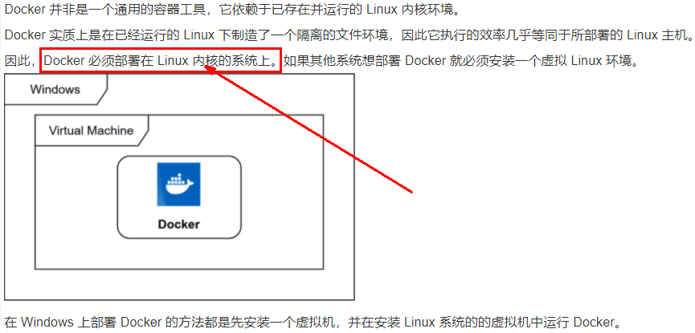
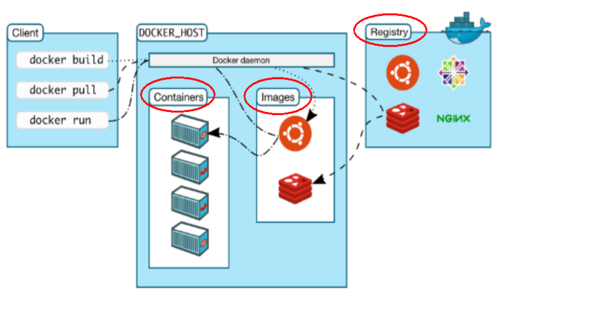
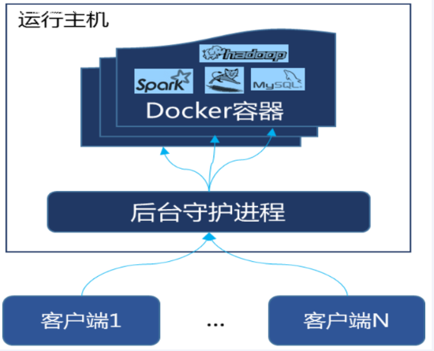
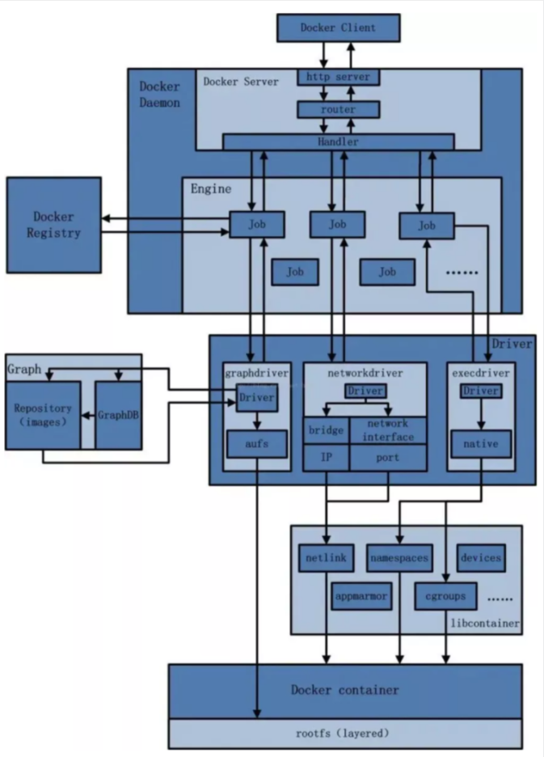
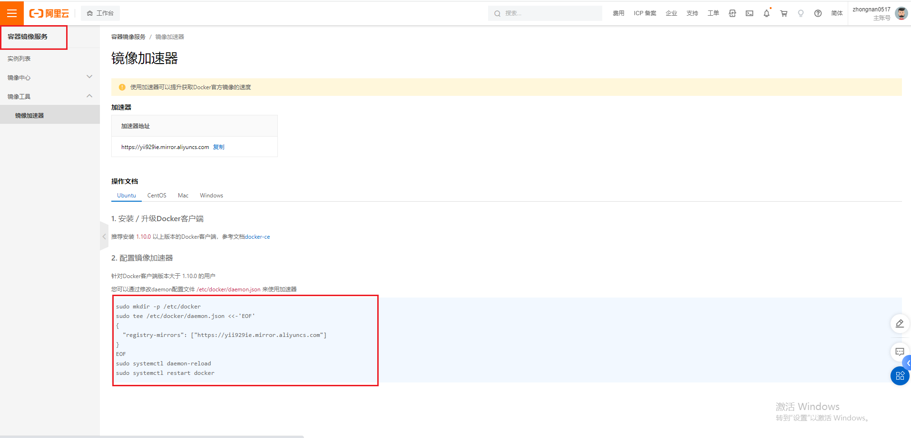
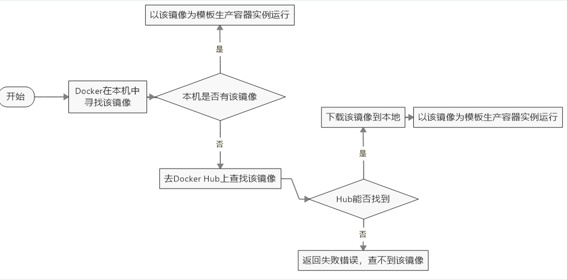
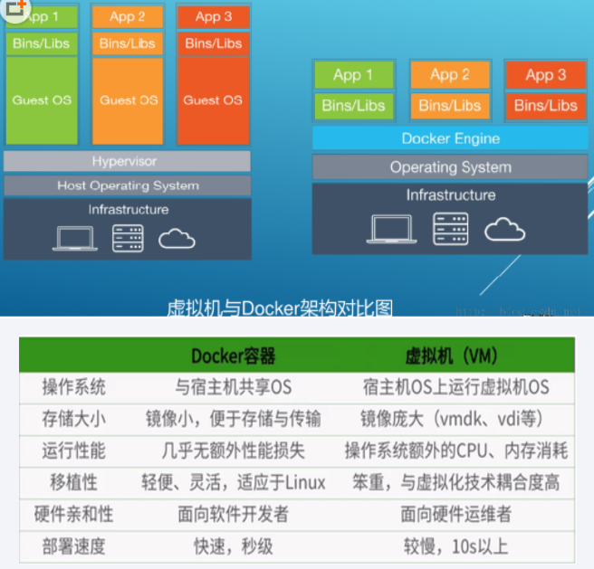

# Docker 安装

## CentOS Docker 安装



### 前提条件

目前，CentOS 仅发行版本中的内核支持 Docker。Docker 运行在 CentOS 7 (64-bit) 上，

要求系统为 64 位、Linux 系统内核版本为 3.8 以上，这里选用 Centos7.x

### 查看自己的内核

uname 命令用于打印当前系统相关信息（内核版本号、硬件架构、主机名称和操作系统类型等）。

```sh
cat /etc/redhat-release 
```

```sh
uname -r
```

## Docker 的基本组成

### 镜像（Image）

Docker 镜像（Image）就是一个 **只读** 的模板。镜像可以用来创建 Docker 容器，一个镜像可以创建很多容器。

它也相当于是一个 root 文件系统。比如官方镜像 CentOS7 就包含了完整的一套 CentoOS7 最小系统的 root 文件系统。

相当于容器的“源代码”，docker 镜像文件类似于 Java 的类模板，而 docker 容器实例类似于 java 中 new 出来的实例对象。

| Docker | 面向对象 |
| ------ | -------- |
| 容器   | 对象     |
| 镜像   | 类       |

### 容器

#### ①从面向对象角度

Docker 利用容器（Container）独立运行的一个或一组应用，应用程序或服务运行在容器里面，容器就类似于一个虚拟化的运行环境，容器是用镜像创建的运行实例。就像是 Java 中的类和实例对象一样，镜像是静态的定义，容器是镜像运行时的实体。容器为镜像提供了一个标准的和隔离的运行环境，它可以被启动、开始、停止、删除。每个容器都是相互隔离的、保证安全的平台

####  ②从镜像容器角度

**可以把容器看做是一个简易版的 Linux 环境**（包括 root 用户权限、进程空间、用户空间和网络空间等）和运行在其中的应用程序。

### 仓库

仓库（Repository）是集中存放镜像文件的场所。

- Maven 仓库，存放各种 jar 包的地方；
- github 仓库，存放各种 git 项目的地方；
- DockerHub 仓库，存放各种镜像模板的地方。

仓库分为公开仓库（Public）和私有仓库（Private）两种形式。

最大的公开仓库是 [Docker Hub](https://hub.docker.com/)。

存放了数量庞大的镜像供用户下载。国内的公开仓库包括阿里云、网易云等。

### 总结

Docker 本身是一个容器运行载体或称之为管理引擎。我们把应用程序和配置依赖打包好形成一个可交付的运行环境，这个打包好的运行环境就是 image 镜像文件。只有通过这个镜像文件才能生成 Docker 容器实例（类似 Java 中 new 出来一个对象）。

image 文件可以看作是容器的模板。Docker 根据 image 文件生成容器的实例。同一个 image 文件，可以生成多个同时运行的容器实例。

**镜像文件**

- image 文件生成的容器实例，本身也是一个文件，称为镜像文件。

**容器实例**

- 一个容器运行一种服务，当我们需要的时候，就可以通过 docker 客户端创建一个对应的运行实例，也就是我们的容器

**仓库**

- 就是放一堆镜像的地方，我们可以把镜像发布到仓库中，需要的时候再从仓库中拉下来就可以了。

## Docker 平台架构



### Docker 工作原理

Docker 是一个 Client-Server 结构的系统，Docker 守护进程运行在主机上，然后通过 Socket 连接从客户端访问，守护进程从客户端接受命令并管理运行在主机上的容器。容器，是一个运行时环境，就是我们前面说到的集装箱。类似与 MySql 和 Navicat 的关系。



### Docker 平台架构版

Docker 是一个 C/S 模式的架构，后端是一个松耦合架构，众多模块各司其职。 

**Docker 运行的基本流程为：**

1. 用户是使用 Docker Client 与 Docker Daemon 建立通信，并发送请求给后者。
2. Docker Daemon 作为 Docker 架构中的主体部分，首先提供 Docker Server 的功能使其可以接受 Docker Client 的请求。
3. Docker Engine 执行 Docker 内部的一系列工作，每一项工作都是以一个 Job 的形式的存在。
4. Job 的运行过程中，当需要容器镜像时，则从 Docker Registry 中下载镜像，并通过镜像管理驱动 Graph driver 将下载镜像以 Graph 的形式存储。
5. 当需要为 Docker 创建网络环境时，通过网铬管理驱动 Network driver 创建并配置 Docker 容器网铬环境。
6. 当需要限制 Docker 容器运行资源或执行用户指令等操作时，则通过 Exec driver 来完成。
7. Libcontainer 是一项独立的容器管理包，Network driver 以及 Exec driver 都是通过 Libcontainer 来实现具体对容器进行的操作。




### 总结

- Docker Client：负责发送请求
- Docker Daemon：守护进程模块
  - Docker Server：负责接收请求
  - Engine：引擎，处理请求
  - Job：工作任务
- Docker Registry：仓库模块
- Driver：驱动模块
  - graphdriver：镜像管理驱动，获取镜像
  - networkdriver：网络管理驱动
  - execdriver：限制 Dokcer 容器资源和者执行用户指令
- Graph：管理镜像模块
  - GraphDB：存储镜像数据库
- libcontainer：独立的容器管理报
- Docker Container：Docker 容器

## Centos7 安装 Docker

### 官网教程

[Centos7 安装](https://docs.docker.com/engine/install/centos/)

### 安装教程

说明：Docker 安装路径是 `/var/lib/docker`，安装 Docker 成功后，在该路径中有一个 image 和 containers 文件夹，分别存放镜像和实例。

#### ①确定是 CemtOS7 及以上版本

```sh
cat /etc/redhat-release
```

#### ②卸载旧版本

```sh
sudo yum remove docker \
                  docker-client \
                  docker-client-latest \
                  docker-common \
                  docker-latest \
                  docker-latest-logrotate \
                  docker-logrotate \
                  docker-engine
```

#### ③yum 安装 gcc 相关依赖

```sh
sudo yum -y install gcc
```

```sh
sudo yum -y install -gcc-c++
```

#### ④安装设置存储库

```sh
 sudo yum install -y yum-utils
```

#### ⑤设置国内的 stable 镜像仓库

```sh
sudo yum-config-manager --add-repo http://mirrors.aliyun.com/docker-ce/linux/centos/docker-ce.repo
```

#### ⑥更新 yum 软件包索引

```sh
sudo yum makecache fast
```

#### ⑦安装 Docker Ce

```sh
 sudo yum install docker-ce docker-ce-cli containerd.io docker-compose-plugin
```

#### ⑧启动 Docker

```sh
sudo systemctl start docker
```

#### ⑨测试

```sh
sudo docker version
```

```sh
sudo docker run hello-world
```

#### ⑩卸载

```sh
sudo systemctl stop docker 
```

```sh
sudo yum remove docker-ce docker-ce-cli containerd.io docker-compose-plugin
```

```sh
sudo rm -rf /var/lib/docker
```

```sh
sudo rm -rf /var/lib/containerd
```

## 阿里云镜像加速

[容器镜像服务官网地址](https://cr.console.aliyun.com/cn-hangzhou/instances/mirrors)



### 设置镜像仓库

```sh
sudo mkdir -p /etc/docker
sudo tee /etc/docker/daemon.json <<-'EOF'
{
  "registry-mirrors": ["https://yii929ie.mirror.aliyuncs.com"]
}
EOF
sudo systemctl daemon-reload
sudo systemctl restart docker
```

```sh
[root@localhost ~]# sudo mkdir -p /etc/docker
[root@localhost ~]# sudo tee /etc/docker/daemon.json <<-'EOF'
> {
>   "registry-mirrors": ["https://yii929ie.mirror.aliyuncs.com"]
> }
> EOF
{
  "registry-mirrors": ["https://yii929ie.mirror.aliyuncs.com"]
}
[root@localhost ~]# sudo systemctl daemon-reload
[root@localhost ~]# sudo systemctl restart docker
```

## HelloWorld 案例

### `docker run hello-world`

```sh
[root@localhost ~]# docker run hello-world

Hello from Docker!
This message shows that your installation appears to be working correctly.

To generate this message, Docker took the following steps:
 1. The Docker client contacted the Docker daemon.
 2. The Docker daemon pulled the "hello-world" image from the Docker Hub.
    (amd64)
 3. The Docker daemon created a new container from that image which runs the
    executable that produces the output you are currently reading.
 4. The Docker daemon streamed that output to the Docker client, which sent it
    to your terminal.

To try something more ambitious, you can run an Ubuntu container with:
 $ docker run -it ubuntu bash

Share images, automate workflows, and more with a free Docker ID:
 https://hub.docker.com/

For more examples and ideas, visit:
 https://docs.docker.com/get-started/
```

### run 干了什么



## 底层原理

### 为什么 Docker 回会比 VM 虚拟机快

**docker 有着比虚拟机更少的抽象层**

  由于 docker 不需要 Hypervisor(虚拟机) 实现硬件资源虚拟化，运行在 docker 容器上的程序直接使用的都是实际物理机的硬件资源。因此在 CPU、内存利用率上 docker 将会在效率上有明显优势。

**docker 利用的是宿主机的内核，而不需要加载操作系统 OS 内核**

  当新建一个容器时，docker 不需要和虚拟机一样重新加载一个操作系统内核。进而避免引寻、加载操作系统内核返回等比较费时费资源的过程，当新建一个虚拟机，虚拟机软件需要加载 OS，返回新建过程是分钟级别的。而 docker 由于直接利用宿主机的操作系统，则省略了返回过程，因此新建一个 docker 容器只需要几秒钟。


