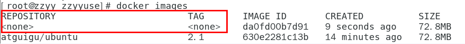
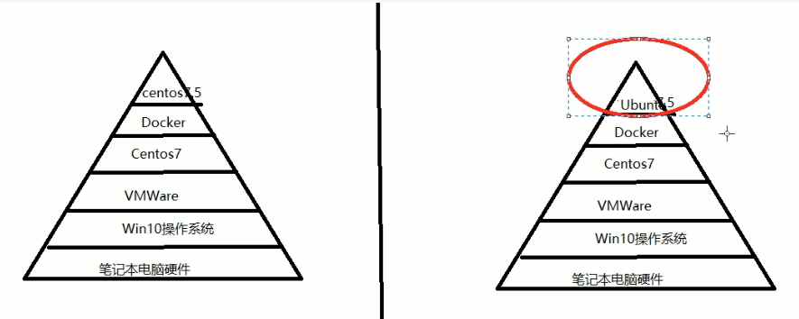
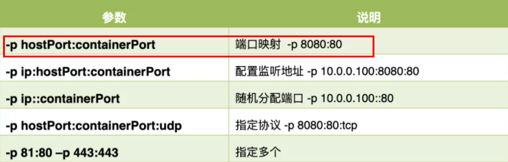

# Docker 常用命令

## 帮助启动类命令

### ①启动 Docker

```sh
systemctl start docker
```

### ②停止 Docker

 ```sh
 systemctl stop docker
 ```

### ③重启 Docker

```sh
systemctl restart docker
```

### ④查看 Docker 状态

```sh
systemctl status docker
```

### ⑤开机启动

```sh
systemctl enable docker
```

### ⑥查看 Docker 概要信息

```sh
docker info
```

### ⑦查看 Docker 总体帮助信息

```sh
docker --help
```

### ⑧查看 Docker 命令帮助文档

```sh
docker 具体命令 --help
```

## 镜像命令

### `docker images`

#### 列出本地镜像列表

```sh
docker images
```

```sh
[root@localhost ~]# docker images
REPOSITORY    TAG       IMAGE ID       CREATED         SIZE
hello-world   latest    feb5d9fea6a5   13 months ago   13.3kB
```

#### 各个选项说明

- REPOSITORY：表示镜像的仓库源
- TAG：镜像的标签版本号 IMAGE 
- ID：镜像 ID
- CREATED：镜像创建时间
- SIZE：镜像大小

 同一仓库源可以有多个 TAG 版本，代表这个仓库源的不同个版本，我们使用 REPOSITORY:TAG 来定义不同的镜像。

如果你不指定一个镜像的版本标签，例如你只使用 ubuntu，docker 将默认使用 ubuntu:latest 镜像。

#### options 说明

- -a 列出本地所有镜像（含历史镜像层）
- -q 只显示镜像 ID

### `docker search 镜像`

#### 搜索远程仓库镜像

```sh
docker search 镜像
```

```sh
[root@localhost ~]# docker search mysql
NAME                            DESCRIPTION                                     STARS     OFFICIAL   AUTOMATED
mysql                           MySQL is a widely used, open-source relation…   13390     [OK]       
mariadb                         MariaDB Server is a high performing open sou…   5110      [OK]       
phpmyadmin                      phpMyAdmin - A web interface for MySQL and M…   666       [OK]       
percona                         Percona Server is a fork of the MySQL relati…   592       [OK]       
bitnami/mysql                   Bitnami MySQL Docker Image                      78                   [OK]
databack/mysql-backup           Back up mysql databases to... anywhere!         72                   
```

#### 各个选项说明

- NAME：镜像名称
- DESCRIPTION：镜像说明
- STARS：点赞数量
- OFFICIAL：是否是官方的
- AUTOMATED：是否是自动构建的

#### options 说明

- -limit 只列出前 N 个镜像，默认是 25 个

### `docker pull 镜像`

#### 下载镜像

```sh
docker pull 镜像
docker pull 镜像:版本
```

`docker pull 镜像`，如果不加版本号就等于`docker pull 镜像:latest`

`docker pull redis:6.0.8`，加了版本号就下载相关版本的镜像

### `docker system df`

#### 查看镜像、容器、数据卷所占用的空间

```sh
docker systrm df
```

```sh
[root@localhost ~]# docker system df
TYPE            TOTAL     ACTIVE    SIZE      RECLAIMABLE
Images               2         1         104.2MB   104.2MB (99%)
Containers         3         0         0B              0B
Local Volumes   0         0         0B              0B
Build Cache       0         0         0B              0B
```

### `docker rmi 镜像 ID`

#### 删除镜像

#### 删除单个

```sh
docker rmi -f 镜像ID
```

#### 删除多个

```sh
docker rmi -f  镜像名:版本 镜像名:版本
```

#### 删除全部

```sh
docker rmi -f $(docker images -qa)
```

### docker 虚悬镜像是什么？

仓库名、标签都是`<none>`的镜像，俗称虚悬镜像 dangling image



## 容器命令

### ①有镜像才能创建容器

以 ubantu 为例

```sh
docker pull ubuntu
```



### ②新建并启动容器

```sh
docker run 镜像
```

#### options 说明

 OPTIONS 说明（常用）：有些是一个减号，有些是两个减号。

- --name="容器新名字"    为容器指定一个名称；
- -d: 后台运行容器并返回容器 ID，也即启动守护式容器 (后台运行)；

- -i：以交互模式运行容器，通常与 -t 同时使用；
- -t：为容器重新分配一个伪输入终端，通常与 -i 同时使用；也称启动交互式容器 (前台有伪终端，等待交互)；

- -P: 随机端口映射，大写 P
- -p: 指定端口映射，小写 p



### ③启动交互 ubuntu 容器

以下命令表示以交互模式启动 ubuntu，并在容器内执行/bin/bash 命令

```sh
docker run -it ubuntu /bin/bash
```

```sh
[root@localhost ~]# docker run -it ubuntu /bin/bash 
root@8e8cf51e2ba3:/# 
root@8e8cf51e2ba3:/# 
root@8e8cf51e2ba3:/# 
```

说明：/bin/bash，放在镜像名后面的是命令。表示希望通过交互式 Shell，因此用的是`/bin/bash`,输入`exit`退出。

### ④列出当前所有正在运行的容器

```sh
[root@localhost ~]# docker ps
CONTAINER ID   IMAGE     COMMAND       CREATED         STATUS         PORTS     NAMES
8e8cf51e2ba3   ubuntu    "/bin/bash"   7 minutes ago   Up 7 minutes             adoring_torvalds
```

#### options 说明

- -a :列出当前所有正在运行的容器 + 历史上运行过的
- -l :显示最近创建的容器。
- -n：显示最近 n 个创建的容器。
- -q :静默模式，只显示容器编号。

### ⑤退出容器

#### exit 退出方式

<mark>容器停止</mark>

 ```sh
 exit
 ```

#### ctrl+p+q 退出方式

<mark>容器不停止</mark>

```sh
ctrl+p+q
```

### ⑥启动已停止运行的容器

```sh
docker start 容器id或容器名称
```

### ⑦重启容器

```sh
docker restart 容器id或容器名称
```

### ⑧停止容器

```sh
docker stop 容器id或容器名称
```

### ⑨强制停止容器

```sh
docker kill 容器id或容器名称
```

### ⑩删除已停止的容器

```sh
docker rm 容器ID
```

### ⑪一次性删除所有容器

```sh
docker rm -f $(docker ps -a -q)

# 或者
docker ps -a -q | xargs docker rm
```

## 容器命令（以 Redis 为例）

有镜像才能创建容器，这是根本前提，以下命令以 Rdis 为例。

### ①下载 Redis6.0.8

```sh
docker pull redis:6.0.8
```

### ③问题

```sh
docker run -d ubuntu
```

如果使用`docker run -d ubuntu`尝试启动守护式的 ubuntu，会发现容器启动后就自动退出了。

因为 Docker 容器如果在后台运行，就必须要有一个前台进程。容器运行的命令如果不是那些一直挂起的命令（例如`top`、`tail`），就会自动退出。

### ③Redis 前后台启动演示

前台交互式启动，关闭窗口时容器会退出，不符合要求。

```sh
docker run -it redis:6.0.8
```

后台守护式启动，关闭窗口时容器不会退出。

```sh
docker run -d redis6.0.8
```

### ④查看容器日志

```sh
docker logs 容器ID或容器名
```

### ⑤查看容器内运行的进程

```sh
docker top 容器ID或容器名
```

### ⑥查看容器内部细节

```sh
docker inspect 容器ID或容器名
```

### 进入正在运行的容器

```sh
docker exec -it 容器ID bashShell
```

```sh
docker attach 容器ID
```

### ⑦`docker exec` 和 `docker attach` 区别

- `attach`直接进入容器启动命令的终端，不会启动新的进程，用`exit`退出会导致容器的停止

- `exec`是在容器中打开新的终端，并且可以启动新的进程，用`exit`退出不会导致容器的停止

