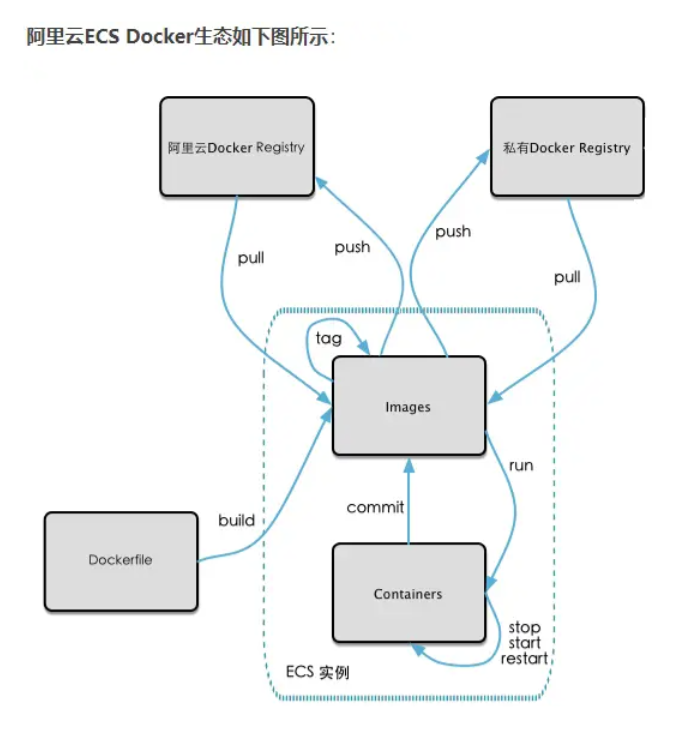
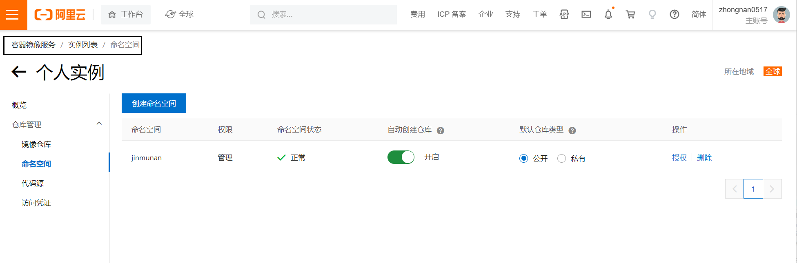
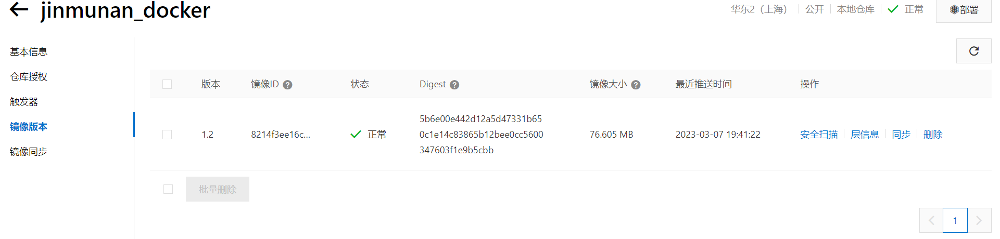

# 本地镜像发布到阿里云

## 流程



## 镜像的生成方法

第一种：基于当前容器创建一个新的镜像，新功能增强

第二种：DockerFile，以后会学到

## 将本地镜像推送到阿里云

### 本地镜像原型

```{3} sh
[root@jinmunan ~]# docker images
REPOSITORY          TAG       IMAGE ID       CREATED          SIZE
zhongnan/myubuntu   1.2       8214f3ee16c5   22 minutes ago   179MB
tomcat              latest    d3c14bf251bf   12 hours ago     474MB
ubuntu              latest    74f2314a03de   6 days ago       77.8MB
hello-world         latest    feb5d9fea6a5   17 months ago    13.3kB
```

阿里云开发者平台：https://promotion.aliyun.com/ntms/act/kubernetes.html](https://promotion.aliyun.com/ntms/act/kubernetes.html)

```sh
操作步骤
1、选择控制台，进入容器镜像服务
2、进入个人实例
3、创建命名空间
4、创建镜像仓库
5、进入管理页面获得脚本
```



### 页面脚本

```sh
1. 登录阿里云Docker Registry
$ docker login --username=zhongnan0517 registry.cn-shanghai.aliyuncs.com
用于登录的用户名为阿里云账号全名，密码为开通服务时设置的密码。

您可以在访问凭证页面修改凭证密码。

2. 从Registry中拉取镜像
$ docker pull registry.cn-shanghai.aliyuncs.com/jinmunan/jinmunan_docker:[镜像版本号]

3. 将镜像推送到Registry
$ docker login --username=zhongnan0517 registry.cn-shanghai.aliyuncs.com
$ docker tag [ImageId] registry.cn-shanghai.aliyuncs.com/jinmunan/jinmunan_docker:[镜像版本号]
$ docker push registry.cn-shanghai.aliyuncs.com/jinmunan/jinmunan_docker:[镜像版本号]
请根据实际镜像信息替换示例中的[ImageId]和[镜像版本号]参数。

4. 选择合适的镜像仓库地址
从ECS推送镜像时，可以选择使用镜像仓库内网地址。推送速度将得到提升并且将不会损耗您的公网流量。

如果您使用的机器位于VPC网络，请使用 registry-vpc.cn-shanghai.aliyuncs.com 作为Registry的域名登录。
```

## 将镜像推送到阿里云

```sh
# 登录到阿里云的docker镜像仓库
$ docker login --username=zhongnan0517 registry.cn-shanghai.aliyuncs.com
# tag是一个用于给镜像打标签的命令；tag命令可以标记本地镜像，并且将其归入某一仓库
$ docker tag 8214f3ee16c5 registry.cn-shanghai.aliyuncs.com/jinmunan/jinmunan_docker:1.2
# 推送远程仓库
$ docker push registry.cn-shanghai.aliyuncs.com/jinmunan/jinmunan_docker:1.2


# 实际操作
[root@jinmunan ~]# docker login --username=zhongnan0517 registry.cn-shanghai.aliyuncs.com
Password: 
WARNING! Your password will be stored unencrypted in /root/.docker/config.json.
Configure a credential helper to remove this warning. See
https://docs.docker.com/engine/reference/commandline/login/#credentials-store

Login Succeeded
[root@jinmunan ~]# docker tag 8214f3ee16c5 registry.cn-shanghai.aliyuncs.com/jinmunan/jinmunan_docker:1.2
[root@jinmunan ~]# docker push registry.cn-shanghai.aliyuncs.com/jinmunan/jinmunan_docker:1.2
The push refers to repository [registry.cn-shanghai.aliyuncs.com/jinmunan/jinmunan_docker]
ae2f900cf48e: Pushed 
202fe64c3ce3: Pushed 
1.2: digest: sha256:5b6e00e442d12a5d47331b650c1e14c83865b12bee0cc5600347603f1e9b5cbb size: 741
```



## 将阿里云的镜像下载到本地

```sh
# 将阿里云的镜像下载到本地,这里是因为创建镜像仓库时名字去错了
$ docker pull registry.cn-shanghai.aliyuncs.com/jinmunan/jinmunan_docker:1.2


# 实际操作
[root@jinmunan ~]# docker images
REPOSITORY    TAG       IMAGE ID       CREATED         SIZE
tomcat        latest    d3c14bf251bf   12 hours ago    474MB
ubuntu        latest    74f2314a03de   6 days ago      77.8MB
hello-world   latest    feb5d9fea6a5   17 months ago   13.3kB
[root@jinmunan ~]# docker pull registry.cn-shanghai.aliyuncs.com/jinmunan/jinmunan_docker:1.2
1.2: Pulling from jinmunan/jinmunan_docker
b65bcf19d144: Already exists 
537b9d9ca2a4: Already exists 
Digest: sha256:5b6e00e442d12a5d47331b650c1e14c83865b12bee0cc5600347603f1e9b5cbb
Status: Downloaded newer image for registry.cn-shanghai.aliyuncs.com/jinmunan/jinmunan_docker:1.2
registry.cn-shanghai.aliyuncs.com/jinmunan/jinmunan_docker:1.2
[root@jinmunan ~]# docker images
REPOSITORY                                                   TAG       IMAGE ID       CREATED          SIZE
registry.cn-shanghai.aliyuncs.com/jinmunan/jinmunan_docker   1.2       8214f3ee16c5   46 minutes ago   179MB
tomcat                                                       latest    d3c14bf251bf   12 hours ago     474MB
ubuntu                                                       latest    74f2314a03de   6 days ago       77.8MB
hello-world                                                  latest    feb5d9fea6a5   17 months ago    13.3kB
```

