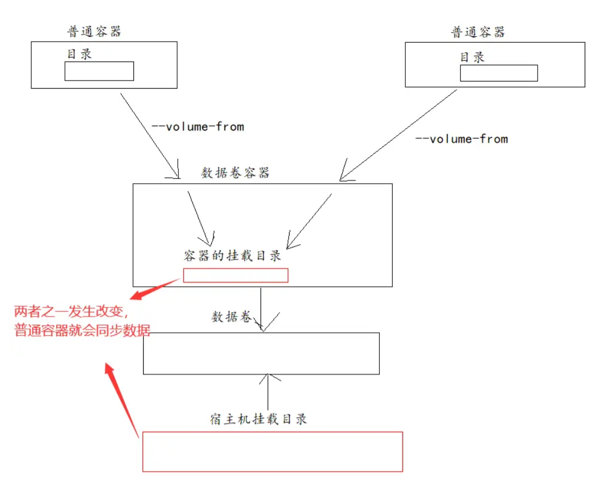

# Docker 数据卷

## 什么是数据卷

说直白点就是在 Lnux 宿主机上建了一个备份文件夹，和 docker 容器共享这个文件夹。

数据卷是一个可供一个或多个容器使用的特殊目录，它绕过 UFS（联合文件系统），可以提供很多有用的特性。

- 数据卷可以在容器之间共享和享用
- 对数据卷的修改立马生效
- 对数据卷的更新，不会影响镜像
- 数据卷默认会一直存在，即使容器被删除

数据卷的使用，类似于 Linux 下对目录或者文件进行 mount，镜像中的被指定为挂载点的目录中的文件会复制到数据卷（仅数据卷为空时复制）

## 为什么使用数据卷

- 当创建一个容器的时候，容器运行，数据能不能持久化
- 如果能够持久化，数据存储在哪？由于 docker 是隔离的，数据能不能存储在容器外
- 如果部署很多容器，每次都需要进入容器中进行配置嘛？能不能外部进行配置

docker 数据卷呈现给 docker 容器的一个形式就是目录，该目录支持多个容器间共享，修改不会影响到镜像。使用 Docker 的数据卷，类似在系统中使用 mount 挂载一个文件系统。

## 数据卷挂载操作

### 三种挂载数据卷格式

```sh
# 前面学习过的命令
docker run -d -p 5000:5000 -v /zhongnan/registry/:/tmp/registry --privileged=true registry

# 具体目录挂载
docker run [options] -v <宿主机绝对路径:容器内的路径[:ro | :rw]> <镜像名>

# 默认目录挂载
docker run [options] -v <任意别名:容器内的路径[:ro | :rw]> <镜像名>

# 匿名目录挂载
docker run [options] -v <容器内的路径[:ro | :rw]> <镜像名>
```

默认目录挂载和匿名目录挂载的目录默认在 `/var/lib/docker/volumes/` 目录下。

宿主机挂载目录里，都会生成 `_data` 目录，该目录存放容器挂载目录下的数据。

### 具体目录挂载

```sh
# 具体目录挂载就是自定义数据卷目录。
# 在用 docker run 命令的时候，使用 -v 标记来创建一个数据卷并挂载到容器里。
# 格式：docker run [options] -v <宿主机绝对路径 | 任意别名:容器内的路径[:ro | :rw]> <镜像名>

docker run [options] -v <宿主机绝对路径 | 任意别名:容器内的路径[:ro | :rw]> <镜像名>

# 宿主机路径必须是绝对路径，如果目录不存在 Docker 会自动为你创建它。
# ro：代表 read-only，容器的路径只允许读，不允许写。不影响宿主机的路径可读可写
# rw：默认值，代表可读可写
```

#### 案例

```sh
# 测试一：具体目录挂载

# 这句话的意思就是启动tomcat并且将容器的/usr/local/tomcat/webapps目录挂载到Linux宿主机的/opt/tomcat中，tomcat容器的8080端口被Linux宿主机的8081端口监听
docker run -d -p 8081:8080 --name mytomcat -v /opt/tomcat:/usr/local/tomcat/webapps tomcat:latest

# 查看挂载信息
docker inspect 7a471f76c0bf

"Mounts": [
    {
        "Type": "bind",
        "Source": "/opt/tomcat",
        "Destination": "/usr/local/tomcat/webapps",
        "Mode": "",
        "RW": true,
        "Propagation": "rprivate"
    }
],


# 特点：宿主机的的挂载目录内容覆盖到容器的挂载目录内容
# 因为 /opt/tomcat 中目录为空，所以容器的 webapps 目录被 tomcat中目录覆盖，也为空。
```

---

```sh
# 测试二：测试容器和宿主机之间数据共享

# 进入tomcat容器
docker exec -it 7a471f76c0bf /bin/bash

# 在容器目录/usr/local/tomcat/webapps中创建文件
root@7a471f76c0bf:/usr/local/tomcat/webapps# touch 1.txt

# 可以看到Linux宿主机的/opt/tomcat/目录下也有这个文件
[root@jinmunan /]# ll -l /opt/tomcat/
total 0
-rw-r--r-- 1 root root 0 Mar  7 21:50 1.txt

# 说明挂载成功，双方挂载的目录实现共享。
```

---

```sh
# 测试三：容器停止运行，宿主机添加 2.txt，再启动容器，文件是否同步到容器里？

# 停止tomcat容器
docker stop 7a471f76c0bf

# 在Linux宿主机中创建文件
[root@jinmunan /]# touch /opt/tomcat/2.txt
[root@jinmunan /]# ll -l /opt/tomcat/
total 0
-rw-r--r-- 1 root root 0 Mar  7 21:50 1.txt
-rw-r--r-- 1 root root 0 Mar  7 22:01 2.txt

# 启动tomcat容器并查看挂载目录
docker start 7a471f76c0bf
docker exec -it 7a471f76c0bf /bin/bash

root@7a471f76c0bf:/usr/local/tomcat/webapps# ls
1.txt  2.txt

# 说明数据依旧同步
```

---

```sh
# 测试四：删除容器，看主机上数据是否会被删除
docker rmi -f fb5657adc892

# Linux宿主机仍然存在文件
[root@jinmunan /]# ll -l /opt/tomcat/
total 0
-rw-r--r-- 1 root root 0 Mar  7 21:50 1.txt
-rw-r--r-- 1 root root 0 Mar  7 22:01 2.txt
```

### 默认目录挂载

```sh
# 默认目录挂载,数据卷目录路径是固定的。

docker run [options] -v <宿主机绝对路径:容器内的路径[:ro | :rw]> <镜像名> # 具体挂载目录
docker run [options] -v <任意别名:容器内的路径[:ro | :rw]> <镜像名> # 默认挂载目录

# 唯一的区别就是没有指定具体的挂载在Linux宿主机上的目录，因此容器会自动挂载在宿主机上的 /var/lib/docker/volumes 这个目录下
# Docker 会在 /var/lib/docker/volumes 目录下生成该数据卷，这是 docker 默认的数据卷目录。并且在数据卷里生成 _data 目录用于与容器目录同步数据
```

#### 案例

```sh
# 默认目录挂载 将容器的/usr/local/tomcat/webapps挂载到宿主机的/var/lib/docker/volumes/mytomcat/_data目录下
docker run -d -p 8080:8081 --name tomcat -v mytomcat:/usr/local/tomcat/webapps tomcat:latest

[root@jinmunan /]# docker run -d -p 8080:8081 --name tomcat -v mytomcat:/usr/local/tomcat/webapps tomcat:latest
efc9c786b76b6be8c8b2b6e725d134f0c5de56934f94bf7a97763af174654803
[root@jinmunan /]# find / -name mytomcat
/var/lib/docker/volumes/mytomcat

# 特点：容器的挂载目录内容覆盖到宿主机的挂载目录内容
```

### 匿名目录挂载

```sh
# 匿名目录挂载会将容器内的路径挂载到Linux的/var/lib/docker/volumes/目录，容器挂载多了会导致这个目录很乱，不推荐使用
docker run [options] -v <容器内的路径[:ro | :rw]> <镜像名> # 匿名目录挂载
```

### 哪个挂载方法好？

首先排除掉 **匿名目录挂载**，它的缺点是不好维护，数据卷名随机生成且太长，不清楚目录挂载的是哪个容器。

**默认目录挂载** 指定了一个默认目录，无论挂载目录有多少，都集中在默认目录下管理。但是缺点是 **不能指定文件挂载**，只能指定目录进行挂载。它和具体目录挂载的另一个区别是：第一次启动容器挂载时，**容器的挂载目录内容会覆盖宿主机的挂载目录内容**。

**具体目录挂载** 可以指定宿主机的任意位置，但是一旦挂载目录多了起来，可能目录过于分散导致无法集中管理，但是它更加灵活，而且 **能指定文件挂载**。值得注意的是：第一次启动容器挂载时，必须确保容器的挂载目录数据备份好，因为该挂载方式会将 **宿主机的挂载目录内容覆盖掉容器的挂载目录内容**。所以，有数据则备份，再挂载。

总之：**匿名目录挂载** 不推荐，根据需求选择 **默认目录挂载** 和 **具体目录挂载**，前者不能挂载文件，挂载在默认目录；后者能挂载文件，且挂载在宿主机任意位置，但是会覆盖容器的挂载目录。

### 读写权限

读写权限仅针对 **容器的挂载目录**，如果不指定权限，默认就是可读可写。

`ro`：代表 read-only，容器的路径只允许读，不允许写。不影响宿主机的路径可读可写

`rw`：默认值，代表可读可

```sh
# 当我们希望只操作宿主机的挂载目录，然后同步给容器的挂载目录，但是不希望容器的挂载目录也能操作，影响宿主机的挂载目录。
# 这样的话容器就只能读而不能写了
docker run -d -p 8081:8080 --name mytomcat -v /opt/tomcat:/usr/local/tomcat/webapps:ro tomcat:latest
```

## 数据卷操作命令

数据卷在 Docker 称为 volume，所以相关命令都要有 volume。

### 数据卷命令

```sh
[root@jinmunan _data]# docker volume --help

Usage:  docker volume COMMAND

Manage volumes

Commands:
  create      Create a volume
  inspect     Display detailed information on one or more volumes
  ls          List volumes
  prune       Remove all unused local volumes
  rm          Remove one or more volumes

Run 'docker volume COMMAND --help' for more information on a command.
```

### 数据卷查看

```sh
[root@jinmunan _data]# docker volume ls
DRIVER    VOLUME NAME
local     16e6cd5622b8577afb089bb332a219ae5c84ee78017c8d9b2fa765a7283505d9
local     mytomcat
```

### 数据卷信息

```sh
[root@jinmunan _data]# docker volume inspect mytomcat
[
    {
        "CreatedAt": "2023-03-07T22:14:12-05:00",
        "Driver": "local",
        "Labels": null,
        "Mountpoint": "/var/lib/docker/volumes/mytomcat/_data",
        "Name": "mytomcat",
        "Options": null,
        "Scope": "local"
    }
]
```

### 数据卷创建

```sh
docker volumn create <数据卷名>
# 创建的数据卷目录依然在 /var/lib/docker/volumes 下
```

### 数据卷删除

```sh
# 指定删除数据卷
docker rm <数据卷名>

# 删除全部未被使用的数据卷命令格式
docker volume prune
```

## 数据卷其他操作

### 继承

```sh
docker run -it  --privileged=true --volumes-from 父类 --name u2 ubuntu
```

---

```sh
# 创建容器一
docker run -it  --privileged=true -v /mydocker/ubuntu/tmp:/tmp --name u1 ubuntu

# 创建容器二去继承容器一
docker run -it  --privileged=true --volumes-from u1 --name u2 ubuntu


[root@jinmunan _data]# docker run -it  --privileged=true -v /mydocker/ubuntu/tmp:/tmp --name u1 ubuntu
root@b5852c950e2b:/# cd /tmp/
root@b5852c950e2b:/tmp# touch 1.txt
root@b5852c950e2b:/tmp# exit
exit
[root@jinmunan _data]# cd /mydocker/ubuntu/tmp
[root@jinmunan tmp]# ls
1.txt
[root@jinmunan tmp]# docker run -it  --privileged=true --volumes-from u1 --name u2 ubuntu
root@368cf1e12b89:/# cd /tmp/
root@368cf1e12b89:/tmp# ls
1.txt

# 发现容器的/tmp/也有文件
```

### 数据共享

上面讲述的是宿主机和容器之间共享数据，那么如何实现容器和容器之间的共享数据呢？那就是创建 **创建数据卷容器**。

命名的容器挂载数据卷，其他容器通过挂载这个（父容器）实现数据共享，挂载数据卷的容器，称之为 **数据卷容器 (Data Volume Container)**。

特点：

- 数据卷可以在容器之间共享或重用数据
- 数据卷中的更改可以直接生效
- 数据卷中的更改不会包含在镜像的更新中
- 数据卷的生命周期一直持续到没有容器使用它为止

---

```sh
# 创建三个容器 tomcat10、tomcat11、tomcat12，其中 tomcat10 是数据卷容器

# 启动镜像，创建数据卷容器
docker run -d -P --name tomcat10 -v tomcat10:/usr/local/tomcat/webapps tomcat:latest

# 创建容器绑定数据卷容器
docker run -d -P --name tomcat11 --volumes-from tomcat10 tomcat:latest
docker run -d -P --name tomcat12 --volumes-from tomcat10 tomcat:latest
```



### 数据备份

```sh
docker run [options] --volumes-from <数据卷容器> [-v <宿主机绝对路径>:<随机路径>] <镜像名>:[TAG | ID] tar cvf <随机路径/备份名> <数据卷容器路径>

# 使用了 tar 命令来将容器的 /usr/local/tomcat/webapps 目录备份到宿主机的/var/lib/docker/overlay2，备份的文件是 backup.tar。
# 备份路径默认在 /var/lib/docker/overlay2/ 下的容器 ID 目录下生成
docker run --name tomcat-backup --volumes-from tomcat10 tomcat:latest tar cvf /backup.tar /usr/local/tomcat/webapps

# 容器的/backup挂载在宿主机的/opt/backup，并将容器的/usr/local/tomcat/webapps备份到容器的/backup/目录，同时宿主机也就有了备份
# 容器的挂载路径要和备份的文件路径保持一致，才能指定备份路径
docker run --name tomcat-backup --volumes-from tomcat10 -v /opt/backup:/backup tomcat:latest tar cvf /backup/backup.tar /usr/local/tomcat/webapps

# 原理：首先将宿主机和容器的目录进行挂载，实现连通，接着容器内压缩成备份文件到 /backup 目录下，实际上也会压缩到与 /backup 挂载的 /opt/backup 目录下，所以这就是为什么将压缩文件的目录和宿主机的挂载目录保持一致，它们连通才能互相同步数据。
```

###  数据恢复

```sh
docker run --volumes-from <恢复到哪个数据卷容器> [-v <宿主机绝对路径>:<随机路径>] <镜像名>[:TAG | ID] tar xvf <随机路径 | 路径>

# 如果要恢复数据到 tomcat20 容器，首先创建一个带有数据卷的容器 tomcat20，因为只能恢复数据到数据卷里。
docker run -d --name tomcat20 -v tomcat20:/usr/local/tomcat/webapps tomcat:latest

# 然后创建另一个容器，挂载 tomcat20 的容器，并使用 untar 解压备份文件到挂载的容器卷中。
docker run --volumes-from tomcat20 -v /opt/backup:/backup tomcat:latest untar xvf /backup/backup.tar -C /

# 原理：此时 tomcat20 挂载目录是 /usr/local/tomcat/webapps，而新的容器只要挂载了 tomcat20 容器，它们两个的 /usr/local/tomcat/webapps 形成关联，新的容器的这个目录发生改变，则 tomcat20 的挂载目录也会发生改变，所以解压文件到新的容器的该目录下，实际上也是解压文件到 tomcat20 的挂载目录下，也就是实现恢复数据。
```

## 挂载特性

关于到底是宿主机的挂载目录覆盖容器的挂载目录，还是反过来覆盖：

- 默认目录挂载：
  - 当宿主机挂载目录已经存在时，双方挂载完成后，**宿主机挂载目录覆盖容器挂载目录**
  - 当宿主机挂载目录不存在时，双方挂载完成后，**容器挂载目录覆盖宿主机挂载目录**
- 具体目录挂载
  - 当宿主机挂载目录无论存不存在，双方挂载完成后，**宿主机挂载目录都会覆盖容器挂载目录**
