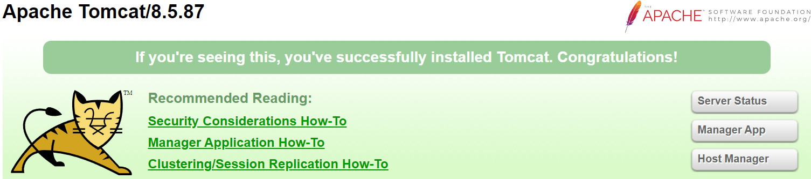
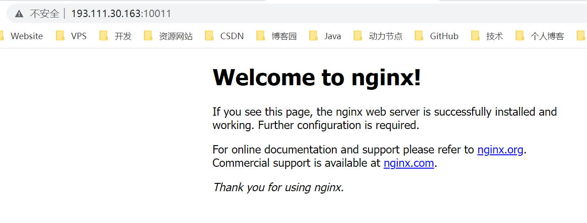
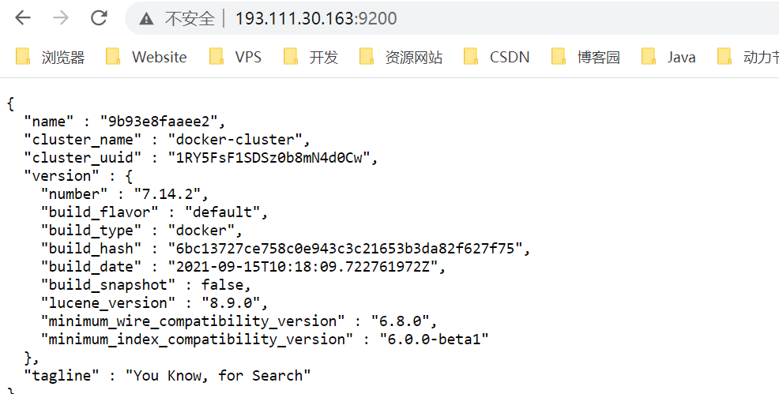
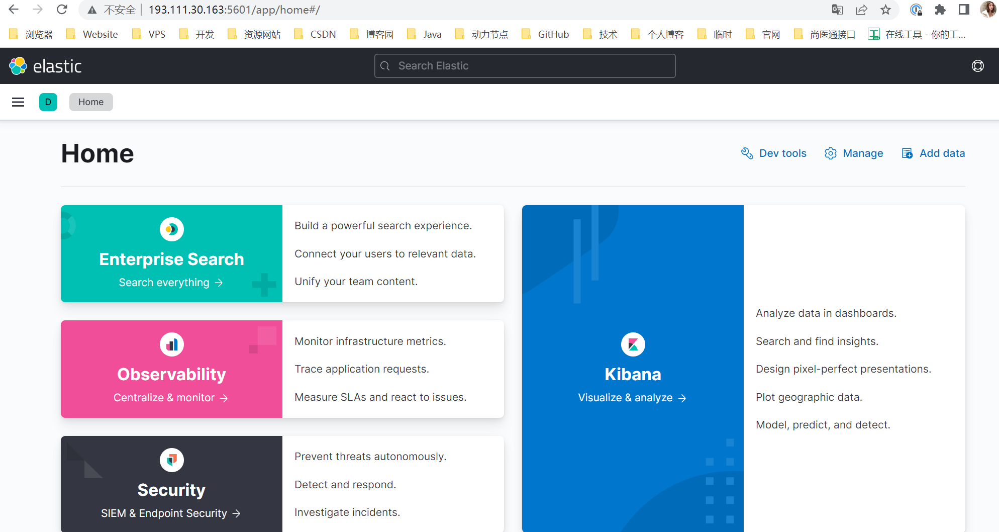
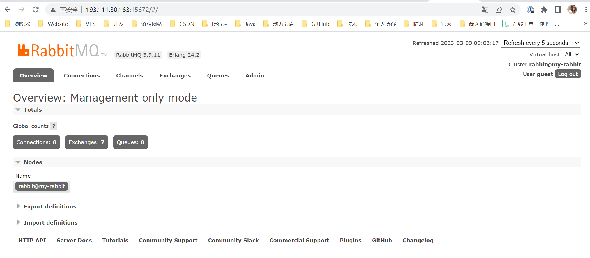

# Docker 软件安装

## 安装软件步骤

- 搜索镜像
- 拉取镜像
- 查看镜像
- 启动镜像 - 服务端口映射
- 停止容器
- 移除容器

## 安装 Tomcat

### 搜索镜像

[tomcat docker 版](https://registry.hub.docker.com/_/tomcat)

tomcat 有很多的版本分支，一个版本可能有多个分支，如 `8-jre` 代表 Tomcat 8 内置 jre8 的版本、 `8-jdk8` 代表 Tomcat 8 内置 jdk8 的版本等等。所以根据需求进行版本选择。（jdk 包括了 jre，但是相对而言比较大）

### 拉取镜像

```sh
# 这里选择的是 8.5.87-jre8-temurin-jammy 版本，先下载：

docker pull tomcat:8.5.87-jre8-temurin-jammy
```

### 查看镜像

```sh
# 下载的版本名太长，我们可以创建短的版本，然后删除掉长的版本
docker tag e1db7c6069fc tomcat:8.5.87

[root@jinmunan ~]# docker tag e1db7c6069fc tomcat:8.5.87
[root@jinmunan ~]# docker rmi -f e1db7c6069fc
[root@jinmunan ~]# docker images
REPOSITORY                     TAG                         IMAGE ID       CREATED         SIZE
tomcat                         8.5.87                      e1db7c6069fc   31 hours ago    240MB
```

### 启动镜像

```sh
# 后台启动
docker run -d --name tomcat01 -p 8080:8080 tomcat:8.5.87

# webapps 启动：创建 webapps 的数据卷，在宿主机的挂载目录部署项目，就会同步到容器的 webapps 目录下
docker run -d --name tomcat01 -p 8080:8080 -v /tomcat01-webapps:/usr/local/tomcat/webapps tomcat:8.5.87

# 配置文件启动：创建配置文件的数据卷，在宿主机的挂载目录修改配置文件，就会同步到容器的配置文件中
docker run -d --name tomcat01 -p 8080:8080 -v /tomcat01-webapps:/usr/local/tomcat/webapps -v tomcat01-conf:/usr/local/tomcat/conf tomcat:8.5.87
```

### 特别注意

```sh
# 进入容器内部
docker exec -it tomcat01 bash

# 进入 webapps 目录，查看内容，会发现为空，因为 Tomcat 官方把所有的初始化文件放到了 webapps.dist 目录下
cd /usr/local/tomcat/webapps

# 所以我们需要把 webapps.dist 的内容拷贝到 webapps 目录中
cp -r docs/ ../webapps
cp -r examples/ ../webapps
cp -r host-manager/ ../webapps
cp -r manager/ ../webapps
cp -r ROOT/ ../webapps

# 此时我们进入默认目录 /tomcat01-webapps/ 下查看拷贝的内容是否同步过来：

# 加 -f 代表实时监听日志动态
docker logs [-f] tomcat01
```



### 停止容器

```sh
dokcer stop tomcat:8.5.82
```

### 移除容器

```sh
docker rmi -f tomcat:8.5.82
```

## 安装 MySQL

### 搜索镜像

[MySQL 版本网址](https://registry.hub.docker.com/_/mysql)

### 拉取镜像

```sh
# 拉取镜像到本地
docker pull mysql:5.7
```

### 启动镜像

```sh
# 简单运行 MySQL 服务，将需要挂载的目录拷贝出来
# 密码自行修改。使用 3307 是因为宿主机可能已经安装了 MySQL，它占用了 3306 端口。
docker run -d --name mysql -p 3307:3306 -e MYSQL_ROOT_PASSWORD=jinmunan123456 mysql:5.7

# 先创建挂载目录
mkdir -p /mysql

# MySQL的相关文件同步到挂载目录
docker cp mysql:/var/lib/mysql /mysql/data
docker cp mysql:/etc/mysql/conf.d /mysql/conf
docker cp mysql:/var/log /mysql/log

# 为什么要拷贝出来呢？因为一旦挂载成功，宿主机的挂载目录会覆盖容器的目录，所以我们确保宿主机的挂载目录不能为空，必须要有原来容器目录的文件。
```

:::: tabs cache-lifetime="5" :options="{ useUrlFragment: false }"

::: tab 无注解版

```sh
# 宿主机与容器实现挂载，保证数据安全，对应上方拷贝出来的目录
docker run -d \
    --name Mymysql \
    --restart always \
    -p 3307:3306 \
    -e MYSQL_ROOT_PASSWORD=jinmunan123456 \
    -v /mysql/data:/var/lib/mysql \
    -v /mysql/conf:/etc/mysql/conf.d \
    -v /mysql/log:/var/log \
    mysql:5.7
```

:::

::: tab 有注解版

```sh
# 宿主机与容器实现挂载，保证数据安全，对应上方拷贝出来的目录
docker run -d \
    --name Mymysql \								# 容器名为 mysql
    --restart always \							# Docker 重启，容器也重启
    -p 3307:3306 \								# 将容器内部 3306 端口映射到 主机的 3306 端口
    -e MYSQL_ROOT_PASSWORD=jinmunan123456 \		# 设置登陆密码为 123456，登陆用户为 root
    -v /mysql/data:/var/lib/mysql \		        # 将容器的「数据」挂载到主机的相应文件夹
    -v /mysql/conf:/etc/mysql/conf.d \          # 将容器的「自定义配置文件夹」挂载到主机的相应文件夹
    -v /mysql/log:/var/log \				    # 将容器的「日志文件夹」挂载到主机的相应位置
    mysql:5.7
```

:::

::::

### 特别注意

```sh
# 宿主机的挂载目录、conf.d 目录、data 数据目录、日志目录根据需求决定，包括密码。

# 这里说明一下：主配置文件名叫 my.cnf，位置在 /etc/mysql，但是不建议直接操作 my.cnf 主配置文件，官方也是如此，所以官方提供了 conf.d 目录，只要在 conf.d 目录下创建 xx.cnf 配置文件，那么该配置文件自动被引入 
# my.cnf 主配置文件，避免直接操作 my.cnf 引起安全问题。
# my.cnf 文件里有这么一句代码：

includedir /etc/mysql/conf.d/

# 可以看出，my.cnf 会自动读取该目录下的所有 .cnf 配置文件。

# 确保简单启动的密码和挂载启动的保持一致，因为启动后，密码保存在 /var/lib/mysql 目录下，而挂载的时候，宿主机的该目录会覆盖容器的目录，导致密码是简单启动的密码。所以确保两种启动方式密码保持一致。
```

### 配置 UTF-8 编码

```sh
# 进入宿主机的配置文件挂载目录：/mysql/conf，有一个 mysql.cnf 配置文件，编辑它

[mysqld]
character-set-server=utf8
collation-server=utf8_general_ci

[client]
default-character-set=utf8

# 进入 MySQL 容器，配置 UTF-8 编码
docker exec -it 4af342d3e726 bash

# 进入容器后，登录 MySQL
mysql -u root -pjinmunan123456

# 查看数据库的编码是否是 UTF-8 ，以下状态是配置成功
SHOW VARIABLES LIKE '%char%';

mysql> SHOW VARIABLES LIKE '%char%';
+--------------------------+----------------------------+
| Variable_name            | Value                      |
+--------------------------+----------------------------+
| character_set_client     | utf8                       |
| character_set_connection | utf8                       |
| character_set_database   | utf8                       |
| character_set_filesystem | binary                     |
| character_set_results    | utf8                       |
| character_set_server     | utf8                       |
| character_set_system     | utf8                       |
| character_sets_dir       | /usr/share/mysql/charsets/ |
+--------------------------+----------------------------+

# 外部查看 MySQL 日志（可选）
docker logs 容器id | 容器名
```

### 其他操作

```sh
# 将 MySQL 数据库备份为 sql 文件
docker exec 容器名 | 容器id bash -c 'exec mysqldump --all-databases -uroot -p"$MYSQL_ROOT_PASSWORD"' > /opt/all-database.sql 
# 用户名要根据需求替换、/opt/all-database 是导出文件的路径，需要根据需求修改。密码不需要修改，它会自动获取登录的密码。
docker exec 4af342d3e726 bash -c 'exec mysqldump --all-databases -uroot -p"$MYSQL_ROOT_PASSWORD"' > /opt/all-database.sql 

# 导出指定的数据库数据的 sql 文件
docker exec 容器名 | 容器 bash -c 'exec mysqldump --databases 库名 -uroot -p"$MYSQL_ROOT_PASSWORD"' > /opt/one-database.sql

# 导出指定的数据库，但是不要数据
docker exec 容器名 | 容器 bash -c 'exec mysqldump --no-data --databases 库名 -uroot -p"$MYSQL_ROOT_PASSWORD"' > /opt/one-database.sql

# 执行 sql 文件到 MySQL 中
docker exec 容器名 | 容器id bash -c 'exec mysql -uroot -p"$MYSQL_ROOT_PASSWORD"' < /opt/xxx.sql
```

## 安装 Redis

[Redis 版本网址](https://registry.hub.docker.com/_/redis)

### 拉取镜像

```sh
# 拉取镜像
docker pull redis:6.2.6

# 查看 docker 容器
docker images
```

### 启动镜像

```sh
# Redis 启动后，进入容器的默认目录是 /data
# 简单的启动，也是最快速的个人使用启动：
docker run -d --name Myredis -p 6379:6379 redis:6.2.6

# AOP 持久化启动
# 指定持久化的 .aop 文件路径，宿主机的文件路径根据需求存放，容器的文件路径默认在 /data
# 容器的 /data 是 AOP 文件的默认路径，redis_data 根据需求修改，是宿主机的挂载目录，而 redis-server --appendonly yes 是必须的，这个命令会覆盖默认的命令，默认的命令是关闭持久化。
docker run -d --name Myredis -p 6379:6379 -v redis_data:/data redis:6.2.6 redis-server --appendonly yes


# 自定义配置文件启动
# 指定配置文件的路径和容器的 /usr/local/etc/redis 挂载，一旦挂载后，容器的该目录获得配置文件，然后通过 redis-server /usr/local/etc/redis/redis.conf 启动该配置文件
# /opt/redis.conf 是在宿主机的配置文件路径，根据需求修改。
# Redis 容器内没有 redis.conf 文件，启动的配置信息都是默认的。我们需要自己准备好一份 redis.conf 文件，然后通过数据卷传进容器内
# 如何准备一份 redis.conf 文件呢？
# 1、去官网下载对应的 Windows 版本，然后拷贝 redis.conf 到 Linux 下，再启动配置，这样很麻烦对吧
# 2、直接 Linux 下创建一个 redis.conf 文件，虽然不如原生的全面，但是我们只需要加入自己的一些配置即可，其他配置 Redis 自动使用默认的

docker run -d --name redis-node-1 -p 6379:6379 -v /opt/redis.conf:/usr/local/etc/redis/redis.conf -d redis:6.2.6 redis-server /usr/local/etc/redis/redis.conf

# 外部查看 MySQL 日志（可选）
docker logs 容器id | 容器名
```

### redis.config

```sh
# 根据需求指定创建路径
cd /opt
vim redis.conf

# redis 简易配置文件
# 在 redis.conf 加入如下内容
# 限制能访问 redis 的地址，根据需求修改
# bind 0.0.0.0

# 默认是 yes，开启保护模式
protected-mode no

# 配置 redis 连接密码，可选
requirepass jinmunan123456

# 以守护进程方式启动，可后台启动
daemonize no

# 更改本地 redis 数据库存放文件夹（可选）
dir ./

# AOP 持久化
# 如果不加入 appendonly yes，可以利用 AOP 持久化启动来指定 appendonly yes 启动。
appendonly yes
```

### 其他操作

```sh
# 启动后进入 redis 容器
docker exec -it redis bash

# 查看 redis 的日志
# 加 -f 代表实时监听日志动态
docker logs [-f] redis

# 输入 redis-cli 连接 redis，如果是连接其他服务器的 redis，则需要加参数
redis-cli -h 193.111.30.163 -p 6379
```

## 安装 Nginx

### 拉取镜像

```sh
# 拉取镜像
docker pull nginx

# 查看 docker 容器
docker images
```

### 启动镜像

```sh
# 创建挂载目录
mkdir -p /home/nginx/conf
mkdir -p /home/nginx/log
mkdir -p /home/nginx/html

# 生成容器
docker run --name nginx -p 9001:80 -d nginx
# 将容器nginx.conf文件复制到宿主机
docker cp nginx:/etc/nginx/nginx.conf /home/nginx/conf/nginx.conf
# 将容器conf.d文件夹下内容复制到宿主机
docker cp nginx:/etc/nginx/conf.d /home/nginx/conf/conf.d
# 将容器中的html文件夹复制到宿主机
docker cp nginx:/usr/share/nginx/html /home/nginx/
# 找到nginx对应的容器id
docker ps -a
# 关闭该容器
docker stop nginx
# 删除该容器
docker rm nginx

启动镜像并挂载数据卷
docker run -d \
    -p 10001:80 \
    --name MyNginx \
    -v /home/nginx/conf/nginx.conf:/etc/nginx/nginx.conf \ # 挂载nginx.conf配置文件
    -v /home/nginx/conf/conf.d:/etc/nginx/conf.d \ # 挂载nginx配置文件
    -v /home/nginx/log:/var/log/nginx \ # 挂载nginx日志文件
    -v /home/nginx/html:/usr/share/nginx/html \ 挂载nginx内容
    nginx:latest
    
    
docker run -d \
    -p 10011:80 \
    --name nginx \
    -v /home/nginx/conf/nginx.conf:/etc/nginx/nginx.conf \
    -v /home/nginx/conf/conf.d:/etc/nginx/conf.d \
    -v /home/nginx/log:/var/log/nginx \
    -v /home/nginx/html:/usr/share/nginx/html \
    nginx:latest
    
docker exec -it nginx /bin/bash
    
# 更新工具
apt-get update
apt install vim
apt install wget
#ping and ifconfig
apt install iputils-ping
apt install net-tools
```



## 安装 ElasticSearch

[ElasticSearch 版本网址](https://registry.hub.docker.com/_/elasticsearch)

### 拉取镜像

```sh
docker pull elasticsearch:7.14.2
```

### 启动镜像

```sh
# 简单启动 浏览器访问的是 9200 端口
docker run -d --name elasticsearch -p 9200:9200 -p 9300:9300 elasticsearch:7.14.2

# 持久化和配置文件启动
# ES 中所有的数据都在容器中的 /usr/share/elasticsearch/data 目录，配置文件在 /usr/share/elasticsearch/config，所以需要挂载出来
# 挂载成功后，哪怕容器被删除了，数据还是会存在宿主机的 /var/lib/docker/volumes/.../_data/目录下
docker run -d --name elasticsearch -p 9200:9200 -p 9300:9300 -v es_data:/usr/share/elasticsearch/data -v es_config:/usr/share/elasticsearch/config elasticsearch:7.14.2

# ik 分词器启动 方式一
# 首先下载好 ik 分词器，版本要和 ES 版本一致，放到 Linux 系统中，我们知道，ES 的插件目录是 /usr/share/elasticsearch/plugins 下，所以需要挂载出来
docker run -d --name elasticsearch -p 9200:9200 -p 9300:9300 -v es_data:/usr/share/elasticsearch/data -v es_config:/usr/share/elasticsearch/config -v es_plugins:/usr/share/elasticsearch/plugins elasticsearch:7.14.2

# 此时的 es_plugins 目录下为空，我们把下载好的 ik 分词器放到该目录下，然后重启 ES 即可
cp <ik 分词器> /var/lib/docker/volumes/es_plugins/_data

docker restart elasticsearch

# ik 分词器启动 方式二
# 先创建数据卷，把 ik 分词器放到数据卷里
docker volume create es_plugins
cp <ik 分词器> /var/lib/docker/volumes/es_plugins/_data
cp elasticsearch-analysis-ik-8.7.0.zip /var/lib/docker/volumes/es_plugins/_data

# 再启动容器进行挂载
docker run -d --name elasticsearch -p 9200:9200 -p 9300:9300 -v es_data:/usr/share/elasticsearch/data -v es_config:/usr/share/elasticsearch/config -v es_plugins:/usr/share/elasticsearch/plugins elasticsearch:7.14.2

# 查看日志
docker inspect --format '{{.LogPath}}' 9b93e8faaee270fb704f4eec233591a5fb851788e7c9a197a7d68968976a8c7e
```

### 特殊说明

```sh
# 启动报错
{"log":"ERROR: [2] bootstrap checks failed. You must address the points described in the following [2] lines before starting Elasticsearch.\n","stream":"stderr","time":"2023-03-08T09:23:43.66429859Z"}
{"log":"bootstrap check failure [1] of [2]: max virtual memory areas vm.max_map_count [65530] is too low, increase to at least [262144]\n","stream":"stderr","time":"2023-03-08T09:23:43.664364575Z"}
{"log":"bootstrap check failure [2] of [2]: the default discovery settings are unsuitable for production use; at least one of [discovery.seed_hosts, discovery.seed_providers, cluster.initial_master_nodes] must be configured\n","stream":"stderr","time":"2023-03-08T09:23:43.664369378Z"}
{"log":"ERROR: Elasticsearch did not exit normally - check the logs at /usr/share/elasticsearch/logs/docker-cluster.log\n","stream":"stderr","time":"2023-03-08T09:23:43.664373607Z"}

# elasticsearch用户拥有的可创建文件描述的权限太低，至少需要65536,
vim /etc/security/limits.conf   # 在最后面追加下面内容
* soft nofile 65535
* hard nofile 65535
* soft nproc 65535
* hard nproc 65535

# max_map_count文件包含限制一个进程可以拥有的VMA(虚拟内存区域)的数量 
# 修改配置 sysctl.conf
vim /etc/sysctl.conf
# 加入配置信息
vm.max_map_count=262144
# 启用配置
sysctl -p

# 在ES的配置文件中设置 /es_config/elasticsearch.yml
discovery.type: single-node # 单例启动
```



## 安装 Kibana

[Kibana 版本网址](https://registry.hub.docker.com/_/kibana)

### 拉取镜像

```sh
# 下载 Kibaba 镜像，版本要和 ElasticSearch 一致。
docker pull kibana:7.14.2
```

### 启动镜像

```sh
# 简单启动 此时没有指定连接es
docker run -d --name kibana -p 5601:5601 kibaba:7.14.2

# 连接es启动
docker run -d --name kibana -p 5601:5601 -e ELASTICSEARCH_URL=http://IP地址:9200 kibaba:7.14.2

# 先简单启动，后在配置文件再连接es，重启生效
# 首先知道配置文件的路径是 /usr/share/kibana/config，将它挂载出来
docker run -d --name kibana -p 5601:5601 -v kibana_conf:/usr/share/kibana/config kibana:7.14.2
# 启动后进入宿主机的 kibana_conf 目录或者 容器的 /usr/share/kibana/config 目录
cd /var/lib/docker/volumes/kibana_conf/_data
vim kibana.yml

# 修改为 ES 的 IP 地址
#
# ** THIS IS AN AUTO-GENERATED FILE **
#
# Default Kibana configuration for docker target
server.host: "0"
server.shutdownTimeout: "5s"
elasticsearch.hosts: [ "http://193.111.30.163:9200" ]
monitoring.ui.container.elasticsearch.enabled: true
i18n.locale: "zh-CN"
```



## 安装 RabbitMQ

[RabbitMQ 版本网址](https://registry.hub.docker.com/_/rabbitmq)

### 拉取镜像

```sh
# 无可视化界面
docker pull rabbitmq

# 有可视化界面
docker pull rabbitmq:management
```

### 运行镜像

```sh
# 关于 RabbitMQ 需要注意的重要事项之一是它根据所谓的“节点名称”存储数据，默认为主机名。
# 这对于在 Docker 中的使用意味着我们应该为每个守护进程明确指定-h/--hostname以便我们不会获得随机主机名并且可以跟踪我们的数据
# 给rabbitmq设定一个主机名
# 简单启动
docker run -d --hostname my-rabbit --name myrabbitmq -p 5672:5672 -p 15672:15672 rabbitmq

# 挂载 /var/lib/rabbitmq 方式启动 --restart=always docker重启时自动启动
docker run -d --hostname my-rabbit --name myrabbitmq -p 5672:5672 -p 15672:15672 -v /opt/rabbitmq/data:/var/lib/rabbitmq --restart=always rabbitmq

# 指定密码的方式启动
docker run -d --hostname my-rabbit --name myrabbitmq -p 5672:5672 -p 15672:15672 -e RABBITMQ_DEFAULT_USER=guest -e RABBITMQ_DEFAULT_PASS=guest -v /opt/rabbitmq/data:/var/lib/rabbitmq --restart=always rabbitmq:management

# 查看日志
docker logs myrabbitmq

# 查看部署的mq容器id
docker ps -a

# 进入容器内部在
docker exec -it 容器id /bin/bash  
docker exec -it c2f12021822f /bin/bash

# 安装可视化面板插件
rabbitmq-plugins enable rabbitmq_management

# 现在可以通过访问http://linuxip:15672，访问web界面，这里的用户名和密码默认都是guest
```



## 安装 MongoDB

```sh
# 首先拉取镜像
docker pull Mongo

# 创建挂载目录
mkdir -p /home/docker/mongodb/db

# 启动容器
# --auth表示连接mongodb需要授权
docker run -itd --name mongodb \
-v /home/docker/mongodb/db:/data/db \
-p 27017:27017 --restart=always \
-d mongo:latest --auth

# 进入MongoDB控制台
docker exec -it mongodb mongo admin

# 创建一个名为admin，密码为123456的用户。
db.createUser({user:'angel',pwd:'Angel#1368',roles:[{role:'userAdminAnyDatabase',db:'admin'},"readWriteAnyDatabase"]});

# 尝试使用上面创建的用户信息进行连接。
db.auth('angel','Angel#1368')
```

## 安装 Nacos

```sh
# 拉去镜像
docker pull nacos/nacos-server:1.0.0

# 查看端口，–permanent表示永久有效
firewall-cmd --zone=public --add-port=8848/tcp --permanent
firewall-cmd --reload

# 运行镜像
docker run --env MODE=standalone --name nacos -d -p 8848:8848 nacos/nacos-server:1.0.0
```

## 安装 seata

```sh
docker run --name seata-server \
        -p 8091:8091 \
        -e SEATA_IP=193.111.30.163 \
        -e SEATA_PORT=8091 \
        docker.io/seataio/seata-server:1.2.0
```

