# Docker 集群安装

## 安装 MySQL 主从复制

### ①新建主服务器容器

```sh
# 新建主服务器容器实例3307
docker run -p 3307:3306 --name mysql-master \
    -v /mydata/mysql-master/log:/var/log/mysql \
    -v /mydata/mysql-master/data:/var/lib/mysql \
    -v /mydata/mysql-master/conf:/etc/mysql \
    -e MYSQL_ROOT_PASSWORD=jinmunan123456  \
    -d mysql:5.7
    
# 进入/mydata/mysql-master/conf目录下新建my.cnf
vim /mydata/mysql-master/conf/my.cnf

[mysqld]
## 设置server_id，同一局域网中需要唯一
server_id=101 
## 指定不需要同步的数据库名称
binlog-ignore-db=mysql  
## 开启二进制日志功能
log-bin=mall-mysql-bin  
## 设置二进制日志使用内存大小（事务）
binlog_cache_size=1M  
## 设置使用的二进制日志格式（mixed,statement,row）
binlog_format=mixed  
## 二进制日志过期清理时间。默认值为0，表示不自动清理。
expire_logs_days=7  
## 跳过主从复制中遇到的所有错误或指定类型的错误，避免slave端复制中断。
## 如：1062错误是指一些主键重复，1032错误是因为主从数据库数据不一致
slave_skip_errors=1062

# 修改完配置后重启master实例
docker restart mysql-master

# 这里报错 设置文件权限解决
# OCI runtime exec failed: exec failed: unable to start container process: error executing setns process: exit status 1: unknown
chmod -R 777 /mydata/mysql-master/conf/my.cnf

# 进入mysql-master容器
docker exec -it mysql-master /bin/bash

# 进入MySQL
mysql -uroot -pjinmunan123456

# master容器实例内创建数据同步用户 给从机授权
drop user 'slave'@'%';
flush privileges;

CREATE USER 'slave'@'%' IDENTIFIED BY '123456';
GRANT REPLICATION SLAVE, REPLICATION CLIENT ON *.* TO 'slave'@'%';
flush privileges;
```

### ②新建从服务器容器

```sh
# 新建从服务器容器实例3308
docker run -p 3308:3306 --name mysql-slave \
    -v /mydata/mysql-slave/log:/var/log/mysql \
    -v /mydata/mysql-slave/data:/var/lib/mysql \
    -v /mydata/mysql-slave/conf:/etc/mysql \
    -e MYSQL_ROOT_PASSWORD=root  \
    -d mysql:5.7
    
# 进入/mydata/mysql-slave/conf目录下新建my.cnf
vim /mydata/mysql-slave/conf/my.cnf

[mysqld]
## 设置server_id，同一局域网中需要唯一
server_id=102
## 指定不需要同步的数据库名称
binlog-ignore-db=mysql  
## 开启二进制日志功能，以备Slave作为其它数据库实例的Master时使用
log-bin=mall-mysql-slave1-bin  
## 设置二进制日志使用内存大小（事务）
binlog_cache_size=1M  
## 设置使用的二进制日志格式（mixed,statement,row）
binlog_format=mixed  
## 二进制日志过期清理时间。默认值为0，表示不自动清理。
expire_logs_days=7  
## 跳过主从复制中遇到的所有错误或指定类型的错误，避免slave端复制中断。
## 如：1062错误是指一些主键重复，1032错误是因为主从数据库数据不一致
slave_skip_errors=1062  
## relay_log配置中继日志
relay_log=mall-mysql-relay-bin  
## log_slave_updates表示slave将复制事件写进自己的二进制日志
log_slave_updates=1  
## slave设置为只读（具有super权限的用户除外）
read_only=1

# 需要重新设置权限
chmod -R 777 /mydata/mysql-slave/conf/my.cnf

# 修改完配置后重启slave实例
docker restart mysql-slave

# 进入从服务器
docker exec -it mysql-slave /bin/bash
mysql -uroot -pjinmunan123456

# 在从数据库中配置主从复制
change master to master_host='宿主机ip', master_user='slave', master_password='123456', master_port=3307, master_log_file='mall-mysql-bin.000001', master_log_pos=617, master_connect_retry=30;

change master to master_host='193.111.30.163', master_user='slave', master_password='123456', master_port=3307, master_log_file='mall-mysql-bin.000001', master_log_pos=617, master_connect_retry=30;

# 在从数据库中查看主从同步状态
show slave status \G;

# 在从数据库中开后主从同步
start slave;
```

### ③会遇到各种错误

[Got fatal error 1236 原因和解决方法](https://blog.csdn.net/weixin_33722405/article/details/94469284)

### ④主从复制命令参数说明

master_host：主数据库的 IP 地址；

master_port：主数据库的运行端口；

master_user：在主数据库创建的用于同步数据的用户账号；

master_password：在主数据库创建的用于同步数据的用户密码；

master_log_file：指定从数据库要复制数据的日志文件，通过查看主数据的状态，获取 File 参数；

master_log_pos：指定从数据库从哪个位置开始复制数据，通过查看主数据的状态，获取 Position 参数；

master_connect_retry：连接失败重试的时间间隔，单位为秒。

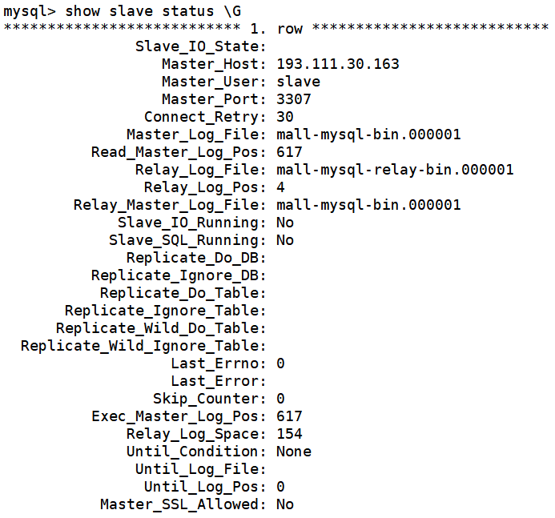

### ⑤成功状态

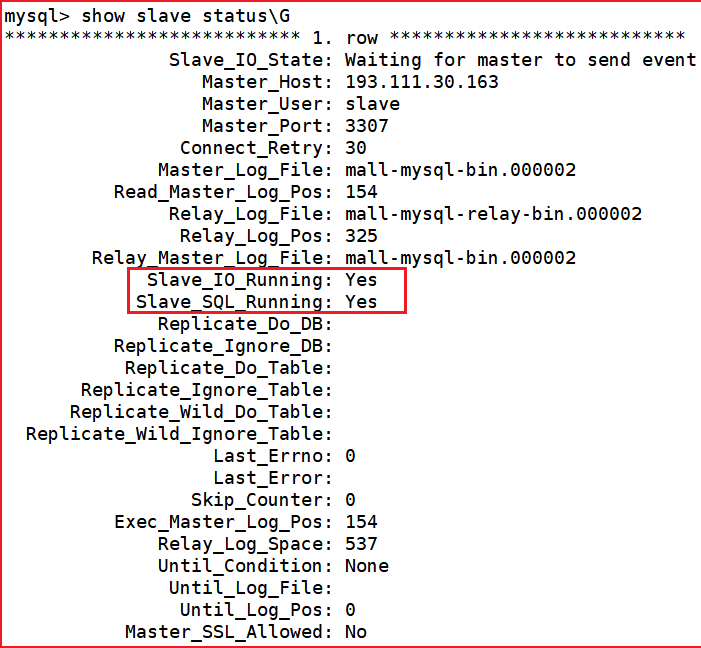

### ⑥测试

```sql
# 主库
create database db1;
use db1;
create table tb1(id int,name varchar(20));
insert into tb1 values(1,'z3');
select * from tb1;

# 切换到从库
use db1;
show tables;
select * from tb1;
```

## 分布式存储案例

### cluster(集群) 模式-docker 版哈希槽分区进行亿级数据存储

1~2 亿条数据需要缓存，请问如何设计这个存储案例？

- 单机单台 100% 不可能，肯定是分布式存储，用 redis？如何落地？

### ①哈希取余分区

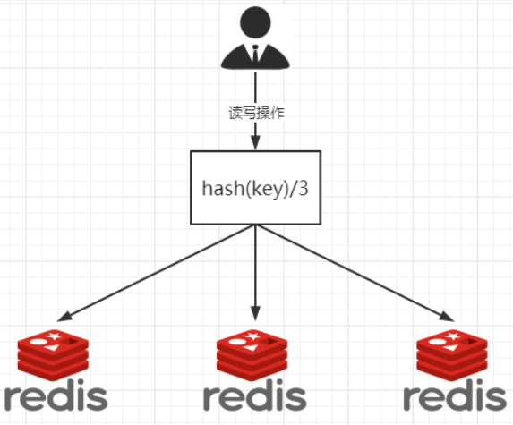

2 亿条记录就是 2 亿个 k,v，我们单机不行必须要分布式多机，假设有 3 台机器构成一个集群，用户每次读写操作都是根据公式：hash(key) % N 个机器台数，计算出哈希值，用来决定数据映射到哪一个节点上。

**优点：**

简单粗暴，直接有效，只需要预估好数据规划好节点，例如 3 台、8 台、10 台，就能保证一段时间的数据支撑。使用 Hash 算法让固定的一部分请求落到同一台服务器上，这样每台服务器固定处理一部分请求（并维护这些请求的信息

**缺点：**

原来规划好的节点，进行扩容或者缩容就比较麻烦了额，不管扩缩，每次数据变动导致节点有变动，映射关系需要重新进行计算，在服务器个数固定不变时没有问题，如果需要弹性扩容或故障停机的情况下，原来的取模公式就会发生变化：Hash(key)/3 会变成 Hash(key) /?。此时地址经过取余运算的结果将发生很大变化，根据公式获取的服务器也会变得不可控。某个 redis 机器宕机了，由于台数数量变化，会导致 hash 取余全部数据重新洗牌。

### ②一致性哈希算法分区

#### 是什么

一致性哈希算法在 1997 年由麻省理工学院中提出的，设计目标是为了解决分布式缓存数据变动和映射问题，某个机器宕机了，分母数量改变了，自然取余数不 OK 了。

#### 能干嘛

提出一致性 Hash 解决方案。目的是当服务器个数发生变动时，尽量减少影响客户端到服务器的映射关系

#### 步骤

##### **①算法构建一致性哈希环**

**一致性哈希环**

一致性哈希算法必然有个 hash 函数并按照算法产生 hash 值，这个算法的所有可能哈希值会构成一个全量集，这个集合可以成为一个 hash 空间[0,2^32-1]，这个是一个线性空间，但是在算法中，我们通过适当的逻辑控制将它首尾相连 (0 = 2^32),这样让它逻辑上形成了一个环形空间。

它也是按照使用取模的方法，前面笔记介绍的节点取模法是对节点（服务器）的数量进行取模。而一致性 Hash 算法是对 2^32 取模，简单来说，一致性 Hash 算法将整个哈希值空间组织成一个虚拟的圆环，如假设某哈希函数 H 的值空间为 0-2^32-1（即哈希值是一个 32 位无符号整形），整个哈希环如下图：整个空间按顺时针方向组织，圆环的正上方的点代表 0，0 点右侧的第一个点代表 1，以此类推，2、3、4、……直到 2^32-1，也就是说 0 点左侧的第一个点代表 2^32-1，0 和 2^32-1 在零点中方向重合，我们把这个由 2^32 个点组成的圆环称为 Hash 环。


##### **②服务器 P 节点映射**

**节点映射**

将集群中各个 IP 节点映射到环上的某一个位置。

将各个服务器使用 Hash 进行一个哈希，具体可以选择服务器的 IP 或主机名作为关键字进行哈希，这样每台机器就能确定其在哈希环上的位置。假如 4 个节点 NodeA、B、C、D，经过 IP 地址的哈希函数计算 (hash(ip))，使用 IP 地址哈希后在环空间的位置如下： 

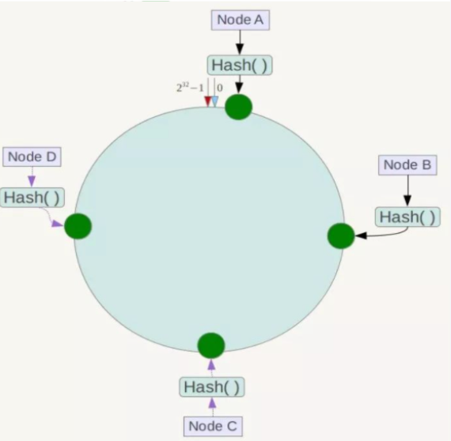


##### **③key 落到服务器的落键规侧**

当我们需要存储一个 kv 键值对时，首先计算 key 的 hash 值，hash(key)，将这个 key 使用相同的函数 Hash 计算出哈希值并确定此数据在环上的位置，**从此位置沿环顺时针“行走”**，第一台遇到的服务器就是其应该定位到的服务器，并将该键值对存储在该节点上。

如我们有 Object A、Object B、Object C、Object D 四个数据对象，经过哈希计算后，在环空间上的位置如下：根据一致性 Hash 算法，数据 A 会被定为到 Node A 上，B 被定为到 Node B 上，C 被定为到 Node C 上，D 被定为到 Node D 上。

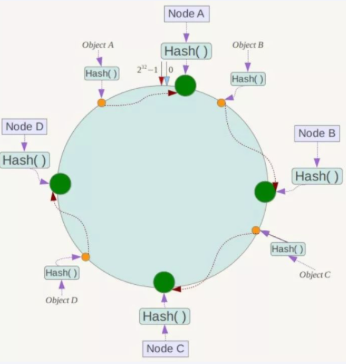

#### 优点

**一致性哈希算法的容错性**

假设 Node C 宕机，可以看到此时对象 A、B、D 不会受到影响，只有 C 对象被重定位到 Node D。一般的，在一致性 Hash 算法中，如果一台服务器不可用，则受影响的数据仅仅是此服务器到其环空间中前一台服务器（即沿着逆时针方向行走遇到的第一台服务器）之间数据，其它不会受到影响。简单说，就是 C 挂了，受到影响的只是 B、C 之间的数据，并且这些数据会转移到 D 进行存储。

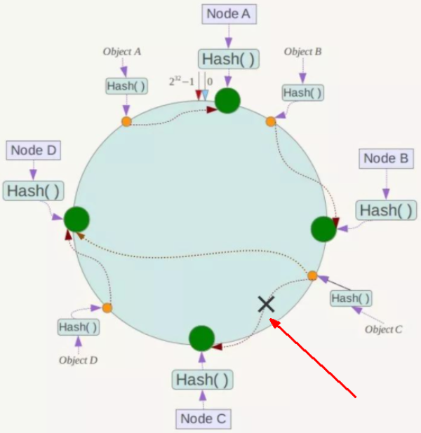

**一致性哈希算法的扩展性**

数据量增加了，需要增加一台节点 NodeX，X 的位置在 A 和 B 之间，那收到影响的也就是 A 到 X 之间的数据，重新把 A 到 X 的数据录入到 X 上即可，

不会导致 hash 取余全部数据重新洗牌。

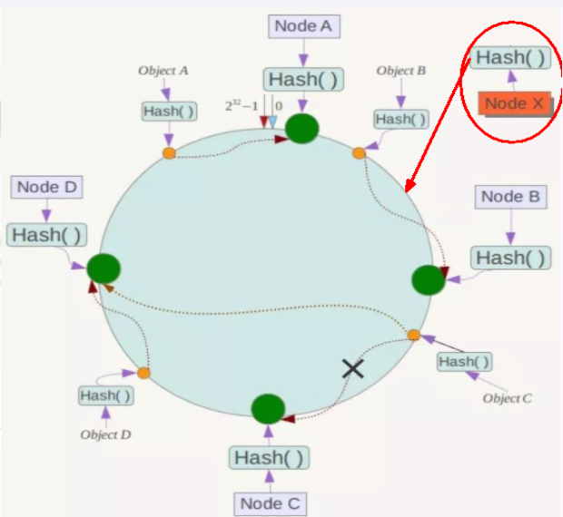

#### 缺点

**一致性哈希算法的数据倾斜问题**

一致性 Hash 算法在服务 **节点太少时**，容易因为节点分布不均匀而造成 **数据倾斜**（被缓存的对象大部分集中缓存在某一台服务器上）问题，

例如系统中只有两台服务器

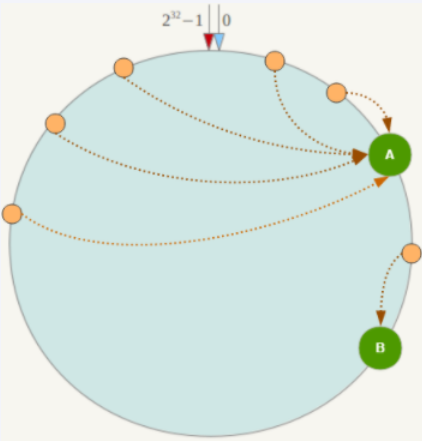

#### 总结

为了在节点数目发生改变时尽可能少的迁移数据

将所有的存储节点排列在收尾相接的 Hash 环上，每个 key 在计算 Hash 后会顺时针找到临近的存储节点存放。

而当有节点加入或退出时仅影响该节点在 Hash 环上顺时针相邻的后续节点。 

**优点**

加入和删除节点只影响哈希环中顺时针方向的相邻的节点，对其他节点无影响。 

**缺点**

数据的分布和节点的位置有关，因为这些节点不是均匀的分布在哈希环上的，所以数据在进行存储时达不到均匀分布的效果。

### ③哈希槽分区

#### 是什么？

##### **为什么出现**？


哈希槽实质就是一个数组，数组[0,2^14 -1]形成 hash slot 空间。

##### **能干什么？**

解决均匀分配的问题，在数据和节点之间又加入了一层，把这层称为哈希槽（slot），用于管理数据和节点之间的关系，现在就相当于节点上放的是槽，槽里放的是数据。

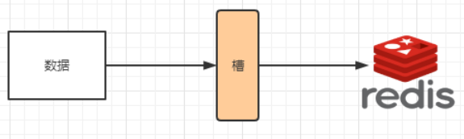

槽解决的是粒度问题，相当于把粒度变大了，这样便于数据移动。

哈希解决的是映射问题，使用 key 的哈希值来计算所在的槽，便于数据分配。

##### **多少个 hash 槽？**

一个集群只能有 16384 个槽，编号 0-16383（0-2^14-1）。这些槽会分配给集群中的所有主节点，分配策略没有要求。可以指定哪些编号的槽分配给哪个主节点。集群会记录节点和槽的对应关系。解决了节点和槽的关系后，接下来就需要对 key 求哈希值，然后对 16384 取余，余数是几 key 就落入对应的槽里。slot = CRC16(key) % 16384。以槽为单位移动数据，因为槽的数目是固定的，处理起来比较容易，这样数据移动问题就解决了。

#### 哈希槽计算

Redis 集群中内置了 16384 个哈希槽，redis 会根据节点数量大致均等的将哈希槽映射到不同的节点。当需要在 Redis 集群中放置一个 key-value 时，redis 先对 key 使用 crc16 算法算出一个结果，然后把结果对 16384 求余数，这样每个 key 都会对应一个编号在 0-16383 之间的哈希槽，也就是映射到某个节点上。如下代码，key 之 A、B 在 Node2，key 之 C 落在 Node3 上

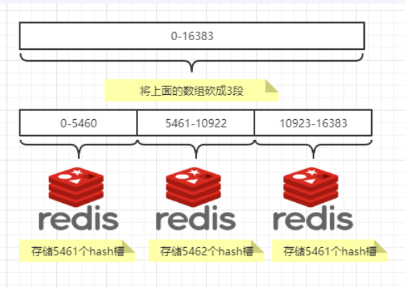

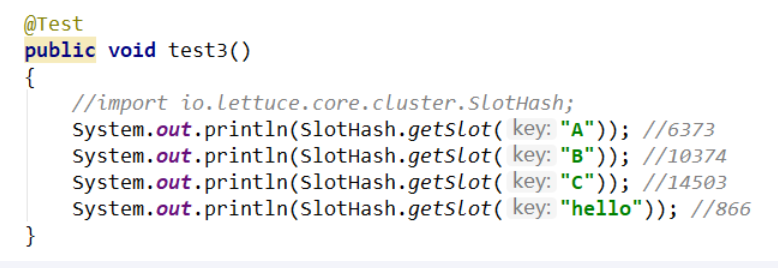

[拓展阅读：[Redis 集群节点扩容及其 Redis 哈希槽](https://www.cnblogs.com/aaabbbcccddd/p/14849085.html)

## 安装 Redis 集群

### Redis3 主 3 从集群

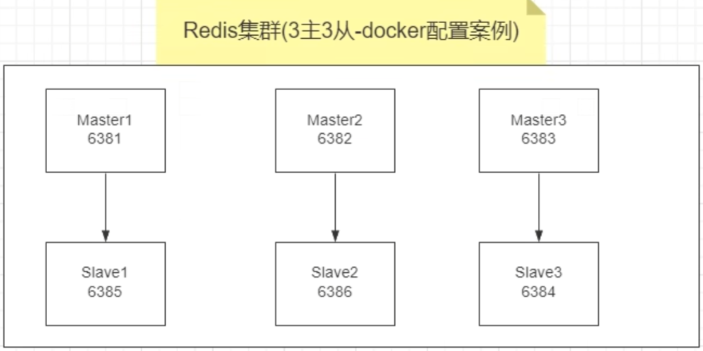

#### ①关闭防火墙 + 后动 docker 后台服务

#### ②新建 6 个 docker 容器 redis 实例

```sh
docker run -d --name redis-node-1 --net host --privileged=true -v /data/redis/share/redis-node-1:/data redis:6.0.8 --cluster-enabled yes --appendonly yes --port 6381

docker run -d --name redis-node-2 --net host --privileged=true -v /data/redis/share/redis-node-2:/data redis:6.0.8 --cluster-enabled yes --appendonly yes --port 6382

docker run -d --name redis-node-3 --net host --privileged=true -v /data/redis/share/redis-node-3:/data redis:6.0.8 --cluster-enabled yes --appendonly yes --port 6383

docker run -d --name redis-node-4 --net host --privileged=true -v /data/redis/share/redis-node-4:/data redis:6.0.8 --cluster-enabled yes --appendonly yes --port 6384

docker run -d --name redis-node-5 --net host --privileged=true -v /data/redis/share/redis-node-5:/data redis:6.0.8 --cluster-enabled yes --appendonly yes --port 6385

docker run -d --name redis-node-6 --net host --privileged=true -v /data/redis/share/redis-node-6:/data redis:6.0.8 --cluster-enabled yes --appendonly yes --port 6386
```

#### ③进入容器 redis-node-1 并为 6 台机器构建集群矣系

```sh
# 进入容器
docker exec -it redis-node-1 /bin/bash

# 构建主从关系
# 注意，进入docker容器后才能执行一下命令，且注意自己的真实IP地址
redis-cli --cluster create 193.111.30.163:6381 193.111.30.163:6382 193.111.30.163:6383 193.111.30.163:6384 193.111.30.163:6385 193.111.30.163:6386 --cluster-replicas 1

# --cluster-replicas 1 表示为每个master创建一个slave节点

# 自动分配哈希槽和主从关系
```

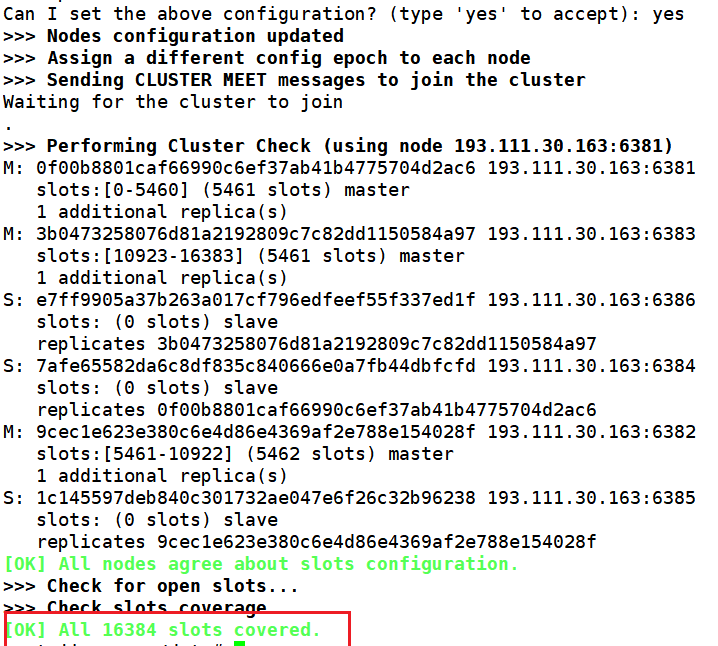


#### ④链接进入 6381 作为切入点，查看集群状态

```sh
# 进入6381
redis-cli -p 6381

# 集群信息
cluster info

127.0.0.1:6381> cluster info
cluster_state:ok
cluster_slots_assigned:16384
cluster_slots_ok:16384
cluster_slots_pfail:0
cluster_slots_fail:0
cluster_known_nodes:6
cluster_size:3
cluster_current_epoch:6
cluster_my_epoch:1
cluster_stats_messages_ping_sent:289
cluster_stats_messages_pong_sent:287
cluster_stats_messages_sent:576
cluster_stats_messages_ping_received:282
cluster_stats_messages_pong_received:289
cluster_stats_messages_meet_received:5
cluster_stats_messages_received:576

# 集群节点
cluster nodes

127.0.0.1:6381> cluster nodes
3b0473258076d81a2192809c7c82dd1150584a97 193.111.30.163:6383@16383 master - 0 1679991373179 3 connected 10923-16383
e7ff9905a37b263a017cf796edfeef55f337ed1f 193.111.30.163:6386@16386 slave 3b0473258076d81a2192809c7c82dd1150584a97 0 1679991373000 3 connected
0f00b8801caf66990c6ef37ab41b4775704d2ac6 193.111.30.163:6381@16381 myself,master - 0 1679991371000 1 connected 0-5460
7afe65582da6c8df835c840666e0a7fb44dbfcfd 193.111.30.163:6384@16384 slave 0f00b8801caf66990c6ef37ab41b4775704d2ac6 0 1679991374180 1 connected
9cec1e623e380c6e4d86e4369af2e788e154028f 193.111.30.163:6382@16382 master - 0 1679991372175 2 connected 5461-10922
1c145597deb840c301732ae047e6f26c32b96238 193.111.30.163:6385@16385 slave 9cec1e623e380c6e4d86e4369af2e788e154028f 0 1679991372000 2 connected
```

### 主从容错切换迁移

#### 数据读写存储

```sh
# 启动 6 机 构成的集群并通过 exec 进入 
docker exec -it redis-node-1 /bin/bash
redis-cli -p 6381

# 对6381新增两个key
# 原因 哈希槽问题
127.0.0.1:6381> set k1 v1
(error) MOVED 12706 193.111.30.163:6383

# 防止路由失效加参数 -c 并新增两个key
redis-cli -p 6381 -c

# 重定向存到了6381
127.0.0.1:6381> set k1 v1
-> Redirected to slot [12706] located at 193.111.30.163:6383
OK

# 查看集群信息
redis-cli --cluster check 193.111.30.163:6381

```

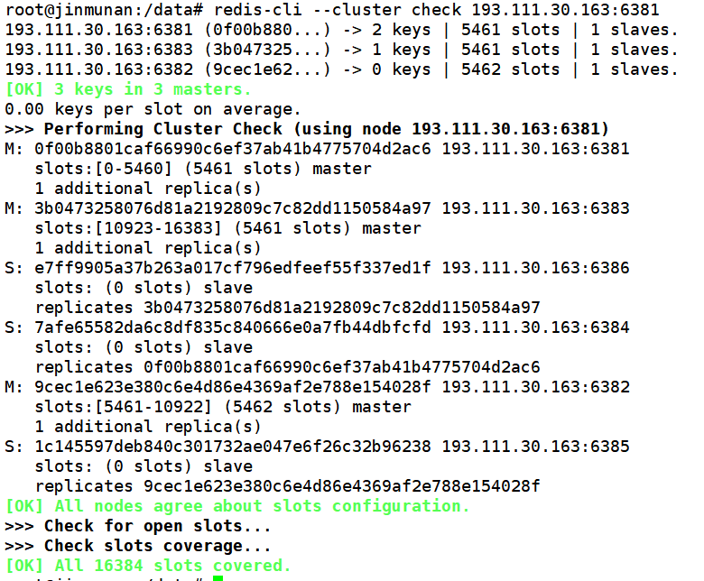

#### 容错切换迁移

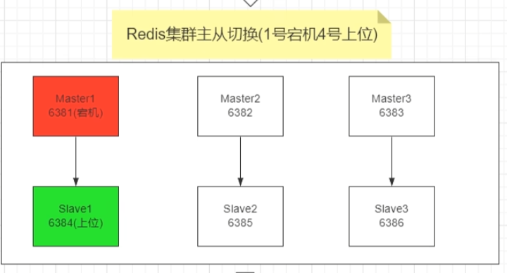

```sh
# 主6381和从机切换，先停止主机6381
# 6381主机停了，对应的真实从机上位
# 6381作为1号主机分配的从机以实际情况为准，具体是几号机器就是几号
docker stop redis-node-1

# 进入 2 号节点
docker exec -it redis-node-2 /bin/bash
redis-cli -p 6382 -c

# 查看集群信息
redis-cli --cluster check 193.111.30.163:6382

# 重新启动6381
docker start redis-node-1

# 发现没有恢复，如果想要恢复成原先主从关系，只需要再将上位的停掉再启动就行
```

##### 查看

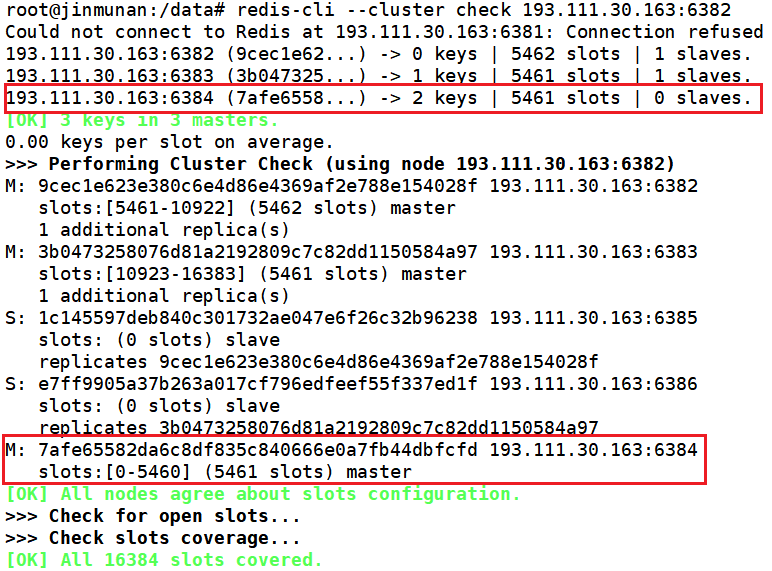

##### 重新启动 6381

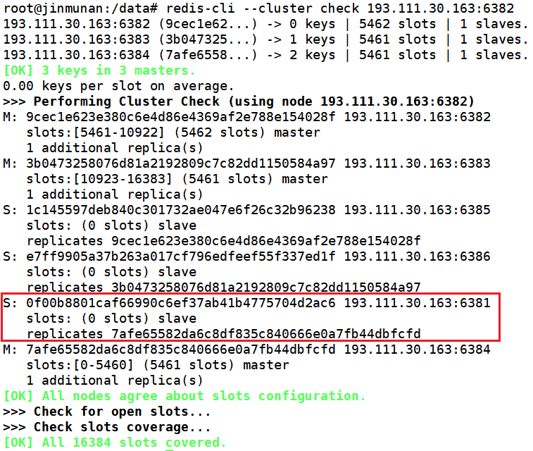

### 主从扩容

#### ①新增主机

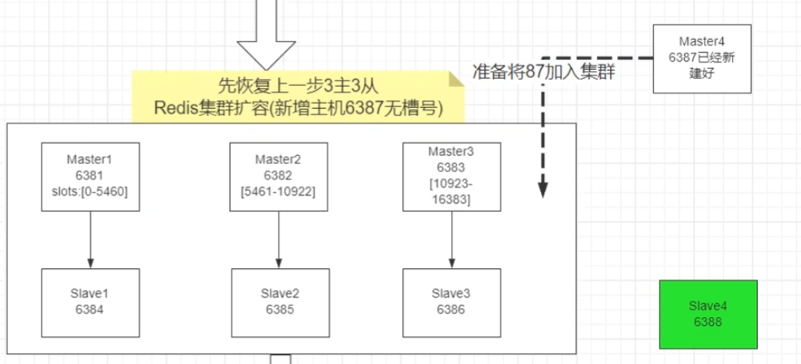

#### ②分配槽位

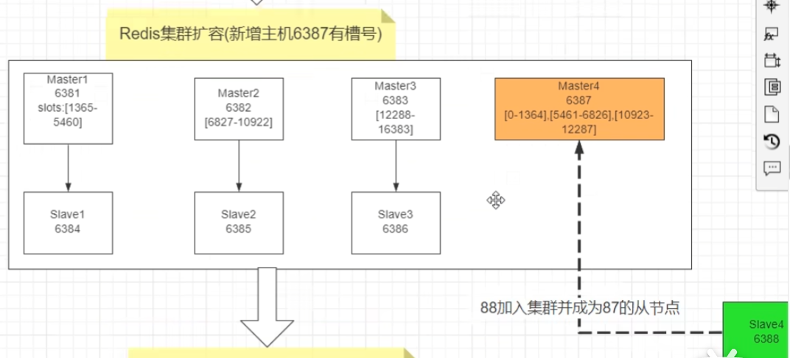

#### ③新增从机

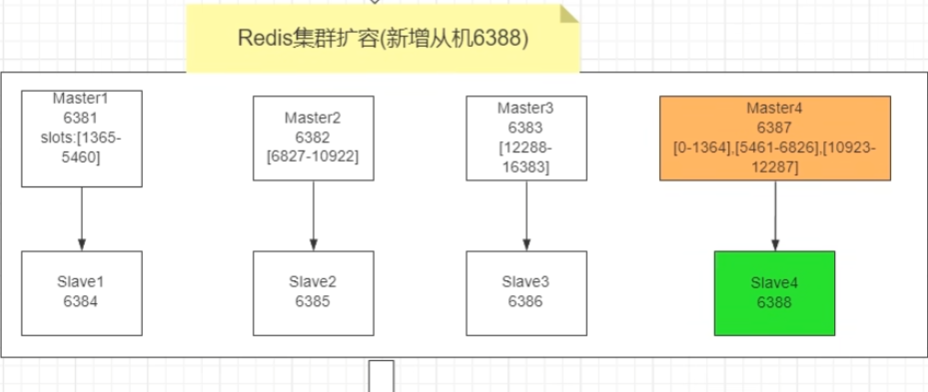

#### 具体操作

```sh
# 新建6387、6388两个节点+新建后后动+查看是否8节点
docker run -d --name redis-node-7 --net host --privileged=true -v /data/redis/share/redis-node-7:/data redis:6.0.8 --cluster-enabled yes --appendonly yes --port 6387

docker run -d --name redis-node-8 --net host --privileged=true -v /data/redis/share/redis-node-8:/data redis:6.0.8 --cluster-enabled yes --appendonly yes --port 6388

docker ps

# 进入6387容器实例内部
docker exec -it redis-node-7 /bin/bash

# 将新增的6387节点（空槽号）作为master节点加入原集群
# 将新增的6387作为master节点加入集群
redis-cli --cluster add-node 193.111.30.163:6387 193.111.30.163:6381

# 6387 就是将要作为master新增节点
# 6381 就是原来集群节点里面的领路人，相当于6387拜拜6381的码头从而找到组织加入集群

# 检查集群情况第1次
redis-cli --cluster check 193.111.30.163:6381

# 重新分派槽号
redis-cli --cluster reshard IP地址:端口号
redis-cli --cluster reshard 193.111.30.163:6381

# 检查集群情况第2次
redis-cli --cluster check 193.111.30.163:6381

# 为主节点6387分配从节点6388
redis-cli --cluster add-node ip:新slave端口 ip:新master端口 --cluster-slave --cluster-master-id 新主机节点ID

redis-cli --cluster add-node 193.111.30.163:6388 193.111.30.163:6387 --cluster-slave --cluster-master-id 0d7166dd0a23a6cc35be3f210d502e3708593d13 # 这个是6387的编号，按照自己实际情况

# 检查集群情况第3次
redis-cli --cluster check 193.111.30.163:6381
```

##### ①将新增的 6387 作为 master 节点加入集群

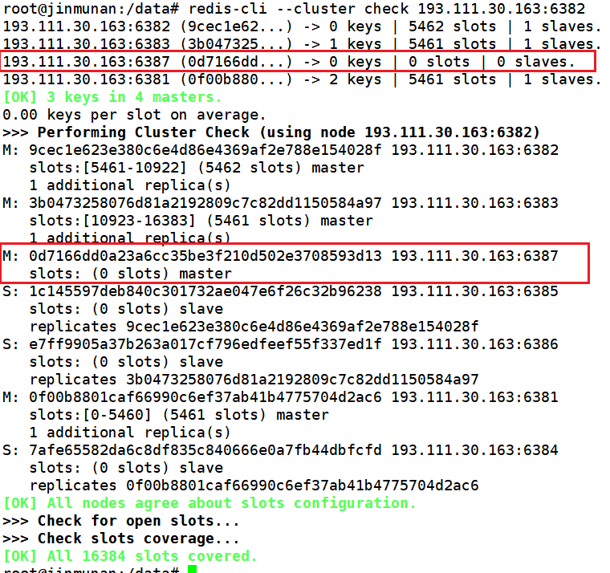

##### ②重新分派槽号

> 自己的图片没有截到。4096 是 16384/4 求出来的

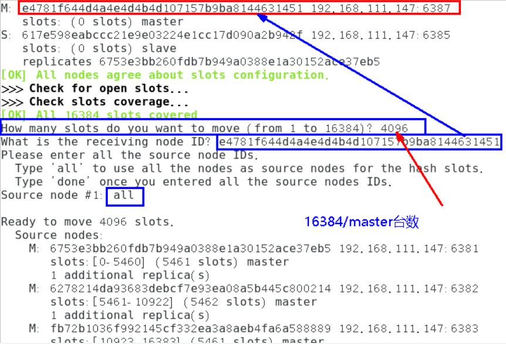

##### ③重新查看

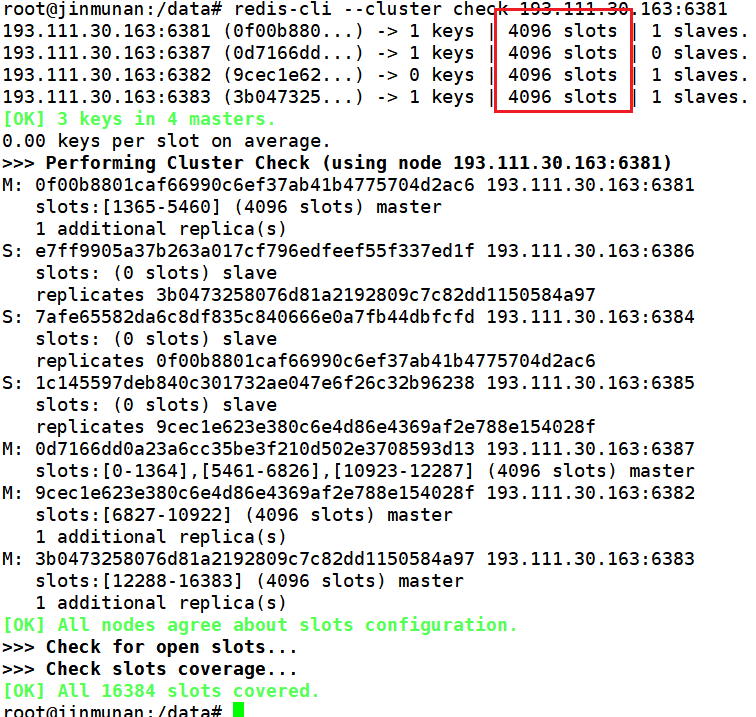

##### ④添加从机后再次查看

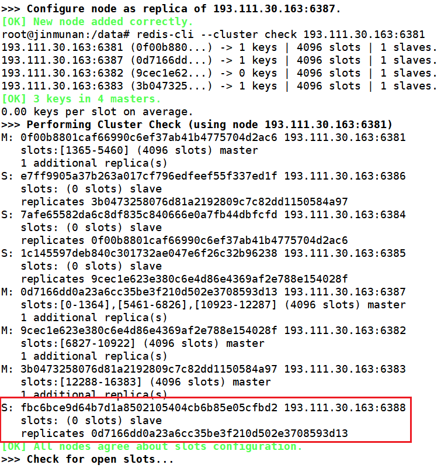

### 主从缩容

```sh
# 目的：6387和6388下线

# 检查集群情况1获得6388的节点ID
redis-cli --cluster check 193.111.30.163:6381

# 将6388删除 从集群中将4号从节点6388删除
redis-cli --cluster del-node ip:从机端口 从机6388节点ID
redis-cli --cluster del-node 193.111.30.163:6388 fbc6bce9d64b7d1a8502105404cb6b85e05cfbd2

# 将6387的槽号清空，重新分配，本例将清出来的槽号都给6381
redis-cli --cluster reshard 193.111.30.163:6381

# 检查集群情况第二次
redis-cli --cluster check 193.111.30.163:6381

# 将6387删除
redis-cli --cluster del-node ip:端口 6387节点ID
redis-cli --cluster del-node 193.111.30.163:6387 0d7166dd0a23a6cc35be3f210d502e3708593d13

# 检查集群情况第三次
redis-cli --cluster check 193.111.30.163:6381

# 备注 如果需要平均分配，需要分配3次
```

#### ①将 6388 删除

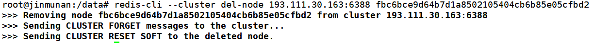

#### ②第一次查看

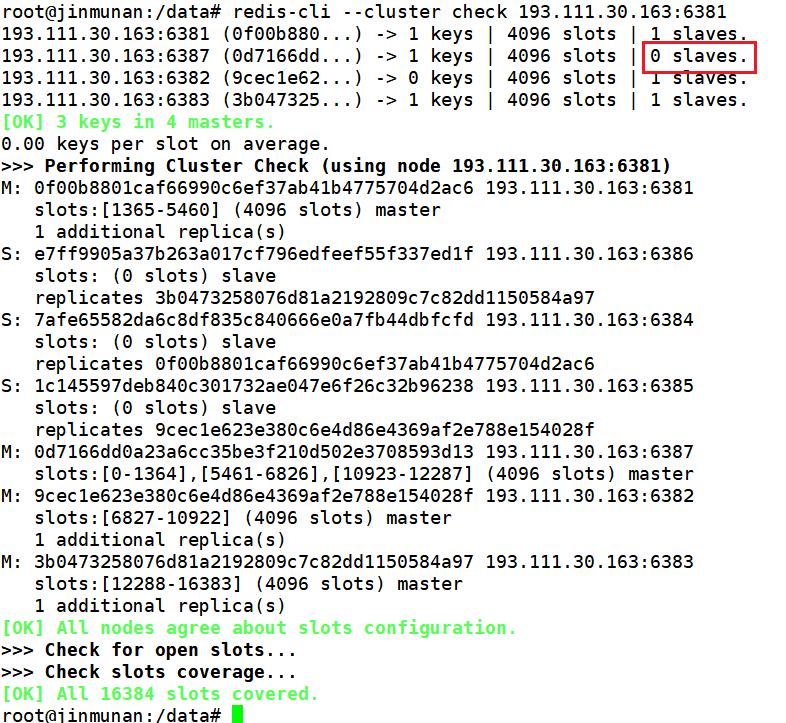

#### ③删除 6387 节点

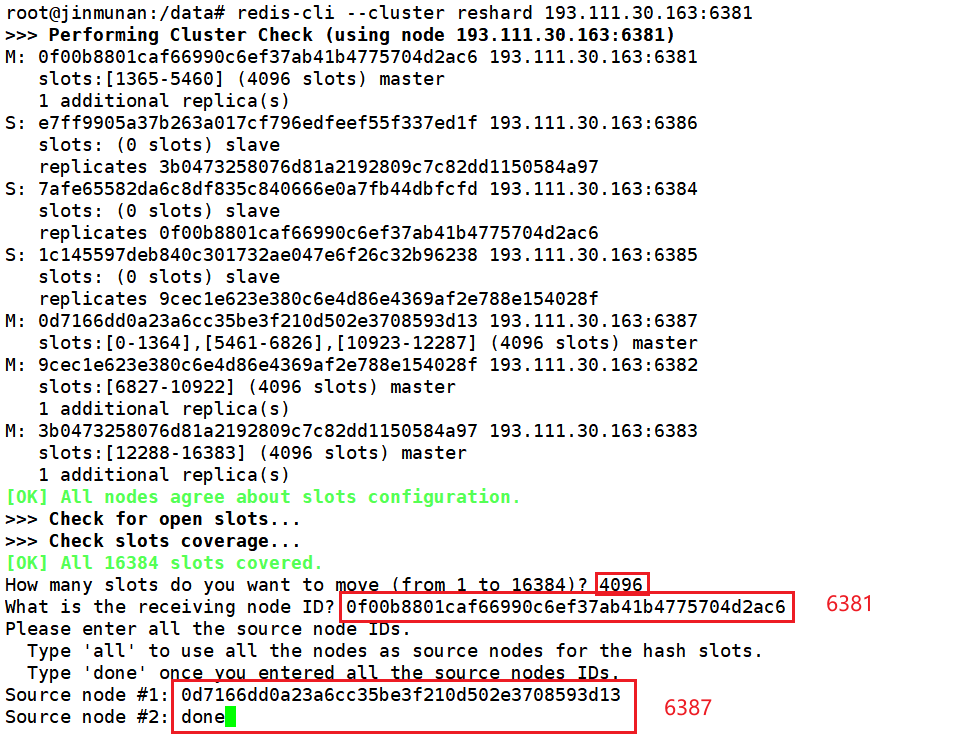

#### ④第二次查看

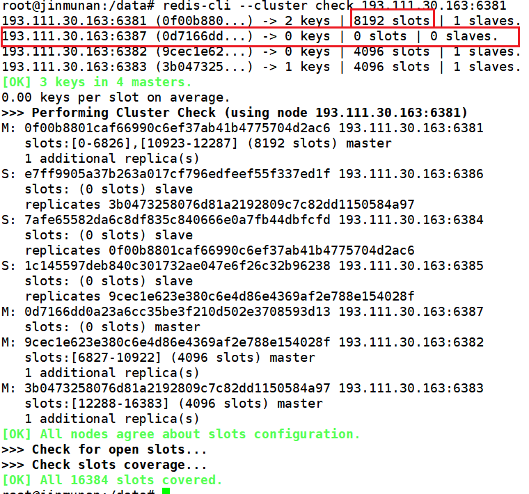

#### ⑤第三次查看

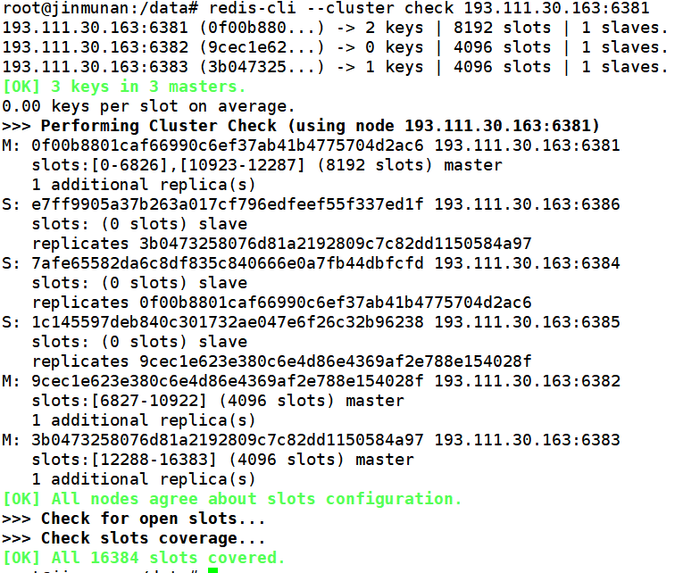
