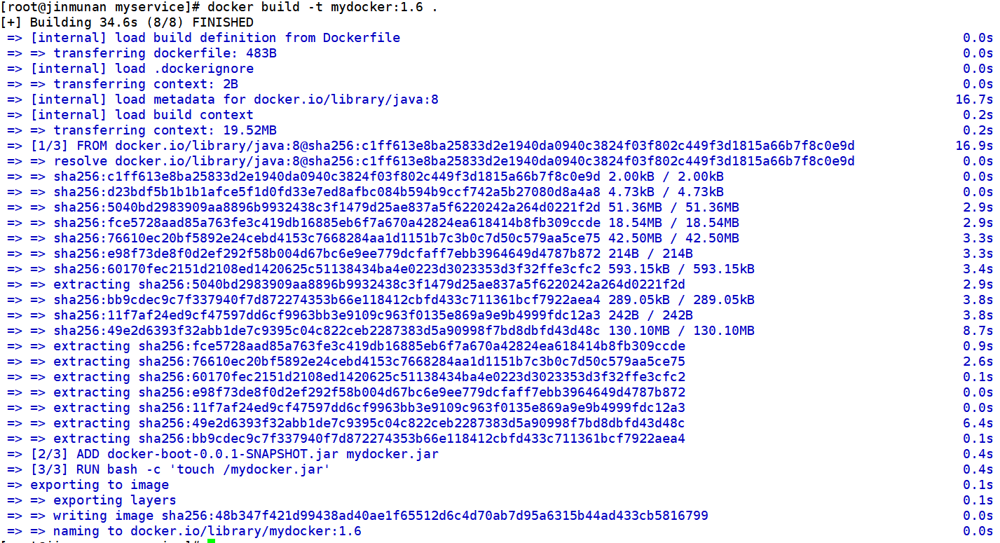
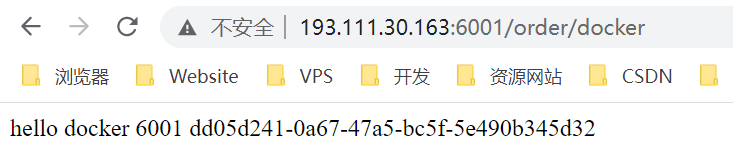

# Docker 微服务实战

## 通过 IDEA 新建一个普通微服务模块

### 建 Module

`docker-boot`

### 改 POM

```pom
<?xml version="1.0" encoding="UTF-8"?>
<project xmlns="http://maven.apache.org/POM/4.0.0" xmlns:xsi="http://www.w3.org/2001/XMLSchema-instance"
         xsi:schemaLocation="http://maven.apache.org/POM/4.0.0 https://maven.apache.org/xsd/maven-4.0.0.xsd">
    <modelVersion>4.0.0</modelVersion>
    <parent>
        <groupId>org.springframework.boot</groupId>
        <artifactId>spring-boot-starter-parent</artifactId>
        <version>2.5.6</version>
        <relativePath/>
    </parent>

    <groupId>com.cj.docker</groupId>
    <artifactId>docker-boot</artifactId>
    <version>0.0.1-SNAPSHOT</version>

    <properties>
        <project.build.sourceEncoding>UTF-8</project.build.sourceEncoding>
        <maven.compiler.source>1.8</maven.compiler.source>
        <maven.compiler.target>1.8</maven.compiler.target>
        <junit.version>4.12</junit.version>
        <log4j.version>1.2.17</log4j.version>
        <lombok.version>1.16.18</lombok.version>
        <mysql.version>5.1.47</mysql.version>
        <druid.version>1.1.16</druid.version>
        <mapper.version>4.1.5</mapper.version>
        <mybatis.spring.boot.version>1.3.0</mybatis.spring.boot.version>
    </properties>

    <dependencies>
        <!--SpringBoot通用依赖模块-->
        <dependency>
            <groupId>org.springframework.boot</groupId>
            <artifactId>spring-boot-starter-web</artifactId>
        </dependency>
        <dependency>
            <groupId>org.springframework.boot</groupId>
            <artifactId>spring-boot-starter-actuator</artifactId>
        </dependency>
        <!--test-->
        <dependency>
            <groupId>org.springframework.boot</groupId>
            <artifactId>spring-boot-starter-test</artifactId>
            <scope>test</scope>
        </dependency>
    </dependencies>

    <build>
        <plugins>
            <plugin>
                <groupId>org.springframework.boot</groupId>
                <artifactId>spring-boot-maven-plugin</artifactId>
            </plugin>
            <plugin>
                <groupId>org.apache.maven.plugins</groupId>
                <artifactId>maven-resources-plugin</artifactId>
                <version>3.1.0</version>
            </plugin>
        </plugins>
    </build>

</project>
```

### 写 YML

```yaml
server:
  port: 6001
```

### 主启动类

```java
@SpringBootApplication
public class DockerBootApplication {
    public static void main(String[] args) {
        SpringApplication.run(DockerBootApplication.class, args);
    }
}
```

### 业务类

```java
@RestController
public class OrderController {
    @Value("${server.port}")
    private String port;

    @RequestMapping("/order/docker")
    public String helloDocker() {
        return "hello docker"+"\t"+port+"\t"+ UUID.randomUUID().toString();
    }

    @RequestMapping(value ="/order/index",method = RequestMethod.GET)
    public String index() {
        return "服务端口号："+"\t"+port+"\t"+UUID.randomUUID().toString();
    }
}
```

## 通过 dockerfile 发布微服务部署到 docker 容器

### IDEA 工具里面搞定微服务

`docker-boot-0.0.1-SNAPSHOT.jar`

### 编写 Dockerfile

```dockerfile
# 基础镜像使用java
FROM java:8

# 作者
MAINTAINER zn<zn923042857@gmail.com>

# VOLUME 指定临时文件目录为/tmp，在主机/var/lib/docker目录下创建了一个临时文件并链接到容器的/tmp
VOLUME /tmp

# 将jar包添加到容器中并更名为 mydocker.jar
ADD docker-boot-0.0.1-SNAPSHOT.jar mydocker.jar

# 运行jar包
RUN bash -c 'touch /mydocker.jar'
ENTRYPOINT ["java","-jar","/mydocker.jar"]

#暴露6001端口作为微服务
EXPOSE 6001
```

将微服务jar包和Dockerfile文件上传到同一个目录下/mydocker

### 构建镜像

`docker build -t mydocker:1.6 .`



### 运行容器

`docker run -d -p 6001:6001 mydocker:1.6`

### 访问测试



