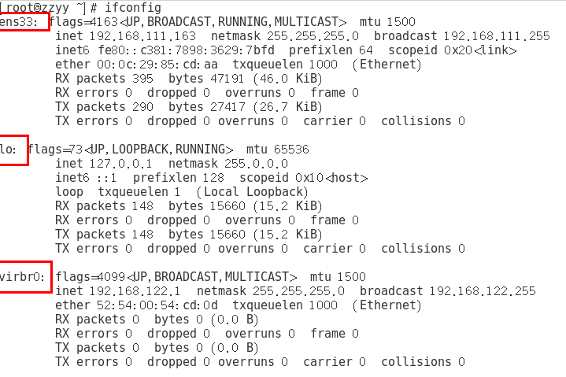
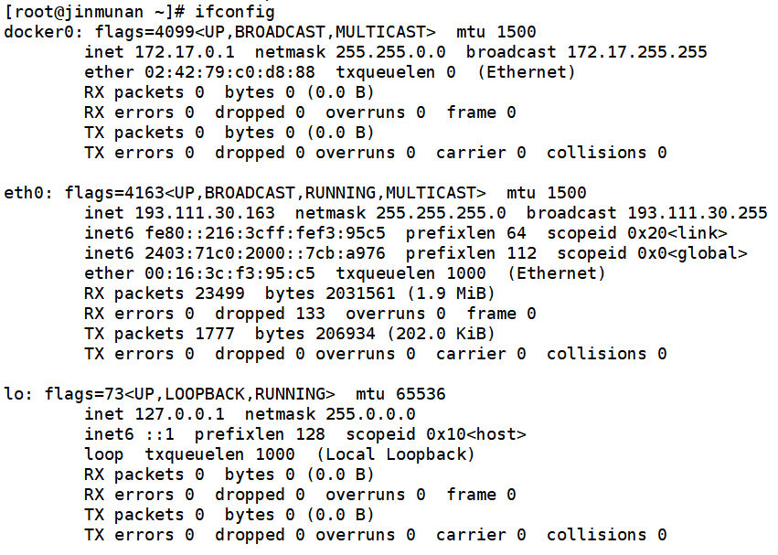
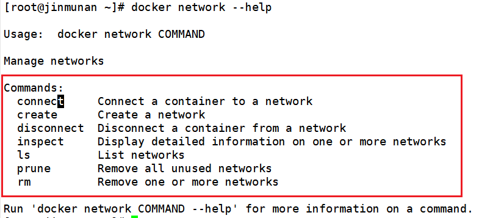
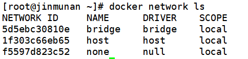
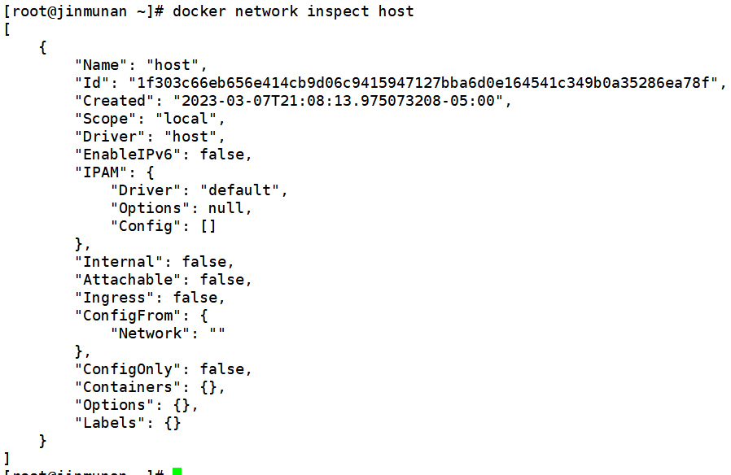
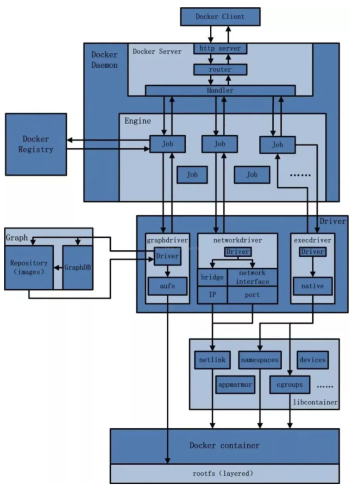

# Docker 网络

## 是什么

### docker 不启动，默认 Linux 网络情况



- ens33

- lo

- virbr0

  ```
  在 CentOS7 的安装过程中如果有选择相关虚拟化的的服务安装系统后，启动网卡时会发现有一个以网桥连接的私网地址的 virbr0 网卡 (virbr0 网卡：它还有一个固定的默认 IP 地址 192.168.122.1)，是做虚拟机网桥的使用的，其作用是为连接其上的虚机网卡提供 NAT 访问外网的功能。
  
  我们之前学习 Linux 安装，勾选安装系统的时候附带了 libvirt 服务才会生成的一个东西，如果不需要可以直接将 libvirtd 服务卸载，
  
  yum remove libvirt-libs.x86_64
  ```


### docker 启动后，网络情况



- ens33

- lo
- docker0

<mark>会产生一个名为 docker0 的虚拟网桥</mark>

## 常用基本命令

### 查看帮助命令

`docker network --help`



### 查看网络

`docker network ls`



### 查看网络源数据

`docker network inspect XXX网络名字`



### 删除网络

`docker network carete XXX网络名字 network`

`docker network rm XXX网络名字`

## 能干嘛


## 网络模式


## Docker 平台架构图解

### 整体说明

从其架构和运行流程来看，Docker 是一个 C/S 模式的架构，后端是一个松耦合架构，众多模块各司其职。 

 

Docker 运行的基本流程为：

 

1 用户是使用 Docker Client 与 Docker Daemon 建立通信，并发送请求给后者。

2 Docker Daemon 作为 Docker 架构中的主体部分，首先提供 Docker Server 的功能使其可以接受 Docker Client 的请求。

3 Docker Engine 执行 Docker 内部的一系列工作，每一项工作都是以一个 Job 的形式的存在。

4 Job 的运行过程中，当需要容器镜像时，则从 Docker Registry 中下载镜像，并通过镜像管理驱动 Graph driver 将下载镜像以 Graph 的形式存储。

5 当需要为 Docker 创建网络环境时，通过网络管理驱动 Network driver 创建并配置 Docker 容器网络环境。

6 当需要限制 Docker 容器运行资源或执行用户指令等操作时，则通过 Execdriver 来完成。

7 Libcontainer 是一项独立的容器管理包，Network driver 以及 Exec driver 都是通过 Libcontainer 来实现具体对容器进行的操作。

### 整体架构


