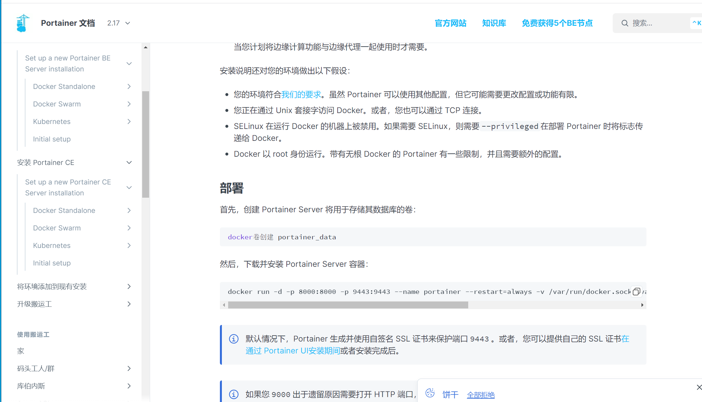
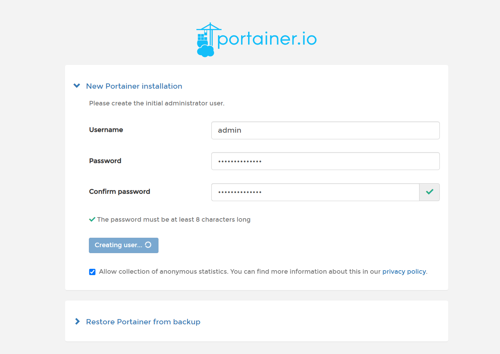
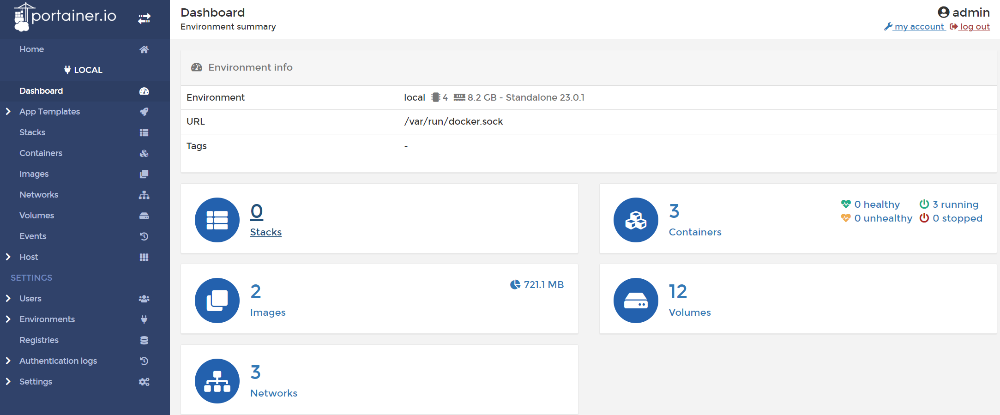
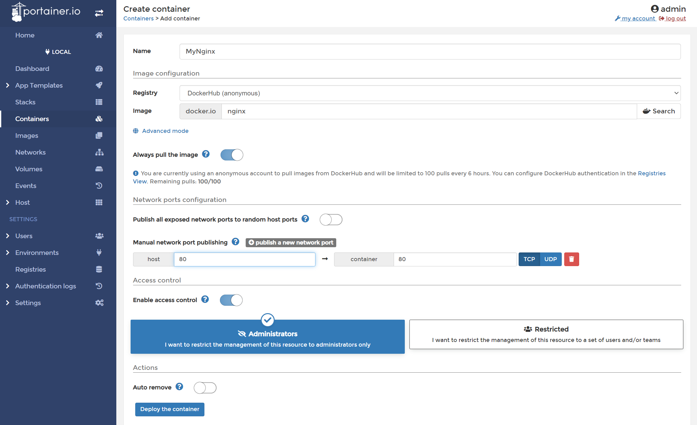

# Docker 可视化工具

## Portainer

Portainer 是一款轻量级的应用，它提供了图形化界面，用于方便地管理 Docker 环境，包括单机环境和集群环境。

### 安装

[https://www.portainer.io/](https://www.portainer.io/)

[https://docs.portainer.io/v/ce-2.9/start/install/server/docker/linux](https://docs.portainer.io/v/ce-2.9/start/install/server/docker/linux)



```sh
docker run -d -p 8000:8000 -p 9443:9443 --name portainer --restart=always -v /var/run/docker.sock:/var/run/docker.sock -v portainer_data:/data portainer/portainer-ce:latest
```

### 登录

```sh
# 第一次登录需创建admin，访问地址：
https://193.111.30.163:9443/#!/init/admin
```



### 调用底层命令图形化展示

```sh
[root@jinmunan ~]# docker system df
TYPE            TOTAL     ACTIVE    SIZE      RECLAIMABLE
Images          2         2         721.1MB   0B (0%)
Containers      3         3         240B      0B (0%)
Local Volumes   12        1         830.7MB   830.6MB (99%)
Build Cache     0         0         0B        0B
```



## 演示 Nginx 安装



### 安装成功


