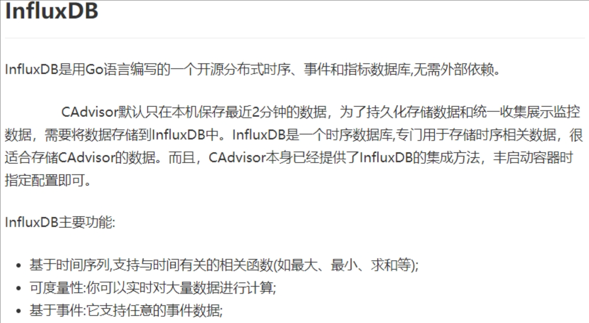
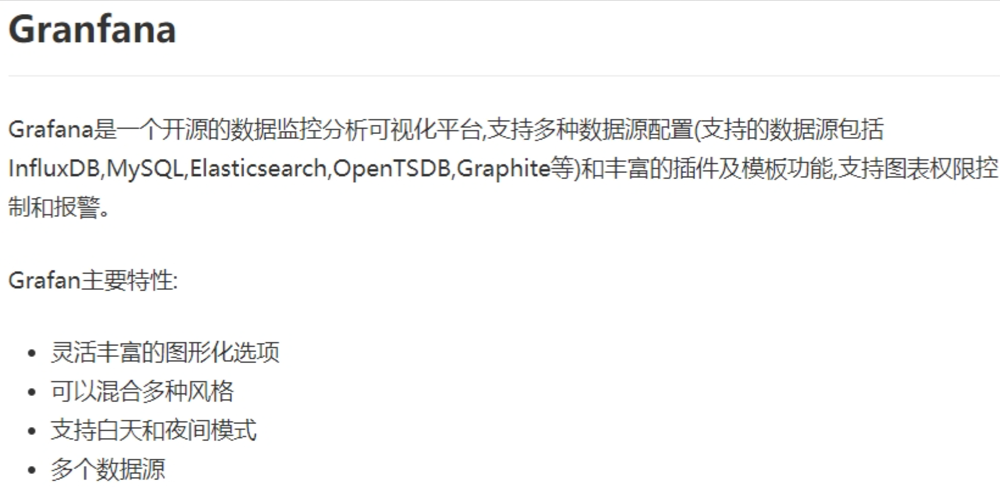

# Docker 容器监控

## CAdvisor+InfluxDB+Granfana

重量级容器监控工具。

### 问题

```sh
[root@jinmunan ~]# docker stats
CONTAINER ID   NAME           CPU %     MEM USAGE / LIMIT     MEM %     NET I/O           BLOCK I/O     PIDS
ae33d83a842d   MyNginx        0.00%     3.141MiB / 7.637GiB   0.04%     18.1kB / 13.8kB   0B / 4.1kB    5
98bd84d9928c   portainer      0.00%     16.31MiB / 7.637GiB   0.21%     1.06MB / 7.24MB   0B / 778kB    6
b80218074264   mysql-slave    0.06%     191.8MiB / 7.637GiB   2.45%     2.67kB / 1.53kB   0B / 12.7MB   28
000ac9c3cd70   mysql-master   0.06%     194.3MiB / 7.637GiB   2.48%     3.55MB / 4.39MB   0B / 12.7MB   33

# 通过 docker stats 命令可以很方便的看到当前宿主机上所有容器的CPU,内存以及网络流量等数据，一般小公司够用了
# 但是 docker stats 统计结果只能是当前宿主机的全部容器，数据资料是实时的，没有地方存储、没有健康指标过线预警等功能
```

### 解决方式

CAdvisor 监控收集+InfluxDB 存储数据+Granfana 展示图表


### CAdvisor


### InfluxDB



### Granfana



### 安装步骤

compose 容器编排。

```sh
# 新建目录
mkdir /mydocker/cig

# 新建3件套组合的 docker-compose.yml
vim docker-compose.yml

# 检查语法
docker-compose config -q

# 启动docker-compose文件
docker-compose


```

### docker-compose.yml 文件

```sh
version: '3.1'
 
volumes:
  grafana_data: {}
 
services:
 influxdb:
  image: tutum/influxdb:0.9
  restart: always
  environment:
    - PRE_CREATE_DB=cadvisor
  ports:
    - "8083:8083"
    - "8086:8086"
  volumes:
    - ./data/influxdb:/data
 
 cadvisor:
  image: google/cadvisor
  links:
    - influxdb:influxsrv
  command: -storage_driver=influxdb -storage_driver_db=cadvisor -storage_driver_host=influxsrv:8086
  restart: always
  ports:
    - "8080:8080"
  volumes:
    - /:/rootfs:ro
    - /var/run:/var/run:rw
    - /sys:/sys:ro
    - /var/lib/docker/:/var/lib/docker:ro
 
 grafana:
  user: "104"
  image: grafana/grafana
  user: "104"
  restart: always
  links:
    - influxdb:influxsrv
  ports:
    - "3000:3000"
  volumes:
    - grafana_data:/var/lib/grafana
  environment:
    - HTTP_USER=admin
    - HTTP_PASS=admin
    - INFLUXDB_HOST=influxsrv
    - INFLUXDB_PORT=8086
    - INFLUXDB_NAME=cadvisor
    - INFLUXDB_USER=root
    - INFLUXDB_PASS=root
```

