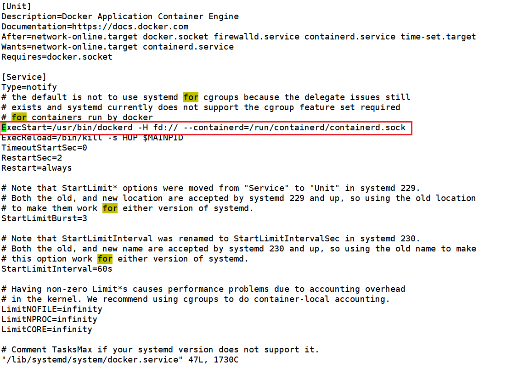
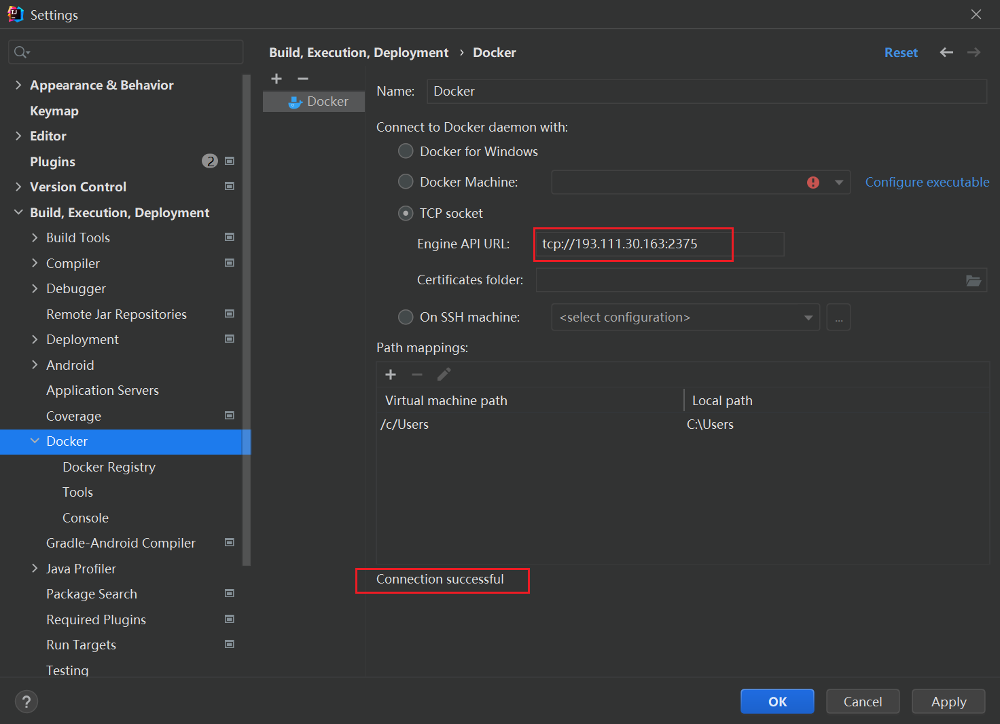
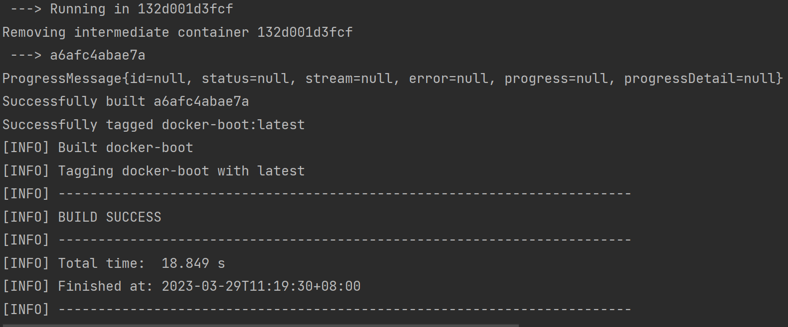

# Docker 整合 IDEA

## ①下载 idea docker 插件

## ②虚拟机开放 2375 端口

```sh
vim  /lib/systemd/system/docker.service
```



```sh
# 修改为
ExecStart=/usr/bin/dockerd -H tcp://0.0.0.0:2375 -H unix://var/run/docker.sock

#  开端口
firewall-cmd --zone=public --add-port=2375/tcp --permanent
firewall-cmd --reload

# 重启docker
systemctl daemon-reload
systemctl restart docker

# 检测是否开启成功
http://Linux的ip地址:2375/version
```

## ③idea 进行连接



## ④通过 docker 的 maven 插件构建镜像

①首先，在项目的 src/main 路径下，创建一个 docker 目录，并在 docker 目录下新建一个 Dockerfile 文件，其内容如下所示：

```pom
# 基础镜像使用java
FROM java:8

# 作者
MAINTAINER zn<zn923042857@gmail.com>

# VOLUME 指定临时文件目录为/tmp，在主机/var/lib/docker目录下创建了一个临时文件并链接到容器的/tmp
VOLUME /tmp

# 将jar包添加到容器中并更名为 mydocker.jar
ADD docker-boot-0.0.1-SNAPSHOT.jar mydocker.jar

# 运行jar包
RUN bash -c 'touch /mydocker.jar'
ENTRYPOINT ["java","-jar","/mydocker.jar"]

#暴露6001端口作为微服务
EXPOSE 6001
```

②修改 pom.xml，使用`<dockerDirectory>`指定 Dockerfile 所在的路径

```pom
<?xml version="1.0" encoding="UTF-8"?>
<project xmlns="http://maven.apache.org/POM/4.0.0" xmlns:xsi="http://www.w3.org/2001/XMLSchema-instance"
         xsi:schemaLocation="http://maven.apache.org/POM/4.0.0 https://maven.apache.org/xsd/maven-4.0.0.xsd">
    <modelVersion>4.0.0</modelVersion>
    <parent>
        <groupId>org.springframework.boot</groupId>
        <artifactId>spring-boot-starter-parent</artifactId>
        <version>2.5.6</version>
        <relativePath/>
    </parent>

    <groupId>com.cj.docker</groupId>
    <artifactId>docker-boot</artifactId>
    <version>0.0.1-SNAPSHOT</version>

    <properties>
        <project.build.sourceEncoding>UTF-8</project.build.sourceEncoding>
        <maven.compiler.source>1.8</maven.compiler.source>
        <maven.compiler.target>1.8</maven.compiler.target>
        <junit.version>4.12</junit.version>
        <log4j.version>1.2.17</log4j.version>
        <lombok.version>1.16.18</lombok.version>
        <mysql.version>5.1.47</mysql.version>
        <druid.version>1.1.16</druid.version>
        <mapper.version>4.1.5</mapper.version>
        <mybatis.spring.boot.version>1.3.0</mybatis.spring.boot.version>
    </properties>

    <dependencies>
        <!--SpringBoot通用依赖模块-->
        <dependency>
            <groupId>org.springframework.boot</groupId>
            <artifactId>spring-boot-starter-web</artifactId>
        </dependency>
        <dependency>
            <groupId>org.springframework.boot</groupId>
            <artifactId>spring-boot-starter-actuator</artifactId>
        </dependency>
        <!--test-->
        <dependency>
            <groupId>org.springframework.boot</groupId>
            <artifactId>spring-boot-starter-test</artifactId>
            <scope>test</scope>
        </dependency>

    </dependencies>

    <build>
        <!-- 打包后的文件名称 -->
        <finalName>app</finalName>

        <plugins>
            <!-- Maven 插件 -->
            <plugin>
                <groupId>org.springframework.boot</groupId>
                <artifactId>spring-boot-maven-plugin</artifactId>
                <!-- 项目基于maven pom多模块的开发的，需要设置goal-repackage属性为true，否则打包后文件依赖文件没有一起打包，然后镜像内没有可以运行的程序文件,显示错误no main manifest attribute, in /app.jar -->
                <executions>
                    <execution>
                        <goals>
                            <goal>repackage</goal>
                        </goals>
                    </execution>
                </executions>
                <configuration>
                    <includeSystemScope>true</includeSystemScope>
                </configuration>
            </plugin>
            <plugin>
                <groupId>org.apache.maven.plugins</groupId>
                <artifactId>maven-resources-plugin</artifactId>
                <version>3.1.0</version>
            </plugin>

            <!--使用docker-maven-plugin插件，官网：https://github.com/spotify/docker‐maven‐plugin-->
            <plugin>
                <groupId>com.spotify</groupId>
                <artifactId>docker-maven-plugin</artifactId>
                <version>1.0.0</version>
                <!--绑定快捷键-->
                <!--将插件绑定在某个phase执行-->
                <executions>
                    <execution>
                        <id>build-image</id>
                        <!--将插件绑定在package这个phase上。也就是说，用户只需执行mvn package，就会自动执行mvn docker:build-->
                        <phase>package</phase>
                        <goals>
                            <goal>build</goal>
                        </goals>
                    </execution>
                </executions>

                <configuration>
                    <!--指定生成的镜像名-->
                    <imageName>${project.artifactId}</imageName>
                    <!--指定标签，可添加多个imageTag，为同一个镜像指定多个标签-->
                    <imageTags>
                        <imageTag>latest</imageTag>
                    </imageTags>

                    <!-- 指定 Dockerfile 路径-->
                    <dockerDirectory>${project.basedir}/src/main/docker</dockerDirectory>

                    <!-- 这里是复制 jar 包到 docker 容器指定目录配置 -->
                    <resources>
                        <resource>
                            <targetPath>/</targetPath>
                            <!--指定需要复制项目jar包的所在路径，${project.build.directory}表示target目录 -->
                            <directory>${project.build.directory}</directory>
                            <!-- 用于指定需要复制的文件。${project.build.finalName}.jar指的是打包后的jar包文件　-->
                            <include>${project.build.finalName}.jar</include>
                        </resource>
                    </resources>

                    <!--指定远程 docker api地址-->
                    <dockerHost>http://193.111.30.163:2375</dockerHost>
                    <!-- 如需重复构建相同标签名称的镜像，可将forceTags设为true，这样就会覆盖构建相同标签的镜像。 -->
                    <forceTags>true</forceTags>
                </configuration>
            </plugin>
        </plugins>
    </build>
</project>
```

③执行 `mvn package`


