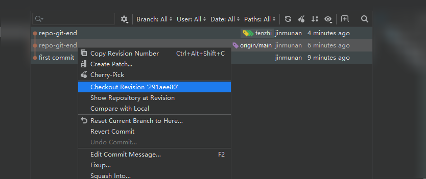
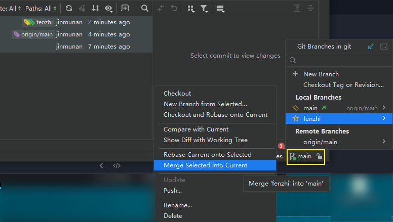
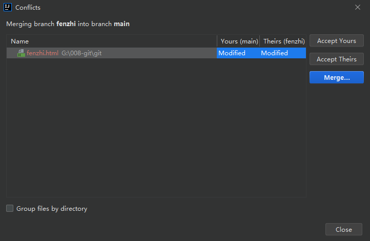
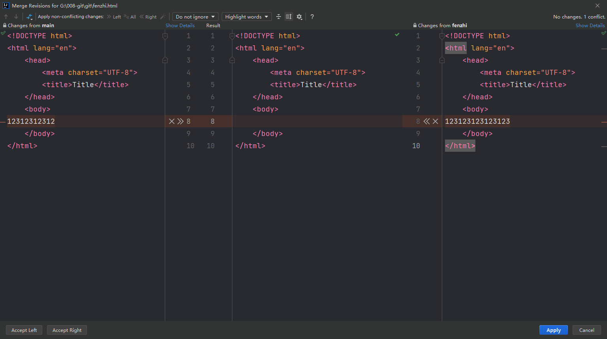

# IDEA 集成 Git

## 配置 Git 忽略文件

项目根路径下创建`git.ignore`文件，SpringBoot 项目会自动创建忽略文件。

## 切换版本

```txt
Checkout Revision 'c'
```



## 合并分支

要在主分支对其他分支进行合并。



## 解决冲突

对分支进行修改 commit 后，再对主分支同样的代码修改和 commit 后，合并会产生冲突。



左边主分支，右边分支，中间是合并的结果。



