# 前端整合 Git

>[尚硅谷 Git 教程全套完整版（12h 深入掌握 git）](https://www.bilibili.com/video/BV15J411973T/?spm_id_from=333.337.search-card.all.click)
>
>[Git](https://git-scm.com/)

## Git 环境安装

略

## VSCode 下载 Gitee 插件

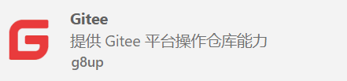

### 用法

- 申请个私人令牌 (access token)：[https://gitee.com/profile/personal_access_tokens](https://gitee.com/profile/personal_access_tokens)

- 按 F1（或者 ctrl + shift + p）,并输入命令前缀 Gitee，从搜索结果中选择要执行的命令

  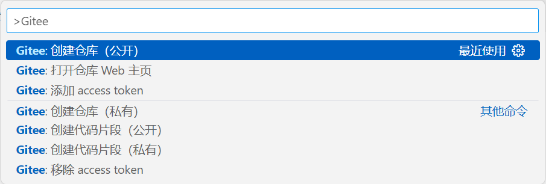

- 创建仓库，创建成功后会在 Gitee 上生成这个仓库

  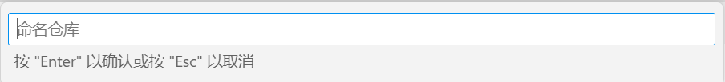

- 初始化仓库，并将 Gitee 官网上的远程仓库添加的本地的 Git 仓库中

  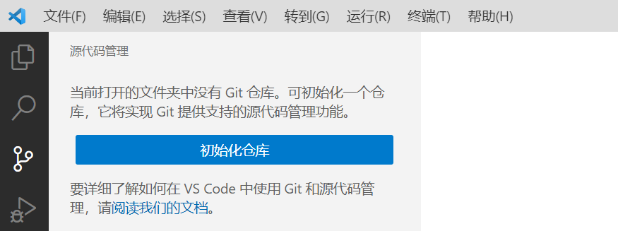

- 在终端添加远程仓库地址

  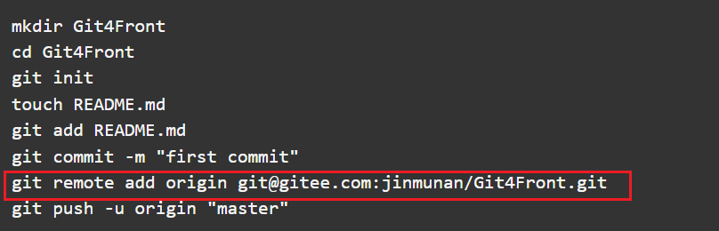

- 提交文件并上传至 Gitee 远程仓库

  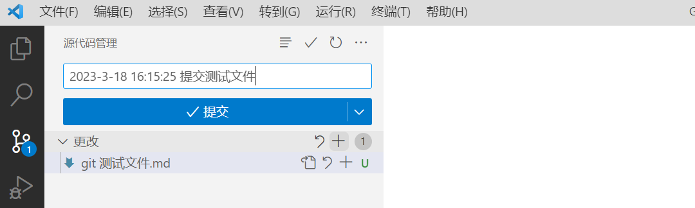

## VSCode 下载 Git Graph 插件

用于查看 git 提交树对象

## Git 分支操作

几乎所有的版本控制系统都以某种形式支持分支。使用分支意味着你可以把你的工作从开发主线上分离开来，以免影响开发主线。在很多版本控制系统中，这是一个略微低效的过程，常常需要完全创建一个源代码目录的副本。对于大项目来说，这样的过程会耗费很多时间。

而 Git 的分支模型极其的高效轻量的。是 Git 的必杀技特性，也正因为这一特性，使得 Git 从众多版本控制系统中脱颖而出。

### 第一步：创建分支

- `git branch testing `：为你创建了一个可以移动的新的指针。**注意：并不会自动切换到新分支中去。**

  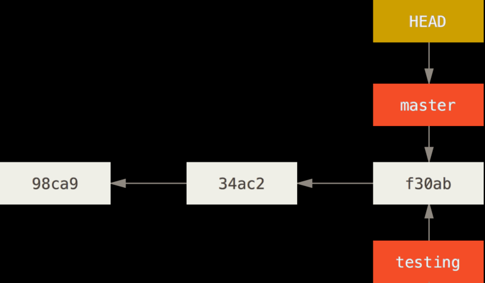

- `git branch`：查看所有分支列表

- `git branch -d testing`：删除分支

- `git branch -v`：可以查看每一个分支的最后一次提交

- `git branch --merged`：查看哪些分支已经合并到当前分支

- `git log --oneline --decorate`：查看当前分支所指对象

### 第二步：切换分支

- `git checkout testing`

  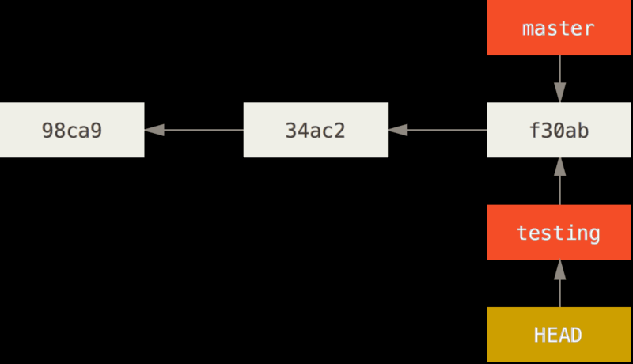

- 做出修改，再提交

  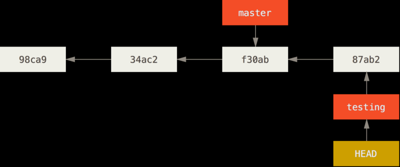

- **切回 master**

  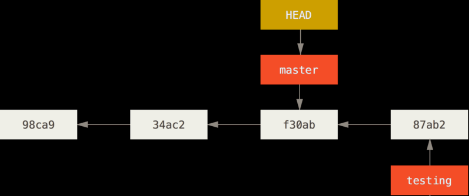

- **注意：每次在切换分支前 提交一下当前分支**

- `git merge 分支名`：分支合并，**注意：切换到主分支（要合并的那个分支）执行命名**

## Git 分支合并实际案例

### 工作流

1. 开发某个网站。
2. 为实现某个新的需求，创建一个分支。
3. 在这个分支上开展工作。
4. 正在此时，你突然接到一个电话说有个很严重的问题需要紧急修补。你将按照如下方式来处理：
   1. 切换到你的线上分支（production branch）。
   2. 为这个紧急任务新建一个分支，并在其中修复它。
   3. 在测试通过之后，切换回线上分支，然后合并这个修补分支，最后将改动推送到线上分支。
   4. 切换回你最初工作的分支上，继续工作。

### Git 流

首先，我们假设你正在你的项目上工作，并且已经有一些提交。

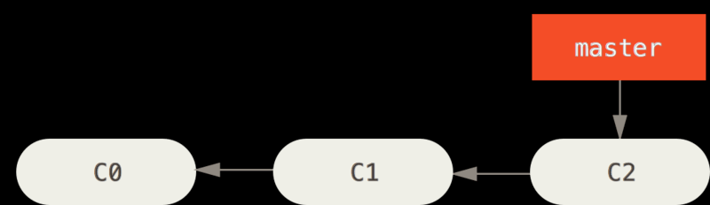

现在，你已经决定要解决你的公司使用的问题追踪系统中的 #53 问题。想要新建一个分支并同时切换到那个分支上，你可以使用命令 `git checkout -b iss53`，等同于 `git branch iss53 和 git checkout iss53`

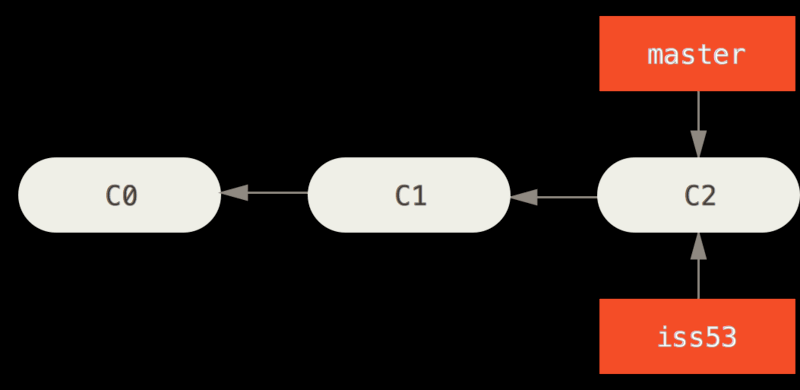

你继续在 #53 问题上工作，并且做了一些提交。在此过程中，iss53 分支在不断的向前推进，因为你已经检出到该分支。

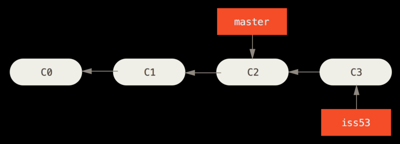

**！！！现在你接到那个电话，有个紧急问题等待你来解决**

有了 Git 的帮助，你不必把这个紧急问题和 iss53 的修改混在一起，你也不需要花大力气来还原关于 53# 问题的修改，然后再添加关于这个紧急问题的修改，最后将这个修改提交到线上分支。你所要做的仅仅是切换回 master 分支

但是，在你这么做之前，要留意你的工作目录和暂存区里那些还没有被提交的修改，它可能会和你即将检出的分支产生冲突从而阻止 Git 切换到该分支。最好的方法是，在你切换分支之前，保持好一个干净的状态。**（提交你的所有修改）**

`git checkout master`

这个时候，你的工作目录和你在开始 #53 问题之前一模一样，现在你可以专心修复紧急问题了。请牢记：当你切换分支的时候，Git 会重置你的工作目录，使其看起来像回到了你在那个分支上最后一次提交的样子。Git 会自动添加、删除、修改文件以确保此时你的工作目录和这个分支最后一次提交时的样子一模一样。

**！！！接下来，你要修复这个紧急问题。让我们建立一个针对该紧急问题的分支（hotfix branch），在该分支上工作直到问题解决：**

`git checkout -b hotfix`

**做出修改**

`git commit -a -m 'fixed the broken email address`

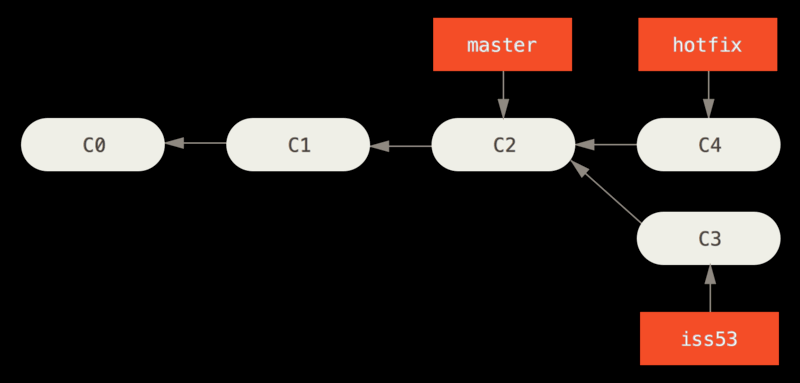

**！！！**你可以运行你的测试，确保你的修改是正确的，然后将其合并回你的 master 分支来部署到线上。你可以使用 `git merge` 命令来达到上述目的

`git checkout master`

`git merge hotfix`

**快进**

在合并的时候，有时候会出现"快进（fast-forward）"这个词。由于当前 master 分支所指向的提交是你当前提交的直接上游，所以 Git 只是简单的将指针向前移动。换句话说，当你试图合并两个分支时，如果顺着一个分支走下去能够到达另一个分支，那么 Git 在合并两者的时候，只会简单的将指针向前推进（指针右移），因为这种情况下的合并操作没有需要解决的分歧——这就叫做“快进（fast-forward）”

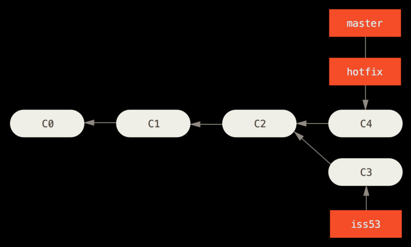

**！！！关于这个紧急问题的解决方案发布之后，你准备回到被打断之前时的工作中。然而，你应该先删除 hotfix 分支，因为你已经不再需要它了**，master 分支已经指向了同一个位置。你可以使用带 -d 选项的 `git branch` 命令来删除分支。现在你可以切换回你正在工作的分支继续你的工作，也就是针对 #53 问题的那个分支

`git branch -d hotfix`

`git checkout iss53`

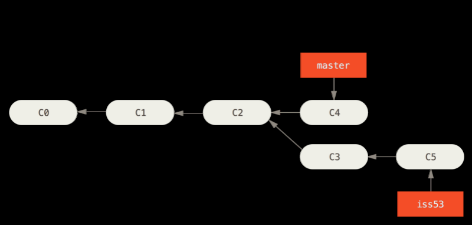

你在 hotfix 分支上所做的工作并没有包含到 iss53 分支中。如果你需要拉取 hotfix 所做的修改，你可以使用 `git merge master` 命令将 master 分支合并入 iss53 分支，或者你也可以等到 iss53 分支完成其使命，再将其合并回 master 分支。

`git checkout master`

`git merge iss53`

**典型合并** 

当前的合并和你之前合并 hotfix 分支的时候看起来有一点不一样。在这种情况下，你的开发历史从一个更早的地方开始分叉开来（diverged）。因为，master 分支所在提交并不是 iss53 分支所在提交的直接祖先，Git 不得不做一些额外的工作。出现这种情况的时候，Git 会使用两个分支的末端所指的快照（C4 和 C5）以及这两个分支的工作祖先（C2），做一个简单的三方合并。

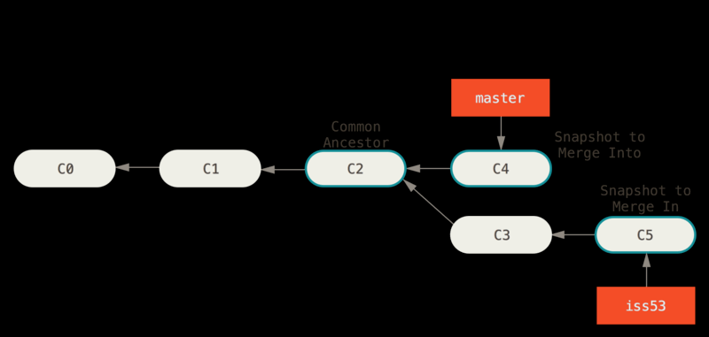

和之前将分支指针向前推进所不同的是，Git 将此次三方合并的结果做了一个新的快照并且自动创建一个新的提交指向它。这个被称作一次**合并提交**，它的特别之处在于他有不止一个父提交。

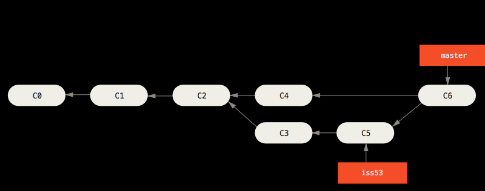

需要指出的是，Git 会自行决定选取哪一个提交作为最优的共同祖先，并以此作为合并的基础；这和更加古老的 CVS 系统或者 Subversion（1.5 版本之前）不同，在这些古老的版本管理系统中，用户需要自己选择最佳的合并基础。Git 的这个优势使其在合并操作上比其他系统要简单很多，最终删除 iss53 号分支。

`git branch -d iss53`

### 简洁版

```sh
# 创建处理#53号问题的分支
git checkout -b iss53

# 处理紧急问题
git commit -a -m "提交目前处理好的iss53代码"

# 切换回 master 分支
git checkout master

# 创建处理问题的分支
git checkout -b hotfix

# 修复完后提交代码
git commit -a -m "修复完紧急问题"

# 切换回主分支
git checkout master

# 合并问题分支
git merge hotfix

# 删除问题分支
git branch -d hotfix

# 切回#53号问题分支
git checkout iss53

# 切换回主分支
git checkout master

# 合并问题分支
git merge iss53

# 删除问题分支
git branch -d iss53

# 结尾：有时候我们会将其他分支推送到远程仓库中，当其他分支中的文件没有推送到远程仓库，切换到主分支是禁止我们删除问题分支的，需要将问题分支提交到远程仓库或者使用命名 `git branch -D iss53` 强制删除，并且使用命令 `git push origin --delete iss53` 删除远程分支
```

## 模拟冲突简洁版

有时候合并操作不会如此顺利。 **如果你在两个不同的分支中，对同一个文件的同一个部分进行了不同的修改**，Git 就没法干净的合并它们。如果你对 #53 问题的修改和有关 hotfix 的修改都涉及到同一个文件的同一处，在合并它们的时候就会产生合并冲突此时 Git 做了合并，但是没有自动地创建一个新的合并提交。Git 会暂停下来，等待你去解决合并产生的冲突。你可以在合并冲突后的任意时刻使用 `git status` 命令来查看那些因包含合并冲突而处于未合并（unmerged）状态的文件任何因包含合并冲突而有待解决的文件，都会以未合并状态标识出来。

在你解决了所有文件里的冲突之后，对每个文件使用 `git add` 命令来将其标记为冲突已解决。一旦暂存这些原本有冲突的文件，Git 就会将它们标记为冲突已解决

```sh
# 创建处理#45号问题的分支
git checkout -b iss45

# 提交代码
git commit -a -m "修复了 Person 类的问题"

# 切换回 master 分支
git checkout master

# 创建处理#46号问题的分支
git checkout -b iss46

# 修复完后提交代码
git commit -a -m "修复了 Person 类的问题"

# 切换回主分支
git checkout master

# 合并问题分支
git merge iss45

# 删除问题分支
git branch -d iss45

# 合并问题分支
git merge iss46
# 这里出现分支冲突，因为是对同一文件进行了修改，git 无法自动合并

# 删除问题分支
git branch -d iss46

# 手动合并冲突完毕之后在此提交
git commit -a -m "合并冲突"
```

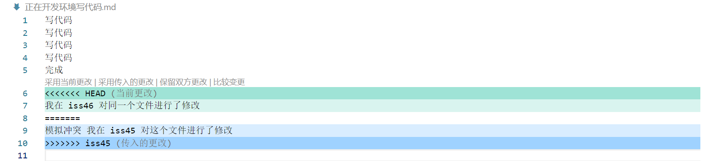

## 长期分支 

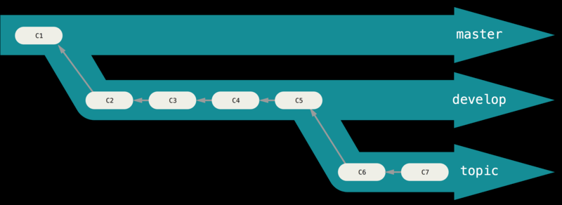

许多使用 Git 的开发者都喜欢使用这种方式来工作，比如只在 master 分支上保留完全稳定的代码——有可能仅仅是已经发布或即将发布的代码。他们还有一些名为 develop 或者 next 的平行分支，被用来做后续开发或者测试稳定性——这些分支不必保持绝对稳定，但是一旦达到稳定状态，它们就可以被合并入 master 分支了。等待下一次的发布。

随着你的提交而不断右移的指针。稳定分支的指针总是在提交历史中落后一大截，而前沿分支的指针往往比较靠前。

### topic 特性分支

特性分支对任何规模的项目都适用。特性分支是一种短期分支，它被用来实现单一特性或其相关工作。也许你从来没有在其他的版本控制系统（VCS）上这么做过，因为在那些版本控制系统中创建和合并分支通常很费劲。然而，在 Git 中一天之内多次创建、使用、合并、删除分支都很常见。

## Git 应用场景

### 一、切换分支时不想提交

有时，当你在项目的一部分上已经工作一段时间后，所有东西都进入了混乱的状态，而这时你想要切换到另一个分支做一点别的事情。问题是，**你不想仅仅因为过会儿回到这一点而为做了一半的工作创建一次提交**。针对这个问题的答案是 `git stash` 命令

- `git stash` 命令会将未完成的修改保存到一个栈上，而你可以在任何时候重新应用这些改动 `git stash apply`
- `git stash list` 查看存储
- `git stash apply stash@{0}` 如果不指定一个储藏，Git 认为指定的是最近的储藏
- `git stash pop` 来应用储藏然后立即从栈上扔掉它
- `git stash drop xxx` 加上将要移除的储藏的名字来移除它

#### 简化版

```sh
# 创建处理#45号问题的分支
git checkout -b iss45

# 不想提交代码
git stash

# 切换回 master 分支
git checkout master

# 创建处理#46号问题的分支
git checkout -b iss46

# 修复完后提交代码
git commit -a -m "修复完成"

# 切换回问题分支
git checkout iss45

# 复原栈上的代码
git stash apply

# 修复完后提交代码
git commit -a -m "修复完成"
```

### 二、修改提交信息或是保存漏掉的文件

`git commit --amend` 命令**用于修改上一次提交的内容**。该命令将会把你对代码的修改和前一次提交合并成一次新的提交。这个命令**可以用来修改上一次提交中的提交信息、添加漏掉的文件、或者是重新编辑提交的内容**。

具体来说，当你想要修改上一次提交信息的时候，可以使用如下命令：

```sh
git commit --amend -m "New commit message"
```

这会打开一个编辑器，允许你修改上一次提交的提交信息。你也可以使用 `-a` 选项来添加已经修改过的文件到上一次提交中：

```sh
git commit --amend -a
```

这样会将所有已修改但未添加到缓存区的文件都添加到上一次提交中。请注意，`git commit --amend` 命令只能修改最近一次提交，因此需要谨慎使用。

#### 简化版

```sh
# 提交代码
git commit -a -m "修复完成"

# 发现有个文件没有提交
git add 漏掉的文件
git commit --amend -a 
```

### 三、将文件从暂存区中撤回到工作目录

`git reset HEAD 文件名` 的意思是将指定文件从暂存区（也称为索引）中移除，即撤销对该文件的暂存操作，但并不影响该文件在工作区的修改。

#### 简化版

```sh
# 比如add了不想添加的文件到暂存区
git add 不想添加的文件.md

# 将这个文件从暂存区撤回
git reset HEAD   # 本质上就是 git reset --mixed HEAD 的简写
git reset 不想添加的文件.md
```

### 四、修改了文件但不想要了，想要复原文件

`git checkout` 将在工作目录中对文件的修改撤销

`git checkout -- [file]` **是一个危险的命令，这很重要。你对那个文件做的任何修改都会消失，你只是拷贝了另一个文件来覆盖它。除非你确实清楚不想要那个文件了，否则不要使用这个命令**

#### 简化版

```sh
# 修改了 测试.md 文件，想要变回原来的样子
git checkout 测试.md
```

### 五、撤销提交至本地库的命令 commit

假设目前对一个文件进行了三次提交

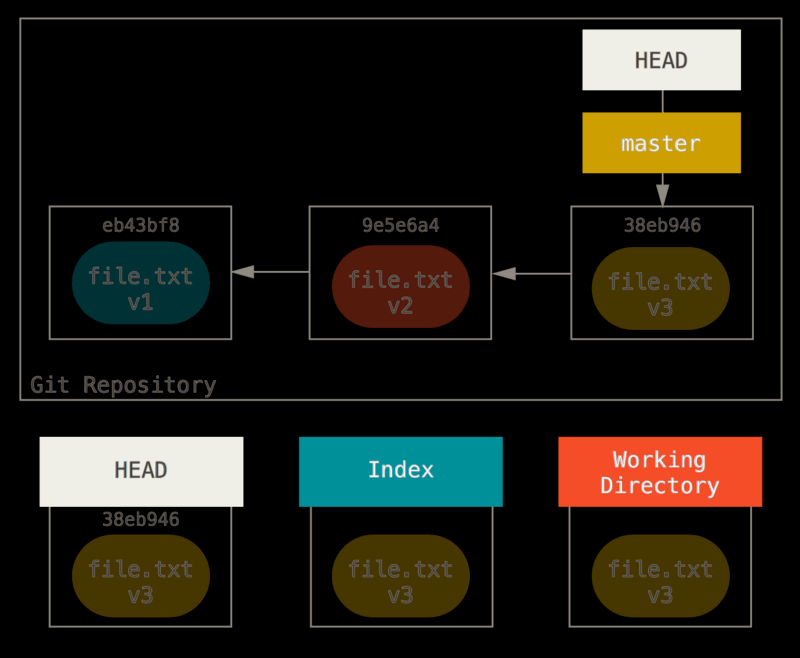

#### ①第一种情况：撤销 commit 命令，工作区和暂存区仍然保留相关代码

```sh
# 撤销commit命令，工作区和暂存区仍然保留相关代码
git reset --soft 59e72cd951a9e6995ba6eb506ff4b89cc944e30d

# 撤回暂存区，返回工作区
git reset 59e72cd951a9e6995ba6eb506ff4b89cc944e30d

# 修改完成后重新提交本地仓库
git commit -a -m "修改完成"
```

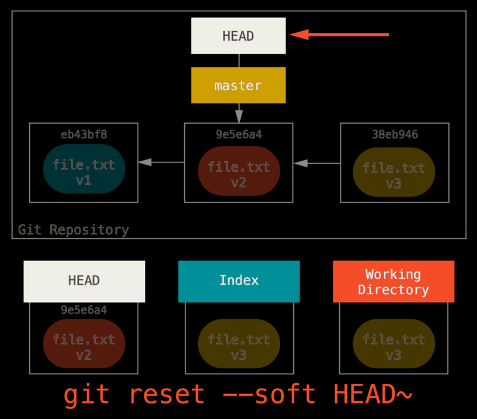

#### ①第二种情况：撤销 commit 命令，暂存区删除，工作区仍然保留相关代码

```sh
# 撤销commit命令，暂存区删除，工作区仍然保留相关代码
git reset --mixed 59e72cd951a9e6995ba6eb506ff4b89cc944e30d

# 修改完成后重新提交本地仓库
git commit -a -m "修改完成"
```

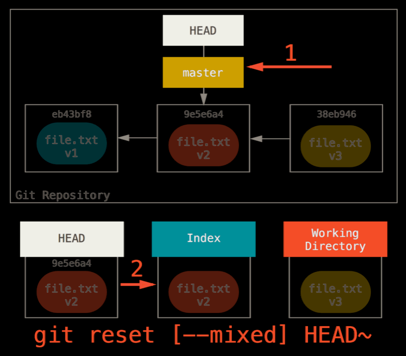

#### ①第三种情况：撤销 commit 命令，工作区和暂存区都删除相关工作

**注意点**：必须注意，`--hard` 标记是 `reset` 命令唯一的**危险用法**，它也是 Git 会真正地销毁数据的仅有的几个操作之一。其他任何形式的 `reset` 调用都可以轻松撤消，但是 `--hard` 选项不能，因为它强制覆盖了工作目录中的文件。在这种特殊情况下，我们的 Git 数据库中的一个提交内还留有该文件的 `v3` 版本，我们可以通过 `reflog` 来找回它。但是若该文件还未提交，Git 仍会覆盖它从而导致无法恢复。

```sh
# 撤销commit命令，工作区和暂存区都删除相关工作
git reset --hard 59e72cd951a9e6995ba6eb506ff4b89cc944e30d
```

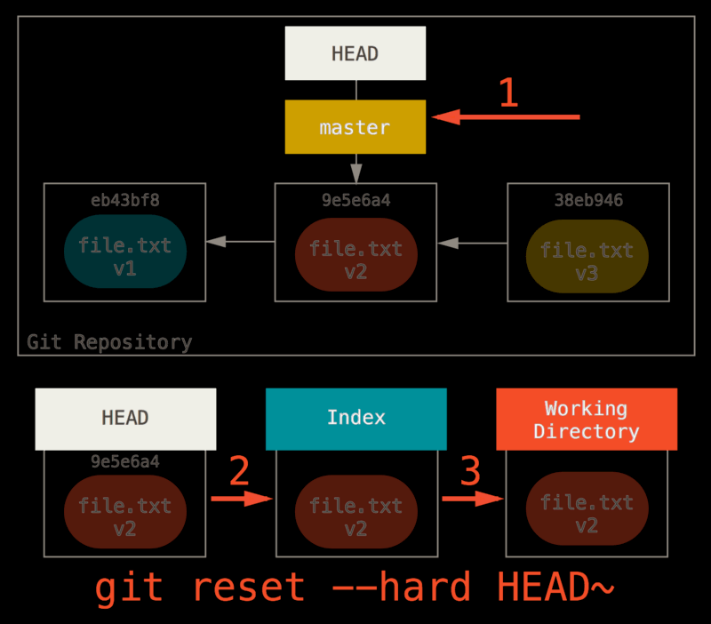

### 六、恢复数据

如果不小心执行了 `git reset --hard 59e72cd951a9e6995ba6eb506ff4b89cc944e30d` 导致所作的工作消失，可以通过以下命令找回：

#### 简洁版

```sh
# 查看日志
git relog

# 恢复数据到恢复分支
git branch recover-branch 387927a

# 切换到恢复分支，会发现数据重新出现，在进行合并等等操作
git checkout recover-branc
```

### 七、删除远程分支

```sh
# 删除远程分支
git push origin --delete branch
```

## Git tag

Git 可以给历史中的某一个提交打上标签，以示重要。比较有代表性的是人们会使用这个功能来标记发布结点（v1.0 等等）。

### 简洁版

```sh
# 列出标签
git tag

# 创建标签
git tag version1

# 远程标签
git push origin --tags

# 删除标签
git tag -d version1
git push origin :refs/tags/version1
```


