# Kubernetes 简介

>bilibili 尚硅谷 K8S 视频：https://www.bilibili.com/video/BV1GT4y1A756
>
>中文官网：https://kubernetes.io/zh
>
>中文社区：https://www.kubernetes.org.cn/

K8S 主要讲的就是 Kubernetes，首先 Kubernetes 首字母为 K，末尾为 s，中间一共有 8 个字母，所以简称 K8S。

## K8S 概念

### 部署发展历程

我们的项目部署也在经历下面的这样一个历程

**传统部署** ===>> **虚拟化部署时代** ===>> **容器部署时代**

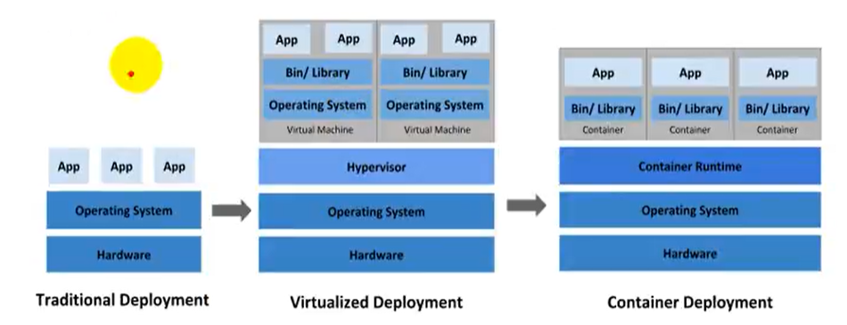

#### 传统部署时代

早期，组织在物理服务器上运行应用程序。无法为物理服务器中的应用程序定义资源边界，这会导致资源分配问题。例如，如果在物理服务器上运行多个应用程序，则可能会出现一个应用程序占用大部分资源的情况，结果可能导致其他应用程序的性能下降。一种解决方案是在不同的物理服务器上运行每个应用程序，但是由于资源利用不足而无法扩展，并且组织维护许多物理服务器的成本很高。

#### 虚拟化部署时代

作为解决方案，引入了虚拟化功能，它允许您在单个物理服务器的 CPU 上运行多个虚拟机（VM）。虚拟化功能允许应用程序在 VM 之间隔离，并提供安全级别，因为一一个应用程序的信息不能被另一应用程序自由地访问。因为虚拟化可以轻松地添加或更新应用程序、降低硬件成本等等，所以虚拟化可以更好地利用物理服务器中的资源，并可以实现更好的可伸缩性。每个 VM 是一台完整的计算机，在虚拟化硬件之上运行所有组件，包括其自己的操作系统。

#### 容器部署时代

容器类似于 VM，但是它们具有轻量级的隔离属性，可以在应用程序之间共享操作系统（OS），因此，容器被认为是轻量级的。容器与 VM 类似，具有自己的文件系统、CPU、内存、进程空间等。由于它们与基础架构分离，因此可以跨云和 OS 分发进行移植。

### 容器的优势

容器因具有许多优势而变得流行起来。下面列出了容器的一些好处：

- 敏捷应用程序的创建和部署：与使用 VM 镜像相比，提高了容器镜像创建的简便性和效率。
- 持续开发、集成和部署：通过简单的回滚（由于镜像不可变性），提供可靠且频繁的容器镜像构建和部署。
- 关注开发与运维的分离：在构建时而不是在部署时创建应用程序容器镜像，将应用程序与基础架构分离。
- 可观察性：不仅可以显示操作系统级别的信息和指标，还可以显示应用程序的运行状况和其他指标信号。
- 跨开发、测试和生产的环境一致性：在便携式计算机上与在云中相同地运行。
- 云和操作系统分发的可移植性：可在 Ubuntu、RHEL、RHEL、CoreOS、本地、Google Kubernetes Engine 和其它任何其它地方运行。
- 以应用程序为中心的管理：提高抽象级别，从在虚拟硬件上运行 OS 到使用逻辑资源在 OS 上运行应用程序。
- 松散耦合、分布式、弹性、解放的微服务：应用程序被分解成较小的独立部分，并且可以动态部署和管理，而不是在一台大型单机上器体运行。
- 资源隔离：可预测的应用程序性能。

### K8S 概述

kubernetes，简称 K8s，是用 8 代替 8 个字符“ubernete”而成的缩写。是一个开源的，用于管理云平台中多个主机上的容器化的应用，Kubernetes 的目标是让部署容器化的应用简单并且高效，Kubernetes 提供了应用部署，规划，更新，维护的一种机制。

传统的应用部署方式是通过插件或脚本来安装应用。这样做的缺点是应用的运行、配置、管理、所有生存周期将与当前操作系统绑定，这样做并不利于应用的升级更新/回滚等操作，当然也可以通过创建虚拟机的方式来实现某些功能，但是虚拟机非常重，并不利于可移植性。

新的方式是通过部署容器方式实现，每个容器之间互相隔离，每个容器有自己的文件系统，容器之间进程不会相互影响，能区分计算资源。相对于虚拟机，容器能快速部署，由于容器与底层设施、机器文件系统解耦的。

Kubernetes 是一个轻便的和可扩展的开源平台，用于管理容器化应用和服务。通过 Kubernetes 能够进行应用的自动化部署和扩缩容。在 Kubernetes 中，会将组成应用的容器组合成一个逻辑单元以更易管理和发现。

Kubernetes 积累了作为 Google 生产环境运行工作负载 15 年的经验，并吸收了来自于社区的最佳想法和实践。

### 小总结

- K8s 是谷歌在 2014 年发布的容器化集群管理系统
- 使用 k8s 进行容器化应用部署
- 使用 k8s 利于应用扩展
- k8s 目标实施让部署容器化应用更加简洁和高效

## K8S 功能

### 自动装箱

基于容器对应用运行环境的资源配置要求自动部署应用容器

### 自我修复

当容器失败时，会对容器进行重启

当所部署的 Node 节点有问题时，会对容器进行重新部署和重新调度

当容器未通过监控检查时，会关闭此容器直到容器正常运行时，才会对外提供服务

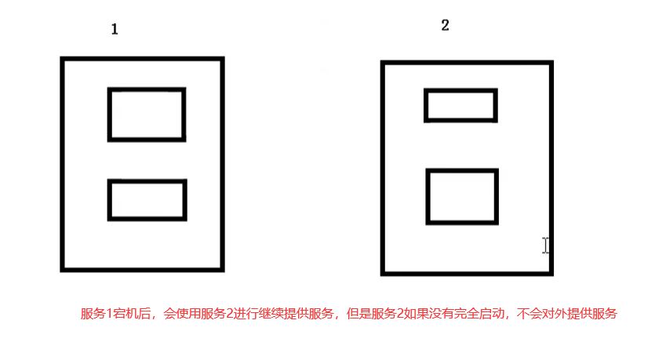

如果某个服务器上的应用不响应了，Kubernetes 会自动在其它的地方创建一个

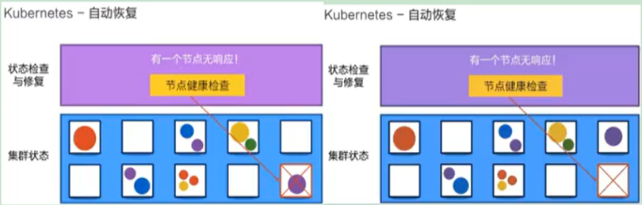

### 水平扩展

通过简单的命令、用户 UI 界面或基于 CPU 等资源使用情况，对应用容器进行规模扩大或规模剪裁

当我们有大量的请求来临时，我们可以增加副本数量，从而达到水平扩展的效果

当黄色应用过度忙碌，会来扩展一个应用

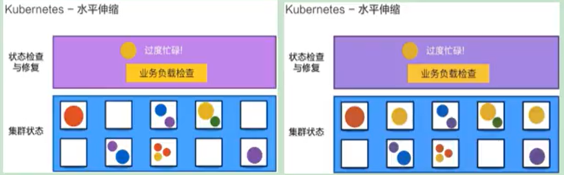

### 服务发现

用户不需使用额外的服务发现机制，就能够基于 Kubernetes 自身能力实现服务发现和负载均衡

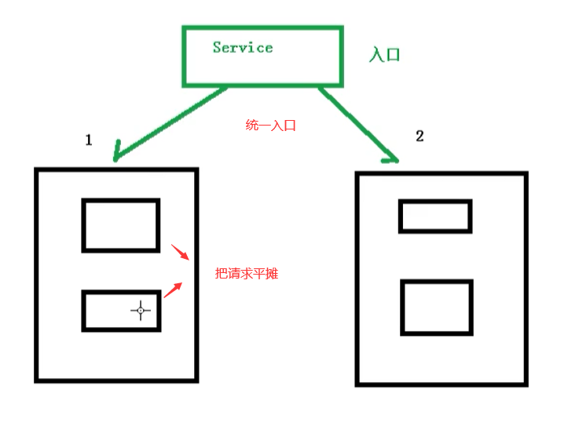

### 滚动更新

可以根据应用的变化，对应用容器运行的应用，进行一次性或批量式更新

### 版本回退

可以根据应用部署情况，对应用容器运行的应用，进行历史版本即时回退

### 密钥和配置管理

在不需要重新构建镜像的情况下，可以部署和更新密钥和应用配置，类似热部署。

### 存储编排

自动实现存储系统挂载及应用，特别对有状态应用实现数据持久化非常重要

存储系统可以来自于本地目录、网络存储 (NFS、Gluster、Ceph 等)、公共云存储服务

### 批处理

提供一次性任务，定时任务；满足批量数据处理和分析的场景

## K8S 架构组件

### 完整架构图

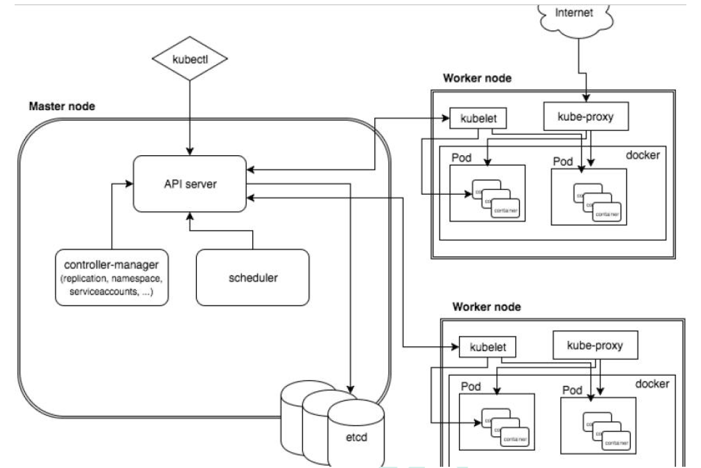

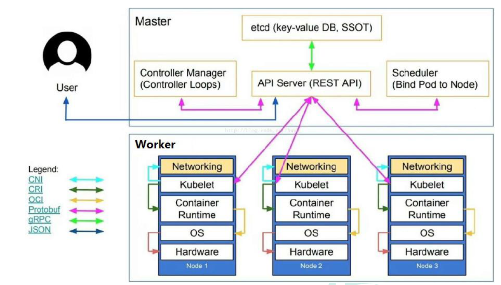

### 架构细节

K8S 架构主要包含两部分：Master（主控节点）和 node（工作节点）

#### master：主控节点

master 节点架构图

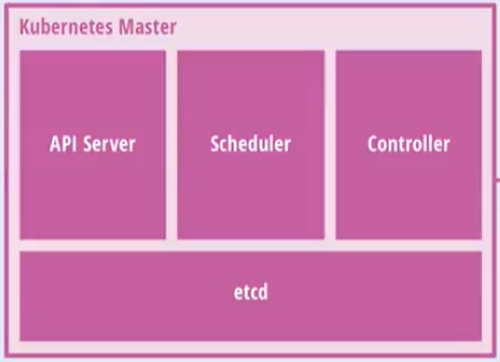

- API Server：集群统一入口，以 restful 风格进行操作，同时交给 etcd 存储
  - 提供认证、授权、访问控制、API 注册和发现等机制

- Scheduler：节点的调度，选择 node 节点应用部署
- Controller-manager：处理集群中常规后台任务，一个资源对应一个控制器
- etcd：存储系统，用于保存集群中的相关数据

#### Work node：工作节点

Node 节点架构图

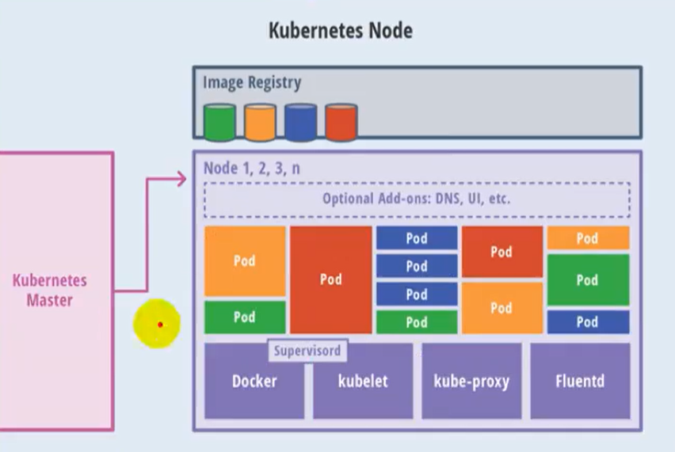

- Kubelet：master 派到 node 节点代表，管理本机容器
  - 一个集群中每个节点上运行的代理，它保证容器都运行在 Pod 中
  - 负责维护容器的生命周期，同时也负责 Volume(CSI) 和 网络 (CNI) 的管理
- kube-proxy：提供网络代理，负载均衡等操作

- 容器运行环境

  - 容器运行环境是负责运行容器的软件
  - Kubernetes 支持多个容器运行环境：Docker、containerd、cri-o、rktlet 以及任何实现 Kubernetes CRI (容器运行环境接口) 的软件

- fluentd：是一个守护进程，它有助于提升集群层面日志

## K8S 核心概念

### Pod

- Pod 是 K8S 中最小的单元
- 一组容器的集合
- 共享网络【一个 Pod 中的所有容器共享同一网络】
- 生命周期是短暂的（服务器重启后，就找不到了）

### Volume

- 声明在 Pod 容器中可访问的文件目录
- 可以被挂载到 Pod 中一个或多个容器指定路径下
- 支持多种后端存储抽象【本地存储、分布式存储、云存储】

### Controller

- 确保预期的 pod 副本数量【ReplicaSet】
- 无状态应用部署【Deployment】
  - 无状态就是指，不需要依赖于网络或者 ip
- 有状态应用部署【StatefulSet】
  - 有状态需要特定的条件
- 确保所有的 node 运行同一个 pod【DaemonSet】
- 一次性任务和定时任务【Job 和 CronJob】

### Deployment

- 定义一组 Pod 副本数目，版本等
- 通过控制器【Controller】维持 Pod 数目【自动回复失败的 Pod】
- 通过控制器以指定的策略控制版本【滚动升级、回滚等】

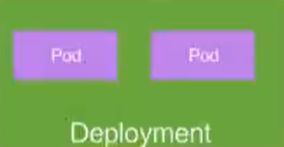

### Service

- 定义一组 pod 的访问规则
- Pod 的负载均衡，提供一个或多个 Pod 的稳定访问地址
- 支持多种方式【ClusterIP、NodePort、LoadBalancer】

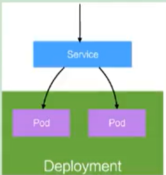

可以用来组合 pod，同时对外提供服务

### Label

label：标签，用于对象资源查询，筛选

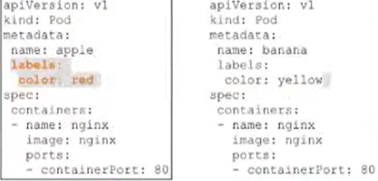

### Namespace

命名空间，逻辑隔离

- 一个集群内部的逻辑隔离机制【鉴权、资源】
- 每个资源都属于一个 namespace
- 同一个 namespace 所有资源不能重复
- 不同 namespace 可以资源名重复

### API

我们通过 Kubernetes 的 API 来操作整个集群

同时我们可以通过 kubectl、ui、curl 最终发送 http + json/yaml 方式的请求给 API Server，然后控制整个 K8S 集群，K8S 中所有的资源对象都可以采用 yaml 或 json 格式的文件定义或描述

如下：使用 yaml 部署一个 nginx 的 pod

## 完整流程

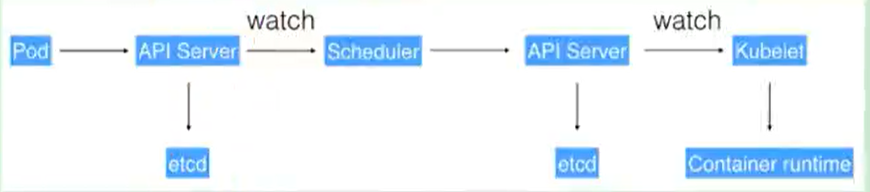

- 通过 Kubectl 提交一个创建 RC（Replication Controller）的请求，该请求通过 APlserver 写入 etcd
- 此时 Controller Manager 通过 API Server 的监听资源变化的接口监听到此 RC 事件
- 分析之后，发现当前集群中还没有它所对应的 Pod 实例
- 于是根据 RC 里的 Pod 模板定义一个生成 Pod 对象，通过 APIServer 写入 etcd
- 此事件被 Scheduler 发现，它立即执行一个复杂的调度流程，为这个新的 Pod 选定一个落户的 Node，然后通过 API Server 讲这一结果写入 etcd 中
- 目标 Node 上运行的 Kubelet 进程通过 APiserver 监测到这个新生的 Pod，并按照它的定义，启动该 Pod 并任劳任怨地负责它的下半生，直到 Pod 的生命结束
- 随后，我们通过 Kubectl 提交一个新的映射到该 Pod 的 Service 的创建请求
- ControllerManager 通过 Label 标签查询到关联的 Pod 实例，然后生成 Service 的 Endpoints 信息，并通过 APIServer 写入到 etod 中
- 接下来，所有 Node 上运行的 Proxy 进程通过 APIServer 查询并监听 Service 对象与其对应的 Endponts 信息，建立一个软件方式的负载均衡器来实现 Service 访问到后端 Pod 的流量转发功能
