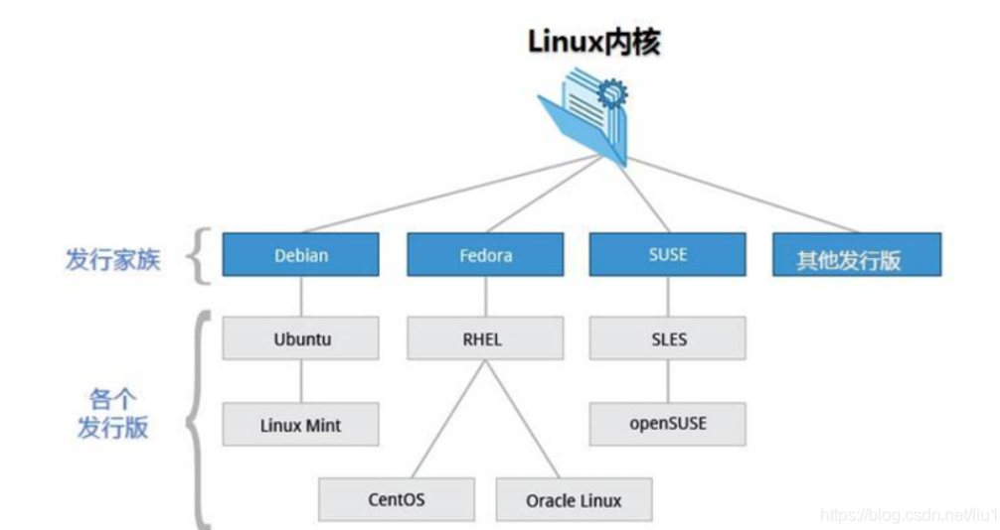
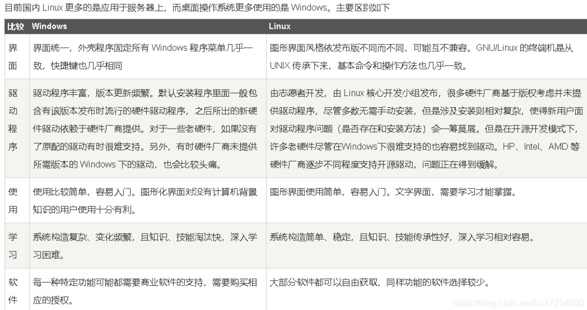

# 历史

## Linux 是在什么版权协议下发行的？

是在 GPL（GNU General Public License）版权协议下发行的。

## 遵循什么标准的操作系统内核？

遵循 POSIX 标准的操作系统内核。

## 其版权属于哪个？

其版权属于 Linus Torvalds，林纳斯·托瓦兹。

## Linux 包含什么？

Linux 是指 GNU/Linux 操作系统。

它包含 Kernel（内核）、Utilities（系统工具程序）以及 Application（应用软件），而不是仅指 Linux 系统内核。

## 什么是发行版？

发行版是指某些公司、组织或个人把 Linux 内核、源代码以及相关的应用程序组织在一起发行。

## Red Hat Linux 的优势

是一个基于 POSIX 和 UNIX 的多用户、多任务、支持多线程和多 CPU 的操作系统。

Linux 能运行主要的 UNIX 工具软件、应用程序和网络协议。它支持 32 位和 64 位硬件。Linux 继承了 Unix 以网络为核心的设计思想，是一个稳定高性能的多用户网络操作系统。

是一款非常优秀的操作系统。它具有非常好的兼容性，同时兼容于 UNIX System V 和 BSD 两个版本，具有两个版本的特点。

它支持多种文件系统，如 FAT16、FAT32、NTFS、EXT2、UFS 等。

Red Hat Linux 是一款 32 位的、多用户、多任务的分时操作系统。

它实用性好，功能强大而且非常稳定。

## Linux vs Windows

