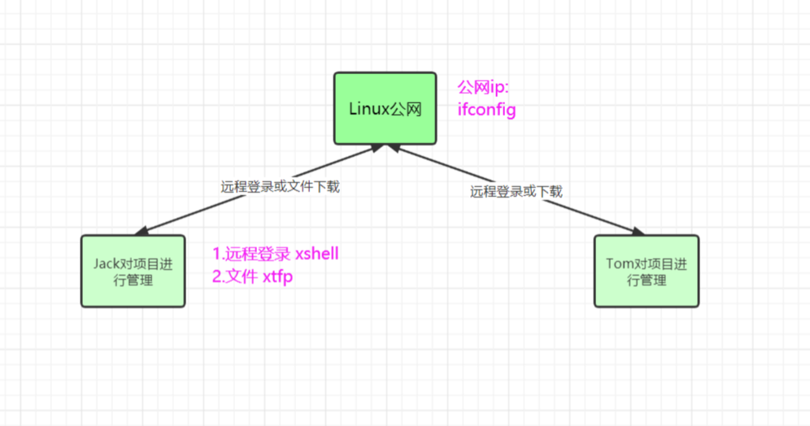
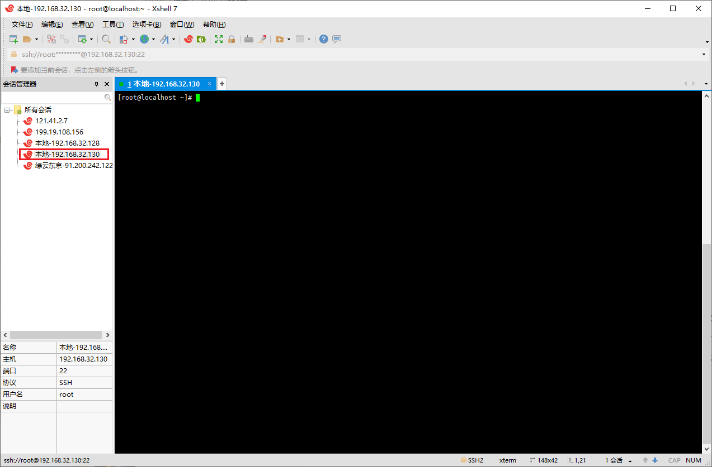
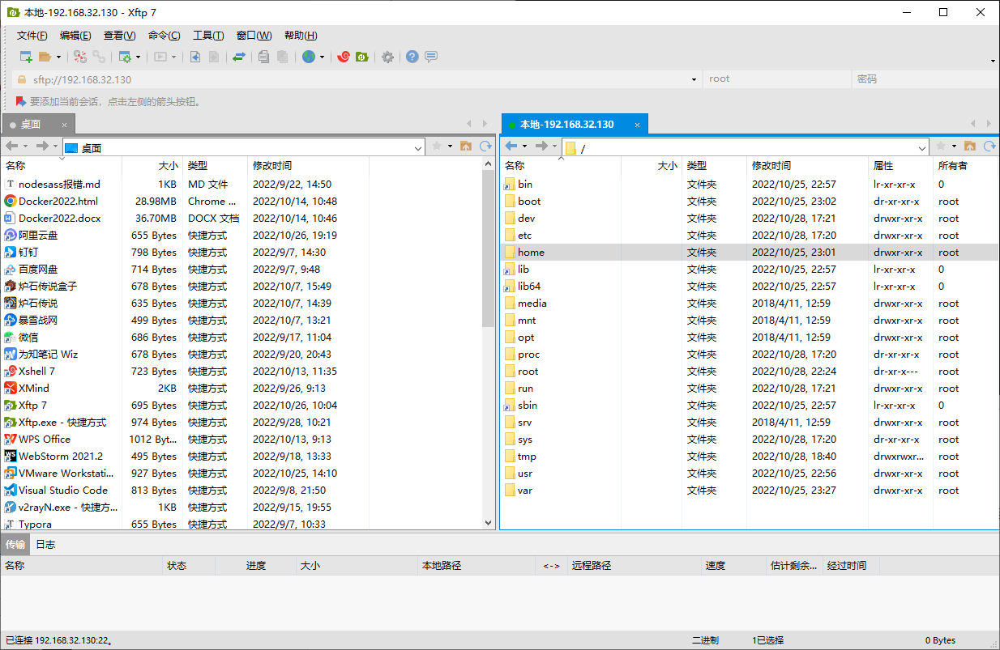

# 远程登录

## 为什么需要远程登录 Linux

### 公司开发应用场景

-   linux 服务器是开发小组共享
-   正式上线的项目是运行在公网
-   因此程序员需要远程登录到 Linux 进行项目管理或者开发
-   画出简单的网络拓扑示意图（帮助理解）

## Xshell7 安装

### Xshell7 介绍

-   Xshell 是目前最好的远程登录到 Linux 操作的软件，流畅的速度并且完美解决了中文乱码的问题，是目前程序员首选的软件。
-   Xshell 是一个强大的安全终端模拟软件，它支持 SSH1, SSH2，以及 Microsoft Windows 平台的 TELNET 协议。
-   Xshell 可以在 Windows 界面下用来访问远端不同系统下的服务器，从而比较好的达到远程控制终端的目的。

### Xshell7 使用

-   新建会话属性，输入主机号 [打开终端，ifconfig 来查看]
-   双击会话用户名，[一次性接受/接受并保存],输入用户名，密码，确定，连接成功！

## Xftp7 安装

### Xftp7 介绍

Xftp7 是一个基于 windows 平台的功能强大的 SFTP、FTP 文件传输软件。使用了 Xftp 以后，windows 用户能安全地在 UNIX/Linux 和 Windows PC 之间传输文件。

### Xftp7 使用

-   新建会话属性，输入主机号。
-   点击连接，[一次性接受/接受并保存]，输入用户名，密码，确定，连接成功！
-   右键点击 windows 上面想传输到 Linux 操作系统的文件，点击传输，也可以把 linux 的文件传输到 windows。

注意：如果 ftp 出现乱码，点击属性，点击选项，把编码改为 Unicode(UTF-8)，刷新一下。
