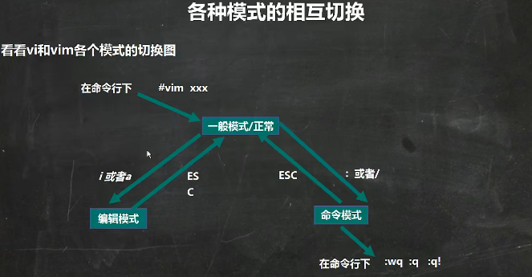
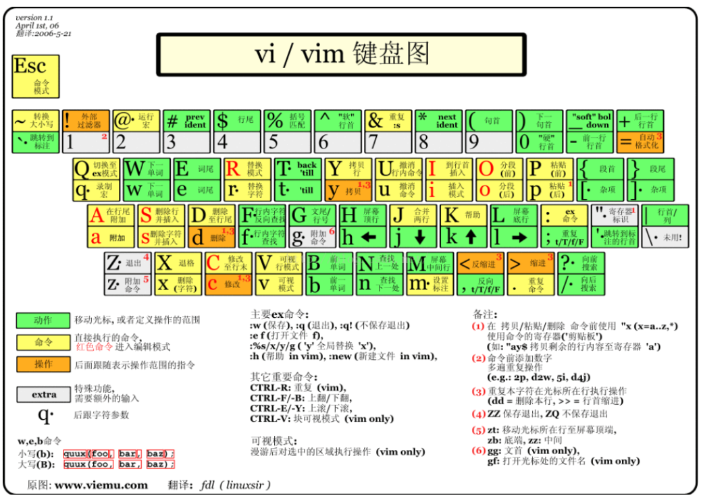
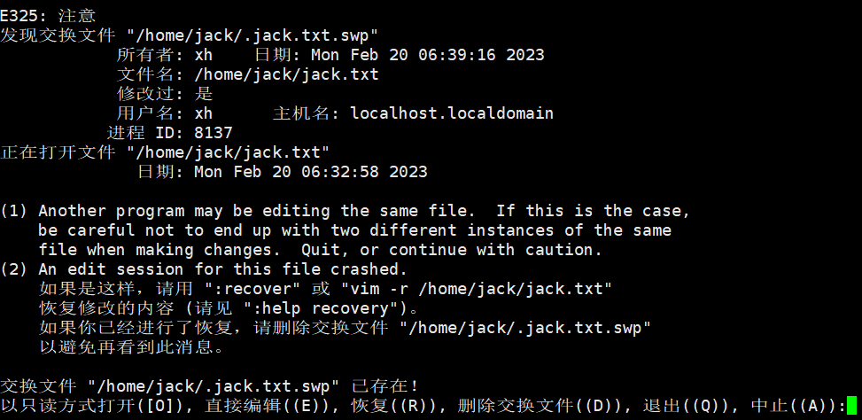

# vi 和 vim 编辑器

## vim 的基本介绍

-   Linux 系统会内置 vi 文本编辑器，（vim 是 vi 的增强版）。
-   vim 具有程序编辑的能力，可以看做是 vi 的增强版本，可以主动的以字体颜色辨别语法的正确性，方便程序设计。代码补完、编译及错误跳转等方便编程的功能特别丰富，在程序员中被广泛使用。

## vim 常用的三种模式

### 正常模式

以 vim 打开一个档案就直接进入一般模式了（这是默认的模式）。在这个模式中，你可以使用上下左右按键来移动光标，你可以使用删除字符或删除整行来处理档案内容，也可以使用复制、粘贴来处理你的文件数据。

### 编辑模式

按下 `i、I、 o、0、 a、 A、 r、R` 等任何一个字母之后才会进入编辑模式，**一般来说按 `i` 即可**。

### 命令行模式

输入 `esc` 再输入 `:` 在这个模式当中，可以提供你相关指令，完成读取、存盘、替换、离开 vim、显示行号等的动作则是在此模式中达成的。

### 各个模式切换

## vim 快捷键

| 操作类型                 | 操作键              | 功能                                                            |
| ------------------------ | ------------------- | --------------------------------------------------------------- |
| 光标移动方向             | ↑、↓、←、→          | 上、下、左、右                                                  |
| 翻页                     | Page Down           | 向下翻动一整页内容                                              |
|                          | Page Up             | 向下翻动一整页内容                                              |
| 行内快速跳转             | Home 键             | 跳转至行首                                                      |
|                          | End 键              | 跳转至行尾                                                      |
| 行间快速跳转             | #GG                 | 跳转至文件的第#行                                               |
| 行号显示                 | :set nu             | 在编辑器中显示行号                                              |
|                          | :set nonu           | 取消编辑器中的行号显示                                          |
| 删除                     | x 或 Del            | 删除光标处的单个字符                                            |
|                          | dd                  | 删除当前光标所在行                                              |
| 复制                     | yy                  | 复制当前行整行的内容到粘贴板                                    |
| 粘贴                     | p                   | 将缓冲区的内容粘到贯标位置之后                                  |
| 保存文件                 | :w                  |                                                                 |
|                          | :w /root/newfile    | 另存为其他文件                                                  |
| 退出 vi                  | :q                  | 未修改退出                                                      |
|                          | :q!                 | 放弃对文件内容的修改，并退出 vi                                 |
| 保存文件并退出           | :wq                 |                                                                 |
| 查找字符                 | /hello              | 从上而下在文件中查找字符串"hello"                               |
|                          | ?hello              | 从下而上在文件中查找字符串"hello"                               |
| 定位下一个被查找到的字符 | n                   | 定位下一个匹配的被查找字符串                                    |
|                          | N                   | 定位上一个匹配的被查找字符串                                    |
| 撤销操作                 | u                   | 按一次取消最近的一次操作，多次重复按 u 键，恢复已进行的多步操作 |
|                          | U                   | 用于取消对当前行所做                                            |
| 保持并退出               | ZZ                  | 保存当前的文件内容并退出 vi 编辑器                              |
| 打开新的文件             | :e ~/install.log    | 打开新的文件进行编辑                                            |
|                          | :r /etc/filesystems | 在当前文件中读入其他文件内容                                    |
| 替换操作                 | :s /old/new         | 将当前行中查找到的第一个字符"old"串替换为"new"                  |
|                          | :s /old/new/g       | 将当前行中查找到的所有字符串"old"替换为"new"                    |
|                          | :#,# s/oldnew/g     | 在行号"#,#"范围内替换所有的字符串"old"为"new"                   |

### 快捷键练习

1. 拷贝当前行 yy，拷贝当前行向下的 5 行 5yy，并粘贴（输入 p）。
2. 删除当前行 dd，删除当前行向下的 5 行 5dd
3. 在文件中查找某个单词[命令行下/关键字﹐回车查找﹐输入 n 就是查找下一个]
4. 设置文件的行号，取消文件的行号。[命令行下：set nu 和:set nonu]
5. 编辑/etc/profile 文件，在一般模式下，使用快捷键到该文档的最末行[G]和最首行[gg]
6. 在一个文件中输入"hello",在一般模式下，然后又撤销这个动作 u
7. 编辑/etc/profile 文件，在一般模式下，并将光标移动到，输入 20，再输入 shift+g
8. 快捷键的键盘对应图

## vim 遇到过的问题

<mark>文件未保存，重新打开后报错</mark>

先按 Q 退出，使用 ls -a 查看，可以看到有一个 swp 文件产生。

如何恢复呢，很简单使用 `vim -r  jack.txt`，打开文件，然后你会发现恢复了，wq 保存就好啦，删掉 swp 文件就好啦。
