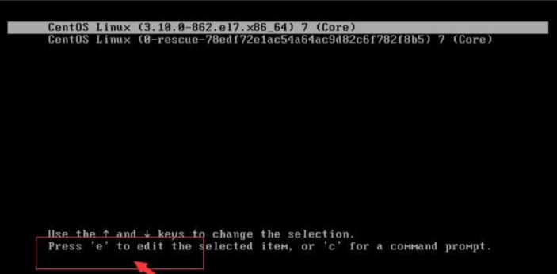
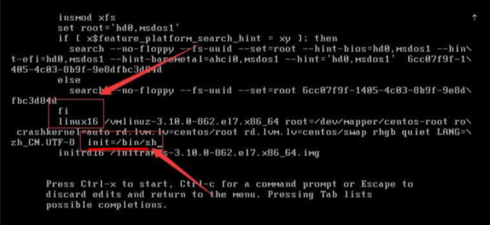
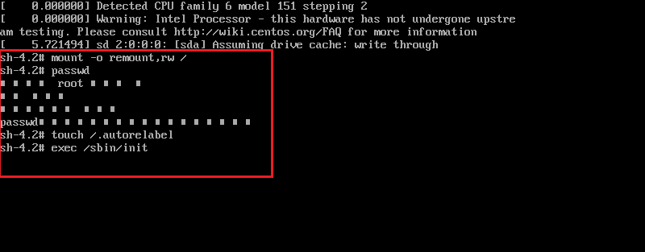

# 实用指令

## 指令运行级别

### 基本介绍

0：关机

1：单用户[找回丢失密码]

2：多用户状态没有网络服务

<mark>3：多用户状态有网络服务</mark>

4：系统未使用保留给客户

<mark>5：图形界面</mark>

6：系统重启

常用运行级别分别是 3 和 5，也可以指定默认运行级别。

### 切换运行级别

`init [0123456]` 切换运行级别

### CentOS7 运行级别说明

-   multi-user. target：运行级别三
-   graphical.target：运行级别五

**查看运行级别**

graphical.target: analogous to runlevel 5

`systemctl get-default`

**设置运行级别**

`systemcfl set-default multi-user.target`

## 找回 root 密码

1、首先，启动系统，进入开机界面，在界面中按“e”进入编辑界面。

2、进入编辑界面，使用键盘上的上下键把光标往下移动，找以“Linux16”开头内容所在的行数”，在行的最后面输入：`init=/bin/sh`。

3、接着，输入完成后，直接按快捷键：`Ctrl+x` 进入单用户模式

4、接着，在光标闪烁的位置中输入：`mount -o remount,rw /`，完成后按键盘的回车键（Enter）。

5、在新的一行最后面输入：passwd，完成后按键盘的回车键（Enter）。输入密码，然后再次确认密码即可 (提示：密码长度最好 8 位以上，但不是必须的)，密码修改成功后，会显示 passwd.....的样式，说明密码修改成功。

6、接着，在鼠标闪烁的位置中（最后一行中）输入：`touch /.autorelabel`，完成后按键盘的回车键（Enter）。

7、继续在光标闪烁的位置中，输入：`exec /sbin/init`，完成后按键盘的回车键（Enter），等待系统自动修改密码（提示：这个过程时间可能有点长，耐心等待），完成后，系统会自动重启，新的密码生效了。

## 帮助指令

### man 指令

功能描述：获得帮助信息。

基本语法：`man 某个指令` 如 `man ls`

### help 指令

功能描述：获得 shell 内置命令的帮助信息。

基本语法：`help`

## 文件目录类

### pwd 指令

功能描述：显示当前工作目录的绝对路径。

基本语法：`pwd`

### ls 指令

功能描述：显示当前工作目录的绝对路径。

基本语法：`ls [options]`

options:

-   -a【all】：显示当前目录所有的文件和目录，包括隐藏的。
-   -l【list】：以列表的方式显示信息。

### cd 指令

功能描述：切换到指定目录。

基本语法：`cd [options]`

options 说明：

-   `cd ~` 回到自己的家目录。
-   `cd ..` 回到当前目录的上一级目录。

### mkdir 指令

功能描述：用于创建空的目录。

基本语法：`mkdir [options] 要创建的目录名`

options 说明：

-   -p：创建多级目录

### rmdir 指令

功能描述：用于删除目录。

基本语法：`rmdir [options] 要删除的空目录名`

options 说明：

-   <mark>-rf：删除当前目录，包含目录下的文件</mark>

使用细节：

-   rmdir 删除的是空目录，如果目录下有内容时无法删除的。
-   提示：如果需要删除非空目录，需要使用 `rm -rf` 要删除的目录。

### touch 指令

功能描述：创建空文件。

基本语法：`touch 文件名称`

### cp 指令

功能描述：拷贝文件到指定目录。

基本语法：`cp [options] 源文件 指定的位置`

options 说明：

-   -r：递归复制整个文件夹

应用案例：

> 案例 1：将/home/hello.txt 拷贝到/home/bbb 目录下
>
> cp hello.txt /home/bbb
>
> 案例 2：递归复制整个文件夹，举例，比如将/home/bbb 整个目录，拷贝到 /opt
>
> cp -r /home/bbb/opt

### rm 指令

功能描述：移除文件或目录。

基本语法：`cp [options] 移除文件或目录`

options 说明：

-   -r：递归删除整个文件夹
-   -f：强制删除不提示

### mv 指令

功能描述：<mark>移动文件与目录或重命名</mark>。

基本语法：`mv 旧文件名 新文件名` 或 `mv 移动的文件名 新的地址`

### cat 指令

功能描述：查看文件内容。

基本语法：`cat [options] 要查看的文件`

options 说明：

-   -n：显示行号

使用细节：

-   cat 只能浏览文件，而不能修改文件，为了浏览方便，一般会带上管道命令 `| more`。
-   `cat -n 文件 | more`

### more 指令

功能描述：more 指令是一个基于 VI 编辑器的文本过滤器，它以全屏幕的方式按页显示文本文件的内容。more 指令中内置了若干快捷键（交互的指令）。

基本语法：`more 要查看的文件`

操作说明：

| 操作            | 功能说明                               |
| --------------- | -------------------------------------- |
| 空白键（space） | 代表向下翻一页                         |
| Enter           | 代表向下翻一行                         |
| q               | 代表立刻离开 more，不再显示该文件内容。 |
| Ctrl+F          | 向下滚动一屏                           |
| Ctrl+B          | 返回上一屏                             |
| =               | 输出当前行的行号                       |
| :f              | 输出文件名和当前行的行号               |

### less 指令

功能描述：less 指令用来分屏查看文件内容，它的功能与 more 指令类似，但是比 more 指令更加强大，支持各种显示终端。less 指令在显示文件内容时，并不是一次将整个文件加载之后才显示，而是根据显示需要加载内容，对于显示大型文件具有较高的效率。

基本语法：`less 要查看的文件`

操作说明：

| 操作       | 功能说明                                      |
| ---------- | --------------------------------------------- |
| 空白键     | 向下翻动一页                                  |
| [pagedown] | 向下翻动一页                                  |
| [pageup]   | 向下翻动一页                                  |
| /子串      | 向下搜寻[字串]的功能;n:向下查找；N:向上查找； |
| ?字串      | 向上搜寻[字串]的功能;n:向上查找；N:向下查找;  |
| q          | 离开 less 这个程序;                           |

### echo 指令

功能描述：echo 输出内容到控制台。

基本语法：`echo [options] 输出内容`

使用细节：

-   输出环境变量，`echo $PATH`、`echo $HOSTNAME`

### head 指令

功能描述：用于显示文件的开头部分内容，默认情况下 head 指令显示文件的前 10 行内容。

基本语法：`head [options] 要查看的文件`

options 说明：

-   -n：显示行号

### tail 指令

功能描述：tail 用于输出文件中尾部的内容，默认情况下 tail 指令显示文件的后 10 行内容。

基本语法：`tail [options] 要查看的文件`

options 说明：

-   -n：显示行号
-   -f：实时监控文件变化

### > 指令 >> 指令

功能描述：\>输出重定向和>>追加。

基本语法：

-   `ls -l > 文件` 将当前列表写入文件中
-   `ls -al >> 文件` 将隐藏文件追加到文件中
-   `cat 文件1 > 文件2` 查看文件 1 并将内容覆盖到文件 2
-   `echo “内容” >> 文件` 输出内容写入到文件中

### ln 指令

功能描述：软链接也称为符号链接，类似于 windows 里的快捷方式，主要存放了链接其他文件的路径。

基本语法：`ln -s 源文件目录 快捷方式目录`

使用细节：

-   当我们使用 pwd 指令查看目录时，仍然看到的是软连接所在的目录。

应用实例：

> 案例 1：在/home 目录下创建一个软连接 myroot，连接到/root 目录
>
> ln -s /root /home/myroot
>
> 案例 2：删除软连接 myroot
>
> rm /home/myroot

### history 指令

功能描述：查看已经执行过历史命令，也可以执行历史命令。

基本语法：`history`

应用实例：

> 案例 1：显示所有的历史命令
>
> history
>
> 案例 2：显示最近使用过的 10 个指令
>
> history 10
>
> 案例 3：执行历史编号为 5 的指令
>
> !5

## 日期时间类

### date 指令

功能描述：显示当前日期

基本语法：

-   date
-   date +%Y
-   date +%m
-   date +%d
-   <mark>date "+%Y-%m-%d %H:%M:%S"</mark>

### date 指令

功能描述：设置日期。

基本语法：`date -s 字符串时间`，例如`date -s "2020-11-03 20:02:10"`

### cal 指令

功能描述：设置日期日历。

基本语法：`cal 2022`

## 搜索查找类

### find 指令

功能描述：将从指定目录向下递归地遍历其各个子目录，将满足条件的文件或者目录显示在终端。

基本语法：`find [搜索范围] [options]`

options 说明：

| 选项            | 功能                             |
| --------------- | -------------------------------- |
| -name<查询方式> | 按照指定的文件名查找模式查找文件 |
| -user<用户名>   | 查找属于指定用户名所有文件       |
| -size<文件大小> | 按照指定的文件大小查找文件       |

使用细节：

-   ``-size (单位)`：【+n 大于】 【-n 小于】 【n 等于】，单位有 k、M、G。

应用实例：

> 案例 1：按文件名：根据名称查找/home 目录下的 hello.txt 文件
>
> find /home -name hello.txt
>
> 案例 2：按拥有者：查找/opt 目录下，用户名称为 nobody 的文件
>
> find /opt -user nobody
>
> 案例 3：查找整个 linux 系统下大于 200M 的文件 (+n 大于 -n 小于 n 等于，单位有 k,M,G)
>
> find / -size +200M

### locate 指令

功能描述：locate 指令可以快速定位文件路径。locate 指令利用事先建立的系统中所有文件名称及路径的 locate 数据库实现快速定位给定的文件。Locate 指令无需遍历整个文件系统，查询速度较快。为了保证查询结果的准确度，管理员必须定期更新 locate 时刻。

基本语法：`locate 文件`

使用细节：

<mark>CentOS7 精简版没有安装 locate，执行`yum install mlocate`安装</mark>

<mark>由于 locate 指令基于数据库进行查询，所以第一次运行前必须使用`updatedb`指令创建 locate 数据库。</mark>

<mark>which 指令，可以查看某个指令在哪个目录下，比如 ls 指令在哪个目录 which ls</mark>

### grep 指令和管道符号 `|`

功能描述：grep 过滤查找，管道符，“|”，表示将前一个命令的处理结果输出传递给后面的命令处理。

基本语法：<mark>`grep [options] 查找内容 源文件` 或者 `cat 源文件 | grep 查找内容`</mark>

options 说明：

| 选项 | 功能             |
| ---- | ---------------- |
| -n   | 显示匹配行及行号 |
| -i   | 忽略字母大小写   |

## 压缩解压类

### gzip/gunzip 指令

功能描述：gzip 用于压缩文件，gunzip 用于解压的。

基本语法：

`gzip 文件` : gzip 文件 (功能描述：压缩文件，只能将文件压缩为\*.gz 文件)。

`gunzip 文件.gz` : 解压缩文件命令。

应用实例：

> 案例：请在 hello.txt 文件中，查找"yes"所在行，并且显示行号
>
> 写法 1: cat/home/hello.txt | grep "yes"
>
> 写法 2: grep -n "yes" /home/hello.txt

### zip/unzip 指令

功能描述：zip 用于压缩文件，unzip 用于解压的，这个在项目打包发布中很有用的。

基本语法：

`zip [options] XXX.zip 将要压缩的内容` ：压缩文件和目录的命令。

`unzip [options] XXX.zip` ：解压缩文件。

options 说明：

-   zip 常用选项

    -   -r：递归压缩，即压缩目录。

-   unzip 的常用选项
    -   -d<目录>：指定解压后文件的存放目录。

应用案例：

> 案例 1：将/home 下的所有文件/文件夹进行压缩成 myhome.zip，将 home 目录及其包含的文件和子文件夹都压缩
>
> zip -r myhome.zip /homel
>
> 案例 2：将 myhome.zip 解压到 opt/tmp 目录下
>
> mkdir /opt/tmp
>
> unzip-d /opt/tmp /home/myhome.zip

### tar 指令

功能描述：tar 指令是打包指令，最后打包后的文件是.tar.gz 的文件。

基本语法：

-   打包压缩：`tar [options] XXX.tar.gz 打包的内容`
-   解压：`tar [options] XXX.tar.gz`

options 说明：

| 选项 | 功能               |
| ---- | ------------------ |
| -c   | 产生.tar 打包文件  |
| -v   | 显示详细信息       |
| -f   | 指定压缩后的文件名 |
| -z   | 打包同时压缩       |
| -x   | 解包.tar 文件      |

应用实例：

> 案例 1：压缩多个文件，将/home/pig.txt 和/home/cat.txt 压缩成 pc.tar.gz
>
> tar -zcvf pc.tar.gz /home/pig.txt /home/cat.txt
>
> 案例 2：将/home 的文件夹压缩成 myhome.tar.gz
>
> tar -zcvf myhome.tar.gz /home/
>
> 案例 3：将 pc.tar.gz 解压到当前目录
>
> tar -zxvf pc.tar.gz
>
> 案例 4：将 myhome.tar.gz 解压到/opt/tmp2 目录下
>
> (1) mkdir /opt/tmp2
>
> (2) tar -zxvf /home/myhome.tar.gz -C /opt/tmp2
