# 组管理和权限管理

## 组管理

在 linux 中的每个用户必须属于一个组，不能独立于组外。在 linux 中每个文件有所有者、所在组、其它组的概念。

-   所有者
-   所在组
-   其他组
-   改变用户所在的组

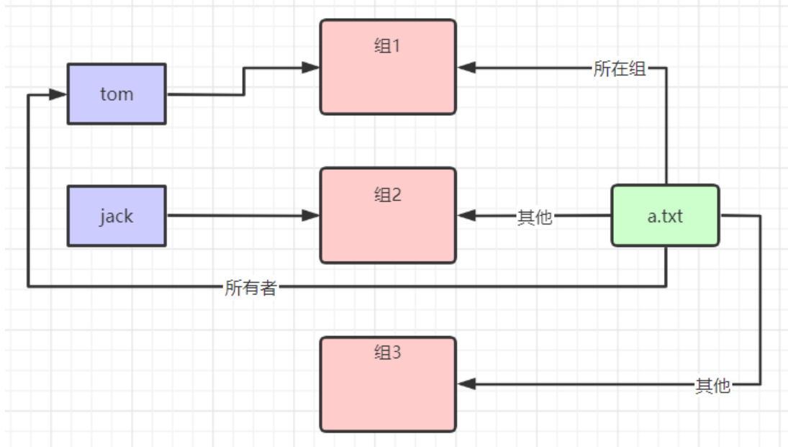

### 文件/目录的所有者

一般为文件的创建者，谁创建了该文件，就自然的成为该文件的所有者。

#### 查看文件/目录的所有者

`ls -ahl`

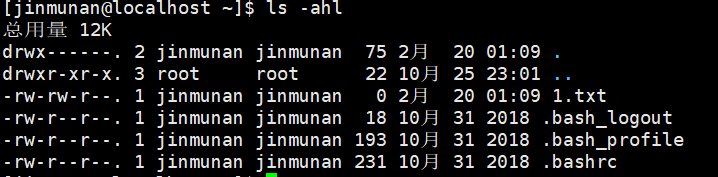

#### 修改文件/目录所有者

`chown 用户名 文件名`

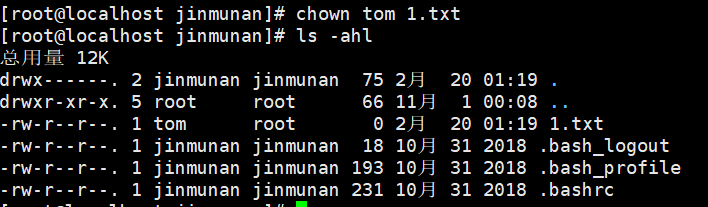

### 文件/目录的所在组

当某个用户创建了一个文件后，这个文件的所在组就是该用户所在的组 (默认)。

#### 应用实例

```sh
创建一个组，monster
groupadd monster
创建一个用户fox,并放入到monster组中
useradd -g monster fox
切换到fox用户并生成ok.txt文件
su - fox
touch ok.txt
查看文ok.txt文件/目录所在组
ll -ahl 发现在monster组中
```

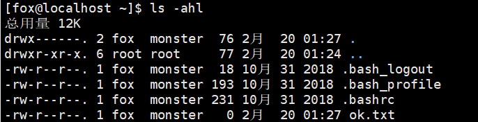

#### 查看文件/目录所在组

`ls -ahl`

#### 修改文件/目录所在组

`chgrp 组名 文件名`

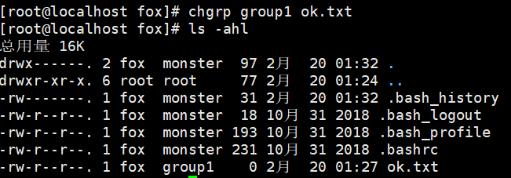

### 其他组

除文件的所有者和所在组的用户外，系统的其它用户都是文件的其它组。

### 改变用户所在组

在添加用户时，可以指定将该用户添加到哪个组中，同样的用 root 的管理权限可以改变某个用户所在的组。

#### 基本指令

`usermod 选项 用户名`

#### 选项说明

`usermod -g 新组名 用户名` 改变用户所在的组。

`usermod -d 目录名 用户名` 改变该用户登陆的初始目录。<mark>特别说明：用户需要有进入到新目录的权限。</mark>

-   -c comment:修改用户的注释信息
-   -g group:修改用户所属的主群组
-   -G group:修改用户所属的附加群租，多个群组以","分隔。
-   -l name:修改用户账号名称
-   -L:锁定用户，使其不能登录
-   -U:解除对用户的锁定
-   -u UID:修改用户的 ID 值
-   -d home:修改用户的主目录
-   -p passwd:修改用户密码

#### 应用实例

```
将 zhonngnan 这个用户从原来所在组，修改到 monster 组

id zhongnan

usermod -g monster zhonngnan
```

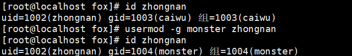

## 权限管理

`ls -l`

```
第一列的 10 位字符代表权限。

第二列的数字代表文件硬连接数或目录子目录数

第三列的文字代表用户

第四列的文字代表组

第五列的数字代表文件字节大小，如果是文件夹，显示4096字节

第六列的日期代表最后修改日期

第七列的文字代表文件名或目录名
```

<mark>第 0 位是确定文件类型</mark>


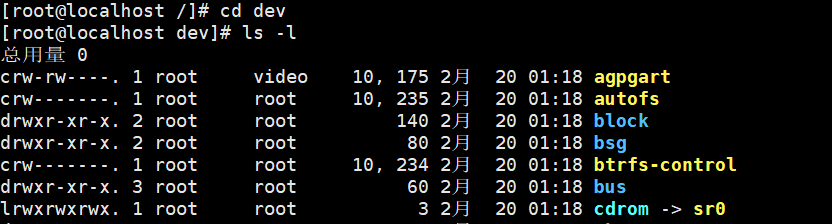

```
-是普通文件
l是链接，相当于windows的快捷方式
d是目录，相当于windows的文件夹
c是字符设备文件，鼠标，键盘
b是块设备，比如硬盘
```

<mark>第 1-3 位确定所有者拥有的权限 user</mark>

<mark>第 4-6 位确定所属组拥有的权限 group</mark>

<mark>第 7-9 位确定其他用户拥有的权限 other</mark>

### rwx 权限详解

#### rwx 作用到文件

1. [ r ]代表可读 (read)：可以读取，查看。
2. [ w ]代表可写 (write)：可以修改，但是不代表可以删除该文件，删除一个文件的前提条件是对该文件所在的目录有写权限，才能删除该文件。
3. [ x ]代表可执行 (execute)：可以被执行。

#### rwx 作用到目录

1. [ r ]代表可读 (read)：可以读取，ls 查看目录内容。
2. [ w]代表可写 (write)：可以修改，对目录内创建，删除，重命名目录。
3. [ x ]代表可执行 (execute)：可以进入该目录。

### 文件/目录权限实际案例

```
-rwxrw-r--

第0位 - 代表普通文件
第1-3位 rwx 表示文件所有者拥有读写执行权限
第4-6位 rw- 表示文件所在组拥有读写权限
第7-9位 r-- 表示文件其他组拥有读权限

可用数字表示为: r=4,w=2,x=1因此rwx=4+2+1=7，数字可以进行组合
```

### 修改文件/目录权限

`chmod 修改的权限`

```
第一种方式：通过+、-、=来变更权限

u：代表所有者、g：代表所有组、o：代表其他人、a：代表所有人

chmod u=rwx,g=rx,o=x 文件/目录名

chmod o+w 文件/目录名 代表其他人加上写的权限

chmod a-x 文件/目录名 代表所有人减去执行的权限

第二种方式：通过数字变更权限

r=4,w=2,x=1

chmod 751 文件/目录名
```

#### 案例

```
修改 hello.txt 文件权限，所有者rwx，所在组rw，其他组r

修改 hello.txt 文件权限，给所有者删除执行权限，给所在组增加执行权限

修改 hello.txt 文件权限，给文件所有人增加写权限
```

`chmod u=rwx,g=rx,o=r hello.txt`

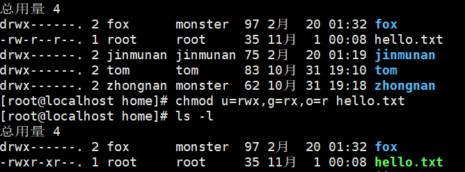

`chmod u-x,g+x hello.txt`

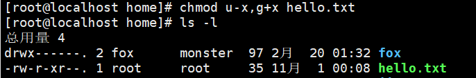

`chmod a+w`

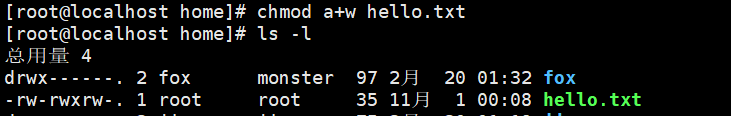

### 修改文件/目录所有者

`chown 新的所有者 文件/目录改变所有者`

`chown 新的所有者:新的所在组 文件/目录改变所有者和所在组`

`-R 如果是目录则使其下所有子文件或目录递归生效`

#### 案例

```
将/home/fox/ok.txt文件的所有者修改成zhongnan

将/home/zhongnan目录下所有的文件和目录的所有者都修改成fox
```

`chown zhongnan /home/fox/ok.txt`

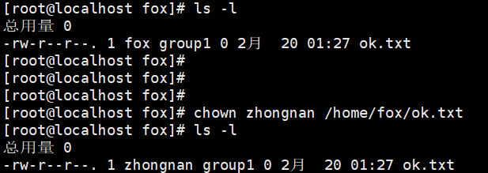

`chown -R fox /home/zhongnan`

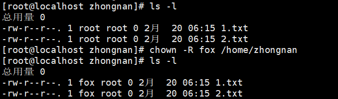

### 修改文件/目录所在组

`chgrp 新的所在组 文件/目录`

#### 案例

```
将/home/hello.txt 文件的所在组修改成monstor

chgrp monster /home/hello.txt
```

## 综合案例：警察抓土匪

```
police 警察组 jack、jerry警察
bandit 土匪组 xh、xq土匪

第一步：创建组
groupadd police;groupadd bandit;

第二步：创建用户
useradd -g police jack;useradd -g police jerry
useradd -g bandit xh;useradd -g bandit xq

第三步：jack创建一个文件。可读可写，本组人可读，其他组没任何权限
su - jack
touch jack.txt
chmod 640 jack.txt;

第四步：jack修改该文件，让其他组的人可以读，本组人可以读写
chmod 664 jack.txt;

第五步：xh投靠警察
usermod -g police xh

第六步；看看xh是否可以读写、xq是否可以
小结论，就是如果要对目录内的文件进行操作，需要要有对该目录的相应权限
chmod 770 jack
```

## 综合案例：神仙和妖怪

```
sx 神仙组 唐僧、沙僧
yg 妖怪组 悟空、八戒

第一步：创建组
groupadd sx;groupadd yg;

第二步：创建用户
useradd -g sx ts;useradd -g sx ss;
useradd -g yg wk;useradd -g yg bj;

第三步：创建密码
passwd ts
passwd ss
passwd wk
passwd bj

第四步：用悟空创建一个文件wk.txt
su - wk
touch wk.txt

第五步：给八戒一个rw权限
chmod g+w wk.txt

第六步：八戒修改wk.txt文件，前提是悟空将自己的文件权限打开
chomd 770 wk

第七步：唐僧、沙僧对该文件都没有权限

第八步：沙僧叛变到妖怪组，再去访问悟空文件，发现还是权限不够，原因是沙僧登录进来就是神仙组，修改组后需要重新登录。
usermod -g yg ss

小结论：
x：表示可以进入到该目录，比如cd
r：表示可以ls，将目录的内容显示
w：表示可以在该目录可以删除或者创建文件
```
