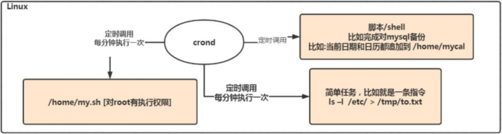
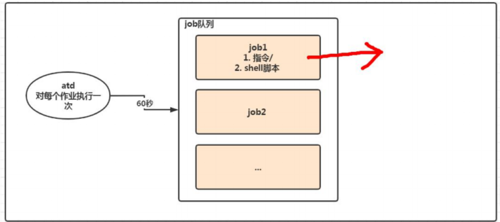

# 定时任务调度

## crond 任务调度

crond 任务调度就是指系统在某个时间执行的特点的命令或程序。

**任务调度分类：**

-   系统工作：有些重要的工作必须周而复始地执行。如病毒扫描等。

-   个别用户工作：个别用户可能希望执行某些程序，比如对 mysql 数据库的备份。



### crond 命令格式

```sh
crontab [选项]
```

### crond 命令选项

| 选项       | 含义                            |
| ---------- | ------------------------------- |
| crontab -e | 编辑 crontab 定时任务           |
| crontab -l | 查询 crontab 任务               |
| crontab -r | 删除当前用户所有的 crontab 任务 |

### 快速入门

```sh
每小时的每分钟执行`Is -l /etc > /tmp/to.txt`命令

第一步：创建个人任务调度
crontab -e

第二步：输出任务到调度文件
*/1 * * * * ls -l /etc > /tmp/to.txt
```

#### 参数说明

| 项目       | 含义                   | 范围                     |
| ---------- | ---------------------- | ------------------------ |
| 第一个"\*" | 一个小时当中的第几分钟 | 0-59                     |
| 第二个"\*" | 一天当中的第几小时     | 0-23                     |
| 第三个"\*" | 一个月当中的第几天     | 1-31                     |
| 第四个"\*" | 一年当中的第几月       | 1-12                     |
| 第五个"\*" | 一周当中的星期几       | 0-7(0 和 7 都代表星期日) |

#### 特殊符号说明

| 特殊符号 | 含义                                                                                                           |
| -------- | -------------------------------------------------------------------------------------------------------------- |
| \*       | 代表任何时间。比如一个"\*"就代表一小时中每分钟都执行一次的意思。                                               |
| ，       | 代表不连续的时间。比如"0 8,12,16 \* \* \*命令"，就代表在每天的 8 点 0 分，12 点 0 分，16 点 0 分都执行一次命令 |
| -        | 代表连续的时间范围。比如"0 5 \* \* 1-6 命令"，就代表周一到周六的凌晨 5 点 0 分执行命令                         |
| \*/n     | 代表没隔多久执行一次。比如"\*/10 \* \* \* \* 命令"，代表每隔 10 分钟就执行一遍命令                             |

### 特殊时间执行案例

| 时间             | 含义                                               |
| ---------------- | -------------------------------------------------- |
| 45 22 \* \* \*   | 每天的 22 点 45 分执行命令                         |
| 0 17 \* \* 1     | 每周一的 17 点 0 分执行命令                        |
| 0 5 1,15 \* \*   | 每月 1 号和 15 号的凌晨 5 点 0 分执行命令          |
| 40 4 \* \* 1-5   | 每周一到周五的凌晨 4 点 40 分执行命令              |
| \*/10 4 \* \* \* | 每天的凌晨 4 点，每隔 10 分钟执行以此命令          |
| 0 0 1,15 \* 1    | 每月 1 号和 15 号，每周 1 的 0 点 0 分都会执行命令 |

<mark>注意：星期几和几号最好不要同时出现，因为他们定义的都是天，非常容易让程序员混乱。</mark>

### 应用实例

```sh
案例1：每隔1分钟，就将当前的日期信息，追加到/tmp/mydate文件中。

*/1 * * * * date >> /tmp/mydate
```

```sh
案例2：每隔1分钟，将当前日期和日历都追加到/home/mycal文件中。

第一步：写sh脚本
vim /home/my.sh
date >> /home/mycal
cal >>/home/mycal

第二步：增加执行权限
chmod u+x /home/my.sh

第三步：任务调度sh脚本
*/1 * * * * /home/my.sh
```

```sh
案例3：每天凌晨2:00将mysql数据库testdb，备份到文件中。

0 2 * * * mysqldump -uroot -proot testdb > /home/db.bak
```

### crond 相关指令

```sh
终止任务调度
crontab -r

列出当前有那些任务调度
crontab -l

重启任务调度
service crond restart
等同于
systemctl restart crond.service
systemctl start crond.service
systemctl stop crond.service
```

## at 定时任务

-   at 命令是一次性定时计划任务，at 的守护进程 atd 会以后台模式运行，检查作业队列来运行。

-   默认情况下，atd 守护进程每 60 秒检查作业队列，有作业时，会检查作业运行时间，如果时间与当前时间匹配，则运行此作业。

-   at 命令是一次性定时计划任务，执行完一个任务后不再执行此任务了。

-   在使用 at 命令的时候，一定要保证 atd 进程的启动，可以使用相关指令来查看。

    ```sh
    可以检测 atd 是否在运行
    ps -ef | grep atd
    
    如果没有安装 atd 需要安装
    yum install atd
    systemctl restart atd
    systemctl start atd
    systemctl stop atd
    ```



### at 命令格式

```sh
at [选项] [时间]
Ctrl+D 结束at命令的输入，输入两次。
```

### at 命令选项

| 选项             | 含义                                                     |
| ---------------- | -------------------------------------------------------- |
| at -m            | 当指定的任务被完成后，讲给用户发送邮件，即使没有标准输出 |
| at -I            | atq 的别名                                               |
| at -d            | atrm 的别名                                              |
| at -v            | 显示任务将被执行的时间                                   |
| at -c            | 打印任务的内容到标准输出                                 |
| at -V            | 显示版本信息                                             |
| at -q <队列>     | 使用指定的队列                                           |
| at -f <文件>     | 从指定文件读入任务而不是从标准输入的读入                 |
| at -t <时间参数> | 以时间参数的形式提交要运行的任务                         |

### at 时间说明

-   接受在当天的 hmm（小时：分钟）式的时间指定。假如该时间已过去，那么就放在第二天执行。例如:04:00。

-   使用 mihnight（深夜），noon（中午） , teatime（饮茶时间，一般是下午 4 点）等比较模糊的词语来指定时间。
-   采用 12 小时计时制，即在时间后面加上 AM（上午）或 PM（下午）来说明是上午还是下午。例如：12pm。
-   指定命令执行的具体日期，指定格式为 month day（月日）或 mm/dd/yy（月/日/年）或 dd.mm.yy（日。月。年），指定的日期必须跟在指定时间的后面。例如:04:00 2021-03-1。
-   使用相对计时法。指定格式为：now + count time-units，now 就是当前时间，time-units 是时间单位，这里能够是 minutes（分钟）、hours（小时）、days（天）、weeks（星期）。count 是时间的数量，几天，几小时。例如：now + 5 minutes
-   直接使用 today（今天）、tomorrow（明天）来指定完成命令的时间。

### 应用案例

```sh
案例1：2天后的下午5点执行 /bin/ls/home
at 5pm + 2 days

案例2：atq 命令来查看系统中没有执行的工作任务
atq

案例3：明天17点钟，输出时间到指定文件内比如 /root/date100.log
at 5pm tomorrow
date > /root/date100.log

案例4：1分钟后，输出时间到指定文件内比如 /root/date200.log
at now + 1 minutes
date > /root/date100.log
```
