# 磁盘分区挂载

## 分区

### 分区原理

-   Linux 来说无论有几个分区，分给哪一目录使用，它归根结底就只有一个根目录，一个独立且唯一的文件结构，Linux 中每个分区都是用来组成整个文件系统的一部分。
-   Linux 采用了一种叫”载入“的处理方法，它的整个文件系统中包含了一整套的文件和目录，且将一个分区和一个目录联系起来。这时要载入的一个分区将使它的存储空间在一个目录下获得。

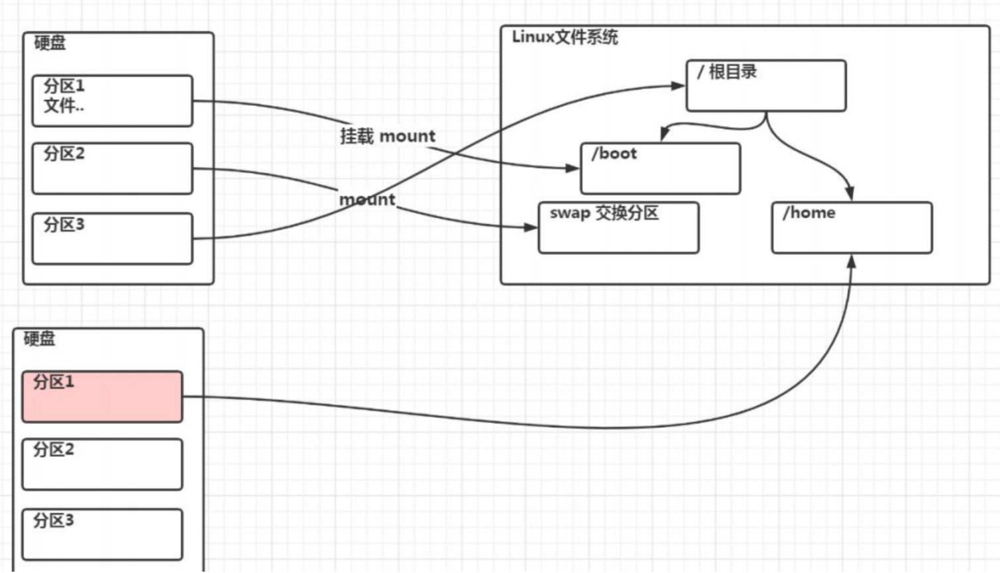

### 硬盘说明

-   Linux 硬盘分 IDE 硬盘和 SCSI 硬盘，目前基本上是 SCSI 硬盘
-   对于 IDE 硬盘，驱动器标识符为“hdx~”，其中“hd”表明分区所在设备的类型，这里是指 IDE 硬盘了。“x”为盘号（a 为基本盘，b 为基本从属盘，c 为辅助主盘，d 为辅助从属盘），“~”代表分区，前四个分区用数字 1 到 4 表示，它们是主分区或扩展分区，从 5 开始就是逻辑分区。例，hda3 表示为第一个 IDE 硬盘上的第三个主分区或扩展分区，hdb2 表示为第二个 IDE 硬盘上的第二个主分区或扩展分区。
-   对于 SCSI 硬盘则标识为“sdx~”，SCSI 硬盘是用“sd”来表示分区所在设备的类型的，其余则和 IDE 硬盘的表示方法一样。

### 查看所有设备挂载情况

```sh
lsblk 或者 lsblk -f
```

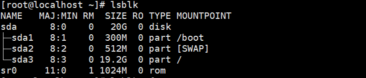

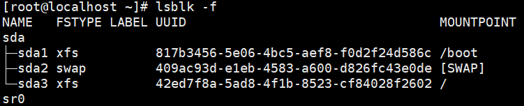

## 挂载的经典案例

下面我们以增加一块硬盘为例来熟悉下磁盘的相关指令和深入理解磁盘分区、挂载、卸载的概念。

### 如何增加一块硬盘

1. 虚拟机添加硬盘
2. 分区
3. 格式化
4. 挂载
5. 设置可以自动挂载

### 虚拟机增加硬盘步骤 1

在【虚拟机】菜单中，选择【设置】，然后设备列表里添加硬盘，然后一路【下一步】，中间只有选择磁盘大小的地方需要修改，至到完成。然后重启系统（才能识别）!

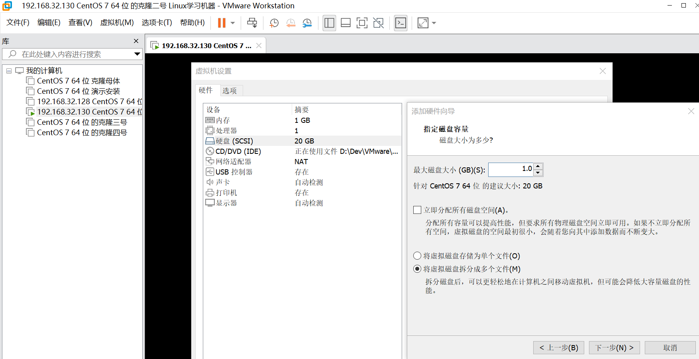

### 虚拟机增加硬盘步骤 2

```sh
对 sdb 分区
fdisk /dev/sdb
```

说明：开始分区后输入 n，新增分区，然后选择 p，分区类型为主分区。两次回车默认剩余全部空间。最后输入 w 写入分区并退出，若不保存退出输入 q。

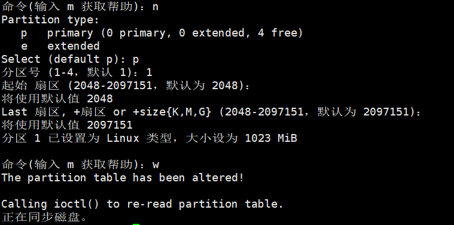

### 虚拟机增加硬盘步骤 3

```sh
格式化磁盘,其中ext4是分区类型
mkfs -t ext4 /dev/sdb1
```

### 虚拟机增加硬盘步骤 4

```sh
挂载：将一个分区与一个目录联系起来，命令行形式挂载在服务器重启后失效，需要配置永久挂载。
mount 设备名称 挂载目录
mkdir newdisk
mount /dev/sdb1 newdisk
```

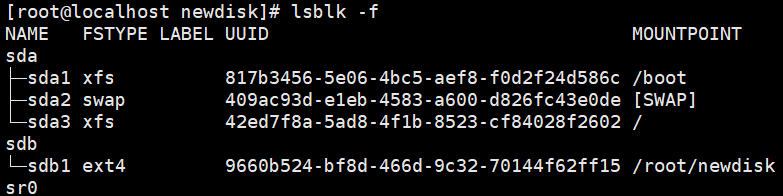

```sh
如果不想使用挂载，删除挂载点
umount 设备名称/挂载目录
umount /dev/sdb1
或者
umount newdisk
```

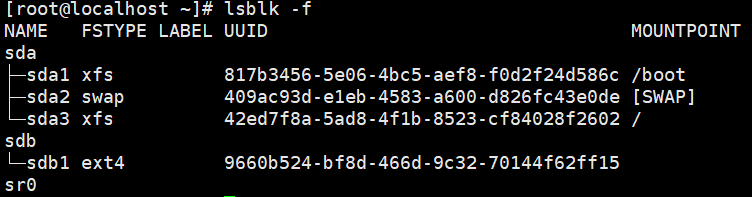

### 虚拟机增加硬盘步骤 5

```sh
永久挂载：通过修改/etc/fstab 实现挂载
添加完成保存后执行mount -a或者reboot即刻生效
```

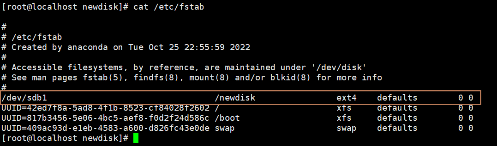

## 磁盘情况查询

### 查询系统整体磁盘使用情况

```sh
df -h
```

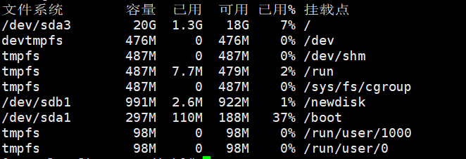

### 查询指定目录的磁盘占用情况

```sh
du -h
```

| 选项             | 含义                       |
| ---------------- | -------------------------- |
| du -s            | 指定目录占用大小汇总       |
| du -h            | 带计量单位                 |
| du -a            | 含文件                     |
| du --max-depth=1 | 子目录深度                 |
| du -c            | 列出明细的同时，增加汇总值 |

```sh
查询 /home 目录的磁盘占用情况，深度为1
du -h --max-depth=1 /home
```

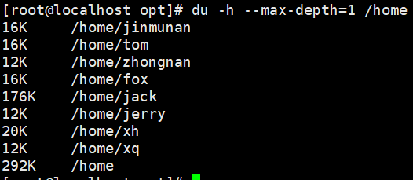

## 磁盘工作实用指令

```sh
案例一：统计/home文件夹下文件的个数

ls -l /home | grep "^-" | wc -l

列出home下面的内容
交给管道grep过滤，"^-":正则表达式
把得到的结果用wc统计
统计/home文件夹下目录的个数

案例二：统计/home文件夹下文件的个数

ls -l /home | grep "^d" | wc -l

案例三：统计/home文件夹下文件的个数，包括子文件夹里的

ls -lR /home | grep "^-" |wc -l

案例四：统计/home文件夹下目录的个数，包括子文件夹里的

ls -lR /home | grep "^d" | wc -l

案例五：以树状显示目录结构 tree 目录，注意，如果没有tree,则使用yum install tree安装
tree /home
```

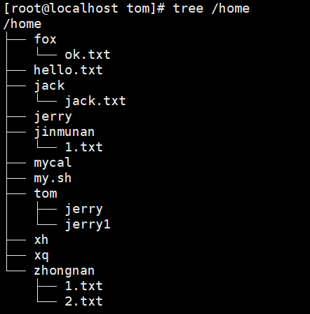
