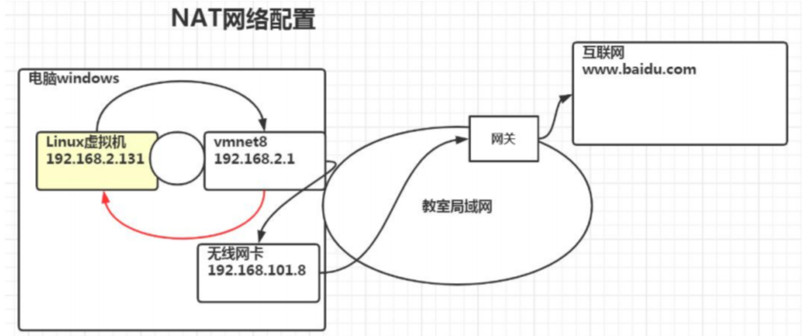
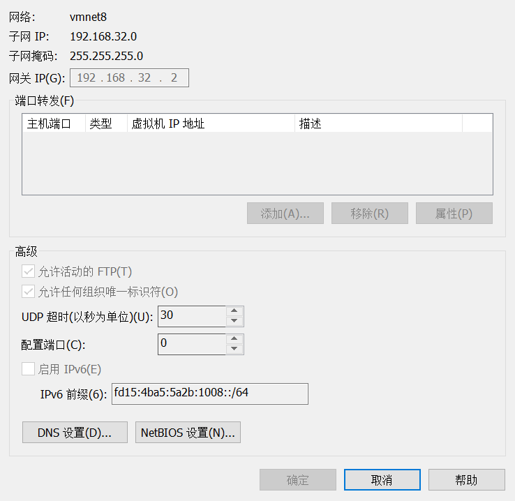
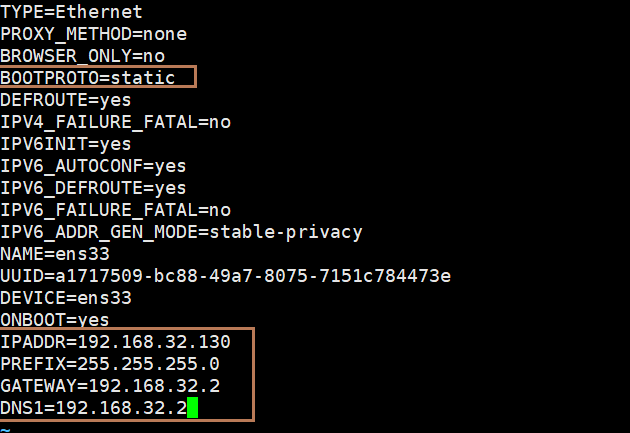
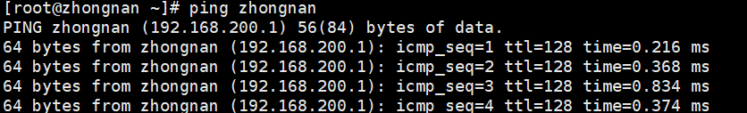
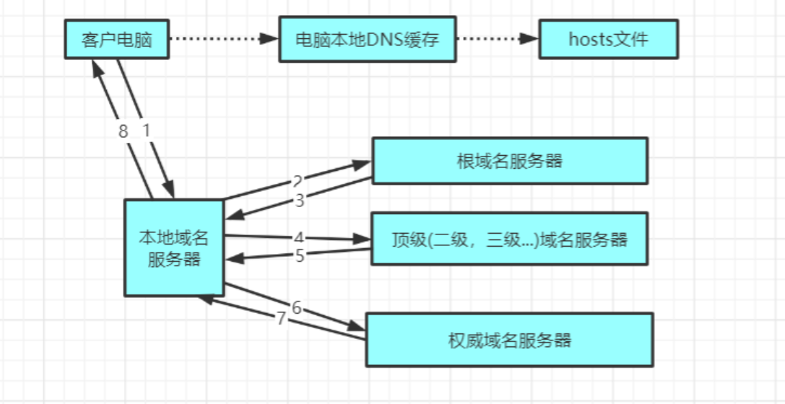

# 网络配置

## 网络原理图



## 查看虚拟机网络 IP 和网关

### 查看虚拟网络 IP 地址


### 查看网关



## 查看 Windows 环境中 VMnet8 网络配置

```sh
ipconfig
```

## 查看 Linux 的网络配置

```sh
ifconfig
```

## Ping 测试主机之间网络连通性

```sh
ping ip
```

## Linux 网络配置环境

### 第一种方法（自动获取）

说明：登陆后，通过界面的来设置自动获取 ip，特点：linux 启动后会自动获取 P，缺点是每次自动获取的 ip 地址可能不一样。

可视化界面

### 第二种方法（指定 ip）

说明：直接修改配置文件来指定 IP 并可以连接到外网（程序员推荐）

```sh
vim /etc/sysconfig/network-scripts/ifcfg-ens33
```



```sh
接口名（设备，网卡）
DEVICE=eth33

网络类型（通常是Ethemet）
TYPE=Ethernet

随机 id
UUID=926a57ba-92c6-4231-bacb-f27e5e6a9f44

系统启动的时候网络接口是否有效(yes/no)
ONBOOT=yes

IP的配置方法[nonelstatic|bootp|dhcp] (引导时不使用协议|静态分配IP|BOOTP协议|DHCP协议)
BOOTPROTO=static

IP 地址
IPADDR=192.168.32.130

网关
GATEWAY=192.168.32.2

域名解析器
DNS1=192.168.32.2
```

```sh
重启网络服务或者重启系统生效
service network restart
或者
reboot
```

## 设置主机名和 Hosts 映射

### 设置主机名

```sh
设置主机名，为了方便记忆，可以给linux系统设置主机名，也可以根据需要修改主机名。

查看主机名
hostname

修改主机名
vim /etc/hostname

重启生效
```

### 设置 Hosts 映射

思考：如何通过主机名能够找到（比如 ping）某个 linux 系统？

```sh
windows
C:\Windows\System32\drivers\etc\hosts

linux
/etc/hosts
192.168.200.1 zhongnan
```



## 主机名解析过程分析（Hosts、DNS）

### Hosts

一个文本文件，用来记录 IP 和 Hostname（主机名）的映射关系。

### DNS

DNS，就是 Domain Name System 的缩写，翻译过来就是域名系统是互联网上作为域名和 IP 地址相互映射的一个分布式数据库

### 应用案例

用户在浏览器输入了 www.baidu.com

-   浏览器先检查（浏览器缓存）中有没有该域名解析 IP 地址，有就先调用这个 IP 完成解析；如果没有，就检查 DNS 解析器缓存（操作系统缓存），如果有直接返回 IP 完成解析。这两个缓存，可以理解为本地解析器缓存。

-   一般来说，当电脑第一次成功访问某一网站后，在一定时间内，浏览器或操作系统会缓存他的 IP 地址（DNS 解析记录），如在 cmd 窗口中输入。

    ```sh
    DNS 域名解析缓存
    ipconfig /displaydns

    手动清理 dns 缓存
    ipconfig /flushdns
    ```

-   如果本地解析器缓存没有找到对应映射，检查系统中 hosts 文件中有没有配置对应的域名 IP 映射，如果有，则完成解析并返回。
-   如果本地 DNS 解析器缓存和 hosts 文件中均没有找到对应的 IP，则到域名服务 DNS 进行解析域。


