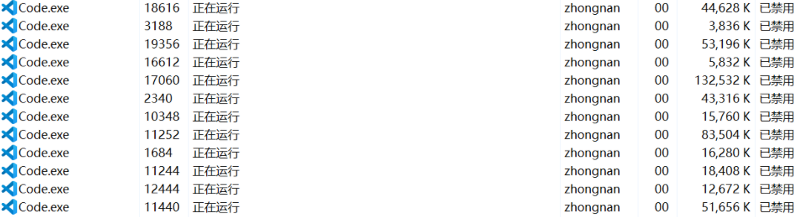
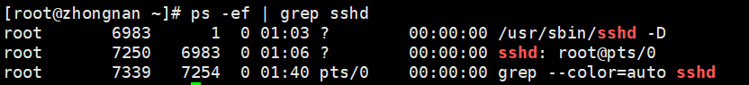
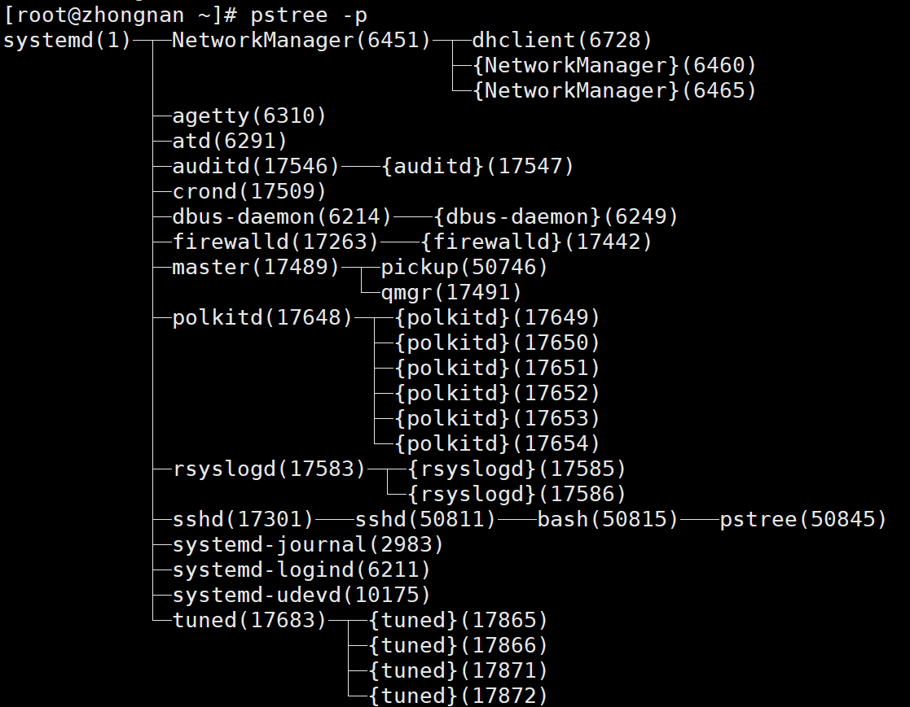
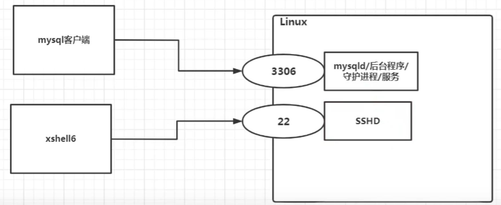
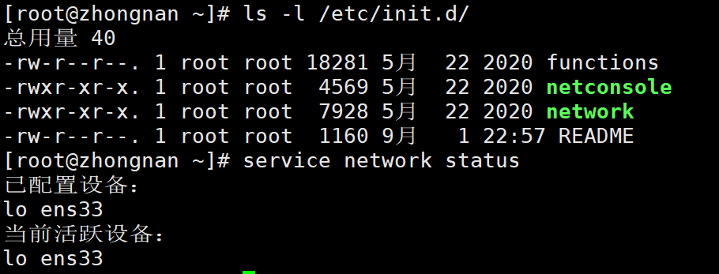
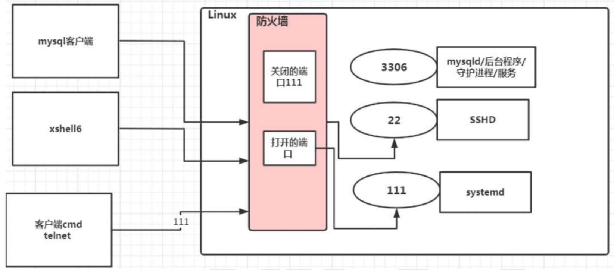
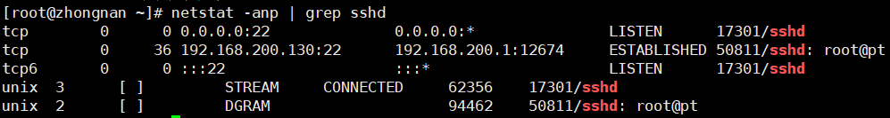
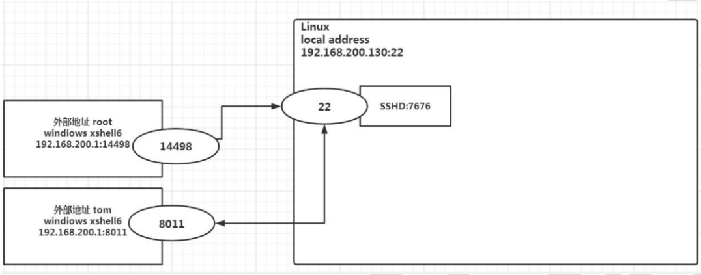
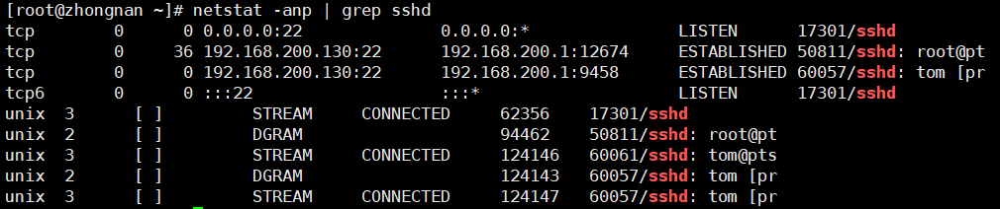

# 13.进程管理

## 基本介绍

-   在 Linux 中，每个执行的程序都称为一个进程。每一个进程都分配一个 ID 号（id，进程号）。
-   每个进程都可能以两种方式存在的。前台与后台，所谓前台进程就是用户目前的屏幕上可以进行操作的。后台进程则是实际在操作，但由于屏幕上无法看到的进程，通常使用后台方式执行。
-   一般系统的服务都是以后台进程的方式存在，而且都会常驻在系统中。直到关机才才结束。



## 显示系统执行的进程

```sh
ps命令是用来查看目前系统中，有哪些正在执行，以及它们执行的情况，可以不加参数。
ps
ps -a:显示当前终端的所有进程信息
ps -u:以用户的格式显示进程信息
ps -x:显示后台进程进行的参数
ps -aux | more
```

### 名词解释

```sh
USER 进程执行用户
PID 进程号
%CPU 占用cpu百分比
%MEM 占用物理内存的百分比
VSZ 进程占用的虚拟内存大小
RSS 程占用的物理内存大小
TTY 控制终端的ID
STAT 当前进程的状态，其中S-睡眠，s-表示该进程是会话的先导进程，N-表示进程拥有比普通优先级更低的优先级，R-正在运行，D-短期等待，Z-僵死进程，T-被跟踪或者被停止等等。
START 进程启动的时间
TIME 进程已经消耗的CPU时间
COMMAND 启动进程所用的命令和参数

[root@zhongnan ~]# ps -aux | more
USER        PID %CPU %MEM    VSZ   RSS TTY      STAT START   TIME COMMAND
root          2  0.0  0.0      0     0 ?        S    01:03   0:00 [kthreadd]
root          3  0.0  0.0      0     0 ?        S    01:03   0:00 [ksoftirqd/0]
root          5  0.0  0.0      0     0 ?        S<   01:03   0:00 [kworker/0:0H]
```

### 应用案例

```sh
要求：以全格式显示当前所有的进程，查看进程的父进程。查看 sshd 的父进程信息
ps -ef 是以全局格式显示当前所有进程
-e 显示所以进程
-f 全格式

ps -ef | grep sshd

解释一下，1是sshd的父进程，6983是sshd的进程，sshd的子进程是7250，7250的子进程是7339。
```



## 终止进程 kill 和 killall

若是某个进程执行一半需要停止时，或是已消了很大的系统资源时，此时可以考虑停止该进程。使用 kill 命令来完成此项任务。

```sh
功能描述：通过进程号杀死/终止进程
kill [选项] 进程号

功能描述：通过进程名称杀死进程，也支持通配符，这在系统因负载过大而变得很慢时很有用
killall 进程名称

表示强迫进程立即停止
kill -9 进程号
```

### 应用案例

```sh
案例1：踢掉某个非法登录用户 kill 进程号,比如关闭 tom 的账户。
ps -ef | grep sshd
kill 7415
tom 的账户就退出了。

案例2：终止远程登录服务sshd,在适当时候再次重启sshd服务 kill sshd 对应的进程号。
ps -aux |grep sshd
kill 6983
如果需要重启 sshd 服务，则执行 systemctl start sshd。

案例3：终止多个gedit。
killall gedit 如果命令找不到，则执行yum install psmisc。

案例4：强制杀掉一个终端。
kill -9 7254
```

## 查看进程树

```sh
可以更加直观的来看进程信息
pstree [选项]

常用选项
pstree -p:显示进程的PID
pstree -u:显示进程的所属用户
```



## 服务 (service) 管理

服务（service）本质就是进程，但是是运行在后台的，通常都会监听某个端口，等待其它程序的请求，比如（mysqld , sshd，防火墙等），因此我们又称为守护进程，是 Linux 中非常重要的知识点。

### 原理图



### service 管理指令（老版本）

-   service 服务名 [start|stop|restart|reload|status]
-   **在 CentOS7.0 后，很多服务不再使用 service，而是 systemctl**
-   service 指令管理的服务在 /etc/init.d 查看



### service 管理指令案例

```sh
请使用service指令，查看，关闭，启动network [注意:在虚拟系统演示，因为网络连接会关闭]指令:

service network status

service network stop

service network start
```

### 查看服务名

```sh
方式一：https://blog.csdn.net/cnds123321/article/details/116431316
最小化的linux系统（centos\redhat）默认都是没有安装setup图形小工具的。
setup

方拾二：/etc/init.d 看到 service 指令管理的服务
ls -l /etc/init.d/
```

### 服务的运行级别

```sh
Linux有7种运行级别：常用的是3和5

运行级别0:系统停机状态，系统默认运行级别不能设为0，否则不能正常启动

运行级别1:单用户工作状态，root权限，用于系统维护，禁止远程登陆

运行级别2:多用户状态(没有NFS)，不支持网络

运行级别3:完全的多用户状态(有NFS)，无界面，登陆后进入控制台命令行模式

运行级别4:系统未使用，保留

运行级别5:X11控制台，登陆后进入图形GUI模式

运行级别6:系统正常关闭并重启，默认运行级别不能设为6，否则不能正常启动
```

开机流程说明


### CentOS7 设置运行级别

```sh
运行级别3
multi-user.target

默认级别5
graphical.target

获取运行级别
systemctl get-default

设置运行级别
systemctl set-default multi-user.target
```

### chkconfig 指令（老版本设置自启动）

```sh
通过 chkconfig 命令可以给服务的各个运行级别设置自启动/关闭
chkconfig 指令管理的服务在 /etc/init.d 查看
注意: Centos7.0后，很多服务使用 systemctl 管理

基本语法：
查看服务
chkconfig --list
chkconfig 服务名 --list
chkconfig --level 5 服务名 on/off

使用细节
chkconfig 重新设置服务后自启动或关闭，需要重启机器reboot生效。
```

### systemctl 管理指令（新版本）

**基本语法**

```sh
systemctl [start|stop|restart|status] 服务名

在 /usr/lib/systemd/system 查看 systemctl 指令管理的服务
ls -l /usr/lib/systemd/system
```

### systemctl 设置服务的自启动状态

```sh
systemctl list-unit-files | grep 服务名 (查看服务开机启动状态, grep可以进行过滤)

systemctl enable 服务名 (设置服务开机启动)

systemctl disable 服务名 (关闭服务开机启动)

systemctl is-enabled 服务名(查询某个服务是否是自启动的)
```

**应用案例**

```sh
查看当前防火墙的状况，关闭防火墙和重启防火墙。

systemctl status firewalld

systemctl stop firewalld

systemctl start firewalld

关闭或者启用防火墙后，立即生效。
这种方式只是临时生效，当重启系统后，还是回归以前对服务的设置。
如果希望设置某个服务自启动或关闭永久生效，要使用 systemctl [enable|disable] 服务名。
```

### 打开或者关闭指定端口

在真正的生产环境，往往需要将防火墙打开，但问题来了，如果我们把防火墙打开，那么外部请求数据包就不能跟服务器监听端口通讯。这时，需要打开指定的端口。



### firewall 指令

```sh
查看协议指令：netstat -anp | more
打开端口：firewall-cmd --permanent --add-port=端口号/协议
关闭端口：firewall-cmd --permanent --remove-port=端口号/协议号
打开或关闭重新载入，才能生效：firewall-cmd --reload
查询端口是否开发：firewall-cmd --query-port=端口/协议
```

**应用案例**

```sh
启用防火墙，测试111端口是否能telnet

开放111 端口
firewall-cmd --permanent --add-port=111/tcp
firewall-cmd --reload

关闭111端口
firewall-cmd --permanent --remove-port=111/tcp
firewall-cmd --reload
```

## 动态监控进程

### top 指令

top 与 ps 命令很相似。它们都用来显示正在执行的进程。Top 与 ps 最大的不同之处，在于 top 在执行一段时间可以更新正在运行的的进程。

**基本语法**

```sh
top [选项]
```

**选项说明**

| 选项 | 功能                                         |
| ---- | -------------------------------------------- |
| -d   | 指定 top 命令每隔几秒更新。默认是 3 秒       |
| -i   | 使 top 不显示任何闲置或者僵死进程            |
| -p   | 通过指定监控进程 ID 来仅仅监控某个进程的状态 |

**交互操作**

| 操作 | 功能                            |
| ---- | ------------------------------- |
| P    | 以 CPU 使用率排序，默认就是此项 |
| M    | 以内存的使用率排序              |
| N    | 以 PID 排序                     |
| q    | 退出 top                        |

**应用案例**

案例 1 :监视特定用户，比如我们监控 tom 用户

```sh
top
u tom
```

案例 2 :终止指定的进程，比如我们要结束 tom 登录

```sh
top
k 51367
```

案例 3 :指定系统状态更新的时间 (每隔 10 秒自动更新),默认是 3 秒

```sh
top -d 10
```

## 监控网络状态

### netstat 指令

查看系统网络情况。

**基本语法**

```sh
netstat [选项]
```

**选项说明**

| 操作 | 功能               |
| ---- | ------------------ |
| an   | 按一定顺序排列输出 |
| p    | 显示哪个进程在调用 |

**应用案例**

请查看服务名为 sshd 的服务信息。

```sh
netstat -anp | grep sshd
```





**tom 登录**



### ping 指令

功能描述：检测主机连接命令，是一种网络检测工具，它主要是用检测远程主机是否正常，或是两部主机间的网线或网卡故障。

基本语法：`ping 对方 ip 地址`
