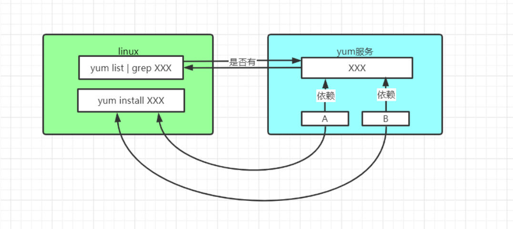

# RPM 和 YUM

## rpm 包管理器

### 基本介绍

rpm 用于互联网下载包的打包及安装工具，它包含在某些 Linux 分发版中。它生成具有.RPM 扩展名的文件。RPM 是 RedHat Package Manager（RedHat 软件包管理工具）的缩写，类似 windows 的 setup.exe，这一文件格式名称虽然打上了 RedHat 的标志，但理念是通用的。

Linux 的分发版本都有采用（suse,redhat, centos 等等），可以算是公认的行业标准了。

### rpm 查询指令

描述：查询已安装的 rpm 列表

语法：`rpm -qa | grep firefox`

### rpm 包名基本格式

firefox-60.2.2-1.el7.centos.x86_64

-   firefox 名称

-   60.2.2-1 版本

-   el7.centos.x86_64 适用的操作系统

-   如果是 i686、i386 表示 32 位系统，noarch 表示通用

### rpm 其他查询指令

```sh
查询所有安装的 rpm 软件包
rpm -qa | more
rpm -qa l grep firefox

查询软件包是否安装
rpm -q firefox

查询软件包信息
rpm -qi firefox

查询软件包中的文件
rpm -ql firefox

查询文件所属的软件包
rpm -qf /etc/passwd
```

### 卸载 rpm 包

描述：卸载 rpm 包

语法：`rpm -e firefox`

细节：如果其他软件包依赖将要卸载的软件包，卸载时则会产生错误信息。如果要强制删除，可以增加参数 `nodeps`，如 `rpm -e --nodeps firefox`

### 安装 rpm 包

描述：安装 rpm 包

语法：`rpm -ivh firefox`

选项：

| 参数      | 含义   |
| --------- | ------ |
| i=install | 安装   |
| v=verbose | 提示   |
| h=hash    | 进度条 |

rpm 包下载地址：[CentOS Mirror](http://mirror.centos.org/centos/7/os/x86_64/Packages/)

## yum 包管理器

### 基本介绍

Yum 是一个 Shell 前端软件包管理器。基于 RPM 包管理，能够从指定的服务器自动下载 RPM 包并且安装，可以`自动处理依赖性关系`，并且一次安装所有依赖的软件包。



### yum 查询指令

描述：查询 yum 服务器是否有需要安装的软件

语法：`yum list | grep firebox`

### 安装 yum 包

描述：安装 yum 包

语法：`yum insatll firefox`

### 卸载 yum 包

描述：卸载 yum 包

语法：`yum remove firefox`

## yum 进阶使用

### yum 查询安装软件指令

```sh
升级系统
yum update

使用 YUM 查找软件包
yum search xxx

列出所有可安装的软件包
yum list

列出所有可更新的软件包
yum list updates

列出所有已安装的软件包
yum install installed

列出所有已安装但不在 Yum Repository 內的软件包
yum list extras

使用 YUM 获取软件包信息
yum info
```

### yum 清除缓存指令

```sh
清除缓存目录(/var/cache/yum)下的软件包
yum clean packages

清除缓存目录(/var/cache/yum)下的 headers
yum clean headers

清除缓存目录(/var/cache/yum)下的软件包及旧的 headers
yum clean all
```

### yum 高级管理技巧

```sh
加快你的 yum 的速度.使用 yum 的扩展插件 yum-fastestmirror
yum -y install yum-fastestmirror

意思是全自动安装，不然安装途中要输入 yes 确认
yum -y
```
