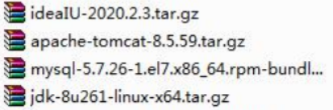

# 配置 Java 环境变量

## 概述

如果需要在 Linux 下进行 JavaEE 的开发，我们需要安装如下软件



## 下载并上传软件

[Idea](https://www.jetbrains.com/zh-cn/idea/download/other.html)

[Tomcat](https://tomcat.apache.org/download-80.cgi)

[JDK8](https://www.oracle.com/jp/java/technologies/javase/javase8-archive-downloads.html)

## 安装 JDK

### 安装步骤

1. mkdir /opt/jdk
2. 通过 xftp6 上传到/opt/jdk 下
3. cd /opt/jdk
4. 解压 tar -zxvf jdk-8u261-linux-x64.tar.gz
5. mkdir /usr/local/java
6. mv /opt/jdk/jdk1.8.0_261 /usr/local/java
7. 配置环境变量的配置文件 vim /etc/profile
8. export JAVA_HOME=/usr/local/java/jdk1.8.0_202
9. export PATH=JAVA_HOME/bin:PATH
10. 让新的环境变量生效 source /etc/profile

### 测试

```sh
java -version
```

## 安装 Tomcat

### 安装步骤

1. 上传安装文件，并解压缩到 /opt/tomcat
2. 进入解压目录/bin，启动 tomcat ./startup.sh
3. 开放端口 8080，回顾 firewall-cmd

```sh
firewall-cmd --permanent --add-port=8080/tcp
firewall-cmd --reload
firewall-cmd --query-port=8080/tcp
```

### 测试

建立文件测试是否安装成功 webapps/ROOT/zn.html


## 安装 Idea

可视化页面

## 安装 MySQL

[安装 MySQL5.7](./53.安装MySQL5.7.md)
