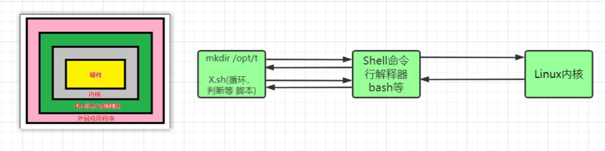
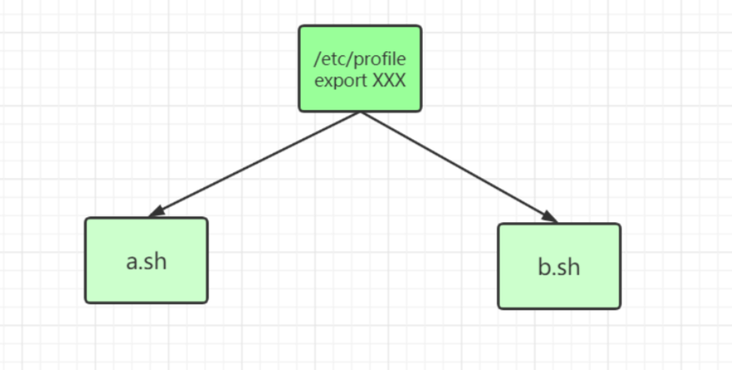
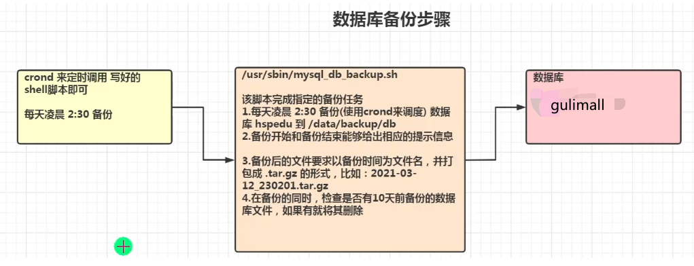

# Shell 编程入门

## Shell 是什么

Shell 是一个命令行解释器，它为用户提供了一个向 Linux 内核发送请求以便运行程序的界面系统级程序，用户可以用 Shell 来启动、挂起、停止甚至是编写一些程序。



## Shell 脚本的执行方式

###  脚本格式要求

1. 脚本以#!/bin/bash 开头
2. 脚本需要有可执行权限

### 编写第一个 Shell 脚本

```sh
# 需求说明:创建一个Shell脚本，输出hello world!

vim hello.sh
# 输入内容，其中第一行表示指定shell命令解释器
#!/bin/bash
echo "hello,world~"

# 执行脚本
# 第一种方式，赋予hello.sh权限执行
chmod -R u+x hello.sh
./hello.sh 
# 第二种方式，sh hello.sh执行
sh hello.sh
```

## Shell 的变量

### Shell 变量介绍

1. Linux Shell 中的变量分为系统变量和用户自定义变量
2. 系统变量：`$HOME、$PWD、$SHELL、$USER`等等，比如：`echo $HOME`
3. 显示当前 shell 中所有变量：set

### Shell 变量的定义

#### 基本语法

1. 定义变量：变量名=值 (注意中间不能有空格)
2. 撤销变量：unset 变量
3. 静态变量：readonly 变量，注意：不能 unset

#### 快速入门

```sh
#!/bin/bash
#案例1:定义变量A
A=100
#输出变量
echo A=$A
#案例2:撤销变量A
unset A
echo A=$A
#案例3:声明静态的变量B=2,不能unset
readonly B=2
echo "B=$B"
unset B
echo B=$B #不可以unset
#案例4:可把变量提升为全局环境变量，可供其他shell程序使用(后面介绍)
```

#### 定义变量的规则

1. 变量名称可以由字母、数字和下划线组成，但是不能以数字开头
2. 等号两侧不能有空格
3. 变量名称一般习惯为大写，这是一个规范，我们遵守即可

#### 将命令的返回值赋给变量

```sh
#反引号，运行里面的命令，并把结果返回给变量A
C=`date`
echo $C
#等价于反引号
D=$(date)
echo $D
```

### 配置环境变量

#### 介绍

比如说配置 Java 环境变量和 Tomcat 环境变量

#### 基本语法

1. export 变量名=变量值 (功能描述：将 shell 变量输出为环境变量/全局变量)
2. source 配置文件 (功能描述：让修改后的配置信息自己生效)
3. echo $变量名 (功能描述：查询环境变量的值)



#### 快速入门

```sh
#在/etc/profile文件中定义TOMCAT_HOME环境变量
vim /etc/profile

#定义java环境变量
export JAVA_HOME=/usr/local/java/jdk1.8.0_202
export PATH=$JAVA_HOME/bin:$PATH
#定义tomcat环境变量
export TOMCAT_HOME=/usr/local/tomcat8/apache-tomcat-8.5.86

#刷新配置文件 注意:在输出TOMCAT_HOME环境变量前，需要让其生效
source /etc/profile

#查看环境变量TOMCAT_HOME的值
echo $TOMCAT_HOME

#在另外一个shell程序中使用TOMCAT_HOME
tom可以使用，没有问题

#shell脚本的多行注释
:<<! 
echo $TOMCAT_HOME
!
```

### 位置参数变量

#### 介绍

当我们执行一个 shell 脚本时，如果希望获取到命令行的参数信息，就可以使用到位置参数变量。

我的理解就是把脚本看做一个函数（方法），执行脚本可以传入参数，通过位置参数变量可以获取参数

#### 基本语法

```sh
$n(功能描述：n为数字，$0代表命令本身，$1-代表第一到第九个参数，十以上的参数，十以上的参数需要用大括号包含，如{10})
$*(功能描述：这个变量代表命令行中所有的参数*把所有的参数看成一个整体)
$@(功能描述：这个变量也代表命令行中所有的参数，不过@把每个参数区分对待)
$#(功能描述：这个变量代表命令行中所有参数的个数)
```

#### 快速入门

```sh
#定义脚本
#!/bin/bash
echo "$0 $1 $2"
echo "$*"
echo "$@"
echo "$#"

#执行脚本
[root@zhongnan shell]# sh shell2.sh 123 312 213
shell2.sh 123 312
123 312 213
123 312 213
3
```

### 预定义变量

#### 介绍

就是 shell 设计者事先已经定义好的变量，可以直接在 shell 脚本中使用。

#### 基本语法

```sh
$$(功能描述:当前进程的进程号(PID) )
$!(功能描述:后台运行的最后一个进程的进程号(PID))
$?(功能描述:最后一次执行的命令的返回状态。如果这个变量的值为0，证明上一个命令正确执行;如果这个变量的值为非0(具体是哪个数，由命令自己来决定)，则证明上一个命令执行不正确了。)
```

#### 快速入门

```sh
#!/bin/bash
echo "当前执行的进程id=$$"
#以后台的方式运行一个脚本，并获取他的进程号
/root/shcode/myshell.sh &
echo "最后一个后台方式运行的子进程id=$!"
echo "执行的结果是$?"

[root@zhongnan shell]# sh shell3.sh
当前执行的进程id=8452
最后一个后台方式运行的子进程id=8453
执行的结果是0
```

## 运算符

### 介绍

学习如何在 shell 中进行各种运算操作

### 基本语法

```sh
#方式一："$((运算式))"
$((运算式))

#方式二："$[运算式]"
$[运算式]

# 方式三：expression表达式 
expr m + n

#注意expr运算符间要有空格，如果需要将结果赋值给某个变量，使用``
expr m - n
expr \*、/、% 分别代表乘、除、取余
```

### 快速入门

```sh
#!/bin/bash
#案例1:计算(2+3)*4的值
RES1=$(((2+3)*4))
echo "RES1=$RES1"

#使用第二种方式
RES2=$[(2+3)*4]
echo "RES2=$RES2"

# 第三种写法
TEMP=`expr 2 + 3`
RES3=`expr $TEMP \* 4`
echo "temp=$TEMP"
echo "RES3=$RES3"

# 案例2：请求出命令行的两个参数[整数]的和
SUM=$[$1+$2]
echo "SUM=$SUM"
```

## 条件判断语句

### 基本语法

```sh
# 就是Java中if语句后面的(),if( condition )
[ condition ] 
```

### 常用判断条件

1. = 字符串比较

2. 两个整数的比较

   -lt 小于

   -le 小于等于

   -eq 等于

   -gt 大于

   -ge 大于等于

   ne 不等于

3. 按照文件权限进行判断

   -r 有读的权限

   -w 有写的权限

   -x 有执行的权限

4. 按照文件类型进行判断

   -f 文件存在并且是一个文件

   -e 文件存在

   -d 文件存在并是一个目录

### 快速入门

```sh
#!/bin/bash
#案例1:"ok"是否等于"ok"
#判断语句：使用=
if [ "ok" = "ok" ]
then
    echo "equal"
fi

#案例2:23是否大于等于22
#判断语句：使用 -ge
if [ 23 -ge 22 ]
then
    echo "大于"
fi

#案例3:/root/shcode/aaa.txt 目录中的文件是否存在并且是一个文件
#判断语句:使用 -f

if [ -f /root/shcode/aaa.txt ]
then
    echo "存在"
fi

#案例
if [ frx ]
then
   echo "true"
fi
```

## 流程控制语句

### if 语句

#### 基本语法

```sh
#注意：[ 条件判断式 ]的中括号和条件判断式之间必须有空格
#单分支
if [ 条件判断式 ]
then
	代码
fi

#多分支
if [ 条件判断式 ]
then
	代码
elif [ 条件判断式 ]
then
	代码
fi
```

#### 应用实例

```sh
#!/bin/bash
#案例：请编写一个shell程序，如果输入的参数，大于等于60，则输出“及格了”，如果小于60，则输出“不及格"
if [ $1 -ge 60 ]
then
    echo "及格了"
elif [ $1 -lt 60 ]
then
    echo "不及格"
fi
```

### case 语句

#### 基本语法

```sh
case $变量名 in
"值1")
#如果变量的值等于值1，则执行程序1
;;
"值2")
#如果变量的值等于值2，则执行程序2
;;
*)
#如果变量的值都不是以上的值，则执行此程序
;;
esac
```

#### 应用实例

```sh
#!/bin/bash
#案例1:当命令行参数是1时，输出"周一",是2时，就输出"周二",其他情况输出"other“
case $1 in
"1")
echo "周一"
;;
"2")
echo "周二"
;;
*)
echo "other..."
;;
esac
```

### for 语句

#### 基本语法

```sh
#格式一
for 变量 in 值1 值2 值3...
do
程序/代码
done

#格式二
for(( 初始值;循环控制条件;变量变化 ))
do
程序/代码
done
```

#### 应用实例

##### 格式一

```sh
#!/bin/bash
# 案例1：打印命令输入的参数[这里可以看出$* 和 $@ 的区别]
# 注意$*是把输入的参数，当做一个整体，所以，只会输出一句
for i in "$*"
do
    echo "num is $i"
done
# 使用$@来获取输入的参数，注意，这时是分别对待，所以有几个参数，就输出几句
echo "========================================"
for j in "$@"
do
    echo "num is $j"
done

#结果
[root@zhongnan shell]# sh shell8.sh 1 2 3
num is 1 2 3
========================================
num is 1
num is 2
num is 3
```

##### 格式二

```sh
#!/bin/bash
#案例1：从1加到100的值输出显示,把100做成变量
#定义一个变量 SUM
SUM=0
for(( i=1; i<=$1; i++ ))
do
    SUM=$[$SUM+$i]
done
echo "SUM=$SUM"
```

### while 语句

#### 基本语法

```sh
# 注意:while和中括号有空格，条件判断式和中括号也有空格
while [ 条件判断式 ]
do
    程序/代码
done
```

#### 应用实例

```sh
#!/bin/bash
#案例1：从命令行输入一个数n,统计从1+...+n的值是多少
SUM=0
i=0
while [ $i -le $1 ]
do
    SUM=$[$SUM+$i]
    #i自增
    i=$[$i+1]
done
echo "执行结果=$SUM"
```

## read 读取控制台输入

### 基本语法

read（选项）（参数）

- 选项

  -p：指定读取值时的提示符

  -t：指定读取值时等待的时间（秒），如果没有在指定的时间内输入，就不再等待了

- 参数

  变量：指定读取值的变量名

### 应用实例

```sh
#!/bin/bash
#案例1:读取控制台输入一个NUM1值
read -p "请输入一个数NUM1=" NUM1
echo "你输入的NUM1=$NUM1"

#案例2:读取控制台输入一个NUM2值，在10秒内输入
read -t 10 -p "请输入一个数NUM2=" NUM2
echo "你输入的NUM2=$NUM2"
```

## 函数

### 介绍

shell 编程和其它编程语言一样，有系统函数，也可以自定义函数。系统函数中，我们这里就介绍两个。

### 系统函数

只讲了基本的 2 个内置系统函数

#### basename

返回完整路径最后 / 的后面部分，常用于获取文件名

##### 基本语法

```sh
#(功能描述:basename命令会删掉所有的前缀包括最后一个(/)字符，然后将字符串显示出来)
basename [pathname] [suffix]
```

##### 应用实例

```sh
#案例1:请返回/home/aaa/test.txt的"test.txt”部分
basename /home/aaa/test.txt

#案例2:请返回/home/aaa/test.txt的"test”部分
basename /home/aaa/test.txt .txt
```

#### dirname

返回完整路径最后 / 的前面的部分，常用于返回路径部分

##### 基本语法

```sh
#(功能描述:从给定的包含绝对路径的文件名中去除文件名(非目录的部分),然后返回剩下的路径(目录的部分))
dirname 文件绝对路径 
```

##### 应用实例

```sh
#案例1:请返回/home/aaa/test.txt的/home/aaa
dirname /home/aaa/test.txt
```

### 自定义函数

#### 基本语法

```sh
function 函数名(){
	函数体
}
```

#### 应用实例

```sh
#!/bin/bash
#案例1:计算输入两个参数的和(动态的获取)
#定义函数 getSum
function getSum(){
    SUM=$[$n1+$n2]
    echo "和是=$SUM"
}
#控制台交互：输入两个值
read -p "请输入一个数n1=" n1
read -p "请输入一个数n2=" n2
# 调用自定义函数
getSum $n1 $n2
```

## Shell 编程案例数据库备份

### 需求分析

```sh
每天凌晨2:30备份数据库gulimall到/data/backup/db
备份开始和备份结束能够给出相应的提示信息
备份后的文件要求以备份时间为文件名，并打包成.tar.gz 的形式，比如:2021-03-12_230201.tar .gz
在备份的同时，检查是否有10天前备份的数据库文件，如果有就将其删除。
画一个思路分析图
```



```sh
#先创建脚本文件,并cd到目录中
touch /usr/sbin/mysql_db_backup.sh
chmod -R 755 mysql_db_backup.sh

#编写脚本

#!/bin/bash
#备份目录
BACKUP=/data/backup/db
#当前时间
DATETIME=$(date +%Y-%m-%d_%H%M%S)
echo "$DATETIME"
# 数据库的地址
HOST=localhost
#数据库的用户名
DB_USER=root
#数据库密码
DB_PW=jinmunan123456
#备份的数据库名
DATABASE=gulimall
#创建备份目录,下面这句话的意思是，如果/data/backup/db/2023-3-6 13:38:59不存在，那么就创建备份文件
[ ! -d "${BACKUP}/${DATETIME}" ] && mkdir -p "${BACKUP}/${DATETIME}"

#备份数据库
mysqldump -u${DB_USER} -p${DB_PW} --host=${HOST} -q -R --databases ${DATABASE} | gzip > ${BACKUP}/${DATETIME}/$DATETIME.sql.gz

#将文件处理成 tar.gz
cd ${BACKUP}
tar -zcvf $DATETIME.tar.gz ${DATETIME}
# 删除对应的备份目录
rm -rf ${BACKUP}/${DATETIME}

#删除10天前的备份文件
find ${BACKUP} -atime +10 -name "*.tar.gz" -exec rm -rf {} \;
echo "备份数据库${DATABASE} 成功~"

#定时任务
crontab -e
30 2 * * * /usr/sbin/mysql_db_backup.sh
```

### 备份数据库和还原数据库

```sh
# 备份数据库
mysqldump -u root -p 123456 test > /home/bak/2015-09-10/test.sql

# 还原数据库
mysql -u root -p 123456 test < /home/bak/2015-09-10/test.sql

# 还原数据库第二种方式
source /home/bak/2015-09-10/test.sql
```

[Linux 的三种时间](https://blog.csdn.net/ten_sory/article/details/88913157)
