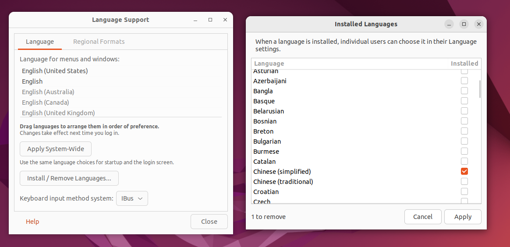
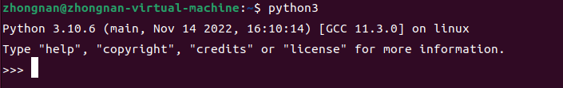

# Ubuntu 介绍.md

## Ubuntu 基本介绍

Ubuntu (友帮拓、优般图、乌班图) 是一个以桌面应用为主的开源 GNU/Linux 操作系统，Ubuntu 是基于 GNU/Linux，支持 x86、amd64 (即 x64) 和 ppc 架构，由全球化的专业开发团队 (CanonicalLtd) 打造的。

Ubuntu和CentOS都是基于GNU/Linux内核的，因此基本使用和CentOS是几乎一样的，它们的各种指令可以通用，在学习和使用Ubuntu的过程中，会发现各种操作指令在前面学习CentOS都使用过。只是界面和预安装的软件有所差别。

Ubuntu 下载地址：http://cn.ubuntu.com/download/

## 设置 Ubuntu 支持中文

默认安装的 ubuntu 中只有英文语言，因此是不能显示汉字的。要正确显示汉字，需要安装中文语言包。安装中文支持步骤：

1. 单击左侧图标栏打开 Language Support 菜单，点击打开 Language Support(语言支持）选项卡
2. 点击Install/Remove Languages，在弹出的选项卡中下拉找到 Chinese(Simplified)，即中文简体，在后面的选项框中打勾。然后点击 Apply Changes 提交，系统会自动联网下载中文语言包。〈保证 ubuntu 是联网的)
3. 这时“汉语〈中国)”在最后一位因为当前第一位是”English”，所以默认显示都是英文。我们如果希望默认显示用中文，则应该将“汉语（中国)”设置为第一位。设置方法是拖动，鼠标单击“汉语 (中国)”，当底色变化 (表示选中了）后，按住鼠标左键不松手，向上拖动放置到第一位
4. 设置后不会即刻生效，需要下一次登录时才会生效



## Ubuntu 的 root 用户

pwd：jinmunan123456

### 基本介绍

1. 安装 ubuntu 成功后，都是普通用户权限，并没有最高 root 权限，如果需要使用 root 权限的时候，通常都会在命令前面加上 sudo。
2. 我们一般使用 su 命令来直接切换到 root 用户的，但是如果没有给 root 设置初始密码，就会抛出 su : Authenticationfailure 这样的问题。所以，我们只要给 root 用户设置一个初始密码就好了。

### 给 root 用户设置密码并使用

1. 输入 sudo passwd 命令，设定 root 用户密码。
2. 设定 root 密码成功后，输入 su 命令。并输入刚才设定的 root 密码，就可以切换成 root 了。提示符 s 代表一般用户，提示符#代表 root 用户。
3. 以后就可以使用 root 用户了
4. 输入 exit 命令，退出 root 并返回一般用户

## Ubuntu 下开发 Pyhton

安装好 Ubuntu 后，默认就已经安装好 Python 的开发环境。



```python
#编写 python 代码
vim hello.py

print("Hello World")

#执行 python 代码
python3 hello.py
```


