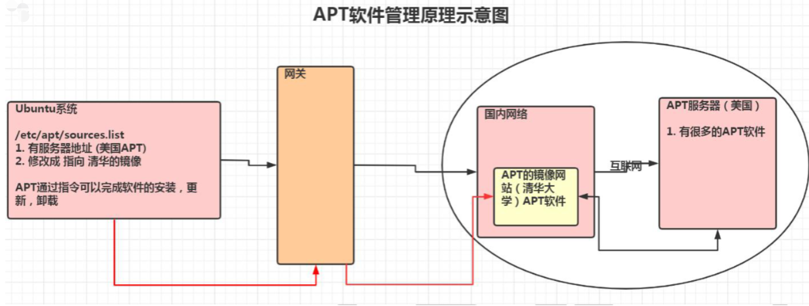
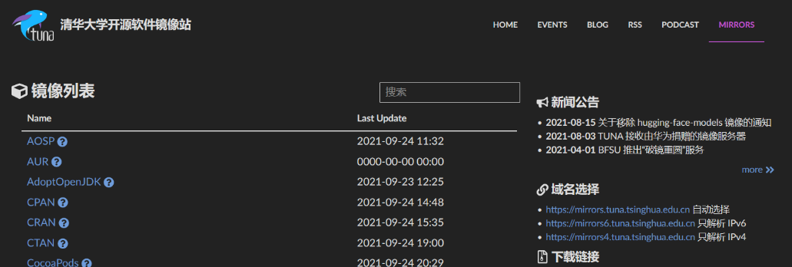
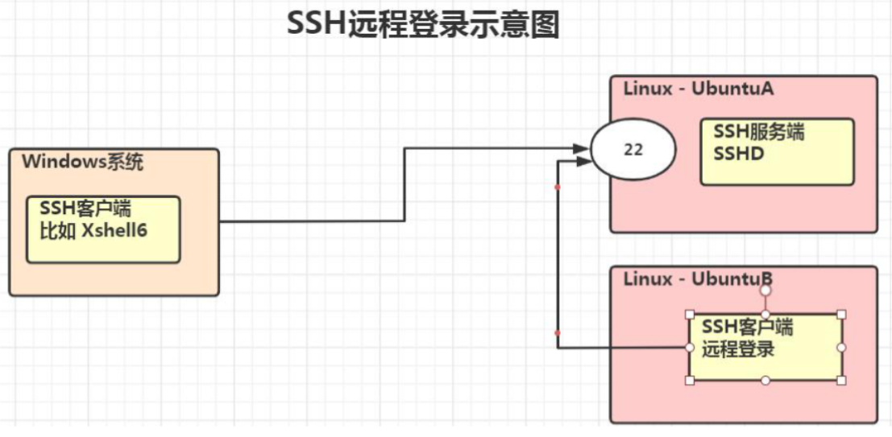
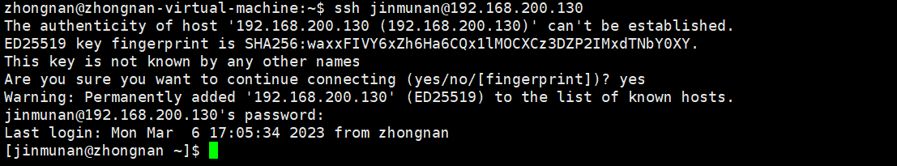

# APT 软件管理和远程登录

## apt 介绍

apt 是 Advanced Packaging Tool 的简称，是一款安装包管理工具。在 Ubuntu 下，我们可以使用 apt 命令进行软件包的安装、删除、清理等，类似于 Windows 中的软件管理工具。

unbuntu 软件管理的原理示意图：



## apt 相关指令

```sh
sudo apt-get update 更新源

sudo apt-get install package 安装包

sudo apt-get remove package 删除包

sudo apt-cache search package 搜索软件包

sudo apt-cache show package 获取包的相关信息，如说明、大小、版本等

sudo apt-get install package --reinstall 重新安装包

sudo apt-get -f install 修复安装

sudo apt-get remove package --purge 删除包，包括配置文件等

sudo apt-get build-dep package 安装相关的编译环境

sudo apt-get upgrade 更新已安装的包

sudo apt-get dist-upgrade 升级系统

sudo apt-cache depends package 了解使用该包依赖那些包

sudo apt-cache rdepends package 查看该包被哪些包依赖

sudo apt-get source package 下载该包的源代码
```

## 更新 Ubuntu 软件下载地址

### 1、寻找国内镜像源

[清华大学开源软件镜像站](https://mirrors.tuna.tsinghua.edu.cn/)

所谓的镜像源：可以理解为提供下载软件的地方，比如 Android 手机上可以下载软件的安卓市场；iOS 手机上可以下载软件的 AppStore



### 2、备份 Ubuntu 默认的源地址

```sh
sudo cp /etc/apt/sources.list /etc/apt/sources.list.backup
```

### 3、更新源服务器列表

[清华大学源列表](https://mirrors.tuna.tsinghua.edu.cn/help/ubuntu/)


```sh
# 清空源服务器列表
sudo echo '' > /etc/apt/sources.list

# 将清华大学的镜像服务器填写进去
vim /etc/apt/sources.list

# 复制镜像网站的地址，拷贝到 sources.list 文件
# 默认注释了源码镜像以提高 apt update 速度，如有需要可自行取消注释
deb https://mirrors.tuna.tsinghua.edu.cn/ubuntu/ jammy main restricted universe multiverse
# deb-src https://mirrors.tuna.tsinghua.edu.cn/ubuntu/ jammy main restricted universe multiverse
deb https://mirrors.tuna.tsinghua.edu.cn/ubuntu/ jammy-updates main restricted universe multiverse
# deb-src https://mirrors.tuna.tsinghua.edu.cn/ubuntu/ jammy-updates main restricted universe multiverse
deb https://mirrors.tuna.tsinghua.edu.cn/ubuntu/ jammy-backports main restricted universe multiverse
# deb-src https://mirrors.tuna.tsinghua.edu.cn/ubuntu/ jammy-backports main restricted universe multiverse
# deb https://mirrors.tuna.tsinghua.edu.cn/ubuntu/ jammy-security main restricted universe multiverse
# # deb-src https://mirrors.tuna.tsinghua.edu.cn/ubuntu/ jammy-security main restricted universe multiverse
deb http://security.ubuntu.com/ubuntu/ jammy-security main restricted universe multiverse
# deb-src http://security.ubuntu.com/ubuntu/ jammy-security main restricted universe multiverse
# 预发布软件源，不建议启用
# deb https://mirrors.tuna.tsinghua.edu.cn/ubuntu/ jammy-proposed main restricted universe multiverse
# # deb-src https://mirrors.tuna.tsinghua.edu.cn/ubuntu/ jammy-proposed main restricted universe multiverse
```

### 4、更新源

```sh
sudo apt-get update
```

## Ubuntu 软件安装测试

```sh
# 案例说明:使用apt完成安装和卸载vim软件，并查询vim软件的信息:(因为使用了镜像网站，速度很快)

# 删除
sudo apt-get remove vim 
# 安装
sudo apt-get install vim
# 获取软件信息
sudo apt-cache show vim
```

## 远程登录 Ubuntu

### ssh 介绍

SSH 为 Secure Shell 的缩写，由 IETF 的网络工作小组 (Network Working Group) 所制定；SSH 为建立在应用层和传输层基础上的安全协议。

SSH 是目前较可靠，专为远程登录会话和其他网络服务提供安全性的协议。常用于远程登录。几乎所有 UNIX/LInux 平台都可运行 SSH。

使用 SSH 服务，需要安装相应的服务器和客户端。客户端和服务器的关系：如果，A 机器想被 B 机器远程控制，那么，A 机器需要安装 SSH 服务器，B 机器需要安装 SSH 客户端。

和 CentOS 不一样，Ubuntu 默认没有安装 SSHD 服务 (使用 netstat 指令查看：如果 netstat 显示没有安装，执行 apt install net-tools)，因此，我们不能进行远程登录。

### 原理图



### 安装 SSH 和启用

```sh
# 执行上面指令后，在当前这台Linux上就安装了SSH服务端和客户端。
sudo apt-get install openssh-server

# 执行上面的指令，就启动了 sshd 服务。会监听端口22
service sshd restart
```

### 在Windows使用XShell7/Xftp7登录Ubuntu

前面我们已经安装了 XShell7，直接使用即可。

### 从一台 linux 系统远程登陆另外一台 linux 系统

在创建服务器集群时，会使用到该技术

```sh
ssh 用户名@IP

# 例如去访问本地jinmunan的CentOS账户
ssh jinmunan@192.168.200.130

使用ssh 访问，如访问出现错误。可查看是否有该文件 ～/.ssh/known_ssh 尝试删除该文件解决，一般不会有问题
```


