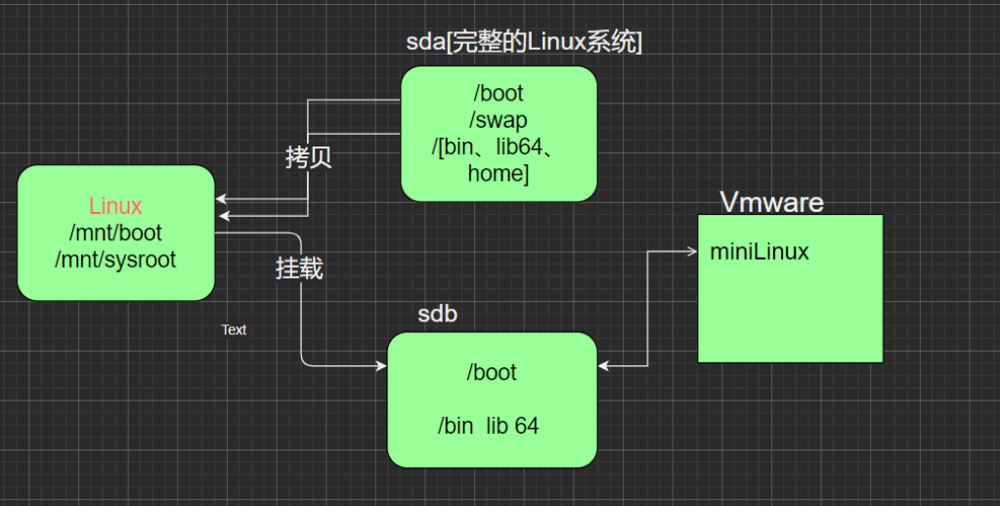

# 定制 Linux

## 基本介绍

通过裁剪现有 Linux 系统 (CentOS7.6)，创建属于自己的 Min Linux 小系统，可以加深我们对 Linux 的理解。利用 CentOS7.6 搭建一个小小 Linux 系统。

## 基本原理

制作 Linux 小系统之前，再了解一下 Linux 的启动流程：

1. 首先 Linux 要通过自检，检查硬件设备有没有故障
2. 如果有多块启动盘的话，需要在 BIOS 中选择启动磁盘
3. 启动 MBR 中的 bootloader 引导程序
4. 加载内核文件
5. 执行所有进程的父进程 systemd
6. 欢迎界面

在 Linux 的启动流程中，加载内核文件时关键文件：

1. kernel 文件：vmlinuz-3.10.0-957.el7.x86_64
2. initrd 文件：initramfs-3.10.0-957.el7.x86_64.img

## 思路分析

1. 在现有的 Linux 系统 (CentOS7.6) 上加一块硬盘/dev/sdb，在硬盘上分两个分区，一个是/boot，一个是/，并将其格式化。需要明确的是，现在加的这个硬盘在现有的 Linux 系统中是/dev/sdb，但是，当我们把东西全部设置好时，要把这个硬盘拔除，放在新系统上，此时，就是/dev/sda
2. 在/dev/sdb硬盘上，将其打造成独立的Linux系统，里面的所有文件是需要拷贝进去的
3. 作为能独立运行的 Linux 系统，内核是一定不能少，要把内核文件和 initramfs 文件也一起拷到/dev/sdb 上
4. 以上步骤完成，我们的自制 Linux 就完成，创建一个新的 linux 虛拟机，将其硬盘指向我们创建的硬盘，启动即可
5. 示意图

## 操作步骤

[视频教程](https://www.bilibili.com/video/BV1Sv411r7vd?p=127&spm_id_from=pageDriver&vd_source=27e6ff4366a111178521f5c7e99fc284)

