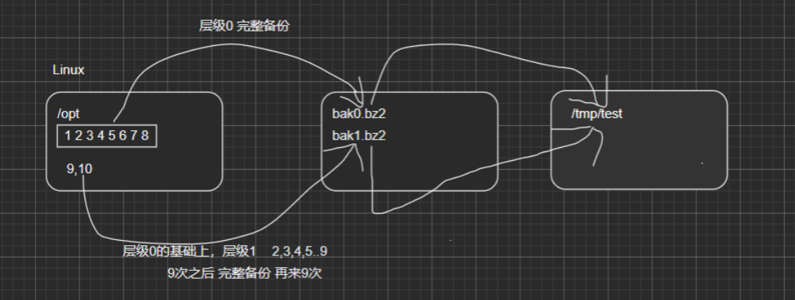

# 备份和恢复

##  基本介绍

实体机无法做快照，如果系统出现异常或者数据损坏，后果严重，要重做系统，还会造成数据丢失。所以我们可以使用备份和恢复技术

linux 的备份和恢复很简单，有两种方式：

1. 把需要的文件 (或者分区) 用 TAR 打包就行，下次需要恢复的时候，再解压开覆盖即可
2. 使用 dump 和 restore 命令

增量备份示意图



## 安装 dump 和 restore

```sh
yum -y install dump
yum -y install restore
```

## 使用 dump 完成备份

dump 支持分卷和增量备份 (所谓增量备份是指备份上次备份后修改/增加过的文件，也称差异备份)

```sh
dump [-cu] [-123456789] [-f<备份后文件名>] [-T<日期>] [ 目录或文件系统] dump []-wW

-c:创建新的归档文件，并将由一个或多个文件参数所指定的内容写入归档文件的开头。

-0123456789:备份的层级。0为最完整备份，会备份所有文件。若指定0以上的层级，则备份至上一次备份以来修改或新增的文件,到9后，可以再次轮替

-f<备份后文件名>:指定备份后文件名

-j:调用bzlib库压缩备份文件，也就是将备份后的文件压缩成bz2格式，让文件更小

-T<日期>:指定开始备份的时间与日期

-u:备份完毕后，在/etc/dumpdares中记录备份的文件系统，层级，日期与时间等。

-t:指定文件名，若该文件已存在备份文件中，则列出名称

-W:显示需要备份的文件及其最后一次备份的层级，时间，日期。

-w:与-W类似，但仅显示需要备份的文件。
```

如果是重要的备份文件，比如数据区，建议将文件上传到其它服务器保存，不要将鸡蛋放在同在一个篮子。

### 应用实例

```sh
将/boot分区所有内容备份到/opt/boot.bak0.bz2文件中，备份层级为“0”
dump -0uj -f /opt/boot.bak0.bz2 /boot

yum y install xfsdump
xfsdump -0uj -f /opt/boot.bak0.bz2 /boot

测试增量备份
xfsdump -1uj -f /opt/boot.bak1.bz2 /boot
```

报错：Bad magic number in super-block while opening filesystem，发现分区是使用的默认分区 xfs

https://blog.csdn.net/tang3827738w/article/details/94059997

## 使用 restore 完成恢复

restore 命令用来恢复已备份的文件，可以从 dump 生成的备份文件中恢复原文件

```sh
restore [模式选项] [选项]

说明下面四个模式，不能混用，在一次命令中，只能指定一种。
-C :使用对比模式，将备份的文件与已存在的文件相互对比
-i:使用交互模式，在进行还原操作时，restore指令将依序询问用户
-r:进行还原模式
-t:查看模式，看备份文件有哪些文件

选项
-f<备份设备>:从指定的文件中读取备份数据，进行还原操作

# 还原上述的备份
restore -t -f boot.bak0.bz2
```

