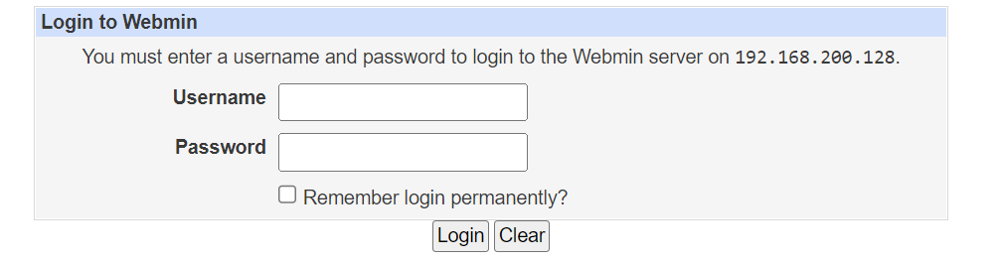
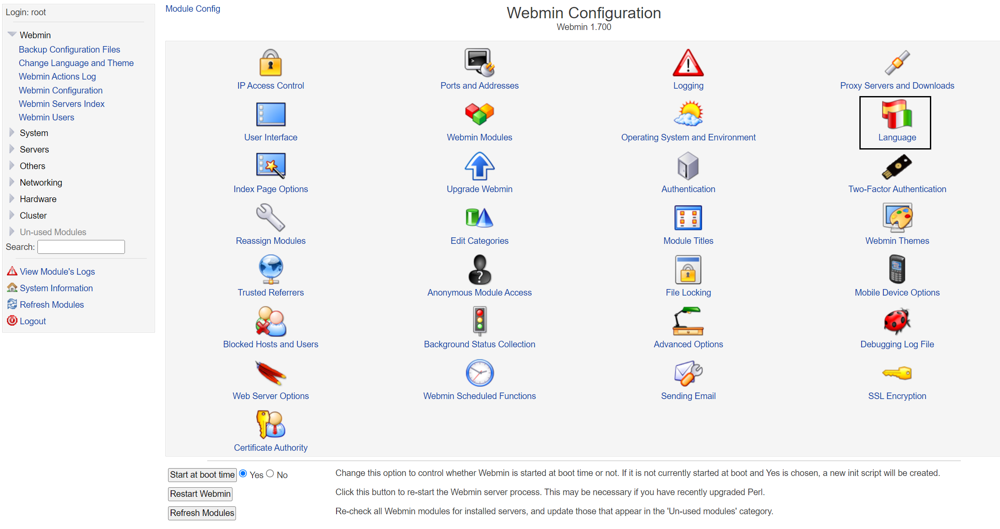
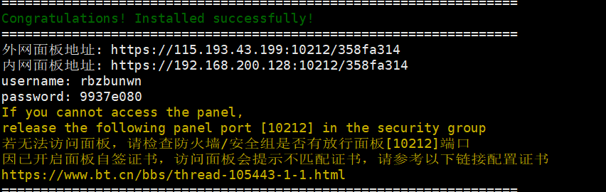

# Webmin 和 BT 运维工具

## Webmin

### 基本介绍

Webmin是功能强大的基于Web的Unix/linux系统管理工具。管理员通过浏览器访问Webmin的各种管理功能并完成相应的管理操作。除了各版本的linux以外还可用于: AIX、HPUX、Solaris、Unixware、Irix 和 FreeBSD 等系统。

### 安装 Webmin

```sh
# 下载
wget http://download.webmin.com/download/yum/webmin-1.700-1.noarch.rpm

# 安装
rpm -ivh webmin-1.700-1.noarch.rpm

# 重置密码
/usr/libexec/webmin/changepass.pl /etc/webmin root 123456

# 修改webmin服务的端口号(默认是10000出于安全目的)
# 将port= 10000修改为其他端口号，如port=16666
vim /etc/webmin/miniserv.conf 

# 重启webmin
/etc/webmin/restart
/etc/webmin/start
/etc/webmin/stop

# 配置防火墙开放16666端口
firewall-cmd --zone=public --add-port=16666/tcp --permanent
# 更新防火墙配置
firewall-cmd --reload 
# 查看已经开放的端口号
firewall-cmd --zone=public --list-ports

# 登录webmin
```

### 简单使用演示



修改语言设置，IP 访问控制，查看进程，修改密码，任务调度，mysql 等



## BT 宝塔

[宝塔官网](https://www.bt.cn/btcode.html)

### 基本介绍

bt 宝塔 Linux 面板是提升运维效率的服务器管理软件，支持一键 LAMP/LNMP/集群/监控/网站/FTP/数据库/JAVA等多项服务器管理功能。

### 安装和使用

```sh
# 安装宝塔
yum install -y wget && wget -O install.sh http://download.bt.cn/install/install_6.0.sh && sh install.sh
# 安装成功后控制台会显示登录地址，账户密码，复制浏览器打开登录
```



### 使用介绍

可以登录终端，配置，快捷安转运行环境和系统工具，添加计划任务脚本等

### 找回密码

```sh
bt default
```

### 宝塔指令指南

https://www.bt.cn/btcode.html
