# 安装 Centos7

## CentOS7 下载

[阿里云镜像地址](http://mirrors.aliyun.com/centos/7.9.2009/isos/x86_64/)

下载完整版或者精简版

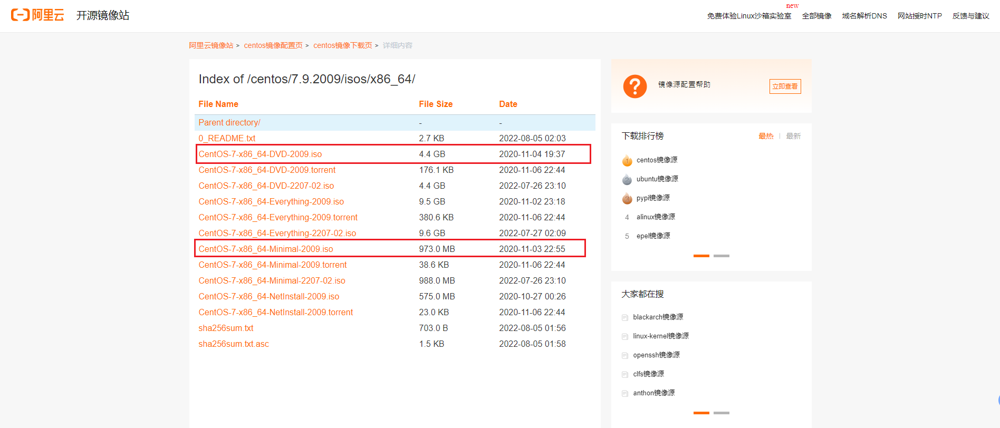

## CentOS7 安装流程

### 新建虚拟机

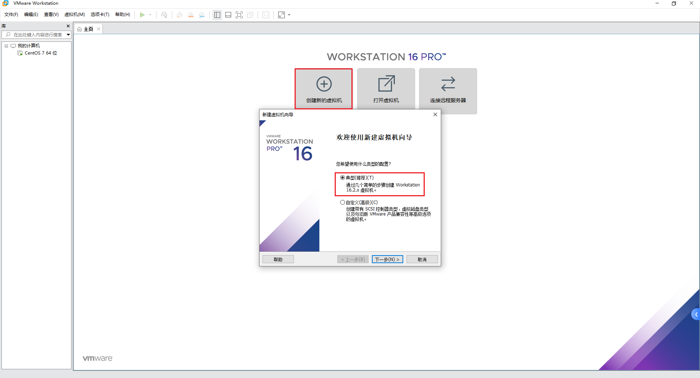

### 选择稍后安装

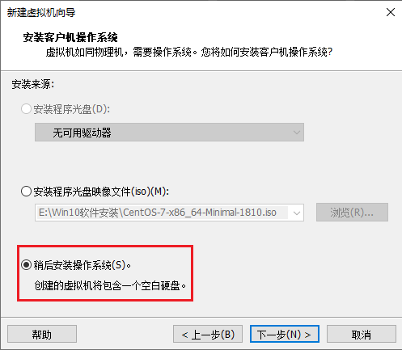

### 选择 CentOS 7 64 位

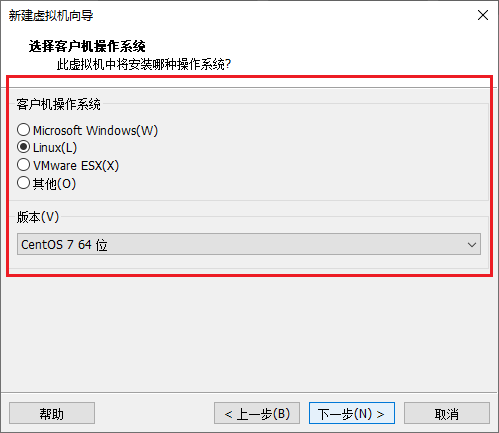

### 选择安装虚拟机的位置

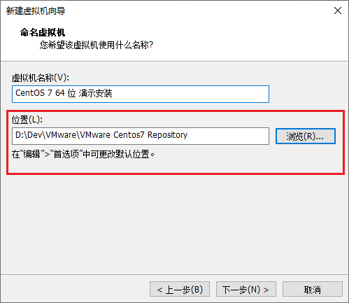

### 指定硬盘大小

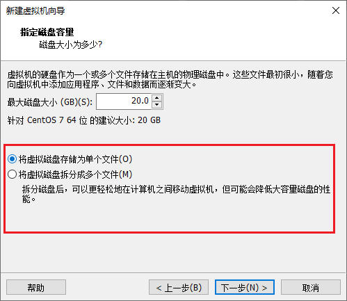

### 自定义硬件

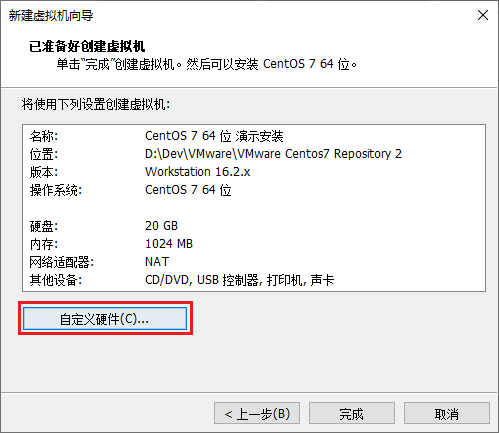

### 安装镜像

选择镜像和网络设置为 NAT

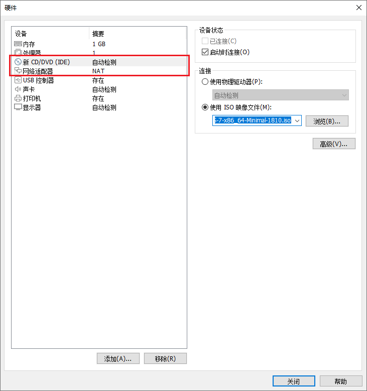

### 开启虚拟机

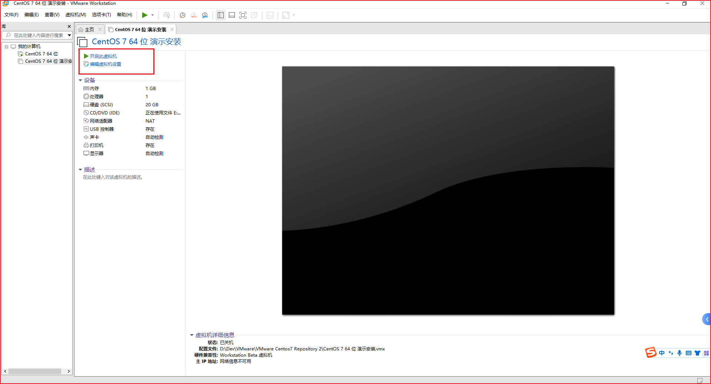

### 安装镜像

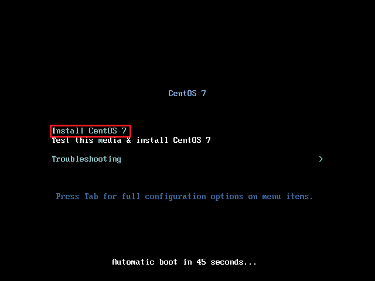

### 选择中文

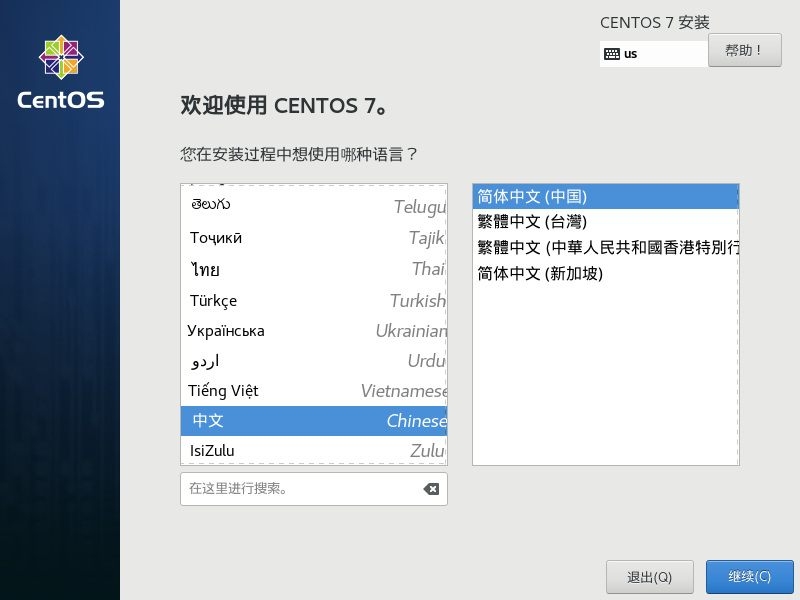

### 配置时间

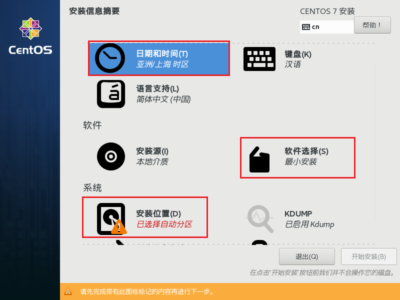

### 配置最小安装

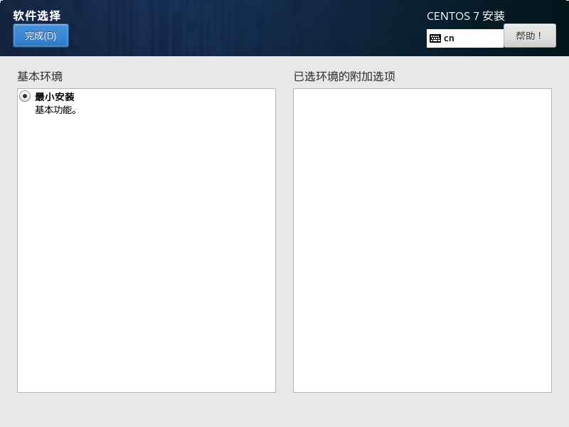

### 配置安装位置

选择我要配置分区后点击完成

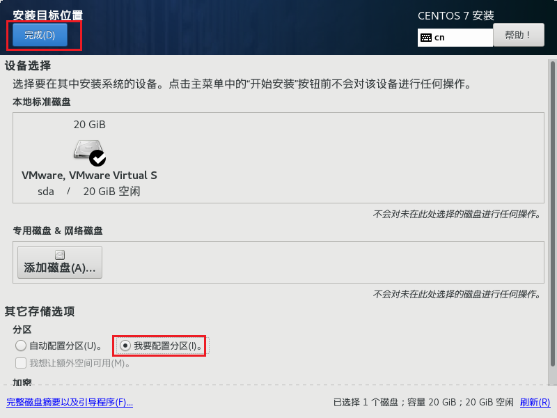

### 手动分区

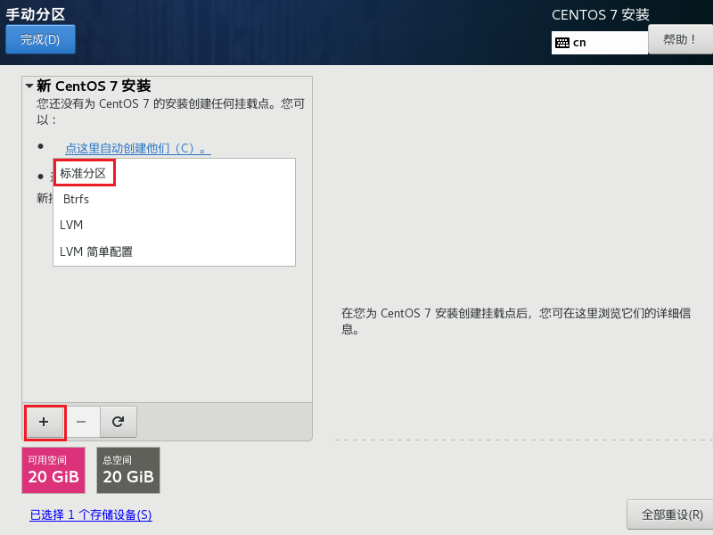

分别创建三个分区：**/boot 区、swap 交换分区、根分区/**

-   添加 /boot 分区，用来放启动文件，大小 300MB，然后点击“添加挂载点”。
-   添加 swap 分区，这个是交换分区，一般情况是物理内存的 2 倍大小，用于物理内存不足时使用，可能造成系统不稳定，所以看情况，可以设置小一点，甚至设置为 0MB，这里我设置为 512MB，然后点击”添加挂载点“。
-   增加根分区，表示所有空间大小，这里不填写大小，即默认剩余的空间都给根分区，然后点击”添加挂载点“。

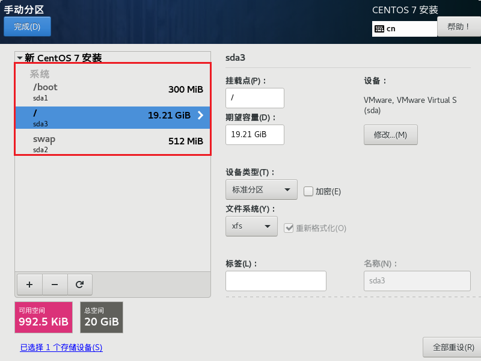

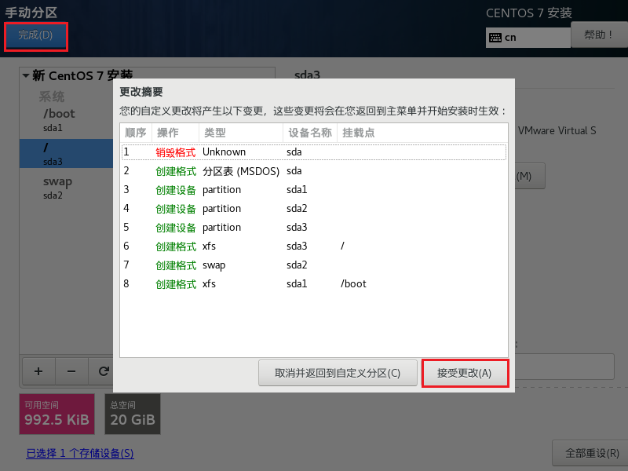

### 开始安装

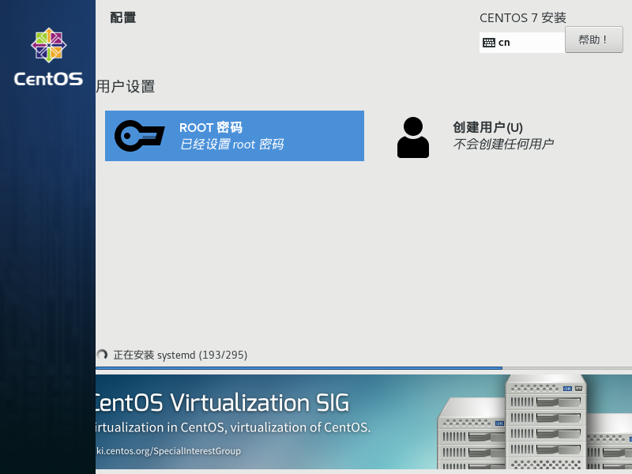

### 设置密码

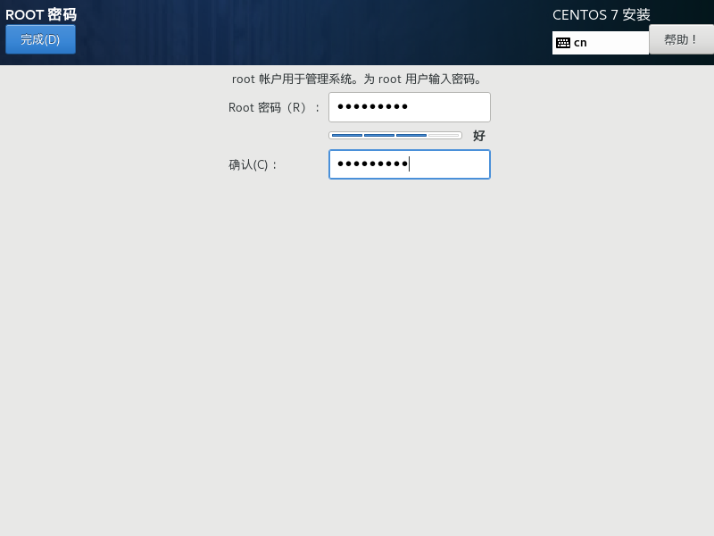

### 创建用户

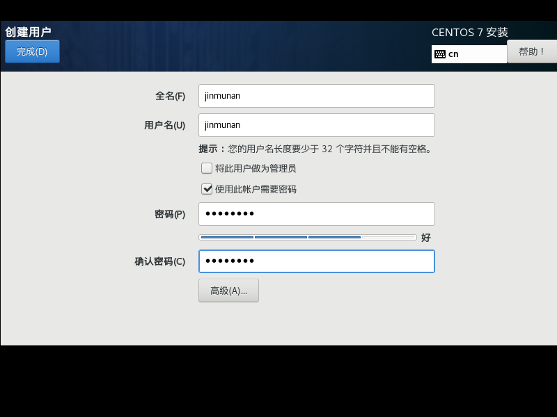

### 重启

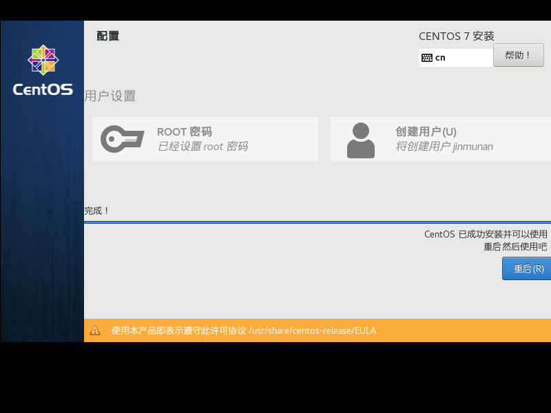

### 登录页面

## CentOS7 网络配置

### 查看网络配置

点击编辑，虚拟网络编辑器，如果需要管理员运行则点击管理员运行。

默认配置如下，因为之前网络配置为 NAT 模式，所以这里不需要修改。

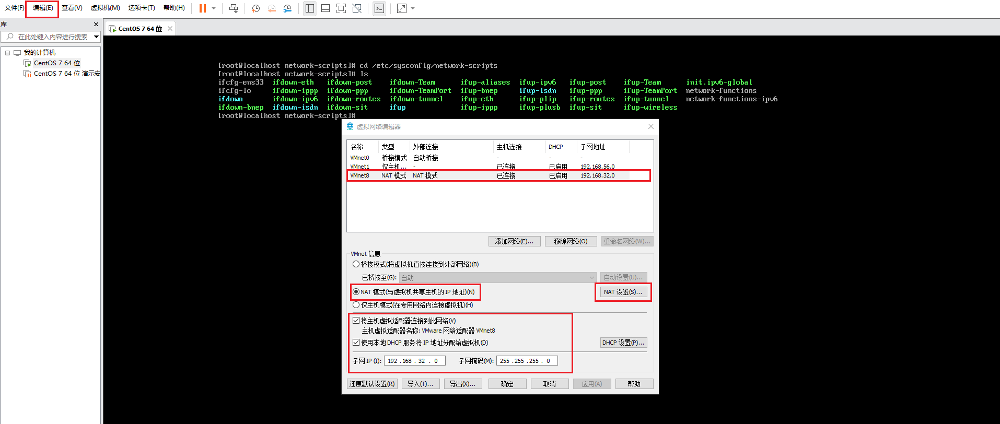

### 启动虚拟机

进入网络配置文件目录：`cd /etc/sysconfig/network-scripts/`，并且用 ls 命令查看是否有 ifcfg-xxx 名称的配置文件（ifcfg-lo 除外）。

### 编辑 ifcfg-ens33 文件

-   vi ifcfg-ens33
-   按 i 进入 insert 编辑模式，将 BOOTPROTO 设为 dhcp，将 ONBOOT 设为 yes。
-   按下 Esc 进入命令模式输入:wq 保存并退出。

### 重启生效网卡

配置完成之后输入：service network restart，重启网卡让网卡设置生效，之后就可以上网了。

### 查看网络是否正常

`ip addr` 可以查看 ip 地址

`ping www.baidu.com` 可以查看网络是否正常

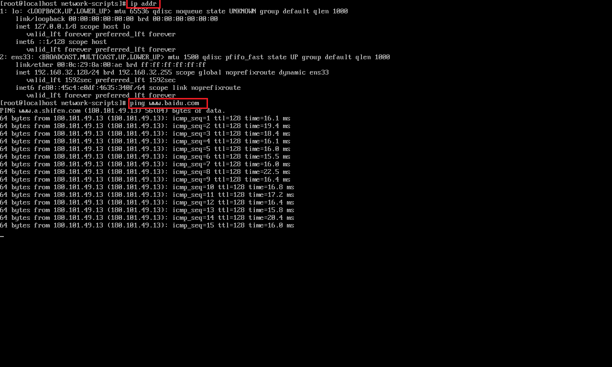

## 远程连接工具连接

通过 Xshell7 工具连接 CentOS7 进行操作。
