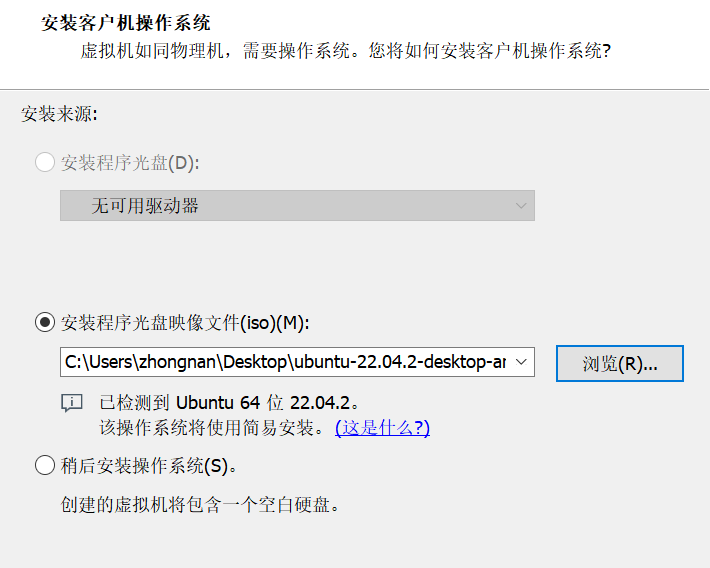
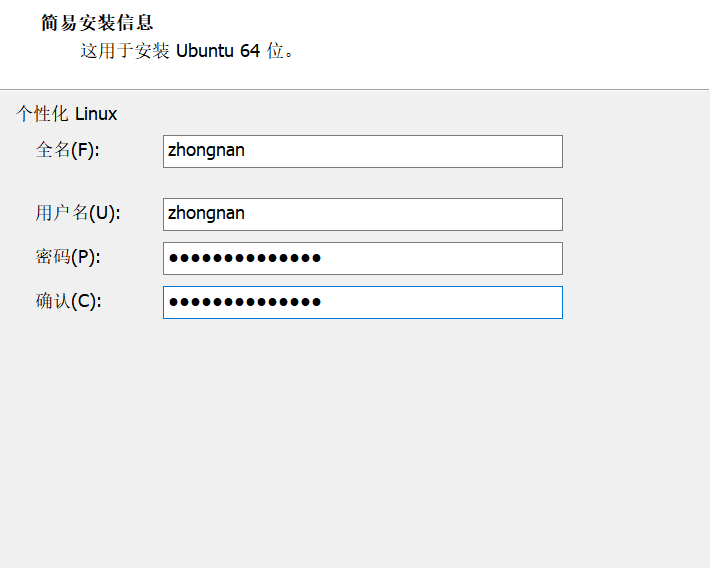
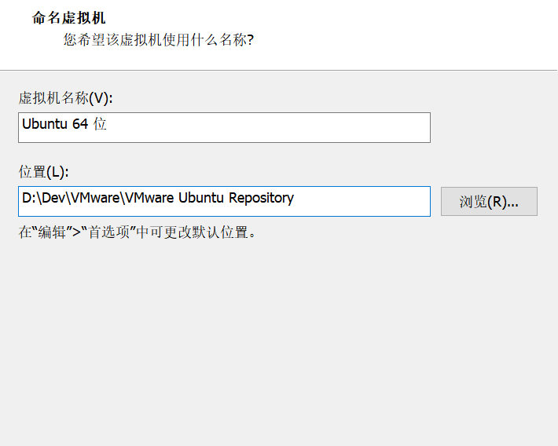
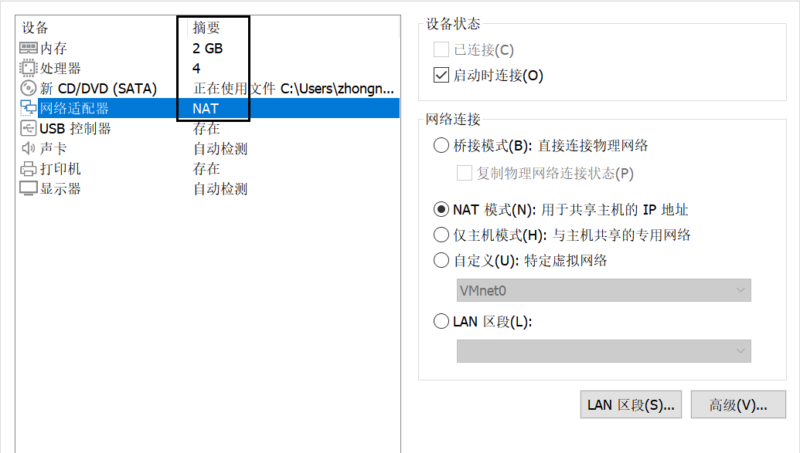
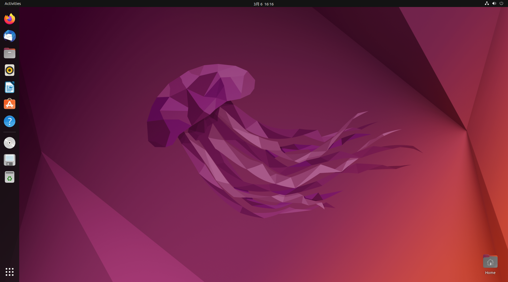

# 安装 Ubuntu

## Ubuntu 下载地址

Ubuntu 下载地址：http://cn.ubuntu.com/download/

## Ubuntu 安装步骤

Ubuntu 的安装非常简单，参照 CentOS 的安装流程走就行。

### 1、导入 ISO 镜像文件

### 2、输入基本信息

### 3、选择系统存储位置

### 4、硬件配置

### 5、等待安装结束

按照默认配置一路安装。

