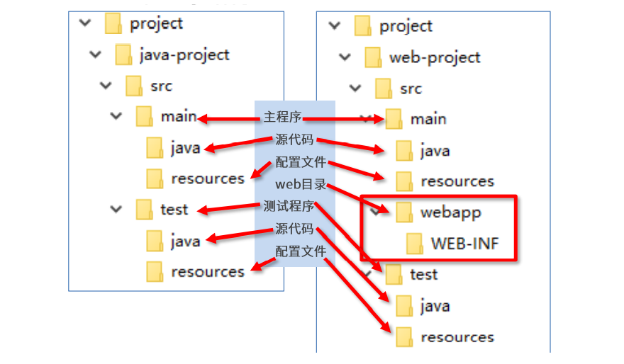
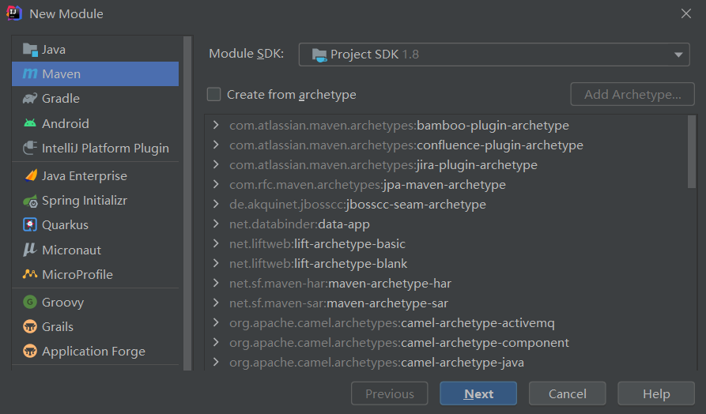
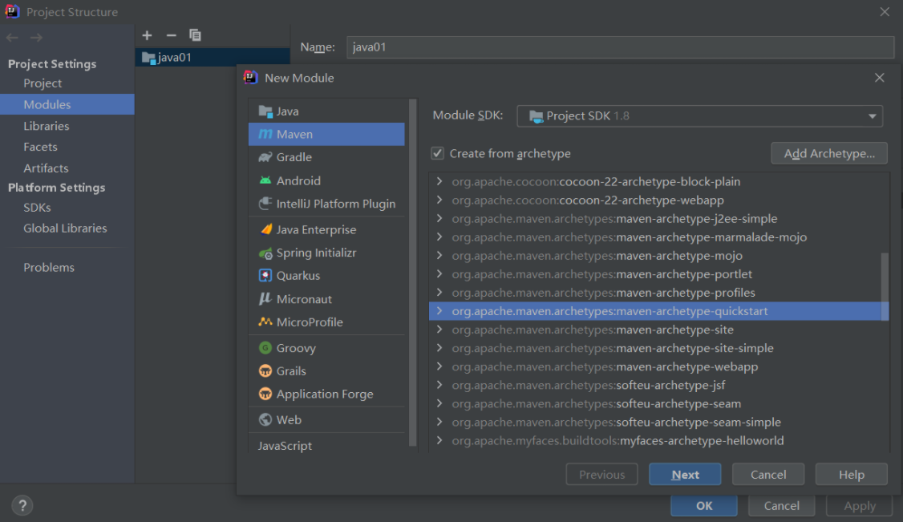
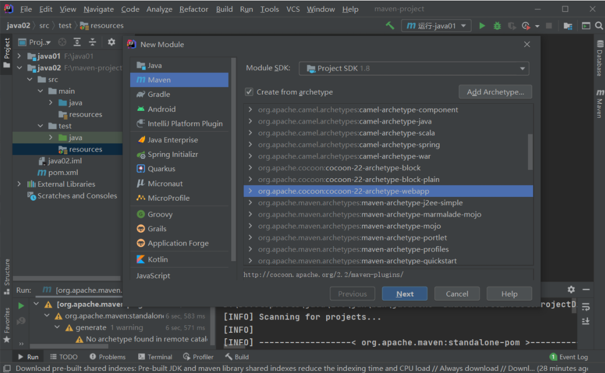
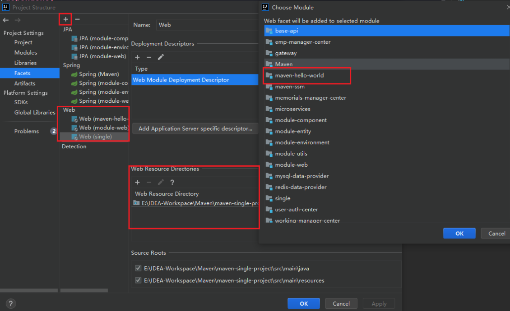
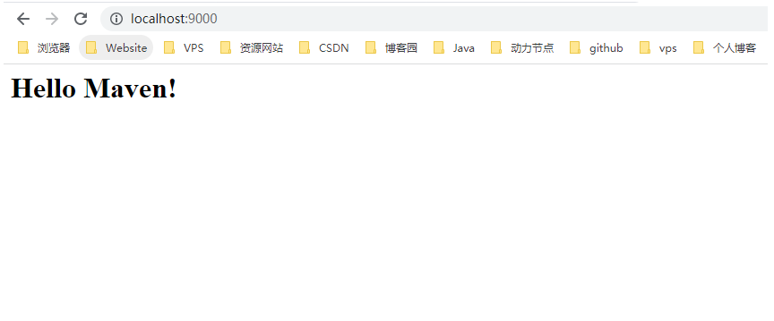

# Maven 手动创建项目

## Maven 工程目录结构

```java
├── Project
│   └── java-project
│    	└── src
│       	├──	main
│          	|	└── java
│           |	└── resources
│       	├── test
│           	└── java
│          		└── resources
```

### 在 src 同级目录下创建 pom.xml

```xml
<?xml version="1.0" encoding="UTF-8"?>
<project 
         xmlns="http://maven.apache.org/POM/4.0.0" 
         xmlns:xsi="http://www.w3.org/2001/XMLSchema-instance" 
         xsi:schemaLocation="http://maven.apache.org/POM/4.0.0 http://maven.apache.org/maven-v4_0_0.xsd">
    <groupId>com.cj.maven</groupId>
    <artifactId>maven-hello-world</artifactId>
    <version>1.0</version>
    <packaging>jar</packaging>
    <dependencies>
        <dependency>
            <groupId>junit</groupId>
            <artifactId>junit</artifactId>
            <version>4.12</version>
        </dependency>
    </dependencies>
</project>
```

## 插件创建 Maven 项目

### 创建工程

```text
mvn archetype:generate
-DgroupId={project-packaging} 
-DartifactId={project-name} 
-DarchetypeArtifactId=maven-archetype-quickstart
-DinteractiveMode=false
```

### 创建 java 工程

```text
mvn archetype:generate -DgroupId=com.frx -DartifactId=java-project -
DarchetypeArtifactId=maven-archetype-quickstart -Dversion=0.0.1-snapshot -
DinteractiveMode=false
```

### 创建 web 工程

```text
mvn archetype:generate -DgroupId=com.frx -DartifactId=web-project -
DarchetypeArtifactId=maven-archetype-webapp -Dversion=0.0.1-snapshot -
DinteractiveMode=false
```



## IDEA 创建 Maven 项目

### 配置 Maven


### 创建项目

新建 Module，选择右侧的 Maven，点击 Next，可以指定工程位置，然后 GroupId 起名称，Artifacted 工程名称，Next，Finish。



### 原型创建 Java 项目

使用模板创建 Java 工程 (搜索 quick start)



### 原型创建 Web 项目

使用模板创建 Web 工程 (搜索 Webapp)



### 导入 WEB-INF



### 插件

Tomcat7 运行插件

```xml
<build>
	<plugins>
		<plugin>
			<groupId>org.apache.tomcat.maven</groupId>
			<artifactId>tomcat7-maven-plugin</artifactId>
			<version>2.1</version>
			<configuration>
				<port>9000</port>
				<path>/</path>
			</configuration>
		</plugin>
	</plugins>
</build>
```

### pom.xml

```xml
<?xml version="1.0" encoding="UTF-8"?>
<project xmlns="http://maven.apache.org/POM/4.0.0"
         xmlns:xsi="http://www.w3.org/2001/XMLSchema-instance"
         xsi:schemaLocation="http://maven.apache.org/POM/4.0.0 http://maven.apache.org/xsd/maven-4.0.0.xsd">
    <parent>
        <artifactId>Maven</artifactId>
        <groupId>com.cj.maven</groupId>
        <version>0.0.1-SNAPSHOT</version>
    </parent>
    <modelVersion>4.0.0</modelVersion>

    <artifactId>maven-hello-world</artifactId>

    <!--打包方式，web工程打包为war,java工程打包为jar-->
    <packaging>war</packaging>

    <!--  构建-->
    <build>
        <plugins>
            <plugin>
                <groupId>org.apache.tomcat.maven</groupId>
                <artifactId>tomcat7-maven-plugin</artifactId>
                <version>2.1</version>
                <configuration>
                    <port>9000</port>
                    <path>/</path>
                </configuration>
            </plugin>
        </plugins>
    </build>

</project>
```


