# AJAX

> [黑马程序员 AJAX 零基础到精通_整合 Git 核心内容全套教程（2022 年已更新优化）](https://www.bilibili.com/video/BV1zs411h74a/?spm_id_from=333.337.search-card.all.click&vd_source=65e8ed62ff65aeec2427f9b6c8523b9b)

## jQuery 整合 AJAX

### 发送不带参数的 GET 请求

```javascript
$(function () {
    $('#btnGET').on('click', function () {
        $.get('http://www.liulongbin.top:3006/api/getbooks', function (data) {
            console.log(data)
        });
    });
});
```

### 发送带参数的 GET 请求

```javascript
$(function () {
    $('#btnGET').on('click', function () {
        $.get('http://www.liulongbin.top:3006/api/getbooks', {id: 1}, function (data) {
            console.log(data)
        });
    });
});
```

### 发送 post 请求提交数据

```javascript
$(function () {
    $('#btnGET').on('click', function () {
        $.post(
            'http://www.liulongbin.top:3006/api/addbook',
            {bookname: 'shuihu', author: '施耐庵转世', publisher: '出版社'},
            /*回调函数*/
            function (data) {
                console.log(data)
            });
    });
});
```

### $.ajax 通用方式

```javascript
//get 请求不带参数
$(function () {
    $('#btnGET').on('click', function () {
        $.ajax({
            type: 'GET',
            url: 'http://www.liulongbin.top:3006/api/getbooks',
            data: {},
            success: function (data) {
                console.log(data);
            }
        });
    });
});

//get 请求带参数
$(function () {
    $('#btnGET').on('click', function () {
        $.ajax({
            type: 'GET',
            url: 'http://www.liulongbin.top:3006/api/getbooks',
            data: {
                id: 2
            },
            success: function (data) {
                console.log(data);
            }
        });
    });
});

//post 请求
$(function () {
    $('#btnGET').on('click', function () {
        $.ajax({
            type: 'POST',
            url: 'http://www.liulongbin.top:3006/api/addbook',
            data: {
                bookname: 'shuihu',
                author: '施耐庵转世',
                publisher: '出版社'
            },
            success: function (data) {
                console.log(data);
            }
        });
    });
});
```

## 接口概念

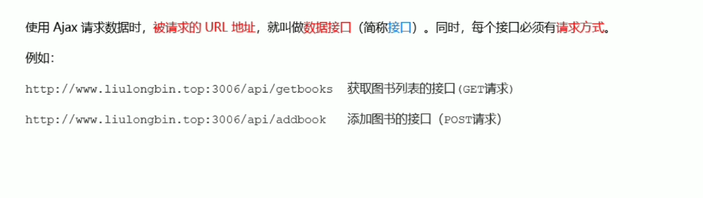

## postman 工具使用

### 发送 get 请求

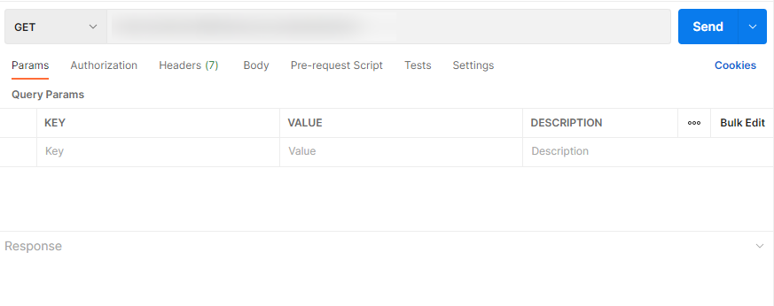

### 发送 post 请求

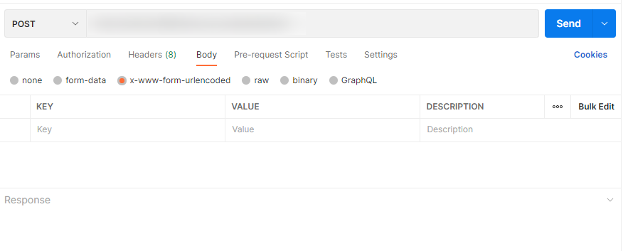

## 接口文档

### 接口文档六部分

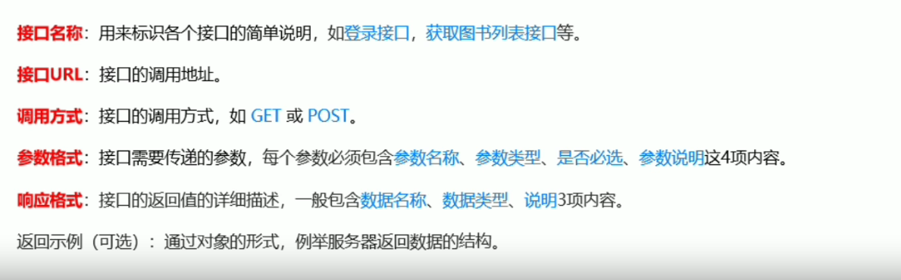

### 接口文档示例

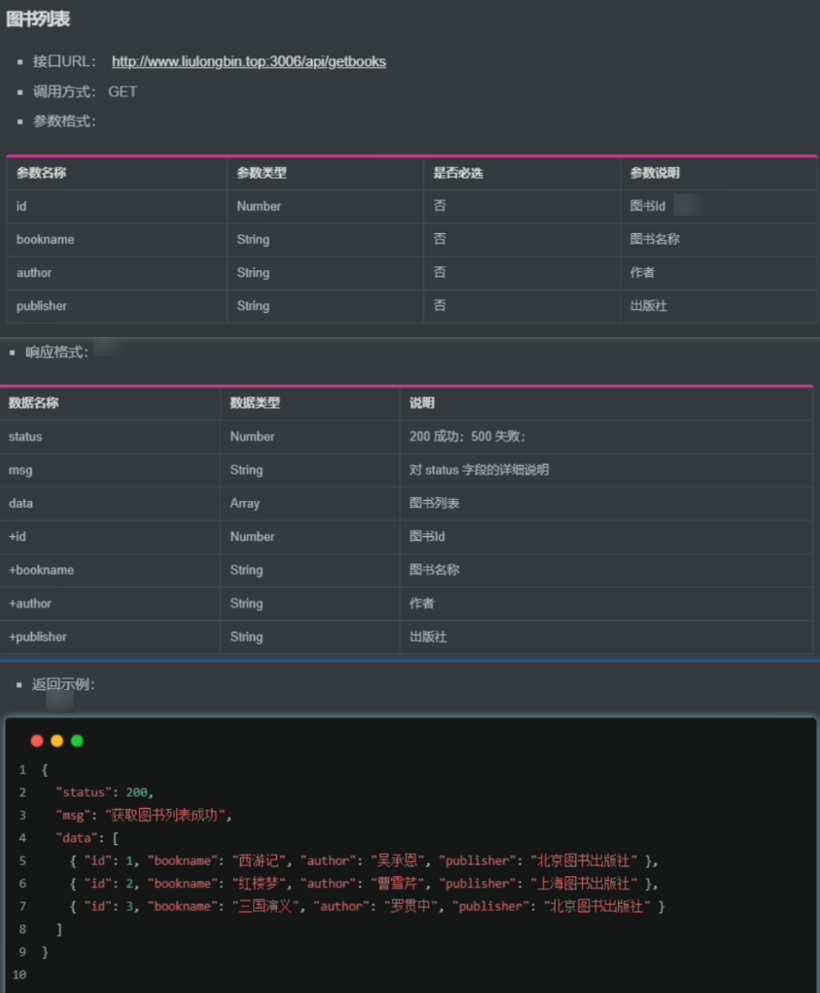

## form 表单与模板引擎

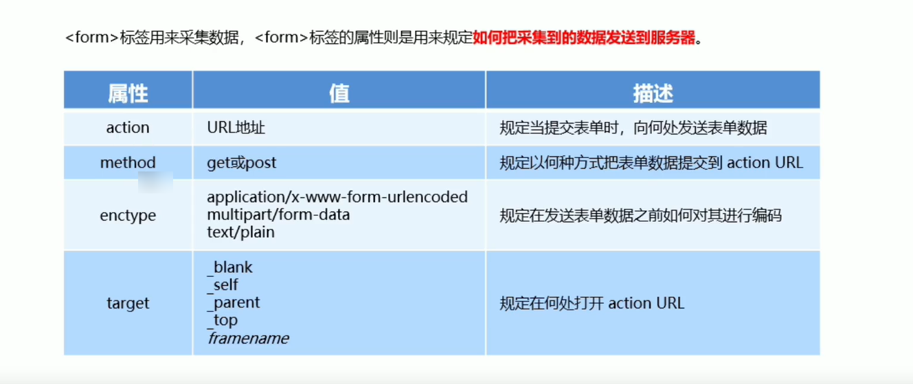


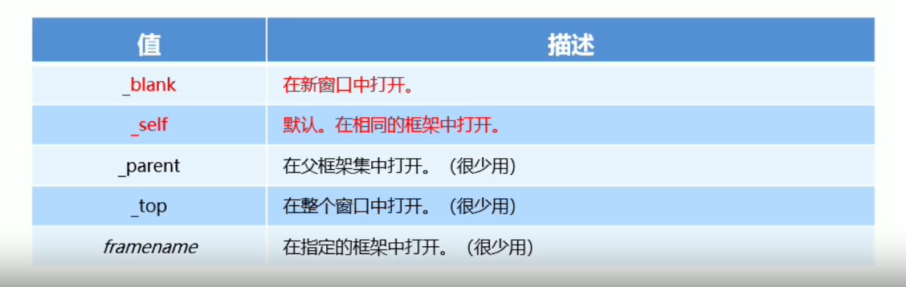


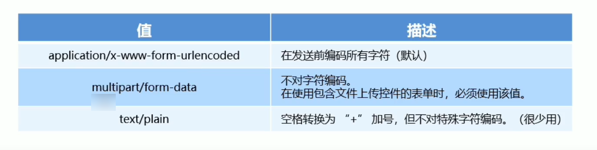

```html
<form action="/login" target="_blank" method="post">
    <input type="text" name="email_or_mobile"/>
    <input type="password" name="password"/>
    <button type="submit">提交</button>
</form>
```

### 阻止默认行

> preventDefault()

```html
<body>
    <form action="/login" id="f1">
        <input type="text" name="user_name"/>
        <input type="password" name="password"/>
        <button type="submit">提交</button>
    </form>
    <script>
        $(function () {
            $('#f1').on('submit', function (e) {
                alert('监听到了表单的提交事件 2')
                e.preventDefault();
            });
        });
    </script>
</body>
```

### serialize() 函数

> 快速获得表单元素的值

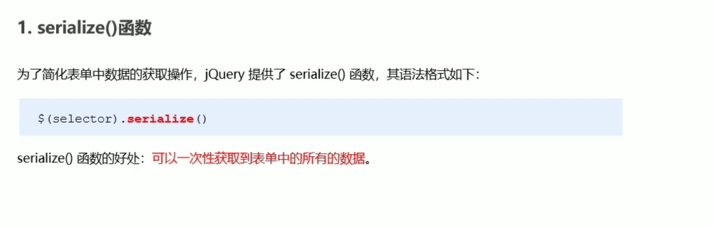

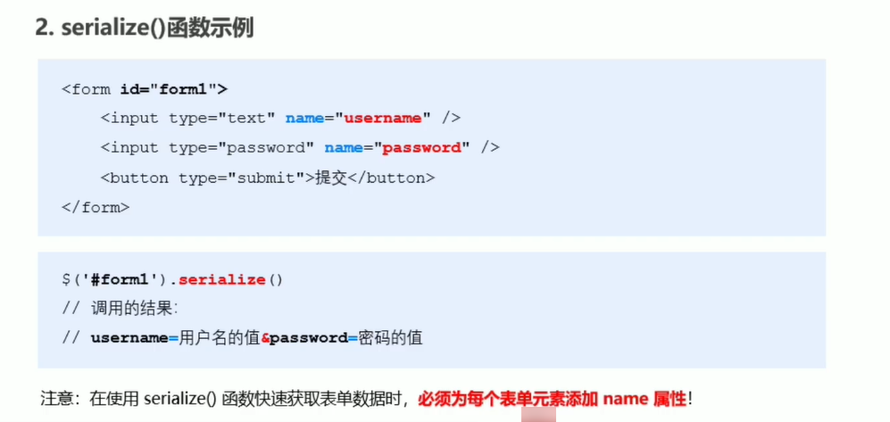

## 模板引擎

> 渲染数据时减少字符串拼接，减少 dom 操作

### art-template

 [template-web.js](http://aui.github.io/art-template/zh-cn/) 

### 导入模板引擎

```javascript
<script src="js/template-web.js"></script>
```

### 定义模板

```html
<!-- 3.1 模板的 HTML 结构，必须定义到 script 中 -->
<script type="text/html" id="tpl-user">
    <h1>{{name}} ------ {{age}}</h1>
{{@ test}}
 <div>
     {{if flag === 0}}
flag 的值是 0
{{else if flag === 1}}
flag 的值是 1
{{/if}}
    </div>
  <ul>
    {{each hobby}}
 <li>索引是:{{$index}}，循环项是:{{$value}}</li>
 {{/each}}
    </ul>
   <h3>{{regTime | dateFormat}}</h3>
</script>
```

### 调用 template 函数

```javascript
// 4. 调用 template 函数
var htmlStr = template('tpl-user', data)
console.log(htmlStr)
// 5. 渲染 HTML 结构
$('#container').html(htmlStr)
```

### art-template 语法

#### 标准语法

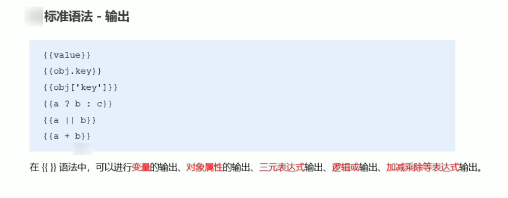

#### 原文输出

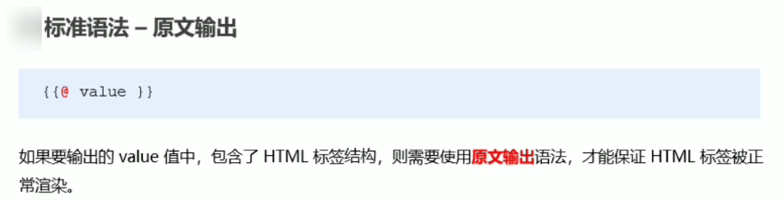

#### 条件输出

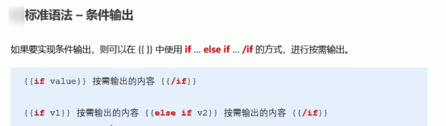

#### 循环输出


#### 过滤函数

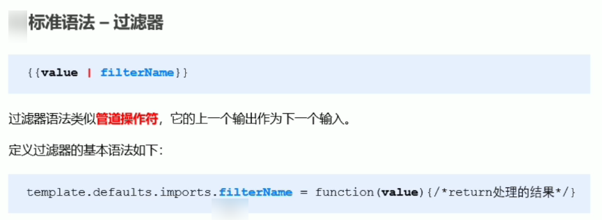

### art-template 原理

> 通过正则表达式的 exec() 方法，可以获得{{name}}，和 name，通过替换操作将值替换到占位符中{{}}

```html
<!DOCTYPE html>
<html lang="en">
    <head>
        <meta charset="UTF-8">
        <meta name="viewport" content="width=device-width, initial-scale=1.0">
        <meta http-equiv="X-UA-Compatible" content="ie=edge">
        <title>Document</title>
        <script src="./js/template.js"></script>
    </head>
    <body>
        <div id="user-box"></div>
        <script type="text/html" id="tpl-user">
            <div>姓名：{{name}}</div>
            <div>年龄：{{ age }}</div>
            <div>性别：{{ gender}}</div>
            <div>住址：{{address }}</div>
        </script>
        <script>
            // 定义数据
            var data = {name: 'zs', age: 28, gender: '男', address: '北京顺义马坡'}
            // 调用模板引擎
            var htmlStr = template('tpl-user', data)
            // 渲染 HTML 结构
            document.getElementById('user-box').innerHTML = htmlStr
        </script>
    </body>
</html>
```

```javascript
function template(id, data) {
    var str = document.getElementById(id).innerHTML
    var pattern = /{{\s*([a-zA-Z]+)\s*}}/
    var pattResult = null
    while (pattResult = pattern.exec(str)) {
        str = str.replace(pattResult[0], data[pattResult[1]])
    }
    return str
}
```

## AJAX 本质

### XMLHttpRequest 发送 get 请求

```javascript
// 1. 创建 XHR 对象
var xhr = new XMLHttpRequest()
// 2. 调用 open 函数
xhr.open('GET', 'http://www.liulongbin.top:3006/api/getbooks')
// 3. 调用 send 函数
xhr.send()
// 4. 监听 onreadystatechange 事件
xhr.onreadystatechange = function () {
    if (xhr.readyState === 4 && xhr.status === 200) {
        // 获取服务器响应的数据
        console.log(xhr.responseText)
    }
}
```

### XMLHttpRequest 发送 post 请求

```javascript
// 1. 创建 xhr 对象
var xhr = new XMLHttpRequest()
// 2. 调用 open 函数
xhr.open('POST', 'http://www.liulongbin.top:3006/api/addbook')
// 3. 设置 Content-Type 属性
xhr.setRequestHeader('Content-Type', 'application/x-www-form-urlencoded')
// 4. 调用 send 函数
xhr.send('bookname=水浒传&author=施耐庵&publisher=上海图书出版社')
// 5. 监听事件
xhr.onreadystatechange = function () {
    if (xhr.readyState === 4 && xhr.status === 200) {
        console.log(xhr.responseText)
    }
}
```

### 查询字符串

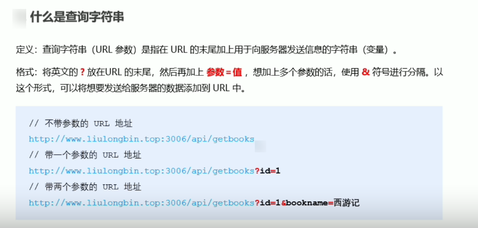

### URL 编码

> var str = encodeURI('黑马程序员')
>
> var str1 = decodeURI('%E9%BB%91%E9%A9%AC')

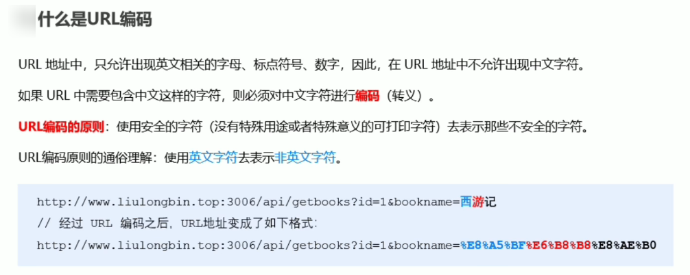

## 封装自己的 AJAX 函数

```javascript
/**
 * 处理 data 函数
 * 将传过来的参数变成 id=1&name=2 这种格式
 * @param data 需要发送服务器的数据
 * @returns {string} 返回拼接好的字符串
 */
function resolveData(data) {
    var arr = [];
    for (var k in data) {
        var str = k + '=' + data[k];
        arr.push(str);
    }
    return arr.join('&');
}

function myAjax(options) {
    var xhr = new XMLHttpRequest();
    // 把外界传递过来的参数对象，转换为 查询字符串
    var qs = resolveData(options.data);
    if (options.method.toUpperCase() === 'GET') {
        // 发起 GET 请求
        xhr.open(options.method, options.url + '?' + qs);
        xhr.send();
    } else if (options.method.toUpperCase() === 'POST') {
        // 发起 POST 请求
        xhr.open(options.method, options.url);
        xhr.setRequestHeader('Content-Type', 'application/x-www-form-urlencoded');
        xhr.send(qs);
    }
    xhr.onreadystatechange = function () {
        if (xhr.readyState === 4 && xhr.status === 200) {
            var result = JSON.parse(xhr.responseText);
            options.success(result);
        }
    }
}
```

```javascript
/*get 请求*/
myAjax({
    method: 'GET',
    url: 'http://www.liulongbin.top:3006/api/getbooks',
    data: {
        id: 1
    },
    success: function (res) {
        console.log(res)
    }
});
/*post 请求*/
myAjax({
    method: 'post',
    url: 'http://www.liulongbin.top:3006/api/addbook',
    data: {
        bookname: '水浒传',
        author: '施耐庵',
        publisher: '北京图书出版社'
    },
    success: function (res) {
        console.log(res)
    }
});
```

## 新版 XMLHttpRequest

### 旧版 XMLHttpRequest 缺点

- 只支持文本数据的传输，无法用来读取和上传文件
- 传送和接收数据时，没有进度信息，只能提示有没有完成

### 新版 XMLHttpRequest

- 可以设置 HTTP 请求的时限
- 可以使用 FormData 对象模拟表单数据
- 可以上传文件
- 可以获得数据传输的进度信息

### 请求超时

```javascript
var xhr = new XMLHttpRequest()
// 设置 超时时间
xhr.timeout = 30
// 设置超时以后的处理函数
xhr.ontimeout = function () {
    console.log('请求超时了！')
}
xhr.open('GET', 'http://www.liulongbin.top:3006/api/getbooks')
xhr.send()
xhr.onreadystatechange = function () {
    if (xhr.readyState === 4 && xhr.status === 200) {
        console.log(xhr.responseText)
    }
}
```

### formData 对象

```javascript
// 1. 创建 FormData 实例
var fd = new FormData()
// 2. 调用 append 函数，向 fd 中追加数据
fd.append('uname', 'zs')
fd.append('upwd', '123456')
var xhr = new XMLHttpRequest()
xhr.open('POST', 'http://www.liulongbin.top:3006/api/formdata')
xhr.send(fd)
xhr.onreadystatechange = function () {
    if (xhr.readyState === 4 && xhr.status === 200) {
        console.log(JSON.parse(xhr.responseText))
    }
}

//formData 快速获得表单
```

```html
<!DOCTYPE html>
<html lang="en">
    <head>
        <meta charset="UTF-8">
        <meta name="viewport" content="width=device-width, initial-scale=1.0">
        <meta http-equiv="X-UA-Compatible" content="ie=edge">
        <title>Document</title>
    </head>
    <body>
        <form id="form1">
            <input type="text" name="uname" autocomplete="off"/>
            <input type="password" name="upwd"/>
            <button type="submit">提交</button>
        </form>
        <script>
            // 1. 通过 DOM 操作，获取到 form 表单元素
            var form = document.querySelector('#form1')
            form.addEventListener('submit', function (e) {
                // 阻止表单的默认提交行为
                e.preventDefault()
                // 创建 FormData，快速获取到 form 表单中的数据
                var fd = new FormData(form)
                var xhr = new XMLHttpRequest()
                xhr.open('POST', 'http://www.liulongbin.top:3006/api/formdata')
                xhr.send(fd)
                xhr.onreadystatechange = function () {
                    if (xhr.readyState === 4 && xhr.status === 200) {
                        console.log(JSON.parse(xhr.responseText))
                    }
                }
            })
        </script>
    </body>
</html>
```

### 上传文件

```javascript
// 1. 获取到文件上传按钮
var btnUpload = document.querySelector('#btnUpload')
// 2. 为按钮绑定单击事件处理函数
btnUpload.addEventListener('click', function () {
    // 3. 获取到用户选择的文件列表
    var files = document.querySelector('#file1').files
    if (files.length <= 0) {
        return alert('请选择要上传的文件！')
    }
    var fd = new FormData()
    // 将用户选择的文件，添加到 FormData 中
    fd.append('avatar', files[0])
    var xhr = new XMLHttpRequest()
    xhr.open('POST', 'http://www.liulongbin.top:3006/api/upload/avatar')
    xhr.send(fd)
    xhr.onreadystatechange = function () {
        if (xhr.readyState === 4 && xhr.status === 200) {
            var data = JSON.parse(xhr.responseText)
            if (data.status === 200) {
                // 上传成功
                document.querySelector('#img').src = 'http://www.liulongbin.top:3006' + data.url
            } else {
                // 上传失败
                console.log('图片上传失败！' + data.message)
            }
        }
    }
})
```

### 显示上传进度

```javascript
// 1. 获取到文件上传按钮
var btnUpload = document.querySelector('#btnUpload')
// 2. 为按钮绑定单击事件处理函数
btnUpload.addEventListener('click', function () {
    // 3. 获取到用户选择的文件列表
    var files = document.querySelector('#file1').files
    if (files.length <= 0) {
        return alert('请选择要上传的文件！')
    }
    var fd = new FormData()
    // 将用户选择的文件，添加到 FormData 中
    fd.append('avatar', files[0])
    var xhr = new XMLHttpRequest()
    // 监听文件上传的进度
    xhr.upload.onprogress = function (e) {
        if (e.lengthComputable) {
            // 计算出上传的进度
            var procentComplete = Math.ceil((e.loaded / e.total) * 100)
            console.log(procentComplete)
            // 动态设置进度条
            $('#percent').attr('style', 'width: ' + procentComplete + '%;').html(procentComplete + '%')
        }
    }
    xhr.upload.onload = function () {
        $('#percent').removeClass().addClass('progress-bar progress-bar-success')
    }
    xhr.open('POST', 'http://www.liulongbin.top:3006/api/upload/avatar')
    xhr.send(fd)
    xhr.onreadystatechange = function () {
        if (xhr.readyState === 4 && xhr.status === 200) {
            var data = JSON.parse(xhr.responseText)
            if (data.status === 200) {
                // 上传成功
                document.querySelector('#img').src = 'http://www.liulongbin.top:3006' + data.url
            } else {
                // 上传失败
                console.log('图片上传失败！' + data.message)
            }
        }
    }
})
```

### jQuery 实现上传文件

```javascript
$(function () {
    // 监听到 Ajax 请求被发起了，加载图片
    $(document).ajaxStart(function () {
        $('#loading').show()
    })
    // 监听到 Ajax 完成的事件，隐藏图片
    $(document).ajaxStop(function () {
        $('#loading').hide()
    })
    $('#btnUpload').on('click', function () {
        var files = $('#file1')[0].files
        if (files.length <= 0) {
            return alert('请选择文件后再上传！')
        }
        var fd = new FormData()
        fd.append('avatar', files[0])
        // 发起 jQuery 的 Ajax 请求，上传文件
        $.ajax({
            method: 'POST',
            url: 'http://www.liulongbin.top:3006/api/upload/avatar',
            data: fd,
            //全部都是 false
            processData: false,
            contentType: false,
            success: function (res) {
                console.log(res)
            }
        })
    })
})
```

## 跨域和 jsonp

### 同源策略

- 同源：两个页面的协议、域名和端口都相同
- 同源策略：非同源的两个网站之间的 javascript 不允许资源交互

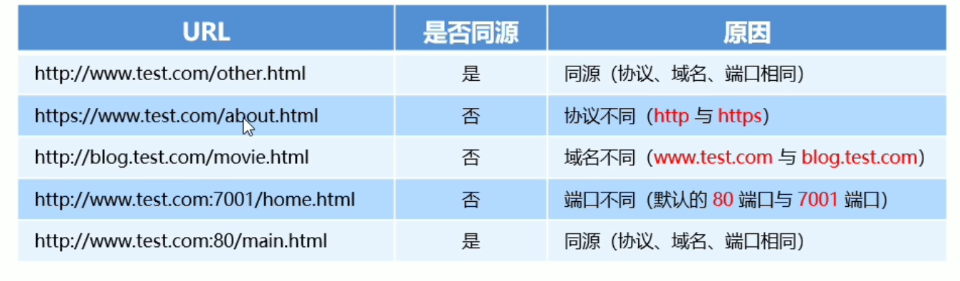

### 跨域

- 同源反之是跨域
- 可以发起跨域请求，也能获取返回的数据，但是浏览器的同源策略会拦截返回回来的数据

### jsonp

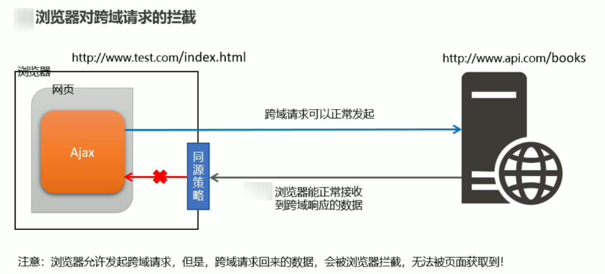

- 出现早，兼容性好
- 只支持**GET 请求**，不支持 POST 请求

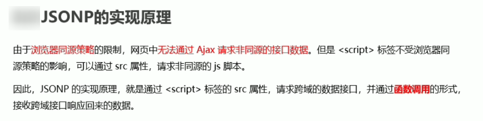

#### script 标签发起 jsonp 请求

```javascript
<script>
    function abc(data) {
    console.log('JSONP 响应回来的数据是：')
    console.log(data)
}
</script>
<script src="http://www.liulongbin.top:3006/api/jsonp?callback=abc&name=ls&age=30"></script>
```

#### jQuery 发起 jsonp 请求

> jQuery 在发送 jsonp 请求时动态创建 script 标签，发送结束后动态删除 script 标签实现 jsonp 请求

```javascript
$(function () {
    // 发起 JSONP 的请求
    $.ajax({
        url: 'http://www.liulongbin.top:3006/api/jsonp?name=zs&age=20',
        // 代表我们要发起 JSONP 的数据请求
        dataType: 'jsonp',
        jsonp: 'callback',
        jsonpCallback: 'abc',
        success: function (res) {
            console.log(res)
        }
    })
})
```

### CORS

- 出现晚，兼容性较差，最终解决方案
- 支持 GET 和 POST 请求

### 淘宝案例

#### 防抖策略

> 频繁的触发某些事件，回调函数只执行一次
>
> 原理是定义一个延时器，当键盘输入后调用延时器函数而不是接口，保证在延时器这一段时间内不管触发多少次键盘事件，请求只会发送一次


#### 全局缓存对象

> 减少重复的请求

1. 定义缓存对象`var cacheObj = {}`
2. 将返回结果保存到缓存对象中`cacheObj[k] = res`
3. 再调用请求时先从缓存对象中获取值`if (cacheObj[keywords]) return renderSuggestList(cacheObj[keywords]);`

#### 节流策略

> 节流阀为空，表示可以执行下次操作;不为空，表示不能执行下次操作

```javascript
$(function () {
    // 1. 获取到图片
    var angel = $('#angel')
    // 步骤 1. 定义节流阀
    var timer = null
    // 2. 绑定 mousemove 事件
    $(document).on('mousemove', function (e) {
        // 步骤 3：判断节流阀是否为空
        if (timer) {
            return
        }
        // 3. 设置图片的位置
        // 步骤 2：开启延时器
        timer = setTimeout(function () {
            $(angel).css('top', e.pageY + 'px').css('left', e.pageX + 'px')
            console.log('ok')
            timer = null
        }, 16)
    })
})
```

## http 协议

### http 请求消息

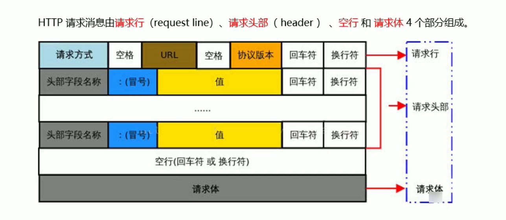

### 请求头

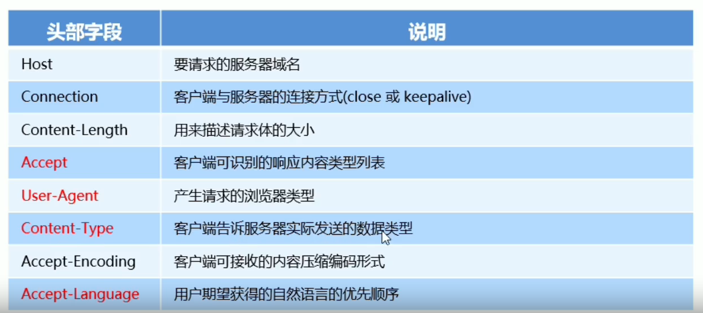

### 请求方法

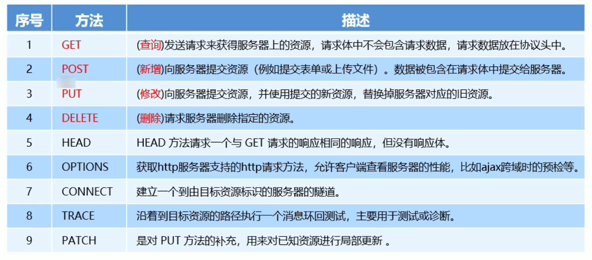

### 响应状态码

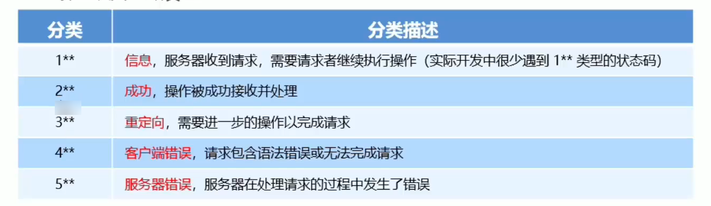

#### 2XX

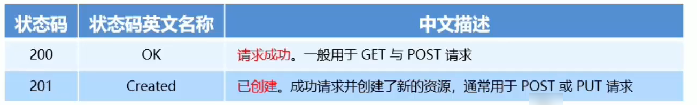

#### 3XX

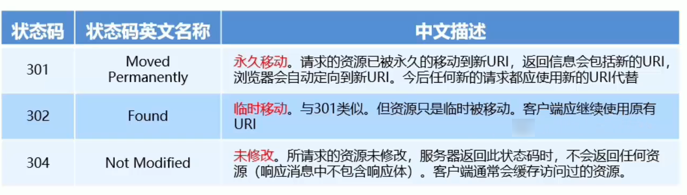

#### 4XX

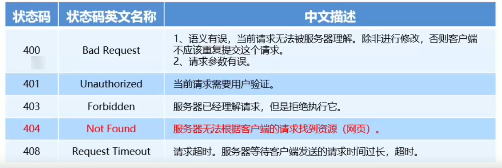

#### 5XX

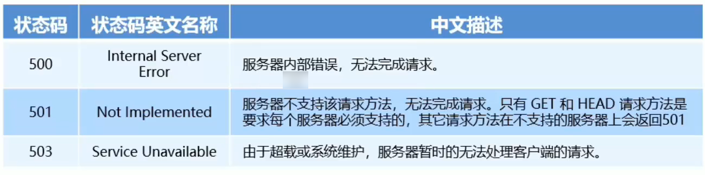


