# Bootstrap

> [Bootstrap v3 中文文档 · Bootstrap 是最受欢迎的 HTML、CSS 和 JavaScript 框架，用于开发响应式布局、移动设备优先的 WEB 项目。 | Bootstrap 中文网 (bootcss.com)](https://v3.bootcss.com/)

## Bootstrap 入门

### Bootstrap 引入

```html
<!--H5 布局-->
<!--默认引入 Normalize.css 初始化样式-->
<!--默认设置全局排版和链接样式 scaffolding.less-->
<!doctype html>
<html lang="zh-CN">
    <head>
        <meta charset="utf-8">
        <meta http-equiv="X-UA-Compatible" content="IE=edge">
        <!--移动设备优先-->
        <meta name="viewport" content="width=device-width, initial-scale=1">
        <!-- 上述 3 个 meta 标签*必须*放在最前面，任何其他内容都*必须*跟随其后！ -->
        <title>Bootstrap</title>

        <!-- Bootstrap -->
        <link rel="stylesheet" href="css/Bootstrap.min.css">

    </head>
    <body>
        <h1>你好，世界！</h1>
        <!-- jQuery (Bootstrap 的所有 JavaScript 插件都依赖 jQuery，所以必须放在前边) -->
        <script src="js/jquery.min.js"></script>
        <!-- 加载 Bootstrap 的所有 JavaScript 插件 -->
        <script src="js/Bootstrap.min.js"></script>
    </body>
</html>
```

## 布局

### 布局容器

```html
hello world
<div class="container">
    hello world
</div>
<div class="container-fluid">
    hello world
</div>
```

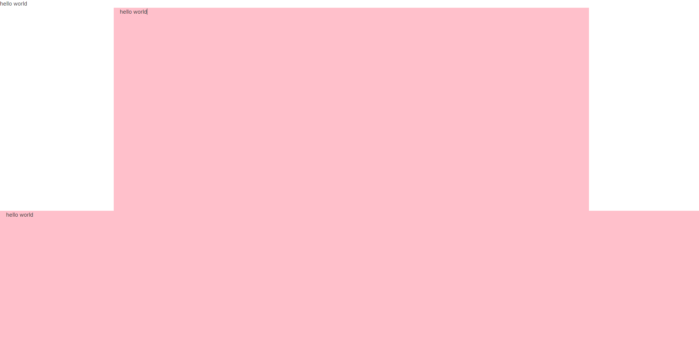

### 媒体查询：响应式布局

```css
/* 超小屏幕（手机，小于 768px） */
/* 没有任何媒体查询相关的代码，因为这在 Bootstrap 中是默认的（还记得 Bootstrap 是移动设备优先的吗？） */

/* 小屏幕（平板，大于等于 768px） */
@media (min-width: @screen-sm-min) { ... }

/* 中等屏幕（桌面显示器，大于等于 992px） */
@media (min-width: @screen-md-min) { ... }

/* 大屏幕（大桌面显示器，大于等于 1200px） */
@media (min-width: @screen-lg-min) { ... }
```

## 栅格系统

- 栅格系统用于通过一系列的行（row）与列（column）的组合来创建页面布局
- row 必须包含在 container 或 container-fluid 中，在 row 中创建 column，将内容放在 cokumn 中
- col-md 在 PC 端使用最多

### 列组合

列组合：每一列不得超过 12 个，否则换行

```html
<div class="container">
    <div class="row">
        <div class="col-md-1">.col-md-1</div>
        <div class="col-md-1">.col-md-1</div>
        <div class="col-md-1">.col-md-1</div>
        <div class="col-md-1">.col-md-1</div>
        <div class="col-md-1">.col-md-1</div>
        <div class="col-md-1">.col-md-1</div>
        <div class="col-md-1">.col-md-1</div>
        <div class="col-md-1">.col-md-1</div>
        <div class="col-md-1">.col-md-1</div>
        <div class="col-md-1">.col-md-1</div>
        <div class="col-md-1">.col-md-1</div>
        <div class="col-md-1">.col-md-1</div>
    </div>
    <div class="row">
        <div class="col-md-8">.col-md-8</div>
        <div class="col-md-4">.col-md-4</div>
    </div>
    <div class="row">
        <div class="col-md-4">.col-md-4</div>
        <div class="col-md-4">.col-md-4</div>
        <div class="col-md-4">.col-md-4</div>
    </div>
    <div class="row">
        <div class="col-md-6">.col-md-6</div>
        <div class="col-md-6">.col-md-6</div>
    </div>
</div>
```

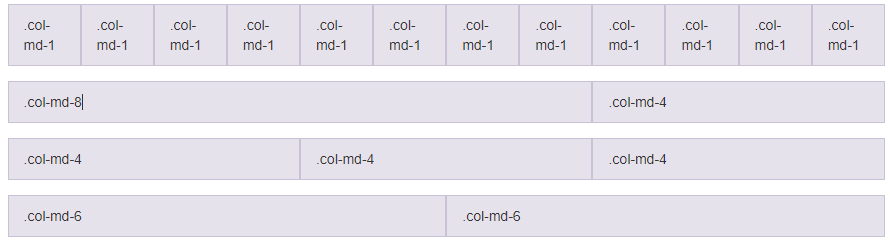

### 列偏移

列偏移：如果添加`col-md-offset-*`样式，盒子会向右偏移*个单位，同时也要保证列和偏移的列总和不超过 12

```html
<div class="container">
    <div class="row">
        <div class="col-md-4" style="background-color: antiquewhite;">.col-md-4</div>
        <div class="col-md-4 col-md-offset-4" style="background-color:cornflowerblue;">.col-md-4 .col-md-offset-4</div>
    </div>
    <div class="row">
        <div class="col-md-3 col-md-offset-3" style="background-color: darkcyan;">.col-md-3 .col-md-offset-3</div>
        <div class="col-md-3 col-md-offset-3" style="background-color: blue;">.col-md-3 .col-md-offset-3</div>
    </div>
    <div class="row">
        <div class="col-md-6 col-md-offset-3" style="background-color: brown;">.col-md-6 .col-md-offset-3</div>
    </div>
</div>
```

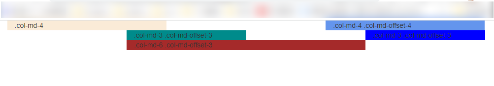

### 列排序

列排序就是改变列的方法，通过使用`.col-md-push-*`(向右推) 和`.col-md-pull-*`(向左拉) 类就可以很容易的改变列的顺序

```html
<div class="container">
    <div class="row">
        <div class="col-md-9 col-md-push-3" style="background-color: black;">.col-md-9 .col-md-push-3</div>
        <div class="col-md-3 col-md-pull-9" style="background-color: burlywood;">.col-md-3 .col-md-pull-9</div>
    </div>
</div>
```


### 列嵌套

在列中还可以嵌套 12 个盒子，无限嵌套

```html
<div class="container">
    <div class="row">
        <div class="col-md-9" style="background-color: pink;">
            Level 1: .col-sm-9
            <div class="row">
                <div class="col-md-8" style="background-color:gray">
                    Level 2: .col-xs-8 .col-sm-6
                </div>
                <div class="col-md-4" style="background-color:crimson">
                    Level 2: .col-xs-4 .col-sm-6
                </div>
            </div>
        </div>
    </div>
</div>
```

### 删除栅栏间隔

```html
<div class="container">
    <div class="row row-no-gutters">
        <div class="col-md-9 col-md-push-3">.col-md-9 .col-md-push-3</div>
        <div class="col-md-3 col-md-pull-9">.col-md-3 .col-md-pull-9</div>
    </div>
</div>
```

### 不同屏幕分辨率下的显示

```html
<div class="container">
    <div class="row">
        <div class="col-md-3 col-sm-12 col-xs-12" style="background-color: pink;">.col-xs-6 .col-sm-4</div>
        <div class="col-md-3 col-sm-12 col-xs-6" style="background-color: pink;">.col-xs-6 .col-sm-4</div>
        <div class="col-md-3 col-sm-12 col-xs-6" style="background-color: pink;">.col-xs-6 .col-sm-4</div>
    </div>
</div>
```

## 常用样式

### 标题

```html
<h1>标题 1<small>副标题 1</small></h1>
<h2>标题 2<span class="h2">副标题 2</span></h2>
<h3>标题 3<span class="h3">副标题 3</span></h3>
<div class="h1">
    标题 div
</div>
```

### 段落

减少间隙，文本变大

```html
<p class="lead">12312312123123123123</p>
```

### 文本情景色

```html
<p class="text-muted">...</p>
<p class="text-primary">...</p>
<p class="text-success">...</p>
<p class="text-info">...</p>
<p class="text-warning">...</p>
<p class="text-danger">...</p>
```

### 背景情景色

```html
<p class="bg-primary">...</p>
<p class="bg-success">...</p>
<p class="bg-info">...</p>
<p class="bg-warning">...</p>
<p class="bg-danger">...</p>
```

### 对齐

```html
<p class="text-left bg-primary">Left aligned text.</p>
<p class="text-center bg-success">Center aligned text.</p>
<p class="text-right bg-info">Right aligned text.</p>
<p class="text-justify bg-warning">Justified text.</p> <!--两端对齐-->
<p class="text-nowrap bg-danger">No wrap text.</p>
```

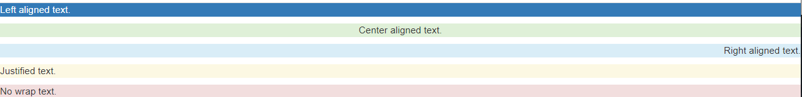

### 列表

```html
<ul>
    <li>我是列表</li>
    <li>我是列表</li>
    <li>我是列表</li>
</ul>
<ol>
    <li>我是列表</li>
    <li>我是列表</li>
    <li>我是列表</li>
</ol>
<!--无样式列表-->
<ul class="list-unstyled">
    <li>我是列表</li>
    <li>我是列表</li>
    <li>我是列表</li>
</ul>
<!--水平列表-->
<ul class="list-inline">
    <li>我是列表</li>
    <li>我是列表</li>
    <li>我是列表</li>
</ul>
```

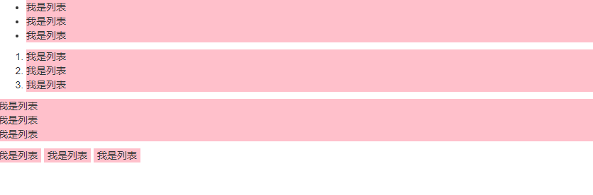

### 代码风格

```html
<code>&lt;内敛代码&gt;</code></br>

<kbd>cd</kbd><kbd><kbd>ctrl</kbd> + <kbd>,</kbd>用户输入</kbd>

<pre class="pre-scrollable">&lt;p&gt;代码块&lt;/p&gt;</pre>

<var>变量:y</var> = <var>m</var><var>x</var> + <var>b</var>

<samp>程序输出</samp>
```

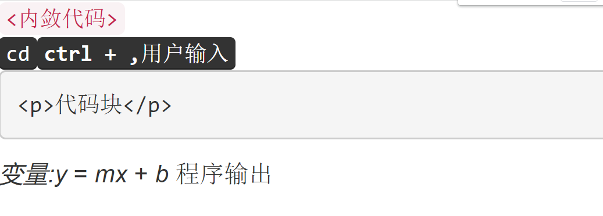

### 表格

#### 基本样式

```html
<table class="table">
    <tr>
        <th>123</th>
        <th>456</th>
        <th>789</th>
    </tr>
    <tr>
        <td>123</td>
        <td>123</td>
        <td>123</td>
    </tr>
    <tr>
        <td>123</td>
        <td>123</td>
        <td>123</td>
    </tr>
</table>
```

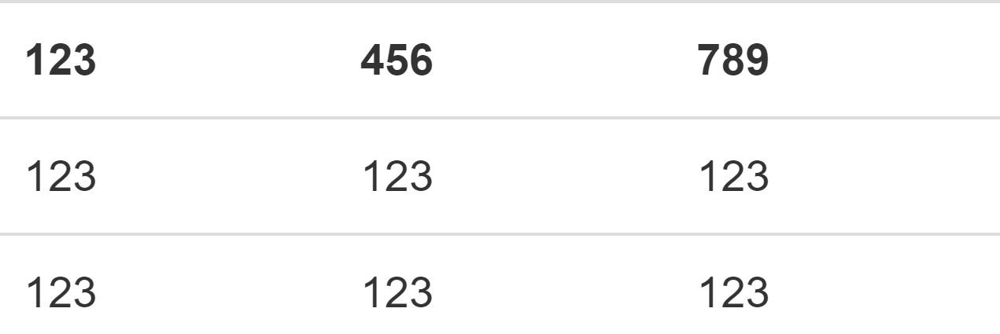

#### 条纹状表格

```html
<table class="table table-striped">
    ...
</table>
```

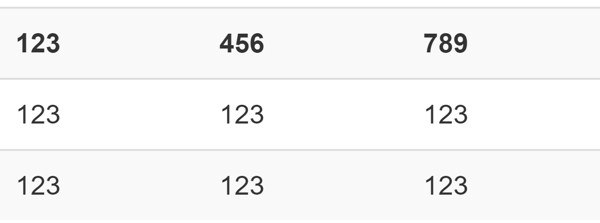

#### 带边框的表格

```html
<table class="table table-bordered">
    ...
</table>
```

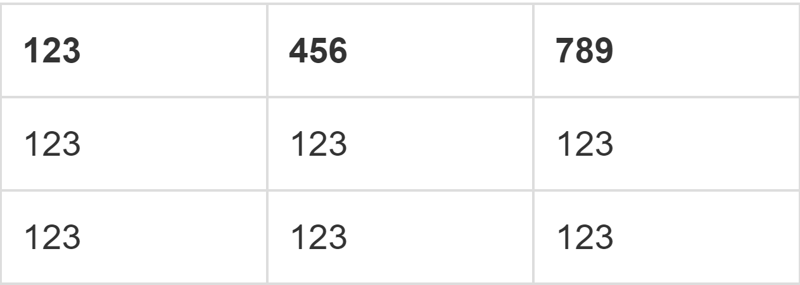

#### 鼠标悬停

```html
<table class="table table-hover">
    ...
</table>
```

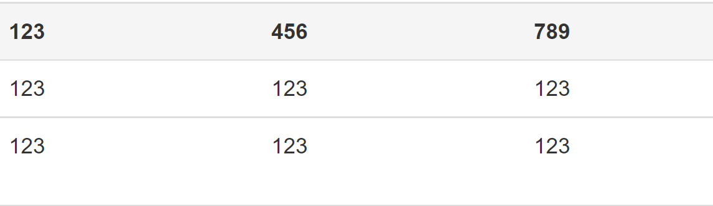

#### 紧缩表格

更加紧凑

```html
<table class="table table-condensed">
    ...
</table>
```

#### 表格情景色

```html
<table class="table table-hover">
    <tr>
        <th class="active">123</th>
        <th class="active">456</th>
        <th class="success">789</th>
    </tr>
    <tr>
        <td class="active">123</td>
        <td class="success">123</td>
        <td class="info">123</td>
    </tr>
    <tr>
        <td class="active">123</td>
        <td class="success">123</td>
        <td class="success">123</td>
    </tr>
</table>
```

| Class      | 描述                                 |
| :--------- | :----------------------------------- |
| `.active`  | 鼠标悬停在行或单元格上时所设置的颜色 |
| `.success` | 标识成功或积极的动作                 |
| `.info`    | 标识普通的提示信息或动作             |
| `.warning` | 标识警告或需要用户注意               |
| `.danger`  | 标识危险或潜在的带来负面影响的动作   |

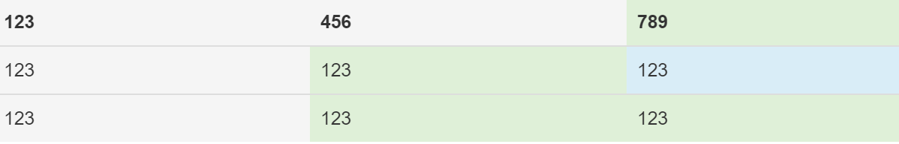

#### 响应式表格

> 随着屏幕的大小变化而变化

```html
<div class="table-responsive">
    <table class="table">
        <tr>
            <th>123</th>
            <th>456</th>
            <th>789</th>
        </tr>
        <tr>
            <td>123</td>
            <td>123</td>
            <td>123</td>
        </tr>
        <tr>
            <td>123</td>
            <td>123</td>
            <td>123</td>
        </tr>
    </table>
</div>
```

### 表单

#### 文本框

```html
<div class="row">
    <div class="col-md-3">
        <input type="text" class="form-control"><br>
        <input type="text" class="form-control input-lg"><br>
        <input type="text" class="form-control input-sm">
    </div>
</div>
```

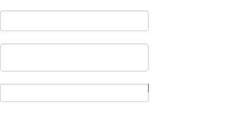

#### 下拉框

```html
<div class="row">
    <div class="col-md-3">
        <select class="form-control">
            <option value="">请选择城市</option>
            <option value="">杭州</option>
            <option value="">北京</option>
        </select>
    </div>
</div>
```


#### 文本域

```html
<div class="row">
    <div class="col-md-3">
        <textarea class="form-control"></textarea>
    </div>
</div>
```

#### 复选框

```html
<!-- 水平显示复选框 -->
<div class="row">
    <div class="col-md-3">
        <div class="checkbox">
            <label>
                <input type="checkbox" name="hobby"> 唱歌
            </label>
        </div>
        <div class="checkbox">
            <label>
                <input type="checkbox" name="hobby"> 跳舞
            </label>
        </div>
    </div>
</div>
<!-- 垂直显示复选框 -->
<div class="row">
    <div class="col-md-3">
        <label class="checkbot-inline">
            <input type="checkbox" name="hobby"> 唱歌
        </label>
        <label class="checkbot-inline">
            <input type="checkbox" name="hobby"> 跳舞
        </label>
    </div>
</div>
```

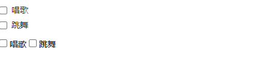

#### 单选框

```html
<!-- 单选框 -->
<div class="row">
    <div class="col-md-3">
        <div class="radio">
            <label>
                <input type="radio" name="sex">男
            </label>
        </div>
        <div class="radio">
            <label>
                <input type="radio" name="sex">女
            </label>
        </div>
    </div>
</div>

<!-- 单选框 -->
<div class="row">
    <div class="col-md-3">
        <label class="radio-inline">
            <input type="radio" name="sex">男
        </label>
        <label class="radio-inline">
            <input type="radio" name="sex">女
        </label>
    </div>
</div>
```

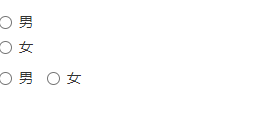

#### 按钮

```html
<!-- Standard button -->
<button type="button" class="btn btn-default">（默认样式）Default</button>
<!-- Provides extra visual weight and identifies the primary action in a set of buttons -->
<button type="button" class="btn btn-primary">（首选项）Primary</button>
<!-- Indicates a successful or positive action -->
<button type="button" class="btn btn-success">（成功）Success</button>
<!-- Contextual button for informational alert messages -->
<button type="button" class="btn btn-info">（一般信息）Info</button>
<!-- Indicates caution should be taken with this action -->
<button type="button" class="btn btn-warning">（警告）Warning</button>
<!-- Indicates a dangerous or potentially negative action -->
<button type="button" class="btn btn-danger">（危险）Danger</button>
<!-- Deemphasize a button by making it look like a link while maintaining button behavior -->
<button type="button" class="btn btn-link">（链接）Link</button>
```

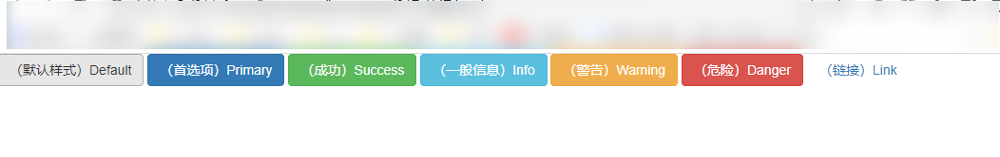

**按钮禁用**

```html
<!-- 禁用按钮 -->
<button type="button" class="btn btn-lg btn-primary" disabled="disabled">Primary button</button>
<button type="button" class="btn btn-default btn-lg" disabled="disabled">Button</button>
```

### 表单布局

#### 水平表单

```html
<form action="" method="POST" class="form-horizontal" role="form">
    <div class="form-group">
        <legend>Form title</legend>
    </div>

    <div class="form-group">
        <div class="col-sm-10 col-sm-offset-2">
            <button type="submit" class="btn btn-primary">Submit</button>
        </div>
    </div>
</form>
```


#### 内敛表单

```html
<form action="" method="POST" class="form-inline" role="form">
    <div class="form-group">
        <label class="sr-only" for="">label</label>
        <input type="email" class="form-control" id="" placeholder="Input field">
    </div>

    <div class="form-group">
        <label class="sr-only" for="">label</label>
        <input type="email" class="form-control" id="" placeholder="Input field">
    </div>

    <div class="form-group">
        <label class="sr-only" for="">label</label>
        <input type="email" class="form-control" id="" placeholder="Input field">
    </div>
    <button type="submit" class="btn btn-primary">Submit</button>
</form>
```

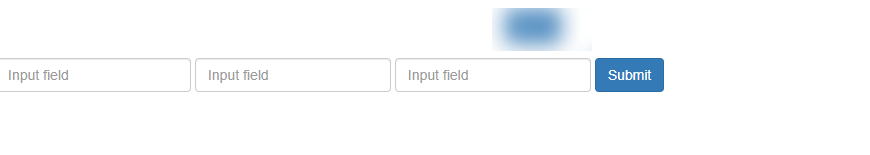

## Bootstrap 组件

### 略缩图

```html
<div class="col-xs-3 col-sm-3 col-md-3 col-lg-3">
    <a href="#" class="thumbnail">
        
    </a>
    <h3>象韵洁</h3>
    <p>韩国</p>
    <button type="button" class="btn btn-default">
        <span class="glyphicon glyphicon-heart">喜欢</span>
    </button>
    <button type="button" class="btn btn-default">
        <span class="glyphicon glyphicon-pencil">评论</span>
    </button>
</div>
```


### 面板

```html
<div class="panel-heading ">
    合集
</div>
<div class="panel-body">
    内容
</div>
```

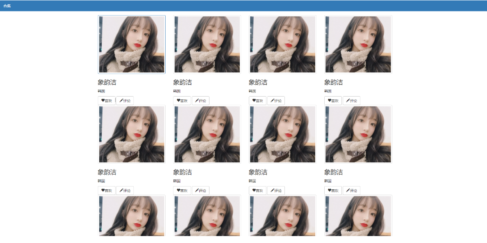

### Glyphicons 字体图标

> 引入类名就行

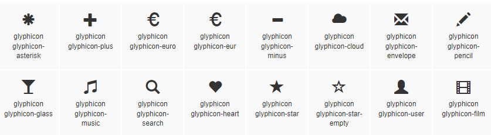

### 导航

```html
<p>标签式的导航菜单</p>
<ul class="nav nav-tabs">
    <li role="presentation" class="active"><a href="#">Home</a></li>
    <li role="presentation"><a href="#">Profile</a></li>
    <li role="presentation"><a href="#">Messages</a></li>
</ul>

<p>胶囊式的导航菜单</p>
<ul class="nav nav-pills">
    <li role="presentation" class="active"><a href="#">Home</a></li>
    <li role="presentation"><a href="#">Profile</a></li>
    <li role="presentation"><a href="#">Messages</a></li>
</ul>

<p>路径式的导航菜单</p>
<ul class="breadcrumb">
    <li role="presentation" class="active"><a href="#">Home</a></li>
    <li role="presentation"><a href="#">Profile</a></li>
    <li role="presentation"><a href="#">Messages</a></li>
</ul>
```

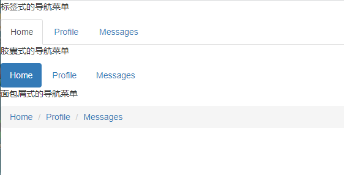

### 导航条

> bs3-navbar

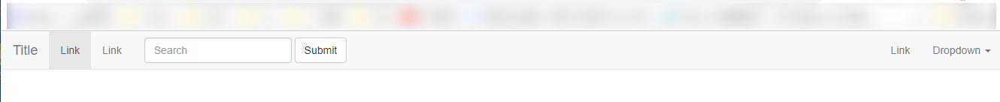

### 分页导航

```html
<ul class="pagination">
    <li><a href="#">&laquo;</a></li>
    <li><a href="#">1</a></li>
    <li><a href="#">2</a></li>
    <li><a href="#">3</a></li>
    <li><a href="#">4</a></li>
    <li><a href="#">5</a></li>          
    <li><a href="#">&raquo;</a></li>
</ul>


<ul class="pager">
    <li><a href="#">上一页</a></li>
    <li><a href="#">下一页</a></li>
</ul>
```

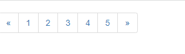

### 下拉菜单

> 参照文档 [https://v3.bootcss.com/components/#progress](https://v3.bootcss.com/components/#progress)

### 导航条

> 参照文档 [https://v3.bootcss.com/components/#progress](https://v3.bootcss.com/components/#progress)

## Bootstrap 插件

### 模态框

```html
<a class="btn btn-primary" data-toggle="modal" href='#modal-id'>Trigger modal</a>
<div class="modal fade" id="modal-id">
    <div class="modal-dialog">
        <div class="modal-content">
            <div class="modal-header">
                <button type="button" class="close" data-dismiss="modal" aria-hidden="true">&times;</button>
                <h4 class="modal-title">Modal title</h4>
            </div>
            <div class="modal-body">
            </div>
            <div class="modal-footer">
                <button type="button" class="btn btn-default" data-dismiss="modal">Close</button>
                <button type="button" class="btn btn-primary" id="submit">Save changes</button>
            </div>
        </div>
    </div>
</div>

<script>
    $("#submit").click(function () {
        $("#modal-id").modal("hide");
    });
</script>
```

### 隐藏和打开模态框

```javascript
$('#myModal').modal('show')
$('#myModal').modal('hide')
```

### 相关 api 参照文档即可

## Bootstrap3Snippets

### bs3 语法

> [https://github.com/JasonMortonNZ/bs3-sublime-plugin#installation](https://github.com/JasonMortonNZ/bs3-sublime-plugin#installation)

| 片段代码           |            |
| ------------------ | ---------- |
| bs3-cdn            | cdn 资源   |
| bs3-local          | 本地资源   |
| bs3-template:html5 | H5 模板    |
| bs3-form           | 表单       |
| bs3-table          | 表格       |
| bs3-input          | 表单框     |
| bs3-select         | 下拉框     |
| bs3-textarea       | 文本域     |
| bs3-alert          | 警示框     |
| bs3-badge          | span 徽章  |
| bs3-breadcrumbs    | 面包导航栏 |
| bs3-carousel       | 轮播图     |
| bs3-button         | 按钮       |
| bs3-col：          | 栅栏列     |
| bs3-row            | 栅栏行     |
| bs3-container      | 布局容器   |
| bs3-icon           | 精灵图     |
| bs3-thumbnail      | 略缩图     |
| bs3-label          | 标签       |
| bs3-pager          | 分页       |
| bs3-pagination     | 分页       |
| bs3-navbar         | 导航条     |
| bs3-panel          | 面板       |
| bs3-list-group     | 列表组     |
| bs3-media-object   | 媒体对象   |
| bs3-clearfix       | 清除修复   |
| bs3-well           | 选项卡窗格 |
| bs3-tabs           | 选项卡窗格 |
| bs3-input-group    | 输入组     |

### b4 语法

>[https://github.com/1tontech/Bootstrap4-snippets/tree/master/vscode](https://github.com/1tontech/Bootstrap4-snippets/tree/master/vscode)

| 片段代码      |            |
| ------------- | ---------- |
| b4-$          | H5 模板    |
| b4-alert      | 本地资源   |
| b4-badge      | 徽章       |
| b4-bgroup     | 按钮组     |
| b4-breadcrumb | 面包屑导航 |
| b4-button     | 按钮       |
| b4-card       | 卡片       |
| b4-carousel   | 轮播图     |
| b4-collapse   | 手风琴     |
| b4-dropdown   | 下拉框     |
| b4-form       | 表单       |
| b4-igroup     | 组         |
| b4-jumbotron  | 超大屏幕   |
| b4-list       | 列表       |
| b4-modal      | 模态框     |
| b4-nav        | 导航       |
| b4-navbar     | 导航条     |
| b4-pagination | 分页       |
| b4-popover    | 弹出框     |
| b4-progress   | 进度条     |
| b4-scrollspy  | 卷轴间谍   |
| b4-tooltip    | 工具提示   |
| b4-figure     | 数字       |
| b4-image      | 图片       |
| b4-table      | 表格       |
| b4-typography | 排版       |
| b4-grid       | 网格       |
| b4-media      | 媒体       |
| b4-responsive | 响应式     |

### fa4 语法

> 图标 [http://www.fontawesome.com.cn/](http://www.fontawesome.com.cn/)

### fa5 语法

> 图标 [http://www.fontawesome.com.cn/](http://www.fontawesome.com.cn/)

### fa5p 语法

> 图标 [http://www.fontawesome.com.cn/](http://www.fontawesome.com.cn/)
