# CSS

> 老版的笔记
>
> [黑马程序员 pink 老师前端入门教程，零基础必看的 h5(html5)+css3+移动端前端视频教程](https://www.bilibili.com/video/BV14J4114768/?spm_id_from=333.337.search-card.all.click&vd_source=65e8ed62ff65aeec2427f9b6c8523b9b)

## CSS 基础

> CSS 是层叠样式表，作用是美化 HTML，使结构和样式相分离

### 语法规范

- 选择器加键值对形式的属性和属性值
- 键值对之间用分号";"区分

## 基础选择器

> 标记某些 HTML 标签并改变其样式

### 标签选择器

> 优点：快速为同一个标签设置统一样式
>
> 缺点：不能差异化样式

```css
标签名 {
	属性: 属性值;
	...
}
```

```css
p {
    color: green;
}
```

```css
<p>颜色变成绿色咯</p>
```

### 类选择器

> 样式"."定义，结构"class"调用，开发使用最多
>
> 多类名使用：class="类名 1 类名 2 ..." =>空格隔开
>
> 作用：方便后期维护修改

```css
.类名 {
	属性: 属性值;
	...
}
```

```css
.red {
	color: red;
}
```

```css
<div class="red">盒子变红色咯</div>
```

### id 选择器

> 样式"#"定义，结构"id"调用，只能调用一次，别人切勿使用。
>
> id 选择器只能调用一次
>
> id 选择器和 js 搭配使用最多

```css
#id名 {
    属性: 属性值;
	...
}
```

```css
#nav {
    color: red;
}
```

```css
<div id="nav">变成红色</div>
```

### 通配符选择器

> 全局设置时使用，例如清除所有元素标签的内外间距

```css
* {
    margin: 0;
    padding: 0; 
}
```

## 字体属性

### 字体系列

> font-family 直接 body 指定就行了

```css
body {
    font-family:'Microsoft YaHei',"微软雅黑",tahoma,arial,'Hiragino Sans GB';
}
```

### 大小

> font-size 直接 body 指定就行了

```css
body {
	font-size:16px;
}
```

### 粗细

>font-weight (重量)
>
>700==blod==粗体
>
>400==normal==默认值

```css
p {
    font-weight:700;
}
```

### 斜体

>font-style = "italic" =(少用)
>
>让倾斜的字体不倾斜

```css
em {
    font-style: normal;
}
```

### font 复合写法

> 书写顺序:font-style	font-weight	font-size/line-height	font-family
>
> 属性可以省略，但是必须保留：**font-size 和 font-family**,不然 font 复合简写将不起作用

```css
body {
    font: italic 700 16px/20px "Microsoft yahei";
}
```

## 文本属性

### 颜色

> color

```css
div {
    color: #FF0000
}
```

### 对齐方式

> text-align 指定文本对齐方式
>
> left==左对齐;right==右对齐;center==居中对齐

```css
div {
	text-align: center;
}
```

### 装饰文本

> text-decoration 属性
>
> text-decoration: none; 删除下划线
>
> text-decoration: underline; 添加下划线

```css
# 超链接取消下划线
a {
    text-decoration: none
}
```

### 缩进

> text-indent 首行缩进 2 字符

```css
p {
    text-indent: 2em;
}
```

### 行间距

> line-height
>
> 文字行与行之间的距离

```css
p {
	line-height: 26px;
}
```

## CSS 引入方式

### 内部样式表

> 放到 head 标签内

```css
<style>
	div {
		color: red;
	}
</style>
```

### 行内样式表

>元素标签内部 style 属性=不推荐使用

```css
<div style="color: red; font-size: 12px;">青春不常在,抓紧谈恋爱</div>
```

### 外部样式表

>结构样式相分离
>使用`<link>`标签引入 CSS 文件

```css
<link rel="stylesheet" href="css文件路径">
```

## Emmet 语法

> Emmet使用缩写来提高html/css的编写速度

### 快速生成 CSS

> CSS 基本采取简写形式即可

```css
1.比如w200按TAP,生成width:200px
2.比如lh26按TAP,生成line-height:26px
```

## 复合选择器

### 后代选择器

- 后代选择器可以选择父元素中的子元素，用空格隔开
- 可以进一步选择孙元素，例如 ol li a{...}
- 基础选择器复合使用，例如.nav li a{}

```css
父元素 子元素 {
    属性:属性值;
    ...
}
```

```css
ol li {
	color: pink;
}
```

```css
<ol>
	<li>只对我有效</li>
</ol>

<ul>
	<li>对我无效</li>
</ul>
```

### 子选择器

> 子元素选择器只能选择最近一级子元素，使用多
>
> 可以看成只选择一级子元素的后代选择器

```css
父元素 > 子元素 {
    属性:属性值;
    ...
}
```

### 并集选择器

> 并集选择器可以选择多组标签，同时定义相同样式，通常用于集体声名

```css
元素1,
元素2 {
	属性:属性值;
    ...
}
```

```css
ul,
div {
    color:pink;
}
```

### 链接伪类选择器

- 针对超链接`<a>`的样式修改
- 按照 LVHA 的顺序声明`::link--:visited--:hover--:active`
- 一般只需要设置 a:hover 悬浮改变样式属性就行

```css
a:link				选择所有未访问(未点击)的超链接
a:visited			选择所有已访问(已点击)的超链接
a:hover		   		鼠标悬浮在超链接上发生样式改变
a:active			鼠标按下还没有弹起时超链接时样式改变
```

```css
a {
    color: #333333;
    text-decoration: none;
}
:hover { 
    color: #336699;
    text-decoration: underline;;
}
```

### :focus 伪类选择器

> 表单元素选择器，点击表单元素时 (获得光标) 改变表单元素样式

```css
input:focus {
	background-color: pink;
}
```

### 复合选择器总结

| 选择器         | 作用                   | 特征     | 使用情况 | 隔开符号及用法              |
| -------------- | ---------------------- | -------- | -------- | --------------------------- |
| 后代选择器     | 选择后代元素           | 子孙后代 | 多       | 空格 .nav a                 |
| 子代选择器     | 选择最近一级元素       | 亲儿子   | 少       | 大于 .nav>a                 |
| 并集选择器     | 选择某些相同样式的元素 | 集体声明 | 多       | 逗号 div, p, .pig           |
| 链接伪类选择器 | 选择不同状态的链接     | 链接     | 多       | 记住 a {}和 :hover {}的用法 |
| :focus 选择器  | 选择活动光标的表单     | 表单     | 少       | input:focus {}用法          |

## CSS 元素显示模式

### 元素显示模式

> HTML 元素分为块元素和行内元素两种类型

### 块级元素

```css
<h1>~<h6> <p> <div> <ul> <ol> <li> 等块级元素
<\div>是最典型的块级元素
/*
独占一行
可以设置宽度 高度 内外边距等
宽度默认是父级宽度 body 的 100%
是一个容器，可以放行内或者块级元素
*/
```

- 文字类的元素内不能使用块级元素

- <\p>标签主要是存放文字，因此<\p>里面不能放块级元素，同理<\h1>~<\h6>也不能

### 行内元素

```css
<a> <strong> <b> <em> <i> <del> <s> <ins> <u> <span> 等行内元素
*<\span>是最典型的行内元素(内联元素)
/*
行内元素之间可以在一行上
宽和高的设置是无效的
默认宽度就是本身内容的宽度
行内元素只能容纳文本或其他行内元素
*/
```

- 链接不能在放链接

- 特殊情况下<\a>里面可以放块级元素，但是给<\a>转换一下块级模式最安全

### 行内块元素

```css
 <input/> <td> 同时具有块元素和行内元素的特点
/*
一行可以显示多个 (行内元素特征)
默认宽度就是本身的宽度 (行内元素特征)
高度 宽度 内外边距可以控制 (块级元素)
*/
```

### 元素显示模式总结

| 元素模式   | 元素排列               | 设置样式             | 默认宽度       | 包含               |
| ---------- | ---------------------- | -------------------- | -------------- | ------------------ |
| 块级元素   | 一行只能放一个块级元素 | 可以设置宽度和高度   | 容器的 100%    | 一般可以放任何标签 |
| 行内元素   | 一行可以放多个行内元素 | 不可以设置宽度和高度 | 本身内容的宽度 | 文本或其他行内元素 |
| 行内块元素 | 一行放多个行内块元素   | 可以设置宽度和高度   | 本身内容的宽度 |                    |

### 元素显示模式的转换

```css
块级元素（block）---行内元素（inline）---行内块元素（inline-block）
display:block;/*转换块级元素*/
display:inline;/*转换行内元素*/
display:inline-block;/*转换行内块元素*/
```

### 文字垂直居中原理

```
当文字的行高等于盒子的高度,就可以文字垂直居中
```

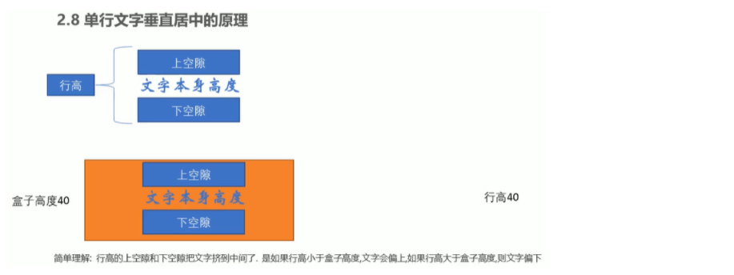

## CSS 背景

### 背景颜色

```css
background-color: 颜色值; /*默认是 transparent(透明)*/
```

### 背景图片

```css
background-image: url(地址);
background-image: none /*无背景图片*/
```

### 背景平铺

```css
background-repeat: no-repeat; /*不平铺默认情况下背景图片平铺*/
background-repeat: repeat; /*横向平铺*/
background-repeat: repeat-x; /*横向平铺*/
background-repeat: repeat-y; /*纵向平铺*/
```

### 背景位置

```css
background-position:x(左右) y(上下); /*top | center | bottom | left | right*/
```

### 背景固定

```css
background-attachment: fixed; /*不随着鼠标滑动而滑动*/
```

### 背景复合写法

```css
background: black url(images/bg.jpg) no-repeat fixed center top;
```

### 背景半透明

```css
background: rgba(0, 0, 0, 0.3);	/*前三个参数表示颜色，第四个参数表示透明度，范围是（0，1）*/
```

### 背景总结

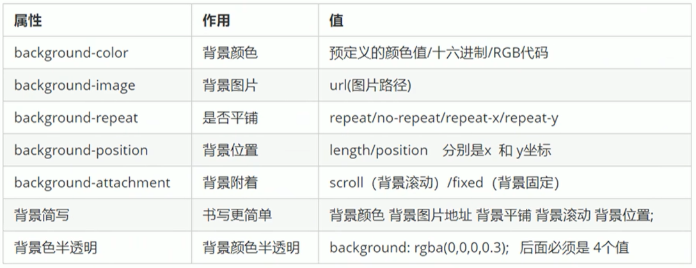

## CSS 三大特性

### 层叠性

> 样式冲突的情况，后面设置的样式会覆盖前面设置的样式

### 继承性

>子标签继承父标签的某些样式，如文本、颜色、字体和行高

```css
body {
    color: pink;
    font: 12px/1.5 'Microsoft YaHei'; /*1.5 表示子元素行高为子元素字体的 1.5 倍*/
}

div {
    /*这个 1.5 就是当前元素文字大小 font-size 的 1.5 倍 所以当前 div 的行高就是 21 像素*/
    font-size: 14px;
}
```

### 优先级

>根据权重优先选择样式

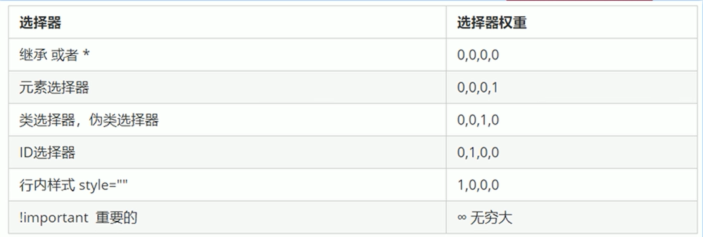

#### 权重叠加问题

- 复合选择器会有权重叠加问题
- 权重虽然会叠加，但是永远不会有进位

```css
/* ul li 的权重是 0,0,0,1 + 0,0,0,1  =  0,0,0,2 ===> 2 */
ul li {
    color: green;
}

/* li 的权重是 0,0,0,1 ===> 1 */
li {
    color: red;
}

/* .nav li  的权重是  0,0,1,0  +  0,0,0,1  =  0,0,1,1 ===> 11 */
.nav li {
    color: pink;
}
```

## 盒子模型

> 盒子模型包括边框、内边距、外边距、内容

### 盒子模型图

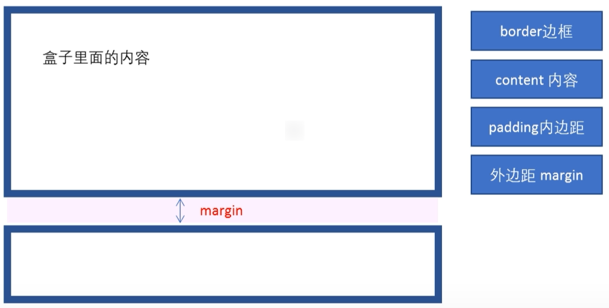

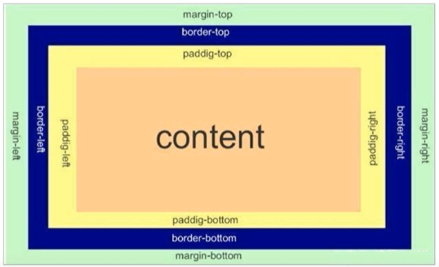

### 边框 border

| 属性                       | 作用                    | 样式                                     |
| -------------------------- | ----------------------- | ---------------------------------------- |
| border-width               | 定义边框粗细，单位是 px |                                          |
| border-style               | 边框样式                | solid 实线 \| dashed 虚线 \| dotted 点线 |
| border-color               | 边框颜色                |                                          |
| border-collapse: collapse; | 细线边框                | 原理是把表格与表格之间的边框合成一个     |

### 边框的复合写法

```css
/* 上边框 */
border-top: 5px solid pink;
/* 下边框 */
border-bottom: 10px dashed purple;
```

### 内边距 padding

| 属性           | 作用     |
| -------------- | -------- |
| padding-left   | 左内边距 |
| padding-right  | 右内边距 |
| padding-top    | 上内边距 |
| padding-bottom | 下内边距 |

### 内边距复合写法

| 属性                        | 作用                                                      |
| --------------------------- | --------------------------------------------------------- |
| padding: 5px                | 全内边距都是 5 像素                                       |
| padding: 5px 10px           | 上下内边距都是 5 像素，左右内边距都是 20 像素             |
| padding: 5px 10px 20px      | 上下内边距分别是 5 像素和 20 像素，左右内边距都是 10 像素 |
| padding: 5px 10px 20px 30px | 分别对应上右下左                                          |

**注意：当盒子已经有宽度和高度，再添加内边距，会撑大盒子，因此需要修改宽度和高度**

### 外边距 margin

| 属性                | 作用           |
| ------------------- | -------------- |
| margin-left         | 左外边距       |
| margin-right        | 右外边距       |
| margin-top          | 上外边距       |
| margin-bottom       | 下外边距       |
| margin: 100px auto; | 盒子水平居中   |
| overflow: hidden;   | 解决外边距塌陷 |

### 嵌套块元素垂直外边距塌陷

> 两个嵌套关系的块元素，父元素有上外边距同时子元素也有上外边距，父元素会塌陷较大的外边距值

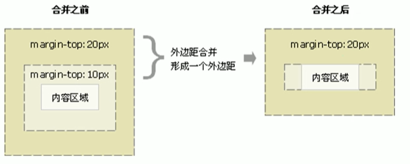

### 清除默认的内外边距

```css
* {
    margin: 0;
    padding: 0;
}
```

**注意：行内元素上下内外边距是无效的，左右内外边距是有效的，可以将行内元素转换成行内块元素**

### Photoshop 基本操作


### 圆角边框

| 属性                       | 作用     |
| -------------------------- | -------- |
| border-radius              | 圆角边框 |
| border-top-left-radius     | 左上角   |
| border-top-right-radius    | 右上角   |
| border-bottom-right-radius | 右下角   |
| border-bottom-left-radius  | 左下角   |

### 盒子阴影

| 属性       | 作用                   |
| ---------- | ---------------------- |
| box-shadow | 盒子阴影               |
| h-shadow   | 水平阴影               |
| h-shadow   | 垂直阴影               |
| blur       | 模糊距离               |
| spread     | 阴影尺寸               |
| color      | 阴影颜色               |
| inset      | 外部阴影设置成内部阴影 |

### 文字阴影

| 属性        | 作用     |
| ----------- | -------- |
| text-shadow | 文字阴影 |
| h-shadow    | 水平阴影 |
| h-shadow    | 垂直阴影 |
| blur        | 模糊距离 |
| color       | 阴影颜色 |

## CSS 浮动

> 浮动可以解决很多标准流无法解决的问题，最常见的应用：让多个块级元素一行内排列显示

### 网页布局第一准则

> 多个块级元素纵向排列找标准流，多个块级元素横向排列找浮动

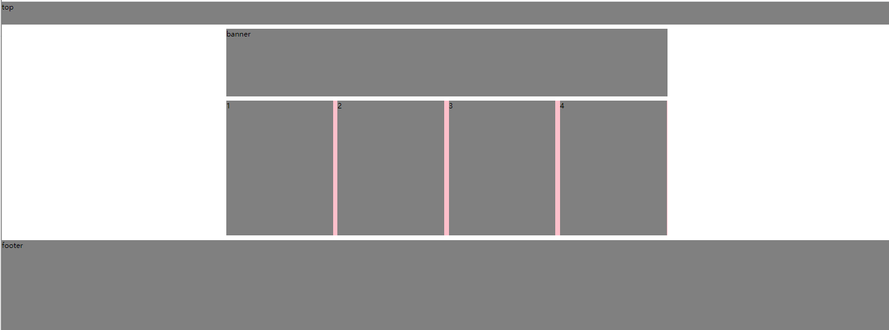

### 浮动属性

| 属性值       | 描述         |
| ------------ | ------------ |
| float：left  | 元素向左浮动 |
| float：right | 元素向右浮动 |

### 浮动特性

- 脱离标准流的控制，浮动起来（脱标）
- 浮动的盒子不在保留原先的位置
- 如果一个盒子设置浮动，另一个盒子不设置浮动，那么设置浮动的盒子会压在不设置浮动的盒子上面


- 如果多个盒子设置浮动，盒子和盒子之间不会覆盖

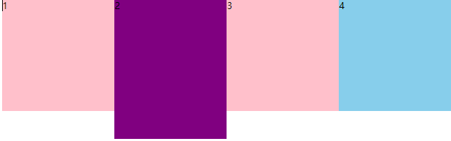

- 元素添加浮动之后都具有**行内块**元素的特征
- 块级盒子没有设置宽度，默认宽度和父级一样宽，但是浮动后，它的宽度根据内容决定
- 浮动的盒子中间没有缝隙
- 浮动元素经常和标准流父级搭配使用：父元素采用标准流排列上下文，内部采用浮动排列子元素

### 常见网页布局

- 标准流
  1. 块级元素：从上到下顺序排列
  2. 行内元素：从左到右顺序排列

- 浮动

- 定位

### 网页布局第二准则

> 先设置盒子大小，在设置盒子位置

### 浮动布局注意点

#### 浮动和标准流的父盒子搭配

> 先用标准流的父元素排列上下位置，之后内部子元素采用浮动排列左右位置

#### 一个元素浮动了，其余的兄弟元素也要浮动

>浮动的盒子指挥影响浮动盒子后面的标准流，不会影响前面的标准流

### 清除浮动

> 为什么要清除浮动？父盒子不设置高度，子盒子又浮动了，又影响下面布局了，就需要清除浮动了

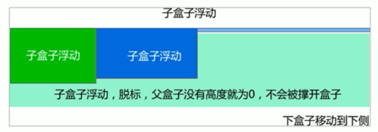

| 属性值      | 描述                       |
| ----------- | -------------------------- |
| clear：both | 同时清除左右两侧浮动的影响 |

**清除浮动的本质是：清除浮动元素脱离标准流造成的影响**

**清除浮动的策略是：闭合浮动，只让浮动在父盒子内部影响，不影响父盒子外面的其他盒子**

### 清除浮动的方法

#### 额外标签法 - 隔墙法

> 在浮动末尾添加一个空的标签

```css
.clear {
    clear: both;
}
```

```html
<div class="box">
    <div class="damao">大毛</div>
    <div class="ermao">二毛</div>
    <div class="ermao">二毛</div>
    <div class="clear"></div>
    <!-- 这个新增的盒子要求必须是块级元素不能是行内元素 -->
</div>
<div class="footer"></div>
```

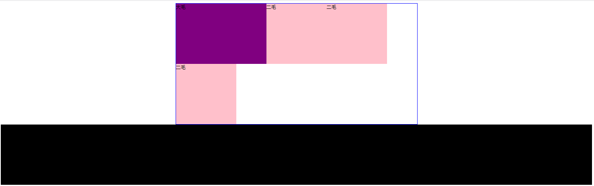

#### 父级添加 overflow 属性

```css
/* 父级清除浮动 */
overflow: hidden;
```

#### 父级添加 after 伪元素

> 额外标签法 - 隔墙法的升级版，相当于在浮动盒子最后添加一个块级元素

```css
.clearfix:after {
    content: "";
    display: block; /*转成块级元素*/
    height: 0;
    clear: both;
    visibility: hidden;
}

/* IE6、7 兼容性 */
.clearfix {
    *zoom: 1;
}
```

#### 父级添加双伪元素

```css
.clearfix:before,
.clearfix:after {
    content: "";
    display: table;
}
.clearfix:after {
    clear: both;
}
.clearfix {
    *zoom: 1;
}
```

## 学成在线案例

### 图片格式

| 格式 | 用途                                                                         |
| ---- | ---------------------------------------------------------------------------- |
| jpg  | 对色彩的信息保留较好、高清、颜色多                                           |
| gif  | 用于图片动画效果                                                             |
| png  | 结合了 gif 和 jpg 的优点，可以切成背景透明的图片                             |
| psd  | photoshop 的专用格式，可以直接从上面复制文字、获得图片、还可以测量大小和距离 |

### 图层切图

1. 右键移动工具
2. 选中图层
3. 右键保存 png

### 合并图层

1. shift+另一个图层
2. ctrl+e 合并图层

### 切片切图

1. 利用切片选中图层
2. 文件、导出、保存为 web 专用的格式，可以选中 png 切成透明图片
3. 另存为

### 插件切图

**Cutterman 插件**

### CSS 书写顺序

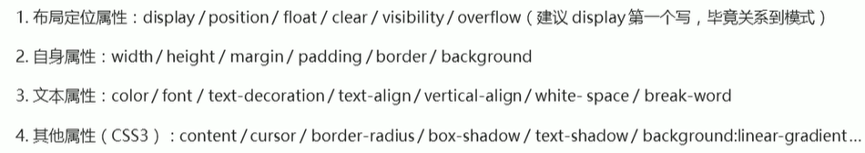

### 页面布局思路

1. 确认页面的版心
2. 分析页面的行模块，再分析列模块，页面布局第一准则
3. 列模块需要浮动布局，先确定大小，再确定位置，页面布局第二准则

### 学成在线


## CSS 定位

### 定位

定位是让盒子自由的在某个盒子内移动位置或固定在屏幕中某个位置，并且压住其他盒子

### 定位组成

定位 = 定位模式 + 边偏移

### 定位模式

| 值                 | 定义     |
| ------------------ | -------- |
| position：static   | 静态定位 |
| position：relative | 相对定位 |
| position：absolute | 绝对定位 |
| position：fixed    | 固定定位 |
| position：sticky   | 粘性定位 |

#### 相对定位

- 相对定位 (relative):相对于原来的位置移动的
- 原来在标准流的位置继续占有，后面的盒子依然以标准流的方式对待

#### 绝对定位

- 如果没有父元素或者父元素没有定位，以浏览器为标准
- 如果祖先元素有定位，则以最近的一级祖先元素为标准
- 绝对定位不会占有原先的位置
- 子绝父相：父盒子需要占有位置所以采用相对定位，子盒子不需要占有位置所以采用绝对定位

#### 固定定位

- 以浏览器的可视窗口为标准
- 固定定位不占有原先的位置

#### 固定版心技巧

**固定在版心右侧位置**

1. 让盒子 left50%，走到浏览器可视区
2. 让盒子 margin-left 版心的一半距离，就可以贴着版心

#### 粘性定位

**固定定位和相对定位的结合**

- 以浏览器的可视窗口为标准
- 粘性定位占有原先的位置
- 必须添加 top、left、right、bottom 其中一个才有效

### 边偏移

| 边偏移属性 | 定义                                         |
| ---------- | -------------------------------------------- |
| top        | 顶端偏移量，定义元素相对于父元素上边线的距离 |
| bottom     | 底部偏移量，定义元素相对于父元素下边线的距离 |
| left       | 左端偏移量，定义元素相对于父元素左边线的距离 |
| right      | 右端偏移量，定义元素相对于父元素右边线的距离 |

### 定位叠放次序 z-index

- 数字越大，盒子越靠上

### 绝对定位水平垂直居中

```css
.box {
    position: absolute;
    /* 1. left 走 50%  父容器宽度的一半 */
    left: 50%;
    /* 2. margin 负值 往左边走 自己盒子宽度的一半 */
    margin-left: -100px;
    top: 50%;
    margin-top: -100px;
    width: 200px;
    height: 200px;
    background-color: pink;
    /* margin: auto; */
}
```

### 定位的特殊特性

1. 行内元素添加绝对或者固定定位，可以直接设置宽度和高度
2. 块级元素添加绝对或者固定定位，如果不给宽度和高度则默认是内容的大小
3. 脱标的盒子不会触发外边距合并
4. 浮动元素只会压住标准流的盒子，不会压住标准流下面的文字
5. 绝对定位和固定定位会压住标准流的盒子和所有内容

### 元素显示和隐藏

#### display

- 不占有原先的位置

| 属性           | 含义                         |
| -------------- | ---------------------------- |
| display：none  | 隐藏对象                     |
| display：block | 转化成块级元素，并且显示元素 |

#### visibility

- 占有原先的位置

| 属性               | 含义     |
| ------------------ | -------- |
| visibility：hidden | 元素隐藏 |

#### overflow

| 属性              | 含义                                       |
| ----------------- | ------------------------------------------ |
| overflow：visible | 溢出的部分显示                             |
| overflow：hidden  | 溢出的部分隐藏                             |
| overflow：scroll  | 溢出的部分显示滚动条，不溢出也显示滚动条   |
| overflow：auto    | 溢出的时候才显示滚动条，不溢出不显示滚动条 |

## 网页布局总结

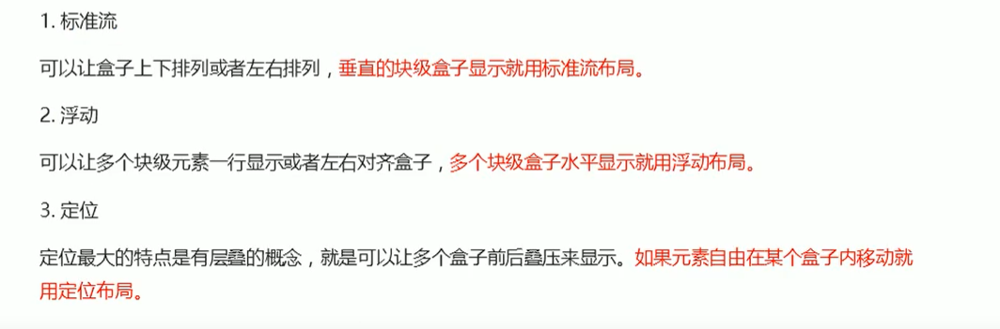

## CSS 高级

### CSS 精灵图

> 多张图片其实是同一张图片，减少清除次数，减轻服务器压力

```css
background: url(images/sprites.png) no-repeat -182px 0;
一般精灵图的值都是负值，因为精灵图以左上角为顶点，一般都是向左或者向上移动
```

### CSS 字体图标

**图标网站下载图标**

https://icomoon.io/app/#/select

**将 font 文件夹放到目录中**

**引入字体文件**

```css
/* 字体声明 */
@font-face {
    font-family: 'icomoon';
    src: url('fonts/icomoon.eot?p4ssmb');
    src: url('fonts/icomoon.eot?p4ssmb#iefix') format('embedded-opentype'),
        url('fonts/icomoon.ttf?p4ssmb') format('truetype'),
        url('fonts/icomoon.woff?p4ssmb') format('woff'),
        url('fonts/icomoon.svg?p4ssmb#icomoon') format('svg');
    font-weight: normal;
    font-style: normal;
    font-display: block;
}
```

**使用时通过图标的代码来表示图标**

**字体图标添加**

通过上传 selection.json，再选中追加的图标，再下载下来

### CSS 三角

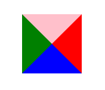

```css
.box {
    width: 0;
    height: 0;
    border-top: 10px solid pink;
    border-right: 10px solid red;
    border-bottom: 10px solid blue;
    border-left: 10px solid green;
}
```

### CSS 用户界面

**鼠标样式**

| 属性                | 值     |
| ------------------- | ------ |
| cursor: default     | 白箭头 |
| cursor: pointer     | 小手   |
| cursor: move        | 移动   |
| cursor: text        | 文本   |
| cursor: not-allowed | 禁止   |

### 页面布局技巧

#### 去除表单轮廓

| 属性          | 值           |
| ------------- | ------------ |
| outline: none | 取消表单轮廓 |

#### 文本域防拖拽

| 属性         | 值             |
| ------------ | -------------- |
| resize: none | 防止拖拽文本域 |

#### 图片和文字垂直居中

> 只能使用在行内元素和行内块元素中

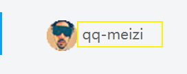

| 属性                   | 值                 |
| ---------------------- | ------------------ |
| vertical-align: bottom | 图片和文字底部     |
| vertical-align: middle | 图片和文字垂直居中 |
| vertical-align: top    | 图片和文字顶部     |

#### 图片底侧空白缝隙

> 原因是图片和盒子底部的基线对齐，而不是和底线对齐

```css
img {
    vertical-align: middle;
    /*display: block;*/
}
```

#### 单行文本溢出省略号显示

| 属性                    | 值                                   |
| ----------------------- | ------------------------------------ |
| white-space: normal     | 如果文字显示不开自动换行             |
| white-space: nowrap     | 如果文字显示不开也必须强制一行内显示 |
| overflow: hidden        | 溢出的部分隐藏起来                   |
| text-overflow: ellipsis | 文字溢出的时候用省略号来显示         |

#### 多行文本溢出省略号显示

```css
overflow: hidden;
text-overflow: ellipsis;
/* 兼容性问题 */
/* 弹性伸缩盒子模型显示 */
display: -webkit-box;
/* 限制在一个块元素显示的文本的行数 */
-webkit-line-clamp: 3;
/* 设置或检索伸缩盒对象的子元素的排列方式 */
-webkit-box-orient: vertical;
```

#### margin 负值的巧妙运用

```css
ul li {
    position: relative;
    float: left;
    list-style: none;
    width: 150px;
    height: 200px;
    border: 1px solid red;
    margin-left: -1px;
}

/* ul li:hover {
1. 如果盒子没有定位，则鼠标经过添加相对定位即可
position: relative;
border: 1px solid blue;

} */
ul li:hover {
    /* 2.如果 li 都有定位，则利用 z-index 提高层级 */
    z-index: 1;
    border: 1px solid blue;
}
```

### CSS 初始化

```css
/* 把我们所有标签的内外边距清零 */
* {
    margin: 0;
    padding: 0
}
/* em 和 i 斜体的文字不倾斜 */
em,
i {
    font-style: normal
}
/* 去掉 li 的小圆点 */
li {
    list-style: none
}

img {
    /* border 0 照顾低版本浏览器 如果 图片外面包含了链接会有边框的问题 */
    border: 0;
    /* 取消图片底侧有空白缝隙的问题 */
    vertical-align: middle
}

button {
    /* 当我们鼠标经过 button 按钮的时候，鼠标变成小手 */
    cursor: pointer
}

a {
    color: #666;
    text-decoration: none
}

a:hover {
    color: #c81623
}

button,
input {
    /* "\5B8B\4F53" 就是宋体的意思 这样浏览器兼容性比较好 */
    font-family: Microsoft YaHei, Heiti SC, tahoma, arial, Hiragino Sans GB, "\5B8B\4F53", sans-serif
}

body {
    /* CSS3 抗锯齿形 让文字显示的更加清晰 */
    -webkit-font-smoothing: antialiased;
    background-color: #fff;
    font: 12px/1.5 Microsoft YaHei, Heiti SC, tahoma, arial, Hiragino Sans GB, "\5B8B\4F53", sans-serif;
    color: #666
}

.hide,
.none {
    display: none
}
/* 清除浮动 */
.clearfix:after {
    visibility: hidden;
    clear: both;
    display: block;
    content: ".";
    height: 0
}

.clearfix {
    *zoom: 1
}
```

