# CSS MOBILE

> 老版的笔记
>
> [黑马程序员 pink 老师前端入门教程，零基础必看的 h5(html5)+css3+移动端前端视频教程](https://www.bilibili.com/video/BV14J4114768/?spm_id_from=333.337.search-card.all.click&vd_source=65e8ed62ff65aeec2427f9b6c8523b9b)

## 视口

- 布局视口：默认 980px，网页到手机上展示，元素很小
- 视觉视口：手机能展示的页面
- 理想视口：布局视口应该和手机宽度保持一致

### meta 视口标签

```html
<meta name="viewport" content="width=device-width, initial-scale=1.0,maximum-scale=1.0, minimum-scale=1.0, user-scalable=no">
```

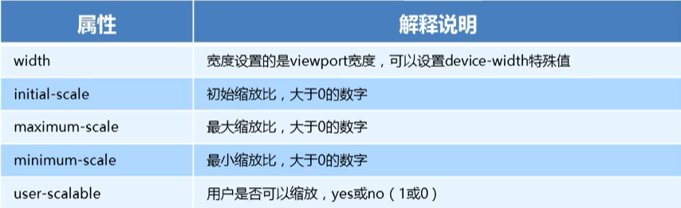

### 标准的 viewport 设置

- 视口宽度和设备保持一致
- 视口的默认缩放笔记 1.0
- 不允许用户自行缩放
- 最大允许的缩放比例 1.0
- 最小允许的缩放比例 1.0

## 二倍图

> 手机会将图片放大，通过大图缩小到小盒子，再通过手机放大，保证图像清晰

### 物理像素

- pc 端一个 px 等于一个物理像素
- 移动端一个 px 等于两个物理像素（retina 屏幕)

### 图片缩放

| 属性                     | 含义       |
| ------------------------ | ---------- |
| background-size: cover   | 完全覆盖   |
| background-size: contain | 等比例拉伸 |

## 移动端开发

### 单独制作移动端页面

- 流式布局
- flex 弹性布局
- less+rem+媒体查询布局
- 混合布局

### 响应式移动端页面

> 随着页面的变化而变化

- 媒体查询
- bootstrap

## css3 盒子模型

- 传统盒子模型=width+border+padding
- CSS3 盒子模型=width(border 和 padding 不会撑大盒子)

```css
/*css3 盒子模型*/
box-sizing:border-box
/*传统盒子模型*/
box-sizing:content-box
```

## 特殊样式

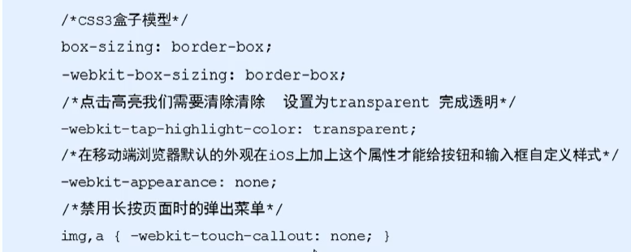

## 流式布局

> 将盒子宽度设置成百分比
>
> 京东首页案例

### 初始化样式

 [normalize.css](..\..\jingdong\H5\css\normalize.css) 

### body 设置

```css
body {
    width: 100%; /*宽度*/
    min-width: 320px; /*最小宽度*/
    max-width: 640px; /*最大宽度*/
    margin: 0 auto;
    font-size: 14px;
    font-family: -apple-system, Helvetica, sans-serif;
    color: #666;
    line-height: 1.5;
}
```

### 顶部布局

- 4 个小 li

- 宽度分别是：8%、10%、57%、25%

  

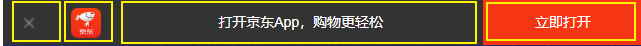

### 搜索框布局

- 两边定位
- 中间标准流
- 外边距塌陷问题，当子盒子添加 margin-top，父盒子会跟着塌陷
- 给父盒子添加 overflow: hidden;解决外边距塌陷问题
- 二倍精灵图

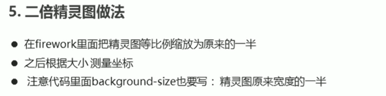

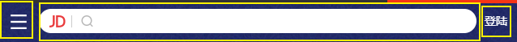

### 品牌日模块

- dpg 图片，京东，有损压缩格式图片，加载速度加快

- webp 图片格式，谷歌，有损压缩格式图片，加载速度加快

## flex 弹性布局

```css
div {
    display: flex;
    width: 80%;
    height: 300px;
    background-color: pink;
    justify-content: space-around;
}
div span {
    /* width: 150px; */
    height: 100px;
    background-color: purple;
    margin-right: 5px;
    flex: 1; /*平均分配*/
}
```

### 父项属性

#### flex-direction

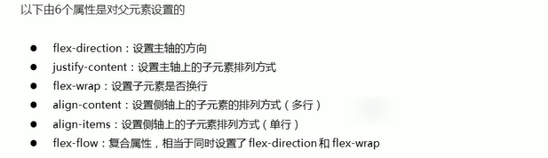

```css
flex-direction: row;
flex-direction: column;
```

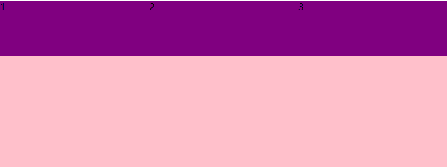

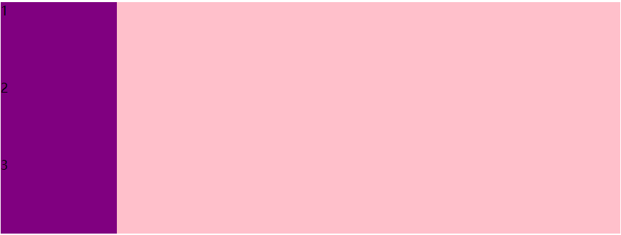

#### justify-content

```css
/* 先两边贴边，在分配剩余的空间 */
justify-content: space-between;
```

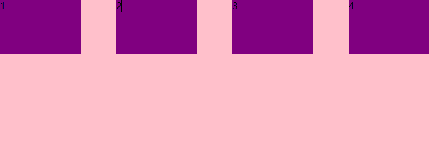

#### flex-wrap

```css
/* flex 布局中，默认的子元素是不换行的，如果装不开，会缩小子元素的宽度，放到父元素里面  */
/* flex-wrap: nowrap;*/
flex-wrap: wrap;
```

#### align-items 单行

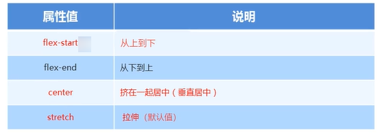

#### align-content 多行

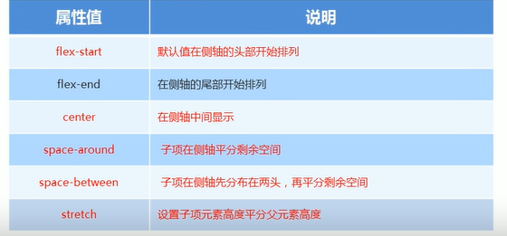

#### flex-flow

> flex-direction+flex-wrap 复合写法

### 子项属性

#### flex：占多少份

#### order：占位

#### align-self：单独布局

## rem 移动布局

> rem 的优点就是可以通过修改 html 里面的文字大小来改变页面中元素的大小可以整体控制

### rem 单位

- em 相对于父元素的字体大小
- rem 相对于 html 的元素的字体大小

### 媒体查询

@media 可以针对不同的屏幕尺寸设置不同的样式

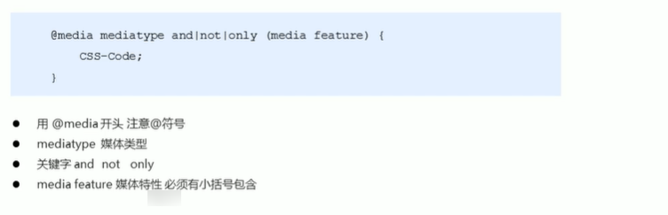

### rem 和媒体查询一起使用

- 媒体查询：页面样式会随着页面大小变化而变化
- rem 会随着 html 的大小变化而变化

```css
@media screen and (min-width: 320px) {
    html {
        font-size: 50px;
    }
}
@media screen and (min-width: 640px) {
    html {
        font-size: 100px;
    }
}
.top {
    height: 1rem;
    font-size: .5rem;
    background-color: green;
    color: #fff;
    text-align: center;
    line-height: 1rem;
}
```

### 引入资源

```css
<link rel="stylesheet" href="style320.css" media="screen and (min-width: 320px)">
<link rel="stylesheet" href="style640.css" media="screen and (min-width: 640px)">
```

### less 基础

> css 没有计算能力
>
> less 是 css 预处理语言

#### less 变量

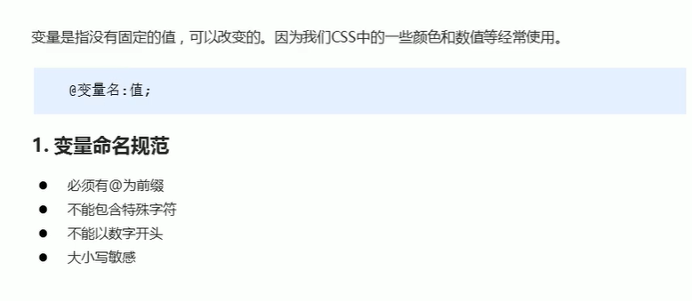

```less
// 定义一个粉色的变量
@color: pink;  
// 错误的变量名  @1color   @color~@#
// 变量名区分大小写  @color  和  @Color 是两个不同的变量
// 定义了一个 字体为 14 像素的变量
@font14: 14px;
body {
    background-color: @color;
}
div {
    color: @color;
    font-size: @font14;
}
a {
    font-size: @font14;
}
```

#### less 编译

> 将 less 文件转换成 css 文件

#### less 嵌套

> 子元素的样式直接写到父元素里面

```less
.header {
    width: 200px;
    height: 200px;
    background-color: pink;
    // 1. less 嵌套 子元素的样式直接写到父元素里面就好了
    a {
        color: red;
        // 2. 如果有伪类、交集选择器、伪元素选择器 我们内层选择器的前面需要加&
        &:hover {
            color: blue;
        }
    }
}
.nav {
    .logo {
        color: green;
    }
    &::before {
        content: "";
    }
}
```

#### less 运算

```css
@baseFont: 50px;
html {
    font-size: @baseFont;
}
@border: 5px + 5;
div {
    width: 200px - 50;
    height: (200px + 50px ) * 2;
    border: @border solid red;
    background-color: #666 - #222;
}
img {
    width: 82rem / @baseFont;
    height: 82rem / @baseFont;
}
// 1. 我们运算符的左右两侧必须敲一个空格隔开
// 2. 两个数参与运算  如果只有一个数有单位，则最后的结果就以这个单位为准
// 3. 两个数参与运算，如果 2 个数都有单位，而且不一样的单位 最后的结果以第一个单位为准
```

### rem 适配方案

#### 方案一

- less
- 媒体查询
- rem

#### 方案二

> 不需要写不同屏幕的媒体查询
>
> cssrem 插件

- flexible.js
- rem


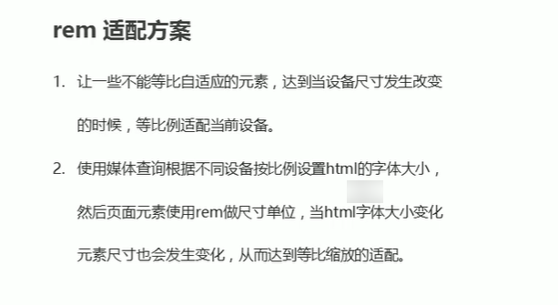

### rem 最终适配方案

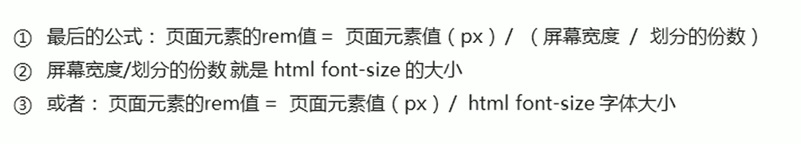

### 导入样式

```css
// 首页的样式 less 文件
@import "common";
// @import 导入的意思 可以把一个样式文件导入到另外一个样式文件里面
```

## 响应式布局

### 原理

> 媒体查询


### bootstrap 框架

> 通过预定义的 html 和 css，直接 cv 完成样式
>
> 也可以自己写样式覆盖 bootstrap 的样式

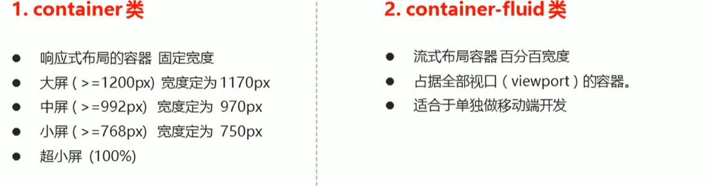

### 栅格系统

> 12 列

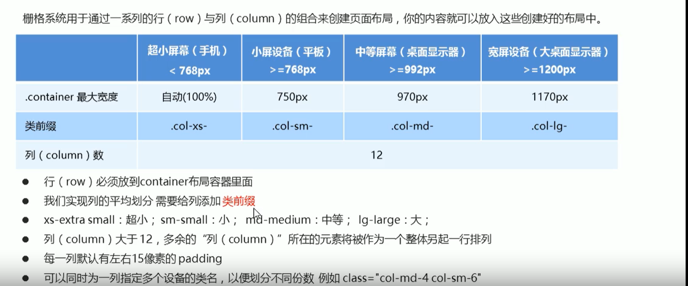

#### 列嵌套

```html
<div class="container">
    <div class="row">
        <div class="col-md-4">
            <!-- 我们列嵌套最好加 1 个行 row 这样可以取消父元素的 padding 值 而且高度自动和父级一样高 -->
            <div class="row">
                <div class="col-md-4">a</div>
                <div class="col-md-8">b</div>
            </div>
        </div>
        <div class="col-md-4">2</div>
        <div class="col-md-4">3</div>
    </div>
</div>
```

#### 列偏移

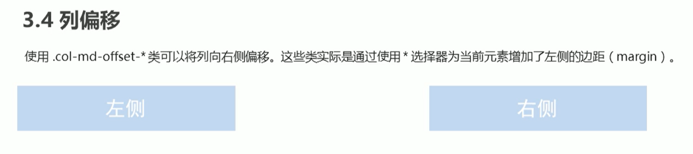

#### 列排序

```html
<div class="container">
    <div class="row">
        <div class="col-md-4 col-md-push-8">左侧</div>
        <div class="col-md-8 col-md-pull-4">右侧</div>
    </div>
</div>
```

#### 响应式工具

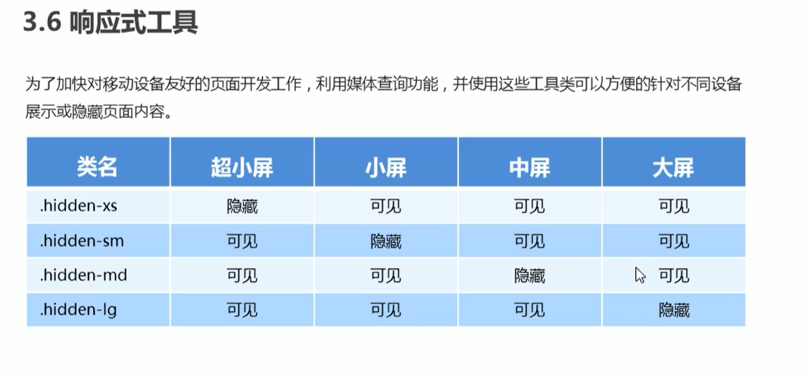

## vw 和 wh

- 视口宽度单位
- 视口高度单位
- 1vw=1/100 视口宽度
- 1vh=1/100 视口高度
- %是相对于父元素，vw 是相对于视口
- 像素大厨工具
- px2vw 插件

```css
div{
    width:13.3333vw;
    height:13.3333vw;
    background-color: pink;
}
```

