# H5C3 提高

> 老版的笔记
>
> [黑马程序员 pink 老师前端入门教程，零基础必看的 h5(html5)+css3+移动端前端视频教程](https://www.bilibili.com/video/BV14J4114768/?spm_id_from=333.337.search-card.all.click&vd_source=65e8ed62ff65aeec2427f9b6c8523b9b)

## 语义化标签

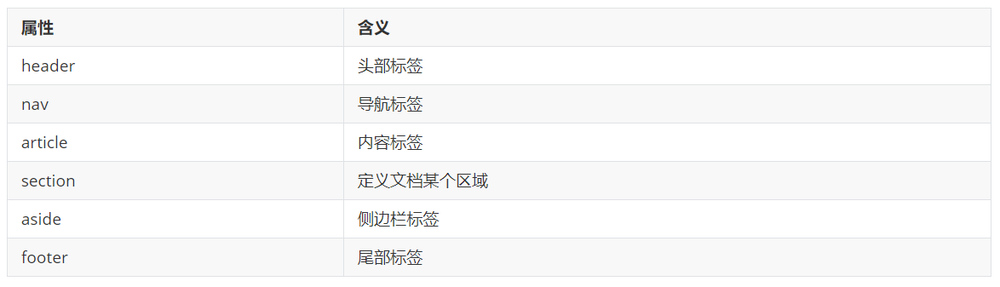

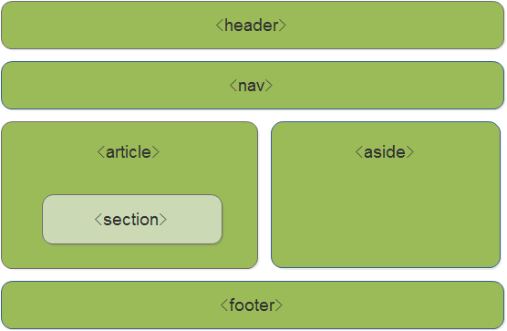

## 多媒体标签

### 视频标签 video

> 因为浏览器兼容性问题，尽量使用 MP4 格式的视频

```html
<video src="media/mi.mp4" autoplay="autoplay" muted="muted"  loop="loop" poster="media/mi9.jpg"></video>
```

### video 常用属性

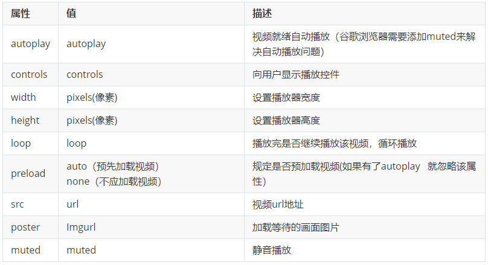

### 音频标签 audio

> 因为浏览器兼容性问题，尽量使用 MP3 格式的音频

**使用语法：**

```html
<audio src="media/music.mp3" autoplay="autoplay" controls="controls"></audio>
```

### audio 常用属性

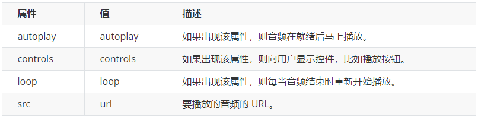

## 新增的表单元素

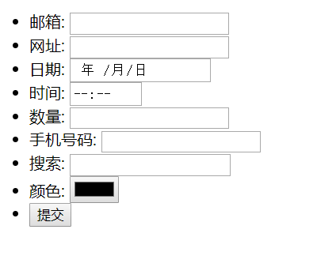

```html
<!-- 我们验证的时候必须添加 form 表单域 -->
<form action="">
    <ul>
        <li>邮箱：<input type="email" /></li>
        <li>网址：<input type="url" /></li>
        <li>日期：<input type="date" /></li>
        <li>时间：<input type="time" /></li>
        <li>数量：<input type="number" /></li>
        <li>手机号码：<input type="tel" /></li>
        <li>搜索：<input type="search" /></li>
        <li>颜色：<input type="color" /></li>
        <!-- 当我们点击提交按钮就可以验证表单了 -->
        <li> <input type="submit" value="提交"></li>
    </ul>
</form>
```

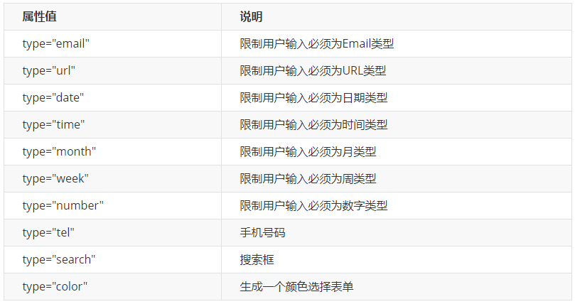

## 新增的表单属性

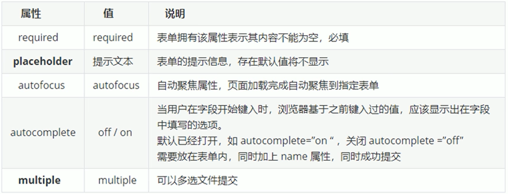

```html
<form action="">
    <input type="search" name="sear" id="" required="required" placeholder="pink老师" autofocus="autofocus"
           autocomplete="off">
    <input type="file" name="" id="" multiple="multiple">
    <input type="submit" value="提交">
</form>
```

## CSS3 新增选择器 

### 属性选择器

> E[att="val"]经常使用

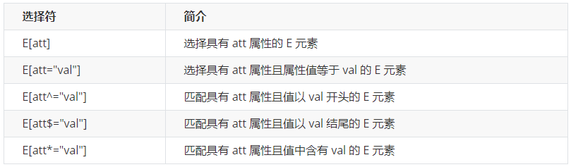

**示例代码**

```css
/* 只选择 type =text 文本框的 input 选取出来 */
input[type=text] {
    color: pink;
}
/* 选择首先是 div 然后 具有 class 属性 并且属性值 必须是 icon 开头的这些元素 */
div[class^=icon] {
    color: red;
}
/* 选择首先是 section 然后 具有 class 属性 并且属性值 必须是 data 结尾的这些元素 */
section[class$=data] {
    color: blue;
}
```

- 属性选择器：根据标签中的属性来选择元素
- 属性选择器可以根据元素特定属性的来选择元素
- 属性选择器也可以选择出来自定义的属性
- 注意：类选择器、属性选择器、伪类选择器，权重为 10

### 结构伪类选择器

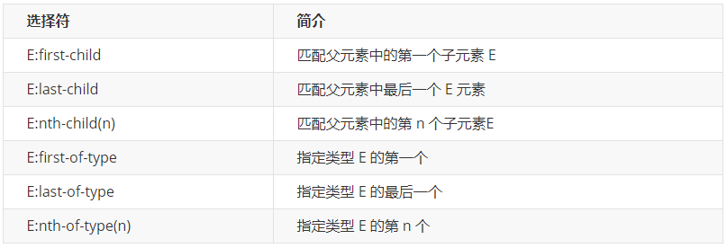

#### E:first-child

```html
<style>
    ul li:first-child{
        background-color: red;
    }
</style>

<ul>
    <li>列表项一</li>
    <li>列表项二</li>
    <li>列表项三</li>
    <li>列表项四</li>
</ul>
```

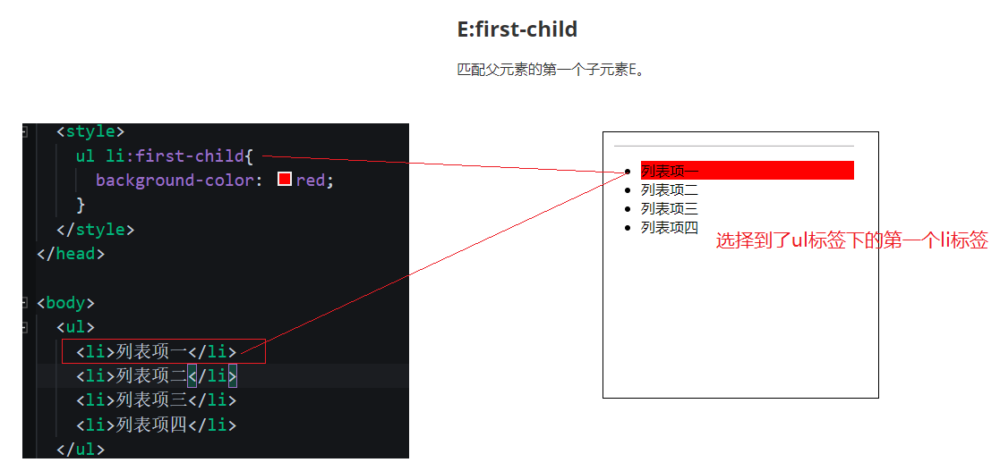

#### E:nth-child

> E:nth-child 最常用

**匹配到父元素的序号为奇数的子元素**

```css
ul li:nth-child(odd){
    background-color: gray;
}
```

**匹配到父元素的序号为偶数的子元素**

```css
ul li:nth-child(even){
    background-color: gray;
}
```

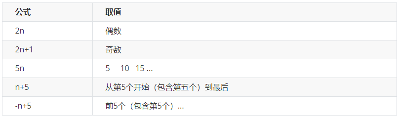

#### E:nth-child 与 E:nth-of-type

```html
<style>
    ul li:nth-child(2){
        /* 字体变成红色 */
        color: red;
    }

    ul li:nth-of-type(2){
        /* 背景变成绿色 */
        background-color: green;
    }
</style>


<ul>
    <li>列表项一</li>
    <p>乱来的 p 标签</p>
    <li>列表项二</li>
    <li>列表项三</li>
    <li>列表项四</li>
</ul>
```

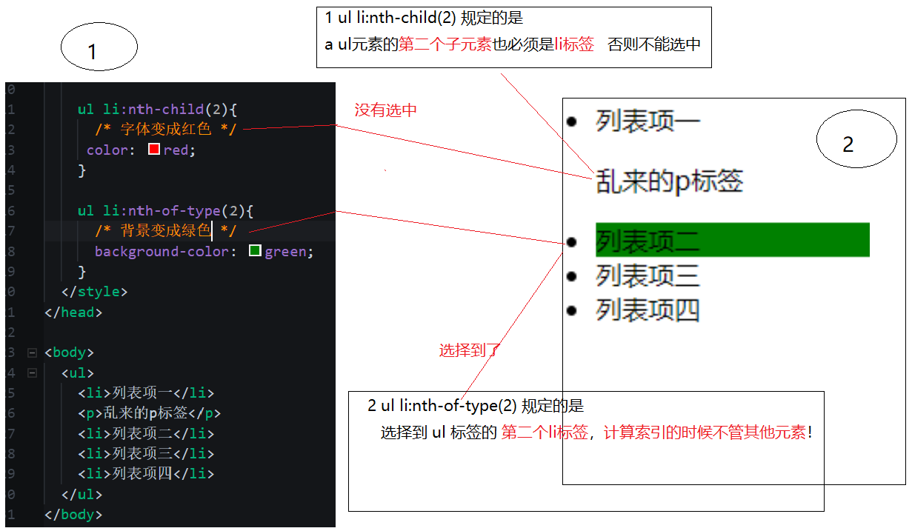

- 注意：类选择器、属性选择器、伪类选择器，权重为 10

### 伪元素选择器

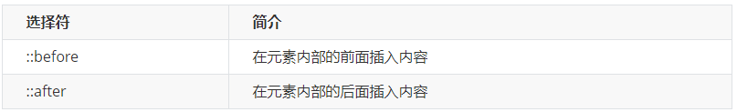

- before 和 after 创建一个元素，但是属于行内元素
- 新创建的这个元素在文档树中是找不到的，所以我们称为伪元素
- before 和 after 必须有 content 属性 
- before 在父元素内容的前面创建元素，after 在父元素内容的后面插入元素，伪元素选择器和标签选择器一样，权重为 1

## CSS3 盒子模型

- box-sizing: content-box  盒子大小为 width + padding + border（以前默认的）
- box-sizing: border-box  盒子大小为 width，不会撑大盒子

```css
* {
    margin: 0;
    padding: 0;
    box-sizing: border-box;
}
```

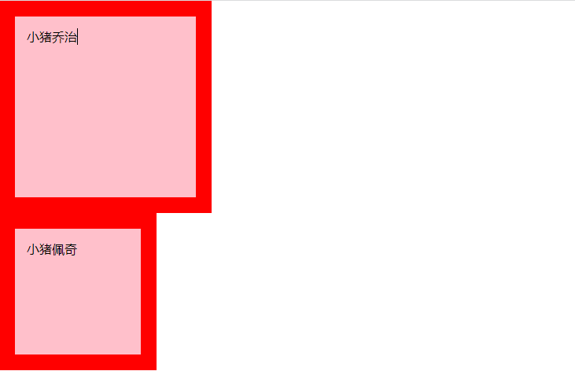

## 图标变模糊

```css
-->  filter:   函数(); 
-->  例如： filter: blur(5px);  
-->  blur模糊处理  数值越大越模糊
```


## 计算盒子宽度

```css
width: calc(100% - 80px);
```

## CSS3 过渡

> 过渡动画：是从一个状态渐渐的过渡到另外一个状态

```css
transition: 要过渡的属性  花费时间  运动曲线  何时开始;
```

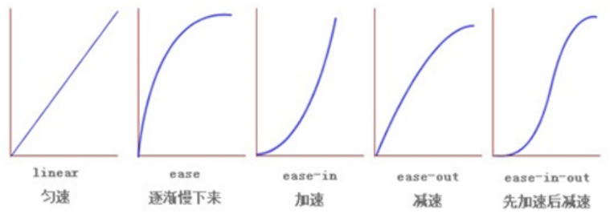
