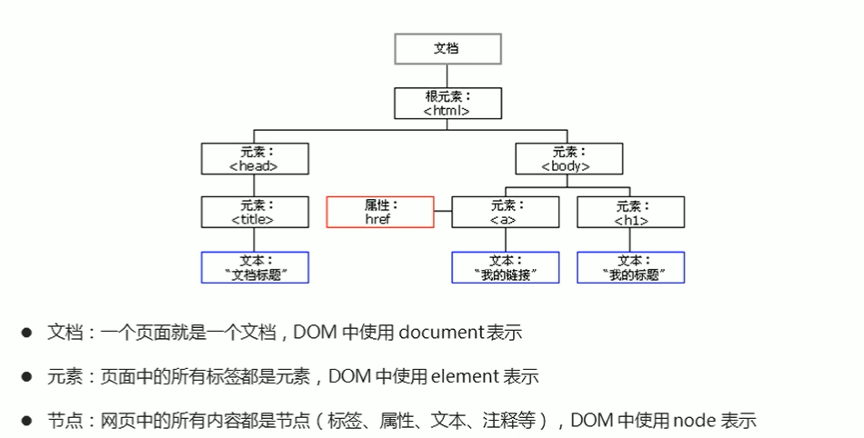
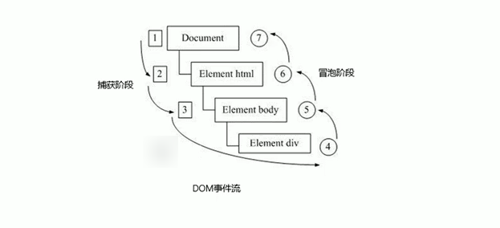
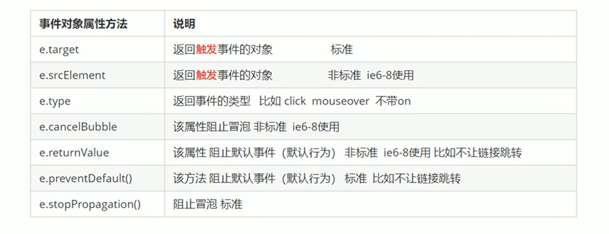
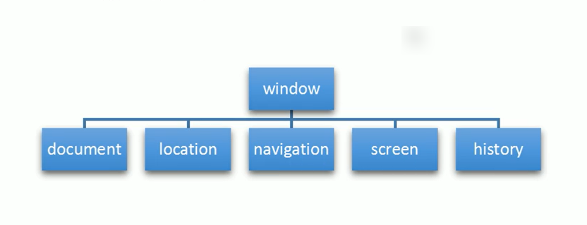
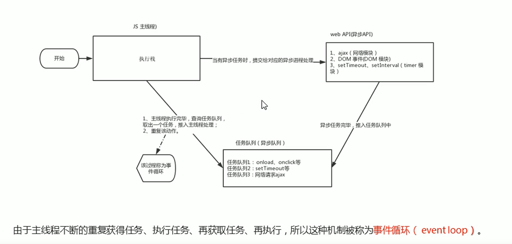

# JavaScript 进阶

> 老版的笔记
>
> [JavaScript 基础语法-dom-bom-js-es6 新语法-jQuery-数据可视化 echarts 黑马 pink 老师前端入门基础视频教程 (500 多集) 持续](https://www.bilibili.com/video/BV1Sy4y1C7ha/?spm_id_from=333.337.search-card.all.click&vd_source=65e8ed62ff65aeec2427f9b6c8523b9b)

> ECMA(基础) 
>
> BOM(浏览器) 
>
> DOM(文档对象模型)

## DOM

> 文档对象模型，是一套标准编程接口

### DOM 树

> 文档：一个页面就是一个文档 (document)
>
> 元素：页面中所有的标签都是元素 (element)
>
> 节点：网页中所有的内容都是节点 (标签，属性，文本，注释...)(node)



### 获取页面元素对象

#### 根据 ID 获取

- 返回值是一个元素对象
- console.dir() 是展示对象属性...的方法

```javascript
<div id="time">
    2019-9-9
</div>

var ele = document.getElementById('time');
console.dir(ele);
```

#### 根据标签名 (TagName) 获取

- 返回值是一个伪数组对象，返回值无论有无元素对象，返回值都是伪数组
- 通过父素获取子元素的值，必须指明父元素是哪个元素对象
- element[指定父元素索引].getElementsByTagName('子元素标签名');

```javascript
<ul>
	<li>知否知否，应是等你好久</li>
	<li>知否知否，应是等你好久</li>
	<li>知否知否，应是等你好久</li>
</ul>

var lis = document.getElementsByTagName('li');

for (var i = 0; i < lis.length; i++) {
    console.log(lis[i]);
}
```

#### 根据 Class 获取

- 根据类名获得:getElementsByTagName('标签名')

#### HTML5 新增的方法获取

```javascript
document.querySelector('选择器'); // 根据指定选择器返回第一个元素对象 类 .box  id #nav
```

```javascript
document.querySelectorAll('选择器'); // 根据指定选择器返回
```

- 注意:querySelector 和 querySelectorAll 里面的选择器需要加符号
- document.querySelector('#nav');  

### 特殊元素获取

#### 获取 body 元素  

```javascript
doucumnet.body // 返回 body 元素对象
```

#### 获取 html 元素  

```javascript
document.documentElement // 返回 html 元素对象
```

## 事件

### 事件三要素

```javascript
//(1) 事件源 事件被触发的对象
var btn = document.getElementById('btn');
//(2) 事件类型 什么事件 比如鼠标点击 (onclick)
<button id="btn">唐伯虎</button>
//(3) 事件处理程序 触发时间的动作
btn.onclick = function () {
    alert('点秋香');
}
```

### 事件类型

| 事件          | 事件               |
| ------------- | ------------------ |
| onclick       | 鼠标点击事件       |
| onfocus       | 获得焦点事件       |
| onblur        | 失去焦点事件       |
| onmouseover   | 鼠标经过事件       |
| onmouseout    | 鼠标离开事件       |
| onmousemove   | 鼠标移动事件       |
| onmouseup     | 鼠标谈起事件       |
| onmousedown   | 鼠标按下事件       |
| oncontextmenu | 禁止浏览器右键菜单 |
| onselectstart | 禁止选中文字       |

## 操作元素

### innerText 和 innerHTML

- innerText 只显示标签内的内容，并且不保留空格和换行

- innerHTML 不仅显示内容，还显示标签，并且保留空格和换行

### 操作元素

- 修改内容：innerText、innerHTML
- 修改图片：img：src、alt、title
- 修改表单：input：type、value、checked、selected、disabled
- 修改样式：element.style、element.className

## 操作属性

### 获取属性值

- element.属性
- element.getAttribute(“自定义属性”)

### 设置属性值

- element.属性= '值'
- element.setAttribute('属性', '值')

### 移出属性值

- removeAttribute(属性)

### 补充

```javascript
div.className = 'navs';
div.setAttribute('class', 'footer'); // class 特殊  这里面写的就是 class 不是 className
```

### H5 自定义属性

- 自定义属性以 data-开头作为属性名并且赋值
- dataset 是所有自定义属性的集合
- class=’data-list-name‘dataset.listName 采用驼峰命名法获取自定义属性

```html
<body>
    <div data-index="2" data-list-name="andy"></div>
    <script>
        var div = document.querySelector('div');
        console.log(div.getAttribute('data-index'));
        console.log(div.getAttribute('data-list-name'));
        // h5 新增的获取自定义属性的方法 它只能获取 data-开头的
        // dataset 是一个集合里面存放了所有以 data 开头的自定义属性
        console.log(div.dataset);
        console.log(div.dataset.index);
        console.log(div.dataset['index']);
        // 如果自定义属性里面有多个 - 链接的单词，我们获取的时候采取 驼峰命名法
        console.log(div.dataset.listName);
        console.log(div.dataset['listName']);
    </script>
</body>
```

### tab 栏制作

- 通过排他思想，点击 li 时设置当前 li 的样式
- 通过设置自定义属性 index，获取当前 li 的 index 位置

```html
<!DOCTYPE html>
<html lang="en">
    <head>
        <meta charset="UTF-8">
        <meta name="viewport" content="width=device-width, initial-scale=1.0">
        <meta http-equiv="X-UA-Compatible" content="ie=edge">
        <title>Document</title>
        <style>
            * {
                margin: 0;
                padding: 0;
            }
            li {
                list-style-type: none;
            }
            .tab {
                width: 978px;
                margin: 100px auto;
            }
            .tab_list {
                height: 39px;
                border: 1px solid #ccc;
                background-color: #f1f1f1;
            }
            .tab_list li {
                float: left;
                height: 39px;
                line-height: 39px;
                padding: 0 20px;
                text-align: center;
                cursor: pointer;
            }
            .tab_list .current {
                background-color: #c81623;
                color: #fff;
            }
            .item_info {
                padding: 20px 0 0 20px;
            }
            .item {
                display: none;
            }
        </style>
    </head>
    <body>
        <div class="tab">
            <div class="tab_list">
                <ul>
                    <li class="current">商品介绍</li>
                    <li>规格与包装</li>
                    <li>售后保障</li>
                    <li>商品评价（50000）</li>
                    <li>手机社区</li>
                </ul>
            </div>
            <div class="tab_con">
                <div class="item" style="display: block;">
                    商品介绍模块内容
                </div>
                <div class="item">
                    规格与包装模块内容
                </div>
                <div class="item">
                    售后保障模块内容
                </div>
                <div class="item">
                    商品评价（50000）模块内容
                </div>
                <div class="item">
                    手机社区模块内容
                </div>
            </div>
        </div>
        <script>
            // 获取元素
            var tab_list = document.querySelector('.tab_list');
            var lis = tab_list.querySelectorAll('li');
            var items = document.querySelectorAll('.item');
            // for 循环绑定点击事件
            for (var i = 0; i < lis.length; i++) {
                // 开始给 5 个小 li 设置索引号 
                lis[i].setAttribute('index', i);
                lis[i].onclick = function () {
                    // 1. 上的模块选项卡，点击某一个，当前这一个底色会是红色，其余不变（排他思想）修改类名的方式
                    // 干掉所有人 其余的 li 清除 class 这个类
                    for (var i = 0; i < lis.length; i++) {
                        lis[i].className = '';
                    }
                    // 留下我自己 
                    this.className = 'current';
                    // 2. 下面的显示内容模块
                    var index = this.getAttribute('index');
                    console.log(index);
                    // 干掉所有人 让其余的 item 这些 div 隐藏
                    for (var i = 0; i < items.length; i++) {
                        items[i].style.display = 'none';
                    }
                    // 留下我自己 让对应的 item 显示出来
                    items[index].style.display = 'block';
                }
            }
        </script>
    </body>
</html>
```

## 节点操作

> dom 获取元素和节点层次关系获取元素

### 节点概述

- 节点类型 nodeType
  - 元素节点为 1
  - 属性节点为 2
  - 文本节点为 3（空格、换行...）
- 节点名称 nodeName
- 节点值 nodeValue

### 节点层级

| 节点                               | 属性                               |
| ---------------------------------- | ---------------------------------- |
| 父节点                             | parentNode                         |
| 子节点 (包换各种节点类型)          | childNodes                         |
| 子元素节点                         | children                           |
| 第一个节点                         | firstChild                         |
| 最后一个节点                       | lastChild                          |
| 第一个元素节点                     | firstElementChild                  |
| 最后一个元素节点                   | lastElementChild                   |
| 第一个元素节点                     | children[0]                        |
| 最后一个元素节点                   | children[children.length-1]        |
| 下一个兄弟节点                     | nextSibling                        |
| 上一个兄弟节点                     | previousSibling                    |
| 下一个兄弟元素节点                 | nextElementSibling                 |
| 上一个兄弟元素节点                 | previousElementSibling             |
| 创建元素节点                       | createElement                      |
| 添加节点                           | node.appendChild(child)            |
| 添加节点                           | node.insertBefore(child, 指定元素) |
| 删除元素节点                       | node.removeChild(child)            |
| 浅拷贝：只复制标签不复制里面的内容 | node.cloneNode()                   |
| 深拷贝：复制标签复制里面的内容     | node.cloneNode(true)               |

### 阻止链接跳转

```
<a href='javascript:void(0);'>删除</a>
<a href='javascript:;'>删除</a>
```

### 创建元素的三种方式

- innerHTML:拼接字符串效率低，如果采用数组效率更高
- document.createElement()：效率高
- document.write()：重绘 HTML

### 动态生成表格

```html
<!DOCTYPE html>
<html lang="en">
    <head>
        <meta charset="UTF-8">
        <meta name="viewport" content="width=device-width, initial-scale=1.0">
        <meta http-equiv="X-UA-Compatible" content="ie=edge">
        <title>Document</title>
        <style>
            table {
                width: 500px;
                margin: 100px auto;
                border-collapse: collapse;
                text-align: center;
            }
            td,
            th {
                border: 1px solid #333;
            }
            thead tr {
                height: 40px;
                background-color: #ccc;
            }
        </style>
    </head>
    <body>
        <table cellspacing="0">
            <thead>
                <tr>
                    <th>姓名</th>
                    <th>科目</th>
                    <th>成绩</th>
                    <th>操作</th>
                </tr>
            </thead>
            <tbody>
            </tbody>
        </table>
        <script>
            // 1.先去准备好学生的数据
            var datas = [{
                name: '魏璎珞',
                subject: 'JavaScript',
                score: 100
            }, {
                name: '弘历',
                subject: 'JavaScript',
                score: 98
            }, {
                name: '傅恒',
                subject: 'JavaScript',
                score: 99
            }, {
                name: '明玉',
                subject: 'JavaScript',
                score: 88
            }, {
                name: '大猪蹄子',
                subject: 'JavaScript',
                score: 0
            }];
            // 2. 往 tbody 里面创建行：有几个人（通过数组的长度）我们就创建几行
            var tbody = document.querySelector('tbody');
            for (var i = 0; i < datas.length; i++) { // 外面的for循环管行 tr
                // 1. 创建 tr行
                var tr = document.createElement('tr');
                tbody.appendChild(tr);
                // 2. 行里面创建单元格(跟数据有关系的3个单元格) td 单元格的数量取决于每个对象里面的属性个数  for循环遍历对象 datas[i]
                for (var k in datas[i]) { // 里面的for循环管列 td
                    // 创建单元格 
                    var td = document.createElement('td');
                    // 把对象里面的属性值 datas[i][k] 给 td  
                    // console.log(datas[i][k]);
                    td.innerHTML = datas[i][k];
                    tr.appendChild(td);
                }
                // 3. 创建有删除2个字的单元格 
                var td = document.createElement('td');
                td.innerHTML = '<a href="javascript:;">删除 </a>';
                tr.appendChild(td);
            }
            // 4. 删除操作 开始 
            var as = document.querySelectorAll('a');
            for (var i = 0; i < as.length; i++) {
                as[i].onclick = function () {
                    // 点击 a 删除 当前 a 所在的行 (链接的爸爸的爸爸)  node.removeChild(child)  
                    tbody.removeChild(this.parentNode.parentNode)
                }
            }
            // for(var k in obj) {
            //     k 得到的是属性名
            //     obj[k] 得到是属性值
            // }
        </script>
    </body>
</html>
```

## DOM 个核心总结

### 创建 DOM 元素

- document.write
- innerHTML
- document.createElement

### 增加到页面中

- appendChild
- insertBefore

### 删除

- removeChild

### 修改

- 元素属性:src、href、title
- 元素内容:innerHTML、innerText
- 表单元素：value、type、disabled
- 元素样式：style、className

### 查找

- getElementById、getElementByTagName
- querySelector、querySelectorAll
- 节点层级操作：parentNode、children、previousElementSibling、nextElementSibling

### 属性操作

- setAttribute
- getAttribute
- removeAttribute

### 事件操作

| 事件          | 事件               |
| ------------- | ------------------ |
| onclick       | 鼠标点击事件       |
| onfocus       | 获得焦点事件       |
| onblur        | 失去焦点事件       |
| onmouseover   | 鼠标经过事件       |
| onmouseout    | 鼠标离开事件       |
| onmousemove   | 鼠标移动事件       |
| onmouseup     | 鼠标谈起事件       |
| onmousedown   | 鼠标按下事件       |
| oncontextmenu | 禁止浏览器右键菜单 |
| onselectstart | 禁止选中文字       |

## DOM 高级

### 注册事件两种方式

```javascript
//传统方式：只能给同一个元素注册一个事件
element.onclick=function(){}
//事件监听注册事件：可以给同一个元素注册多个事件
element.addEventListener('click',function(){})
//ie9 以前使用，兼容性问题
//element.attachEvent('click',function(){}) 
```

### 删除事件两种方式

```javascript
//传统方式：解绑注册事件
element.onclick = null;
//删除事件：不要使用匿名函数
element.removeEventListener('click', fn)
//ie9 以前使用，兼容性问题
element.detachEvent('onclick', fn);
```

### DOM 事件流三个阶段

> 事件发生时会在元素节点之间按照特定的顺序传播，这个传播过程叫做 DOM 事件流

- 捕获阶段

```javascript
// 1. JS 代码中只能执行捕获或者冒泡其中的一个阶段。
// 2. onclick 和 attachEvent（ie）只能得到冒泡阶段。
// 3. 捕获阶段 如果 addEventListener 第三个参数是 true 那么则处于捕获阶段  document -> html -> body -> father -> son
var son = document.querySelector('.son');
son.addEventListener('click', function () {
    alert('son');
}, true);
var father = document.querySelector('.father');
father.addEventListener('click', function () {
    alert('father');
}, true);

//father -> son
```

- 当前目标阶段
- 冒泡阶段

```javascript
// 4. 冒泡阶段 如果 addEventListener 第三个参数是 false 或者 省略 那么则处于冒泡阶段  son -> father ->body -> html -> document
var son = document.querySelector('.son');
son.addEventListener('click', function () {
    alert('son');
}, false);
var father = document.querySelector('.father');
father.addEventListener('click', function () {
    alert('father');
}, false);

//son -> father
```



### 事件对象 event

- 事件对象 event 是监听事件的对象，是事件的一系列集合，由系统自动创建**，是一个形参，不需要传递实参**

```javascript
// 事件对象
var div = document.querySelector('div');
div.onclick = function (e) {
    console.log(e);
}
```

### 事件对象属性

- e.target 指的是触发事件的元素，this 指的是绑定事件的元素



#### 阻止默认行为

```javascript
element.addEventListener('click', function (e) {
    e.preventDefault();
})
```

#### 阻止冒泡行为

```javascript
element.addEventListener('click', function (e) {
    e.stopPropagation();
}, false);
```

### 事件委托

- 利用事件冒泡影响每一个子节点，减少操作 dom 的次数

```javascript
// 事件委托的核心原理：给父节点添加侦听器，利用事件冒泡影响每一个子节点
var ul = document.querySelector('ul');
ul.addEventListener('click', function (e) {
    // alert('知否知否，点我应有弹框在手！');
    // e.target 这个可以得到我们点击的对象
    e.target.style.backgroundColor = 'pink';
})
```

### 鼠标事件对象

```javascript
// 鼠标事件对象 MouseEvent
document.addEventListener('click', function (e) {
    // 1. client 鼠标在可视区的 x 和 y 坐标
    console.log(e.clientX);
    console.log(e.clientY);
    console.log('---------------------');
    // 2. page 鼠标在页面文档的 x 和 y 坐标
    console.log(e.pageX);
    console.log(e.pageY);
    console.log('---------------------');
    // 3. screen 鼠标在电脑屏幕的 x 和 y 坐标
    console.log(e.screenX);
    console.log(e.screenY);
})
```

### 键盘事件

- 三个事件的执行顺序  keydown -- keypress -- keyup
- keydown 和 keypress 都是先触发事件再输入文字，keyup 是先输入文字再触发事件

| 事件       | 事件                               |
| ---------- | ---------------------------------- |
| onkeyup    | 键盘松开事件                       |
| onkeydown  | 键盘按下事件                       |
| onkeypress | 键盘按下事件，不识别功能键 ctrl... |

### 键盘事件对象

```javascript
键盘事件对象中的keyCode属性可以得到相应键的ASCII码值
keyup和keydown事件不区分字母大小写
keypress事件区分字母大小写
document.addEventListener('keyup', function (e) {
    console.log('up:' + e.keyCode);
})
```

## BOM

> 浏览器对象模型
>
> 顶级对象是 window



## window 对象事件

### 窗口加载事件

```javascript
//当文档内容完全加载完毕后执行函数
window.onload = function(){}
window.addEventListener('load',function(){})
//不包含样式表，图片.flash 等
docunment.addEventListener('DOMContentLoaded',function(){})
```

### 窗口大小事件

```javascript
window.addEventListener('resize', function(){})
window.innerWith // 屏幕宽度
```

## 定时器

### 设置定时器

```javascript
function callback() {
    console.log('爆炸了');
}
var timer = setTimeout(callback, 3000);
```

### 清除定时器

```javascript
var btn = document.querySelector('button');
var timer = setTimeout(function() {
    console.log('爆炸了');

}, 5000);
btn.addEventListener('click', function() {
    clearTimeout(timer);
})
```

### setInterval 定时器

> 每隔一段时间就调用函数。重复调用函数

```javascript
setInterval(function () {
    console.log('继续输出');
}, 1000);
```

### 清除 setInterval 定时器

```javascript
var begin = document.querySelector('.begin');
var stop = document.querySelector('.stop');
var timer = null;
begin.addEventListener('click', function () {
    timer = setInterval(function () {
        console.log('ni hao ma');
    }, 1000);
})
stop.addEventListener('click', function () {
    clearInterval(timer);
})
```

### 倒计时效果

```html
<!DOCTYPE html>
<html lang="en">
    <head>
        <meta charset="UTF-8">
        <meta name="viewport" content="width=device-width, initial-scale=1.0">
        <meta http-equiv="X-UA-Compatible" content="ie=edge">
        <title>Document</title>
        <style>
            div {
                margin: 200px;
            }
            span {
                display: inline-block;
                width: 40px;
                height: 40px;
                background-color: #333;
                font-size: 20px;
                color: #fff;
                text-align: center;
                line-height: 40px;
            }
        </style>
    </head>
    <body>
        <div>
            <span class="hour">1</span>
            <span class="minute">2</span>
            <span class="second">3</span>
        </div>
        <script>
            // 1. 获取元素 
            var hour = document.querySelector('.hour'); // 小时的黑色盒子
            var minute = document.querySelector('.minute'); // 分钟的黑色盒子
            var second = document.querySelector('.second'); // 秒数的黑色盒子
            var inputTime = +new Date('2022-5-4 18:00:00'); // 返回的是用户输入时间总的毫秒数
            countDown(); // 我们先调用一次这个函数，防止第一次刷新页面有空白 
            // 2. 开启定时器
            setInterval(countDown, 1000);
            function countDown() {
                var nowTime = +new Date(); // 返回的是当前时间总的毫秒数
                var times = (inputTime - nowTime) / 1000; // times是剩余时间总的秒数 
                var h = parseInt(times / 60 / 60 % 24); //时
                h = h < 10 ? '0' + h : h;
                hour.innerHTML = h; // 把剩余的小时给 小时黑色盒子
                var m = parseInt(times / 60 % 60); // 分
                m = m < 10 ? '0' + m : m;
                minute.innerHTML = m;
                var s = parseInt(times % 60); // 当前的秒
                s = s < 10 ? '0' + s : s;
                second.innerHTML = s;
            }
        </script>
    </body>
</html>
```

### this 指向问题

```javascript
全局作用域或普通函数中this指向的是全局对象window
方法调用中谁调用this指向谁
构造函数中this指向构造函数的实例
```

## JavaScript 执行队列

> JavaScript 是单线程语言，但允许创建多个线程
>
> 同步任务放到主线程执行栈中
>
> 异步任务（回调函数）放到任务队列中



## location 对象

> 获取和设置窗体的 URL，解析 URL 的对象
>
> 跳转页面使用

### 统一资源定位符

url

### location 对象属性

| 属性              | 返回值   |
| ----------------- | -------- |
| location.href     | URL      |
| location.host     | 域名     |
| location.port     | 端口号   |
| location.pathname | 返回路径 |
| location.search   | 返回参数 |
| location.hash     | 返回片段 |

### location 对象方法

| 方法               | 返回值                   |
| ------------------ | ------------------------ |
| location.assign()  | 跳转页面                 |
| location.replace() | 替换当前页面，不能回退   |
| location.reload()  | 重新加载页面，相当于刷新 |

## navigator 对象

>包含浏览器的信息，常用的是 userAgent 属性，可以返回 User-agent 头部的值
>
>判断是手机页面还是电脑页面

```javascript
if((navigator.userAgent.match(/(phone|pad|pod|iPhone|iPod|ios|iPad|Android|Mobile|BlackBerry|IEMobile|MQQBrowser|JUC|Fennec|wOSBrowser|BrowserNG|WebOS|Symbian|Windows Phone)/i))) {
    window.location.href = "../H5/index.html"; //手机
}
```

## history 对象

> 浏览器页面相互跳转
>
> 使用不多

| 方法               | 返回值   |
| ------------------ | -------- |
| location.forward() | 前进     |
| location.back()    | 后退     |
| location.go()      | 前进后退 |
