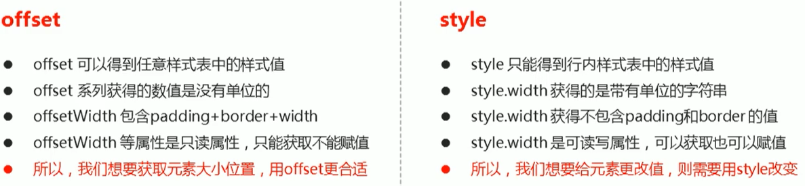
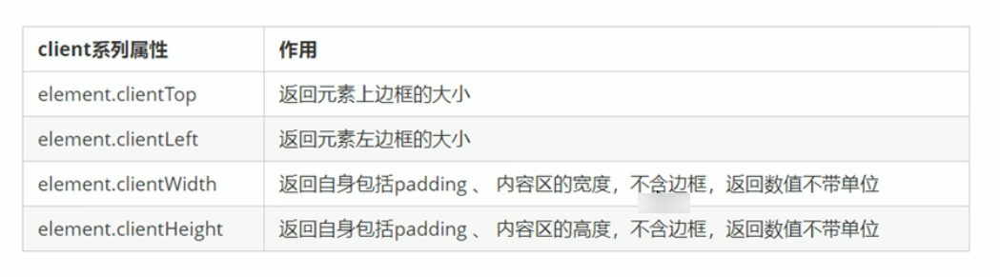
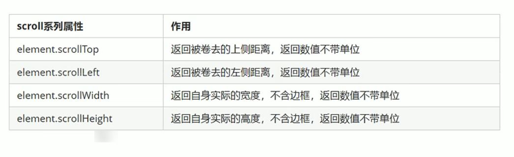
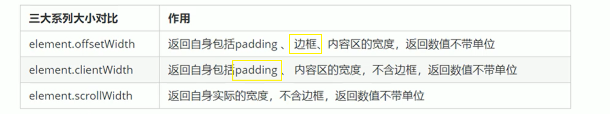
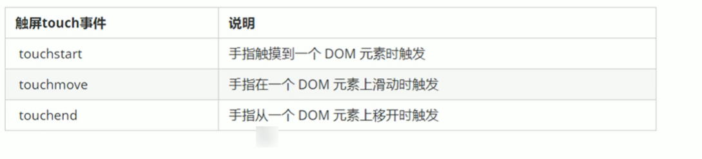

# JavaScript 网页特效

> 老版的笔记
>
> [JavaScript 基础语法-dom-bom-js-es6 新语法-jQuery-数据可视化 echarts 黑马 pink 老师前端入门基础视频教程 (500 多集) 持续](https://www.bilibili.com/video/BV1Sy4y1C7ha/?spm_id_from=333.337.search-card.all.click&vd_source=65e8ed62ff65aeec2427f9b6c8523b9b)

## offset 偏移

| 属性                 | 作用                                                          |
| -------------------- | ------------------------------------------------------------- |
| element.offsetTop    | 返回元素相对带有定位的父元素上方的距离                        |
| element.offsetLeft   | 返回元素相对带有定位的父元素左边的距离                        |
| element.offsetWidth  | 返回自身包含内边距，边框，内容区的宽度                        |
| element.offsetHeight | 返回自身包含内边距，边框，内容区的高度                        |
| element.offsetParent | 返回作为该元素带有定位的父级元素，如果父级元素没有则返回 body |



## 模态框

> 弹出框，又称模态框

## client 元素可视区



## 立即执行函数

> 不需要调用，自己能执行的函数

```javascript
(function(){})()
(function(){}())
```

## scroll 滚动屏幕



## 总结




## mouseenter

### mouseenter 和 mouseover 的区别

- 鼠标经过事件
- mouseover 在经过自身盒子和子盒子都会触发，有冒泡
- mouseenter 在经过自身盒子会触发，经过子盒子不会触发，没有冒泡

- mouseleave 同理

## 动画

> 通过定时器 setInterval() 不断移动盒子位置

- animate()

### 缓动动画

> 就是让动画慢下来（目标值 - 现在的位置）、10

## 网页轮播图

## 移动端的网页特效

### 触屏事件



### 移动端插件

## 本地存储

### sessionStorage

- 大小约 5M
- 生命周期是浏览器打开关闭
- 单窗口共享数据

| 函数                              | 含义                |
| :-------------------------------- | ------------------- |
| sessionStorage.setItem(key,value) | 设置键值对          |
| sessionStorage.getItem(key)       | 获取值              |
| sessionStorage.removeItem(key)    | 移出键值对          |
| sessionStorage.clear()            | 清空 sessionStorage |

### localStorage

- 大小约 20M
- 生命周期永久生效
- 多窗口共享数据

| 函数                            | 含义              |
| :------------------------------ | ----------------- |
| localStorage.setItem(key,value) | 设置键值对        |
| localStorage.getItem(key)       | 获取值            |
| localStorage.removeItem(key)    | 移出键值对        |
| localStorage.clear()            | 清空 localStorage |
