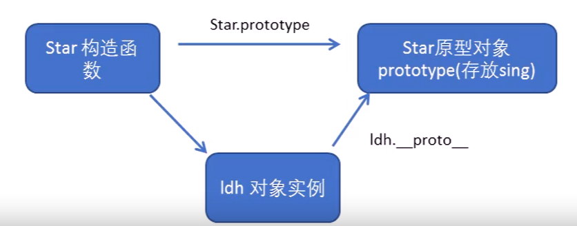
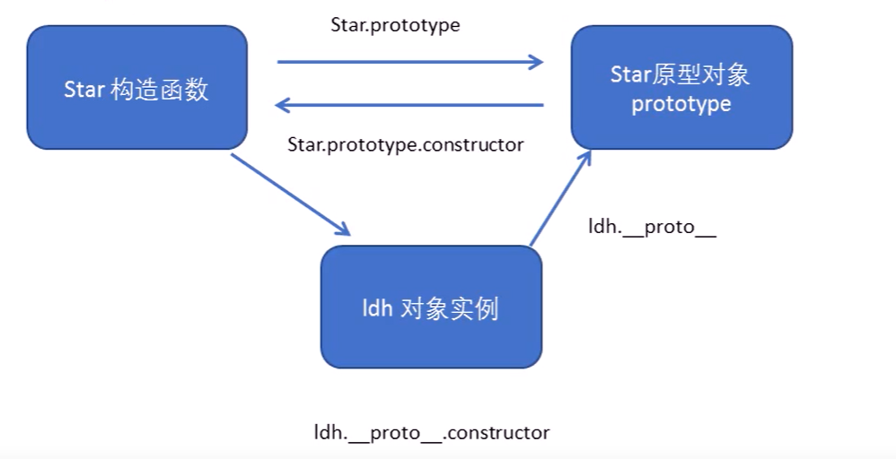
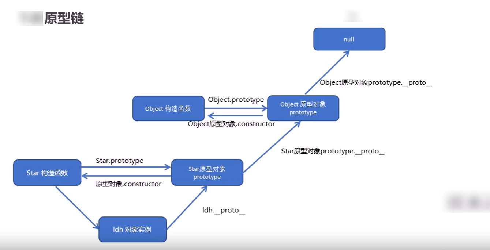
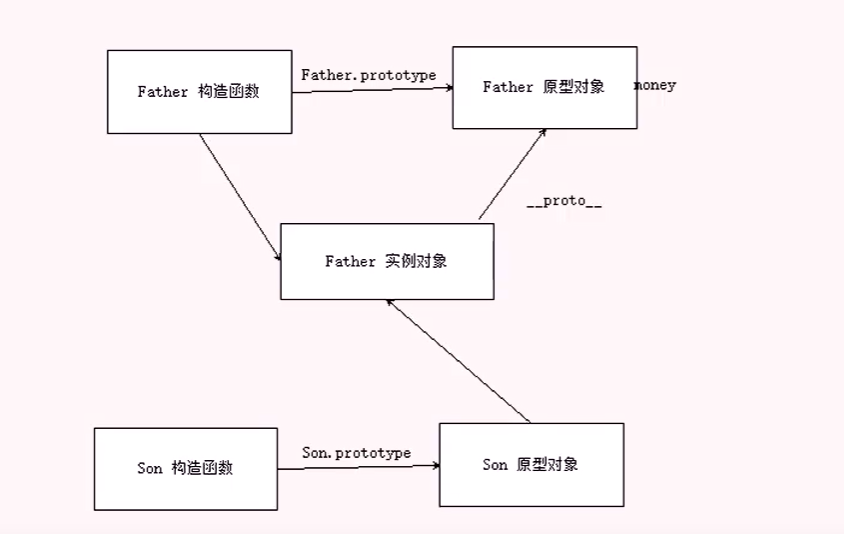
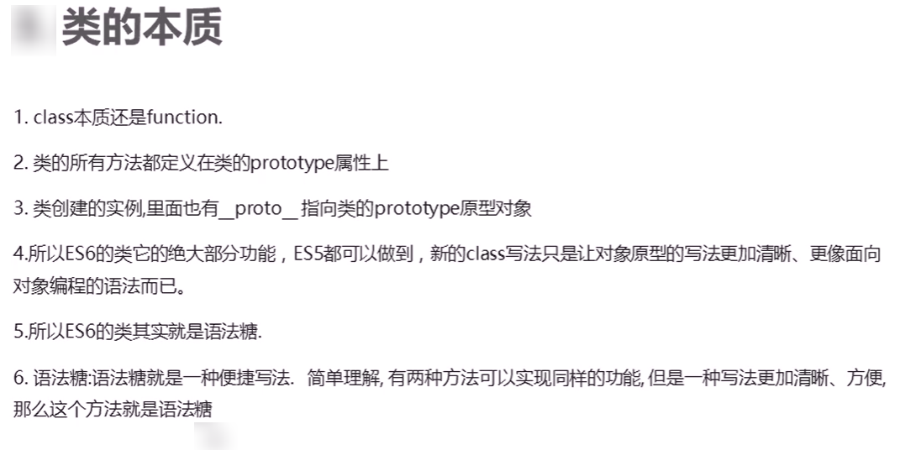
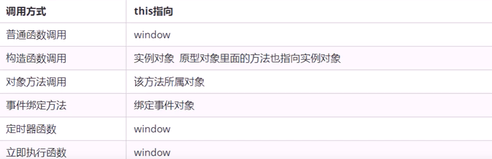
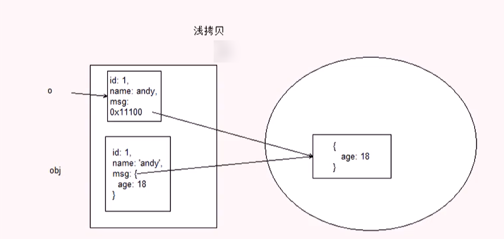
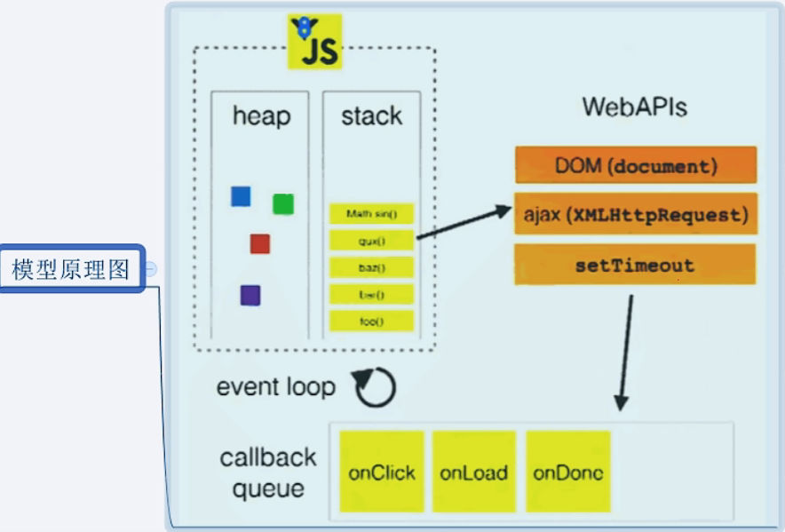

# JavaScript-ES5-ES6

> 老版的笔记
>
> [JavaScript 基础语法-dom-bom-js-es6 新语法-jQuery-数据可视化 echarts 黑马 pink 老师前端入门基础视频教程 (500 多集) 持续](https://www.bilibili.com/video/BV1Sy4y1C7ha/?spm_id_from=333.337.search-card.all.click&vd_source=65e8ed62ff65aeec2427f9b6c8523b9b)

## JavaScript 面向对象

> ES6 新增

### 面向对象

> 参考 java 面向对象

```javascript
//定义类
class Star {
    constructor(username) {
        this.username = username;
    }
    sing(){
        console.log("唱歌");
    }
}

//创建对象
let star = new Star("刘德华");
console.log(star.username);
console.log(star.sing());
```

### super

> super 关键字用于访问和调用对象父类上的函数，可以调用父类的构造函数，也可以调用父类的普通函数
>
> super() 表示调用父类的构造函数
>
> super.xxx() 表示调用父类的普通方法
>
> 类里面的共有属性和方法一定要加 this 引用

```javascript
//继承
class People {
    constructor(x, y) {
        this.x = x;
        this.y = y;
    }

    sum() {
        console.log(this.x + this.y);
    }
}

class Son extends People {
    constructor(x, y) {
        super(x, y);
        this.x = x;
        this.y = y;
    }
}

new Son(1, 2).sum()
```

### this

>`this.sing`是指向这个函数而并没有执行
>`this.sing()`是执行这个函数
>`this.sing(){}`是定义这个函数也没有执行
>
>构造函数中的 this 执向的是实例对象，方法里面的 this 指向的是方法的调用

```html
<button>点击</button>
<script>
    //定义类
    class Star {
        constructor(username) {
            this.username = username;
            this.btn = document.querySelector("button");
            this.btn.onclick = this.sing;
        }

        //按钮调用了 sing 函数，所以 sing 里面的 this 指的是按钮这个元素
        sing() {
            console.log(this); //<button>点击</button>
            console.log("唱歌" + this); //[object HTMLButtonElement]
        }
    }

    new Star()
</script>
```

## JavaScript 创建对象

> ES5 的内容

### 创建对象

```javascript
//new Object() 创建对象
var obj1 = new Object();

//利用对象字面量创建对象
var obj2 = {}

//构造函数创建对象
function Star(uname,age){
    this.uname = uname;
    this.age = age;
}
console.log(new Star("刘德华",55))
```

### 实例成员和静态成员

```javascript
function Star(uname, age) {
    this.uname = uname;
    this.age = age;
}
//实例成员
console.log(new Star("刘德华", 55))
//静态成员
Star.sex = "男";
console.log(Star.sex)
```

### 原型 prototype

> 每一个构造函数都有一个 prototype 属性，这个属性以对象形式存在
>
> 原型的作用是：共享方法，节省开辟内存的空间，因为方法是复杂数据，每次创建对象调用方法都会开辟内存空间

```javascript
function Star(uname, age) {
    this.uname = uname;
    this.age = age;
}

Star.prototype.sing = function () {
    console.log("唱歌")
}
//实例成员
new Star("刘德华", 55).sing();
//静态成员
Star.sex = "男";
console.log(Star.sex)
console.log(Star.prototype)
console.log(star.__proto__) //指向构造函数的原型对象
```

### `__proto__`对象原型



### 指回原型对象

```javascript
function Star(uname, age) {
    this.uname = uname;
    this.age = age;
}

// Star.prototype.sing = function () {
//     console.log("唱歌")
// }
Star.prototype = {
    /*指回原型对象*/
    construct: Star,
    sing: function () {
        console.log("唱歌")
    },
    movie: function () {
        console.log("跳舞")
    }
}

//实例成员
var star = new Star("刘德华", 55);
star.sing();
console.log(star);
//静态成员
Star.sex = "男";
console.log(Star.sex)
console.log(Star.prototype)
console.log(star.__proto__)
```

### 构造函数 - 原型对象 - 实例原型的关系



### 原型链

```javascript
console.log(Star.prototype.__proto__);
console.log(Star.prototype.__proto__==Object.prototype) //true
console.log(Object.prototype.__proto__) //null
```



### 拓展内置对象方法

> 通过原型对象可以拓展内置对象的方法

```javascript
Array.prototype.sum = function () {
var sum = 0;
for (let i = 0; i < this.length; i++) {
sum += this[i];
}
return sum;
}

var arr = [1,2,3];
console.log(arr.sum());
```

### 继承原理

> ES5 没有 extends 继承，通过构造函数 + 原型对象模拟继承，称为组合继承

```javascript
function Father(uname, age) {
    //this 指向父构造函数的对象实例
    this.uname = uname;
    this.age = age;
}

function Son(uname, age) {
    //this 指向子构造函数的对象实例
    Father.call(this,uname,age) //改变指向
}
```

### call() 方法

> 1、可以调用函数
>
> 2、可以改变函数的 this 指向
>
> 3、继承原理

```javascript
function fn() {
    console.log("喝咖啡");
    console.log(this)
}

var o = {
    name: 'andy'
}
fn(); //this 是 window
fn.call();
fn.call(o); //call() 会改变 this 指向
```

### 方法继承的错误

>Son.prototype = Father.prototype
>
>//Son 的原型指向 Father 的原型地址，再给 Son 添加方法，相当于给 Father 添加方法，他俩的物理地址是同一个

```javascript
function Father(uname, age) {
    //this 指向父构造函数的对象实例
    this.uname = uname;
    this.age = age;
}

Father.prototype.money = function () {
    console.log("赚钱")
}

function Son(uname, age) {
    //this 指向子构造函数的对象实例
    Father.call(this, uname, age) //改变指向
}
Son.prototype = Father.prototype
Son.prototype.exam = function () {
    console.log("考试")
}
var son = new Son("刘德华", 55);
console.log(son);
console.log(new Father()); //money,exam
```

### 方法继承

```javascript
function Father(uname, age) {
    //this 指向父构造函数的对象实例
    this.uname = uname;
    this.age = age;
}

Father.prototype.money = function () {
    console.log("赚钱")
}

function Son(uname, age) {
    //this 指向子构造函数的对象实例
    Father.call(this, uname, age) //改变指向
}
Son.prototype = new Father();
Son.prototype.constructor = Son;

//相当于给 Father 对象添加放啊发
Son.prototype.exam = function () {
    console.log("考试")
}

var son = new Son("刘德华", 55);
console.log(son);
console.log(new Father());
```



### 类的本质



## ES5 新增的方法

### 数组方法

```javascript
arr.forEach() //遍历
arr.map() //遍历
arr.filter() //筛选数组，返回新数组
arr.some() //是否满足条件，返回布尔值
arr.every() //和 some 类似
```

### 字符串方法

```javascript
str.trim() //去除空格
```

### 对象方法

```javascript
Object.defineProperty(obj,'price',{value:1000}) //定义新属性或修改原有的属性
Object.key(obj) //获取对象自身的属性
```

## 函数进阶

### 函数定义

```javascript
//自定义函数
function fn(){}
//匿名函数
var fun = function(){}
//new Function()
var fn = new Function(
    'a', 'console.log(a)'
)
fn('1');
```

### 函数中 this 指向

> 谁调用函数，this 指向谁



### 改变函数内部指向

> call()[用作继承]、apply()[用作数组求最大值]可以调用函数和改变 this 指向，bind()[定时器指向]可以改变 this 指向但不能调用函数

| 函数    | 示例                                  |
| ------- | ------------------------------------- |
| call()  | fn.call(obj)                          |
| apply() | Math.max.apply(Math,arr) 求数组最大值 |
| bind()  | fn。bind(obj)                         |

```html
<button>按钮</button>
<script>
    var btn = document.querySelector("button");
    btn.onclick = function () {
        this.disabled = true;
        setTimeout(function () {
            this.disabled = false;
        }.bind(this), 3000)
    }
</script>
```

## 严格模式

### 严格模式

> ES5:更加规范的书写 js 代码

 ```javascript
'use strict' //下面的函数按照严格模式

(function(){
    'use strict'
})();
 ```

### 严格模式变化

1. 变量名必须先声明再使用
2. 不能删除定义好的变量
3. 全局作用域下 this 指向的是 unferfined
4. 创建实例需要 new 出来
5. 定时器的 this 指向还是 window

### 高阶函数

>接收函数作为参数或者以函数作为返回值的函数叫做高阶函数
>
>callback&&callback() 相当于：
>
>```js
>if(callback){
>	callback();
>}
>```

```javascript
function fn(a, b, callback) {
    console.log(a + b);
    callback && callback();
}

fn(1, 2, function () {
    console.log('我是最后调用的')
})
```

## 闭包函数

### 变量作用域

> 闭包是指有权访问另一个函数作用域中变量的函数

1. 函数内部可以使用全局变量
2. 函数外部不可以使用局部变量
3. 函数执行完毕，本作用域的局部变量会销毁

```javascript
function fn() {
    var num = 10;

    function fun() {
        console.log(num)
    }
    fun()
}
fn()
```

```javascript
function fn() {
    var num = 10;
    return function (){
        console.log(num)
    }
}
var f = fn();
f();
```

## 递归函数

> 函数可以调用本身的函数是递归函数
>
> 递归函数需要添加结束条件

### 求阶乘

> return 3*fn(2)
>
> return 3\*(2\*(fn(1)))
>
> return 3\*(2\*(1))

```javascript
function fn(n) {
    if (n == 1) {
        return 1;
    }
    return n * fn(n - 1);
}
console.log(fn(3));
```

### 斐波那契数列

```javascript
function fn(n) {
    if (n == 1 || n == 2) {
        return 1;
    }
    return fn(n - 1) + fn(n - 2)
}

console.log(fn(6));
```

### 递归遍历数据

```javascript
var data = [{
    id: 1,
    name: '家电',
    goods: [{
        id: 11,
        gname: '冰箱',
        goods: [{
            id: 111,
            gname: '冰箱'
        }, {
            id: 112,
            gname: '洗衣机'
        }]
    }, {
        id: 12,
        gname: '洗衣机'
    }]
}, {
    id: 2,
    name: '服饰'
}];
function getID(json, id) {
    json.forEach(function (item) {
        if (item.id === id) {
            console.log(item)
        } else if (item.goods && item.goods.length > 0) {
            getID(item.goods, id);
        }
    })
}
getID(data, 111)
```

## 浅拷贝和深拷贝

### 浅拷贝

> 只拷贝一层，更深层次对象级别只拷贝地址引用

```javascript
var obj = {
    id: 1,
    name: 'andy',
    boy: {
        name: '三',
        age: 18
    }
}
var o = {};
for (var k in obj) {
    o[k] = obj[k];
}
o.boy.name = '四'
console.log(o)
//ES6 语法
Object.assign(o,obj);
```



### 深拷贝

> 拷贝所有，每一级的数据都会拷贝，新对象修改不会对旧对象没有影响

```javascript
var obj = {
    id: 1,
    name: 'andy',
    boy: {
        name: '三',
        age: 18,
        color: ['pink', 'red']
    }
}
var o = {};

function deepCopy(newObj, oldObj) {
    for (var k in oldObj) {
        //获取属性值
        var item = oldObj[k];
        //如果这个属性值是数组
        if (item instanceof Array) {
            //定义一个数组
            newObj[k] = [];
            //将空数组和值递归
            deepCopy(newObj[k], item)
        } else if (item instanceof Object) {
            newObj[k] = {};
            deepCopy(newObj[k], item)
        } else {
            //承担数组、对象、值封装
            newObj[k] = item;
        }
    }
}

deepCopy(o, obj)
o.boy.age=22
console.log(o);
console.log(obj);
```

## 正则表达式

> 参考 JavaScript 基础笔记

### 语法

```javascript
//语法 1
var  re = /pattern/[flags]

//语法 2
var  re = new RegExp("pattern",["flags"]) 
```

## 线程

> js 是单线程运行的
>
> H5 的 WebWorkers 是多线程运行的
>
> 浏览器是多线程多线程的，老版 ie 是单进程多线程的

## 事件循环模型



## Web Workers

> 给 js 提供多线程的能力，听说一下即可
