# LayUI

> 官网：[https://www.layuion.com/](https://www.layuion.com/)

## LayUI 页面元素

### 布局

```html
<div class="layui-container">
    <div class="layui-row">
        123
    </div>
</div>
<div class="layui-fluid">
    123
</div>
```

### 栅格系统

和 Bootstrap 的栅格系统一致，响应式的原始是媒体查询，类名样式也差不多，加了 layui-前缀

#### 列组合

layui 也是将每一行分为 12 列，每一行不能超过 12 列

```html
<div class="layui-container">
    <div class="layui-row">
        <div class="layui-col-md9" style="background-color: pink;">
            123
        </div>
        <div class="layui-col-md3" style="background-color:firebrick">
            123
        </div>
        <div class="layui-col-md3" style="background-color: salmon;">
            123
        </div>
        <div class="layui-col-md3" style="background-color:darkcyan">
            123
        </div>
        <div class="layui-col-md2" style="background-color: aliceblue;">
            123
        </div>
        <div class="layui-col-md4" style="background-color:greenyellow">
            123
        </div>
    </div>
</div>
```

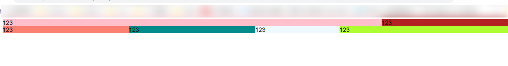

#### 列边距

css3 的盒子，给盒子增加 padding 内边距，单位是 px，取值是 1-30px

```html
<div class="layui-row layui-col-space10">
    <div class="layui-col-md4">
        <div style="background-color: darkcyan;">123</div>
    </div>
    <div class="layui-col-md4">
        <div style="background-color: darkgrey;">123</div>
    </div>
    <div class="layui-col-md4">
        <div style="background-color: darkkhaki;">123</div>
    </div>
</div>
```


#### 列偏移

和 bootstrap 一致

```html
<div class="layui-row">
    <div class="layui-col-md4" style="background-color: green;">
        4/12
    </div>
    <div class="layui-col-md4 layui-col-md-offset4" style="background-color: green;">
        偏移 4 列，从而在最右
    </div>
</div>
```

#### 列嵌套

和 bootstrap 一致

```html
<div class="layui-row layui-col-space5">
    <div class="layui-col-md5">
        <div class="layui-row grid-demo">
            <div class="layui-col-md3">
                内部列
            </div>
            <div class="layui-col-md9">
                内部列
            </div>
            <div class="layui-col-md12">
                内部列
            </div>
        </div>
    </div>
</div>
```

### 颜色

类似于 bootstrap 的情景色

```html
<div class="layui-bg-red">123</div>
<div class="layui-bg-orange">123</div>
<div class="layui-bg-green">123</div>
<div class="layui-bg-cyan">123</div>
<div class="layui-bg-blue">123</div>
<div class="layui-bg-black">123</div>
<div class="layui-bg-gray">123</div>
```

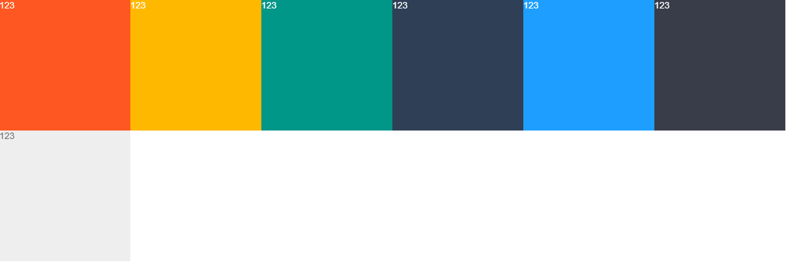

### 图标

和 bootstrap 的 Glyphicons 类似

```html
从 layui 2.3.0 开始，支持 font-class 的形式定义图标：<br>
<i class="layui-icon layui-icon-face-smile"></i>
你可以去定义它的颜色或者大小，如：<br>
<i class="layui-icon layui-icon-face-smile" style="font-size: 30px; color: #1E9FFF;"></i>
```

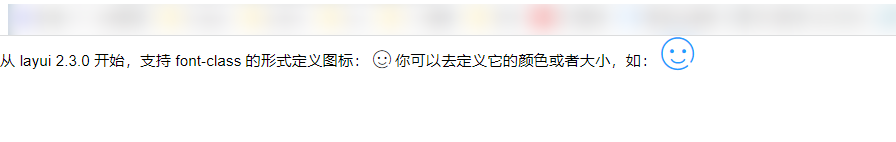

### css3 动画效果

layui 提供基础的动画效果

```html
<div class="layui-anim layui-anim-up"></div>
<div class="layui-anim layui-anim-up layui-anim-loop"></div> <!--循环效果-->
```

### 按钮

基本的按钮样式

#### 标准按钮

```html
<button type="button" class="layui-btn">一个标准的按钮</button>
<a href="http://www.layuion.com" class="layui-btn">一个可跳转的按钮</a>
```

#### 颜色按钮

```html
<button type="button" class="layui-btn layui-btn-normal">按钮</button>
<button type="button" class="layui-btn layui-btn-warm">暖色按钮</button>
<button type="button" class="layui-btn layui-btn-danger">警告按钮</button>
<button type="button" class="layui-btn layui-btn-disabled">禁用按钮</button>
```

#### 按钮大小

```html
<button type="button" class="layui-btn layui-btn-lg">大型</button>
<button type="button" class="layui-btn">默认</button>
<button type="button" class="layui-btn layui-btn-sm">小型</button>
<button type="button" class="layui-btn layui-btn-xs">迷你</button>
```

#### 圆形按钮

```html
<button type="button" class="layui-btn layui-btn-radius layui-btn-primary">原始</button>
<button type="button" class="layui-btn layui-btn-radius">默认</button>
<button type="button" class="layui-btn layui-btn-radius layui-btn-warm">暖色</button>
```

#### 图标按钮

```html
<button type="button" class="layui-btn">
    <i class="layui-icon layui-icon-down layui-font-12"></i> 按钮
</button>

<button type="button" class="layui-btn layui-btn-sm layui-btn-primary">
    <i class="layui-icon layui-icon-left"></i>
</button>
```

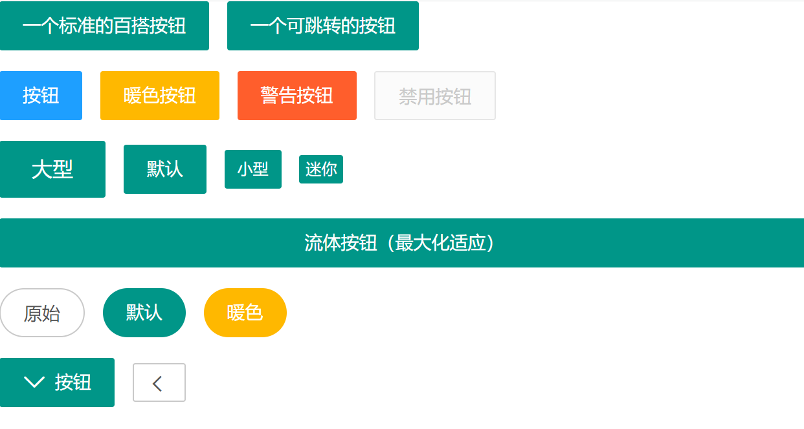

### 导航

目前来说以下代码声明以下组件即可，无需其他代码操作

```javascript
//注意：导航 依赖 element 模块，否则无法进行功能性操作
layui.use('element', function () {
    var element = layui.element;
    //…
});
```

#### 水平导航

- layui-this 表示指向当前列表
- layui-nav-child 表示二级菜单
- 加上 layui-nav-tree 就是垂直导航
- 可以设置图片和徽章导航
- 可以设置不同主图色的导航
- 水平导航支持的其它背景主题有：*layui-bg-cyan*（藏青）、*layui-bg-molv*（墨绿）、*layui-bg-blue*（艳蓝）
- 垂直导航支持的其它背景主题有：*layui-bg-cyan*（藏青）

```html
<ul class="layui-nav" lay-filter="">
    <li class="layui-nav-item"><a href="">最新活动 123</a></li>
    <li class="layui-nav-item layui-this"><a href="">产品 123</a></li>
    <li class="layui-nav-item"><a href="">大数据 123</a></li>
    <li class="layui-nav-item">
        <a href="javascript:;">解决方案 123</a>
        <dl class="layui-nav-child">
            <!-- 二级菜单 -->
            <dd><a href="">移动模块 123</a></dd>
            <dd><a href="">后台模版 123</a></dd>
            <dd><a href="">电商平台 123</a></dd>
        </dl>
    </li>
    <li class="layui-nav-item"><a href="">社区 123</a></li>
</ul>

<script>
    //注意：导航 依赖 element 模块，否则无法进行功能性操作
    layui.use('element', function () {
        var element = layui.element;
        //…
    });
</script>
```

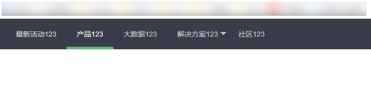

#### 侧边导航

- layui-nav-tree layui-nav-side 表示侧边导航

```html
<ul class="layui-nav layui-nav-tree layui-nav-side">
    <li class="layui-nav-item layui-nav-itemed">
        <a href="javascript:;">默认展开</a>
        <dl class="layui-nav-child">
            <dd><a href="javascript:;">选项 1</a></dd>
            <dd><a href="javascript:;">选项 2</a></dd>
            <dd><a href="">跳转</a></dd>
        </dl>
    </li>
    <li class="layui-nav-item">
        <a href="javascript:;">解决方案</a>
        <dl class="layui-nav-child">
            <dd><a href="">移动模块</a></dd>
            <dd><a href="">后台模版</a></dd>
            <dd><a href="">电商平台</a></dd>
        </dl>
    </li>
    <li class="layui-nav-item"><a href="">产品</a></li>
    <li class="layui-nav-item"><a href="">大数据</a></li>
</ul>

<script>
    //注意：导航 依赖 element 模块，否则无法进行功能性操作
    layui.use('element', function () {
        var element = layui.element;
        //…
    });
</script>
```

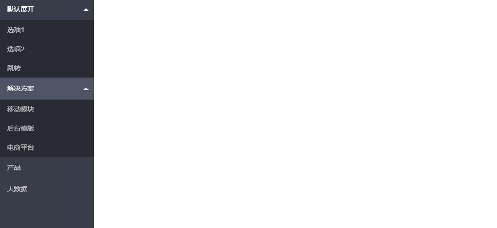

#### 面包屑导航

```html
<span class="layui-breadcrumb">
    <a href="">首页</a>
    <a href="">国际新闻</a>
    <a href="">亚太地区</a>
    <a><cite>正文</cite></a>
</span>
<br>
<span class="layui-breadcrumb" lay-separator="|">
    <a href="">娱乐</a>
    <a href="">八卦</a>
    <a href="">体育</a>
    <a href="">搞笑</a>
    <a href="">视频</a>
    <a href="">游戏</a>
    <a href="">综艺</a>
</span>
<script>
    //注意：导航 依赖 element 模块，否则无法进行功能性操作
    layui.use('element', function () {
        var element = layui.element;

        //…
    });
</script>
```

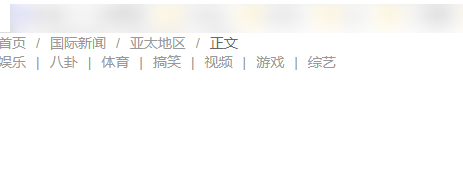

### 选项卡

#### 基本样式

```html
<div class="layui-tab">
    <ul class="layui-tab-title">
        <li class="layui-this">网站设置</li>
        <li>用户管理</li>
        <li>权限分配</li>
        <li>商品管理</li>
        <li>订单管理</li>
    </ul>
    <div class="layui-tab-content">
        <div class="layui-tab-item layui-show">内容 1</div>
        <div class="layui-tab-item">内容 2</div>
        <div class="layui-tab-item">内容 3</div>
        <div class="layui-tab-item">内容 4</div>
        <div class="layui-tab-item">内容 5</div>
    </div>
</div>

<script>
    //注意：选项卡 依赖 element 模块，否则无法进行功能性操作
    layui.use('element', function () {
        var element = layui.element;

        //…
    });
</script>
```

#### 简洁风格

```html
<div class="layui-tab layui-tab-brief" lay-filter="docDemoTabBrief">
    <ul class="layui-tab-title">
        <li class="layui-this">网站设置</li>
        <li>用户管理</li>
        <li>权限分配</li>
        <li>商品管理</li>
        <li>订单管理</li>
    </ul>
    <div class="layui-tab-content"></div>
</div>   
```

#### 卡片风格

```html
<div class="layui-tab layui-tab-card">
    <ul class="layui-tab-title">
        <li class="layui-this">网站设置</li>
        <li>用户管理</li>
        <li>权限分配</li>
        <li>商品管理</li>
        <li>订单管理</li>
    </ul>
    <div class="layui-tab-content" style="height: 100px;">
        <div class="layui-tab-item layui-show">1</div>
        <div class="layui-tab-item">2</div>
        <div class="layui-tab-item">3</div>
        <div class="layui-tab-item">4</div>
        <div class="layui-tab-item">5</div>
        <div class="layui-tab-item">6</div>
    </div>
</div>
```

#### 带删除的 Tab

```html
<div class="layui-tab" lay-allowClose="true">
    <ul class="layui-tab-title">
        <li class="layui-this">网站设置</li>
        <li>用户基本管理</li>
        <li>权限分配</li>
        <li>全部历史商品管理文字长一点试试</li>
        <li>订单管理</li>
    </ul>
    <div class="layui-tab-content">
        <div class="layui-tab-item layui-show">1</div>
        <div class="layui-tab-item">2</div>
        <div class="layui-tab-item">3</div>
        <div class="layui-tab-item">4</div>
        <div class="layui-tab-item">5</div>
        <div class="layui-tab-item">6</div>
    </div>
</div>
```

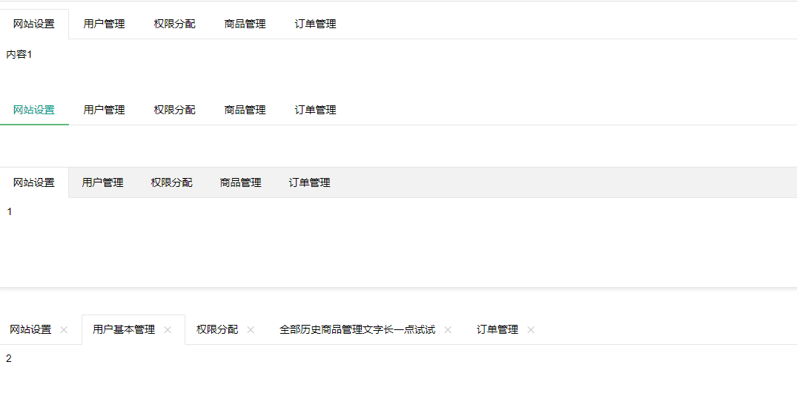

### 表格

#### 基本样式

```html
<table class="layui-table">
    <colgroup>
        <col width="150">
        <col width="200">
        <col>
    </colgroup>
    <thead>
        <tr>
            <th>昵称</th>
            <th>加入时间</th>
            <th>签名</th>
        </tr>
    </thead>
    <tbody>
        <tr>
            <td>贤心</td>
            <td>2016-11-29</td>
            <td>人生就像是一场修行</td>
        </tr>
        <tr>
            <td>许闲心</td>
            <td>2016-11-28</td>
            <td>于千万人之中遇见你所遇见的人，于千万年之中，时间的无涯的荒野里…</td>
        </tr>
    </tbody>
</table>
```

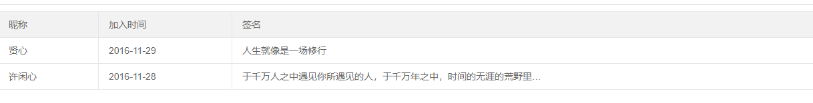

#### 其他样式

| 属性名            | 属性值                                               |
| :---------------- | :--------------------------------------------------- |
| lay-even          | 隔行换色                                             |
| lay-skin="属性值" | line（行边框风格）row（列边框风格）nob（无边框风格） |
| lay-size="属性值" | sm（小尺寸）lg（大尺寸）                             |

### 表单

依赖加载模块：[form](https://www.layuion.com/doc/modules/form.html) 

#### 表单基本结构

- layui-input-block
- layui-input-inline :让表单元素占成一行显示
- block 元素通常被现实为独立的一块，会单独换一行；inline 元素则前后不会产生换行，一系列 inline 元素都在一行内显示，直到该行排满。
- 大体来说 HTML 元素各有其自身的布局级别（block 元素还是 inline 元素）：
- 常见的块级元素有 DIV, FORM, TABLE, P, PRE, H1~H6, DL, OL, UL 等。
- 常见的内联元素有 SPAN, A, STRONG, EM, LABEL, INPUT, SELECT, TEXTAREA, IMG, BR 等。

```html
<form class="layui-form" action="">
    <div class="layui-form-item">
        <label class="layui-form-label">标签区域</label>
        <div class="layui-input-block">
            原始表单元素区域
        </div>
    </div>
</form>
<script>
    //Demo
    layui.use('form', function () {
        var form = layui.form;
    });
</script>
```

#### 输入框

- required：注册浏览器所规定的必填字段
- lay-verify：注册 form 模块需要验证的类型
- class="layui-input"：layui.css 提供的通用 CSS 类

```html
<input type="text" name="title" required lay-verify="required" placeholder="请输入标题" autocomplete="off"
       class="layui-input">
```

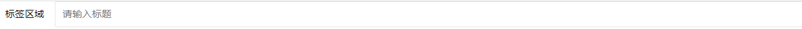

#### 下拉选择框

- disabled 表示禁用
- optgroup 表示分组
- lay-search 表示可以搜索

```html
<div class="layui-form-item">
    <div class="layui-input-inline">
        <select name="city" lay-verify="">
            <option value="">请选择一个城市</option>
            <option value="010">北京</option>
            <option value="021">上海</option>
            <option value="0571">杭州</option>
        </select>
    </div>
</div>

<div class="layui-form-item">
    <div class="layui-input-inline">
        <select name="city" lay-verify="">
            <option value="010">北京</option>
            <option value="021" disabled>上海（禁用效果）</option>
            <option value="0571" selected>杭州</option>
        </select>
    </div>
</div>


<div class="layui-form-item">
    <div class="layui-input-inline">
        <select name="quiz">
            <option value="">请选择</option>
            <optgroup label="城市记忆">
                <option value="你工作的第一个城市">你工作的第一个城市？</option>
            </optgroup>
            <optgroup label="学生时代">
                <option value="你的工号">你的工号？</option>
                <option value="你最喜欢的老师">你最喜欢的老师？</option>
            </optgroup>
        </select>
    </div>
</div>

<div class="layui-form-item">
    <div class="layui-input-inline">
        <select name="city" lay-verify="" lay-search>
            <option value="010">layer</option>
            <option value="021">form</option>
            <option value="0571" selected>layim</option>
            ……
        </select>
    </div>
</div>
```

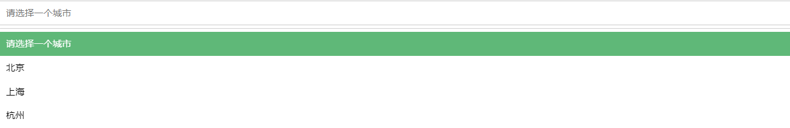

#### 复选框

- checked 表示被选中
- disabled 表示被禁用
- 属性*title*可自定义文本（温馨提示：如果只想显示复选框，可以不用设置 title）
- 属性*lay-skin*可设置复选框的风格
- 设置*value="1"*可自定义值，否则选中时返回的就是默认的 on

```html
<div class="layui-form-item">
    <div class="layui-input-inline">
        默认风格：<br>
        <input type="checkbox" name="" title="写作" checked>
        <input type="checkbox" name="" title="发呆">
        <input type="checkbox" name="" title="禁用" disabled>
    </div>
</div>

<div class="layui-form-item">
    <div class="layui-input-inline">
        原始风格：<br>
        <input type="checkbox" name="" title="写作" lay-skin="primary" checked>
        <input type="checkbox" name="" title="发呆" lay-skin="primary">
        <input type="checkbox" name="" title="禁用" lay-skin="primary" disabled>
    </div>
</div>
```

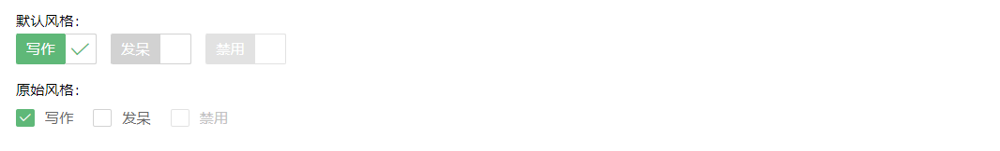

#### 开关

- 其实就是 checkbox 复选框的“变种”，通过设定 *lay-skin="switch"* 形成了开关风格
- 属性*checked*可设定默认开
- 属性*disabled*开启禁用
- 属性*lay-text*可自定义开关两种状态的文本
- 设置*value="1"*可自定义值，否则选中时返回的就是默认的 on

```html
<div class="layui-form-item">
    <div class="layui-input-block">
        <input type="radio" name="sex" value="nan" title="男">
        <input type="radio" name="sex" value="nv" title="女" checked>
        <input type="radio" name="sex" value="" title="中性" disabled>
    </div>
</div>
```

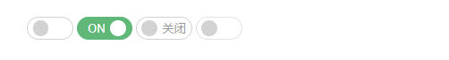

#### 单选框

```html
<input type="radio" name="sex" value="nan" title="男">
<input type="radio" name="sex" value="nv" title="女" checked>
<input type="radio" name="sex" value="" title="中性" disabled>
```

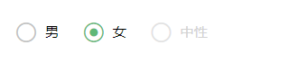

#### 文本域

```html
<div class="layui-form-item">
    <div class="layui-input-block">
        <textarea name="" required lay-verify="required" placeholder="请输入" class="layui-textarea"></textarea>
    </div>
</div>
```

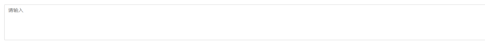

#### 组装行内表单

- class="layui-inline"：定义外层行内
- class="layui-input-inline"：定义内层行内

```html
<div class="layui-form-item">
    <div class="layui-inline">
        <label class="layui-form-label">范围</label>
        <div class="layui-input-inline" style="width: 100px;">
            <input type="text" name="price_min" placeholder="￥" autocomplete="off" class="layui-input">
        </div>
        <div class="layui-form-mid">-</div>
        <div class="layui-input-inline" style="width: 100px;">
            <input type="text" name="price_max" placeholder="￥" autocomplete="off" class="layui-input">
        </div>
    </div>
    <div class="layui-inline">
        <label class="layui-form-label">密码</label>
        <div class="layui-input-inline" style="width: 100px;">
            <input type="password" name="" autocomplete="off" class="layui-input">
        </div>
    </div>
</div>
```

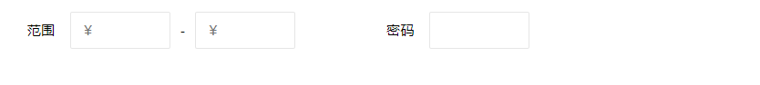

#### 表单方框风格

`class="layui-form-pane"`

### 面板

> 2.6 新增

#### 常规面板

```html
<div class="layui-row layui-col-space15">
    <div class="layui-col-md6">
        <div class="layui-panel">
            <div style="padding: 30px;">一个面板</div>
        </div>
    </div>
    <div class="layui-col-md6">
        <div class="layui-panel">
            <div style="padding: 30px;">一个面板</div>
        </div>
    </div>
</div>

<script>
    //注意：折叠面板 依赖 element 模块，否则无法进行功能性操作
    layui.use('element', function () {
        var element = layui.element;

        //…
    });
</script>
```

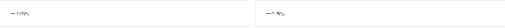

#### 卡片面板

```html
<div class="layui-card">
    <div class="layui-card-header">卡片面板</div>
    <div class="layui-card-body">
        卡片式面板面板通常用于非白色背景色的主体内<br>
        从而映衬出边框投影
    </div>
</div>
```

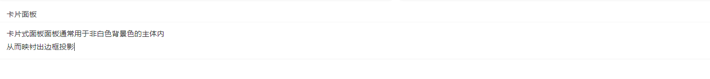

#### 折叠面板

```html
<div class="layui-collapse">
    <div class="layui-colla-item">
        <h2 class="layui-colla-title">杜甫</h2>
        <div class="layui-colla-content layui-show">内容区域</div>
    </div>
    <div class="layui-colla-item">
        <h2 class="layui-colla-title">李清照</h2>
        <div class="layui-colla-content layui-show">内容区域</div>
    </div>
    <div class="layui-colla-item">
        <h2 class="layui-colla-title">鲁迅</h2>
        <div class="layui-colla-content layui-show">内容区域</div>
    </div>
</div>
```


#### 开启手风琴效果

`lay-accordion`

### 徽章

#### 小圆点

`layui-badge-dot`

#### 椭圆体

`layui-badg`

#### 边框体

`layui-badge-rim`

### 事件线

> 参照官方文档 [https://www.layuion.com/doc/element/progress.html](https://www.layuion.com/doc/element/progress.html)

### 菜单

> 参照官方文档 [https://www.layuion.com/doc/element/progress.html](https://www.layuion.com/doc/element/progress.html)

### 进度条

> 参照官方文档 [https://www.layuion.com/doc/element/progress.html](https://www.layuion.com/doc/element/progress.html)

## LayUI 组件

### 组件定义

```javascript
//layui 模块的定义（新 js 文件）
layui.define([mods], function(exports){
    //……
    exports('mod', api);
});  
```

### 组件使用

```javascript
//layui 模块的使用
layui.use(['mod1', 'mod2'], function(args){
    var mod = layui.mod1;
    //……
});         
```

## LayUI 内置组件

### 弹出层 layer

#### 单独使用

```html
<!DOCTYPE html>
<html lang="en">
    <head>
        <meta charset="UTF-8">
        <title>Title</title>
        <link rel="stylesheet" href="layer/layer.css">
        <script src="layer/layer.js"></script>
    </head>
    <body>
        <script>
            layer.msg("hello layer");
        </script>
    </body>
</html>
```

#### 模块化使用

```html
<!DOCTYPE html>
<html lang="en">
    <head>
        <meta charset="UTF-8">
        <title>Title</title>
        <link rel="stylesheet" href="layui/css/layui.css">
        <script src="layui/layui.js"></script>
    </head>
    <body>
        <script>
            layui.use("layer", function () {
                var layer = layui.layer;
                layer.msg("hello layer")
            });
        </script>
    </body>
</html>
```

#### 弹出层类型

##### 信息框

```javascript
layer.open({
    type: 0,
    title: ['信息框', 'color:red;'],
    content: 'hello layer' //这里 content 是一个普通的 String
});
```

##### 页面层

```javascript
layer.open({
    type: 1,
    title: ['信息框', 'color:red;'],
    content: '<h1>你好啊</h1>'
});
```

##### iframe 层

```javascript
layer.open({
    type: 2,
    title: ['信息框', 'color:red;'],
    content: 'https://www.bilibili.com/video/BV19V411b7sx?p=14&spm_id_from=pageDriver' 
});
```

##### tips 层

```javascript
<span id="id">hello java</span>
layer.open({
    type: 4,
    title: ['信息框', 'color:red;'],
    content: ['内容', '#id'] //数组第二项即吸附元素选择器或者 DOM
});
```

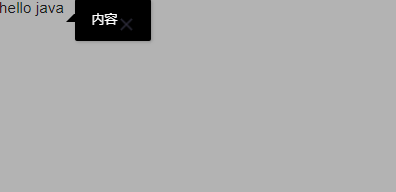

#### 按钮

```javascript
layer.open({
    content: 'test'
    , btn: ['按钮一', '按钮二']
    , yes: function (index, layero) {
        //按钮【按钮一】的回调
        layer.msg('hello'); 
    }
    , btn2: function (index, layero) {
        //按钮【按钮二】的回调
        //return false 开启该代码可禁止点击该按钮关闭
    }
    , cancel: function () {
        //右上角关闭回调
        //return false 开启该代码可禁止点击该按钮关闭
    }
});
```

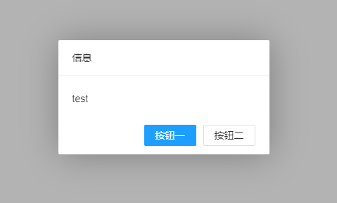

#### 其他参数

| 参数名         | 含义           | 参数值                                                            |
| -------------- | -------------- | ----------------------------------------------------------------- |
| type           | 弹出层类型     | 0（信息框，默认）1（页面层）2（iframe 层）3（加载层）4（tips 层） |
| title          | 标题           | 可以自定义样式`title: ['文本', 'font-size:18px;']`                |
| content        | 内容           | String/DOM/Array/url                                              |
| skin           | 样式类名       | `layui-layer-lan` `layui-layer-molv`                              |
| area           | 宽高           | `area: ['500px', '300px']`                                        |
| offset         | 坐标           | 默认：垂直水平居中，不用设置                                      |
| icon           | 图标           | 默认皮肤可以传入 0-6 加载层 0-2                                   |
| btn            | 按钮           | btn: ['yes', 'no']                                                |
| 其余参数看文档 | 其余参数看文档 | 其余参数看文档                                                    |

#### 弹出层方法

| 方法                                         | 含义                                  |
| -------------------------------------------- | ------------------------------------- |
| layer.ready(callback)                        | 一打开页面就弹出一个弹出层            |
| layer.open(options)                          | 弹出一个弹出层                        |
| layer.alert(content, options, yes)           | 普通信息框                            |
| layer.confirm(content, options, yes, cancel) | 询问框                                |
| layer.msg(content, options, end)             | 提示框                                |
| layer.load(icon, options)                    | 加载层                                |
| layer.tips(content, follow, options)         | tips 层                               |
| layer.close(index)                           | 关闭指定层，var index = layer.open(); |
| 其余参数看文档                               | 其余参数看文档                        |

#### 其他层

##### 输入层

```javascript
layer.prompt({
    formType: 2,
    value: '初始值',
    title: '请输入值',
    area: ['800px', '350px'] //自定义文本域宽高
}, function (value, index, elem) {
    alert(value); //得到 value
    layer.close(index);
});
```

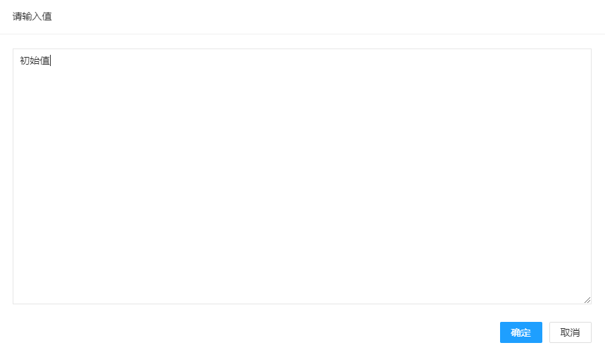

##### tab 层

```javascript
layer.tab({
    area: ['600px', '300px'],
    tab: [{
        title: 'TAB1',
        content: '内容 1'
    }, {
        title: 'TAB2',
        content: '内容 2'
    }, {
        title: 'TAB3',
        content: '内容 3'
    }]
});
```

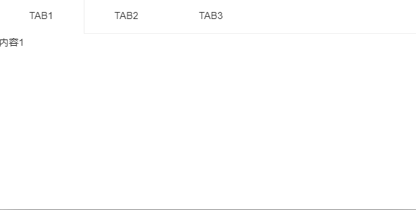

##### 图片层

```javascript
layer.photos({
    photos: '#layer-photos-demo'
    , anim: 5 //0-6 的选择，指定弹出图片动画类型，默认随机（请注意，3.0 之前的版本用 shift 参数）
});
```


### 时间和日期模块

#### 基本使用

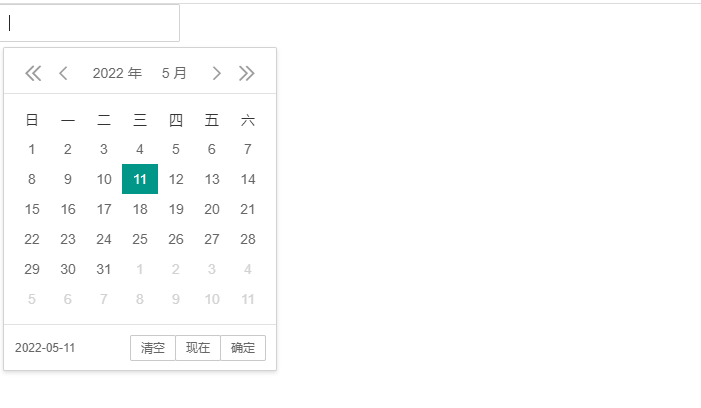

#### 基本参数

| 参数名         | 含义                 | 参数值                                                                                           |
| -------------- | -------------------- | ------------------------------------------------------------------------------------------------ |
| elem           | 绑定元素             | elem: '#test'                                                                                    |
| type           | 日期时间选择器       | 默认值是：datetime，其他的 year...没意义                                                         |
| range          | 开启左右面板范围选择 | 默认值：false，也可以 range: '~'定义分隔符号                                                     |
| format         | 自定义格式           | 默认值：yyyy-MM-dd                                                                               |
| value          | 给时间初始值         | value: '2018-08-18'                                                                              |
| btns           | 工具按钮             | 默认值：['clear', 'now', 'confirm']                                                              |
| theme          | 主题                 | theme 的可选值有：*default*（简约）、*molv*（墨绿）、*#颜色值*（自定义颜色背景）、*grid*（格子） |
| calendar       | 是否显示公历节日     | calendar: true                                                                                   |
| 其余参数看文档 | 其余参数看文档       | 其余参数看文档                                                                                   |

#### range

开启左右面板范围选择  

```html
<div class="layui-inline">
    <!-- 注意：这一层元素并不是必须的 -->
    <input type="text" class="layui-input" id="test1">
</div>
<script>
    layui.use('laydate', function () {
        var laydate = layui.laydate;
        //执行一个 laydate 实例
        laydate.render({
            elem: '#test1', //指定元素
            type: 'datetime',
            range: '~'
        });
    });
</script>
```

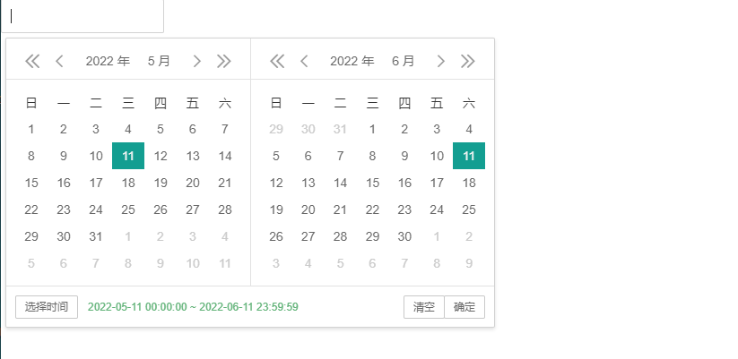

```html
<div class="layui-form-item">
    <div class="layui-inline">
        <label class="layui-form-label">日期范围</label>
        <div class="layui-inline" id="test-range">
            <div class="layui-input-inline">
                <input type="text" id="startDate" class="layui-input" placeholder="开始日期">
            </div>
            <div class="layui-form-mid">-</div>
            <div class="layui-input-inline">
                <input type="text" id="endDate" class="layui-input" placeholder="结束日期">
            </div>
        </div>
    </div>
</div>
<script>
    layui.use('laydate', function () {
        var laydate = layui.laydate;
        //执行一个 laydate 实例
        laydate.render({
            elem: '#test-range' //开始时间和结束时间所在 input 框的父选择器
            //设置开始日期、日期日期的 input 选择器
            , range: ['#startDate', '#endDate'] //数组格式为 layui 2.6.6 开始新增
        });
    });
</script>
```

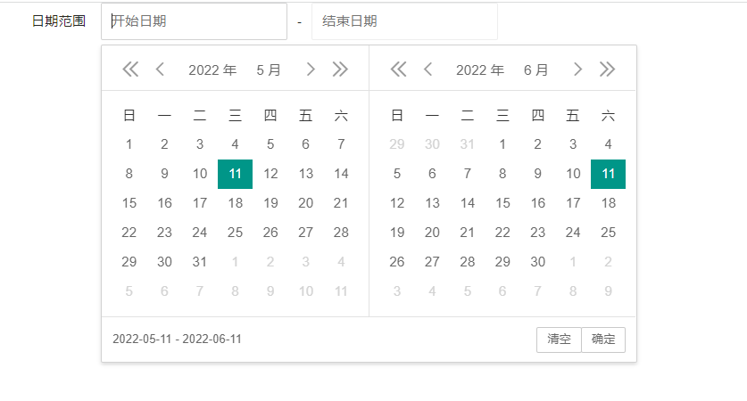

### 分页模块

- 模块：laypage
- 默认每页十条
- 分页的绑定不用加#，绑定的是属性

#### 基本分页

```html
<div id="test1"></div>

<script>
    layui.use('laypage', function () {
        var laypage = layui.laypage;
        //执行一个 laypage 实例
        laypage.render({
            elem: 'test1' //注意，这里的 test1 是 ID，不用加 # 号
            , count: 50 //数据总数，从服务端得到
        });
    });
</script>
```


#### 基本参数

| 参数名         | 含义                         | 参数值                                   |
| -------------- | ---------------------------- | ---------------------------------------- |
| elem           | 绑定元素                     | elem: '#test'                            |
| count          | 数据总数。一般通过服务端得到 | 默认值是：datetime，其他的 year...没意义 |
| limit          | 每页显示的条数               | 默认值：10                               |
| limits         | 每页显示的条数的选项         | limits：[10, 20, 30, 40, 50]             |
| layout         | 自定义排版                   | ['prev', 'page', 'next','limit','count'] |
| group          | 连续显示的页码数量           |                                          |
| 其余参数看文档 | 其余参数看文档               | 其余参数看文档                           |

#### 每页条数的选择

```html
<div id="test1"></div>

<script>
    layui.use('laypage', function () {
        var laypage = layui.laypage;
        //执行一个 laypage 实例
        laypage.render({
            elem: 'test1' //注意，这里的 test1 是 ID，不用加 # 号
            , count: 500, //数据总数，从服务端得到
            limit: 20,
            limits:[10,20,30,40,50],
            layout:['prev', 'page', 'next','limit','count'],
            groups: 10
        });
    });
</script>
```

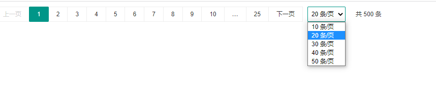

### 数据表格模块

#### 基本样式

```html
<!DOCTYPE html>
<html lang="">
    <head>
        <meta charset="utf-8">
        <title>table模块快速使用</title>
        <link rel="stylesheet" href="layui/css/layui.css">
        <script src="layui/layui.js"></script>
    </head>
    <body>
        <!--方法渲染-->
        <table id="demo" lay-filter="test"></table>
        <!--自动渲染-->
        <table class="layui-table"
               lay-data="{height:315, url:'js/package.json', page:true, id:'test1'}"
               lay-filter="test1">
            <thead>
            <tr>
                <th lay-data="{field:'id', width:80, sort: true}">ID</th>
                <th lay-data="{field:'username', width:80}">用户名</th>
                <th lay-data="{field:'sex', width:80, sort: true}">性别</th>
                <th lay-data="{field:'city'}">城市</th>
                <th lay-data="{field:'sign'}">签名</th>
                <th lay-data="{field:'experience', sort: true}">积分</th>
                <th lay-data="{field:'score', sort: true}">评分</th>
                <th lay-data="{field:'classify'}">职业</th>
                <th lay-data="{field:'wealth', sort: true}">财富</th>
            </tr>
            </thead>
        </table>
        <!--转换静态表格-->
        <table lay-filter="demo">
            <thead>
            <tr>
                <th lay-data="{field:'username', width:100}">昵称</th>
                <th lay-data="{field:'experience', width:80, sort:true}">积分</th>
                <th lay-data="{field:'sign'}">签名</th>
            </tr>
            </thead>
            <tbody>
            <tr>
                <td>贤心 1</td>
                <td>66</td>
                <td>人生就像是一场修行 a</td>
            </tr>
            <tr>
                <td>贤心 2</td>
                <td>88</td>
                <td>人生就像是一场修行 b</td>
            </tr>
            <tr>
                <td>贤心 3</td>
                <td>33</td>
                <td>人生就像是一场修行 c</td>
            </tr>
            </tbody>
        </table>
        <script>
            layui.use('table', function () {
                var table = layui.table;
                //方法渲染
                table.render({
                    elem: '#demo'
                    , height: 312
                    , url: "js/package.json" //数据接口
                    , page: true //开启分页
                    ,cols: [[ //表头
                        {field: 'id', title: 'ID', width:80, sort: true, fixed: 'left'}
                        ,{field: 'username', title: '用户名', width:80}
                        ,{field: 'sex', title: '性别', width:80, sort: true}
                        ,{field: 'city', title: '城市', width:80}
                        ,{field: 'sign', title: '签名', width: 177}
                        ,{field: 'experience', title: '积分', width: 80, sort: true}
                        ,{field: 'score', title: '评分', width: 80, sort: true}
                        ,{field: 'classify', title: '职业', width: 80}
                        ,{field: 'wealth', title: '财富', width: 135, sort: true}
                    ]]
                });
                //转换静态表格
                table.init('demo', {
                    height: 315 //设置高度
                    , limit: 10 //注意：请务必确保 limit 参数（默认：10）是与你服务端限定的数据条数一致
                    //支持所有基础参数
                });
            });
        </script>
    </body>
</html>
```

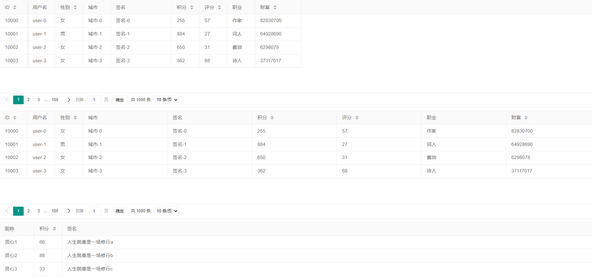

#### 相关属性

| 参数           | 说明                                                                                                                                 | 示例值              |
| :------------- | :----------------------------------------------------------------------------------------------------------------------------------- | :------------------ |
| elem           | 指定原始 table 容器的选择器                                                                                                          | "#demo"             |
| cols           | 设置表头                                                                                                                             |                     |
| url            | 异步数据接口                                                                                                                         |                     |
| toolbar        | 开启表格头部工具栏区域                                                                                                               | false               |
| defaultToolbar | 该参数可自由配置头部工具栏右侧的图标按钮                                                                                             |                     |
| width          | 设定容器宽度。table 容器的默认宽度是跟随它的父元素铺满，你也可以设定一个固定值，当容器中的内容超出了该宽度时，会自动出现横向滚动条。 | 1000                |
| height         | 设定容器高度                                                                                                                         |                     |
| data           | 直接赋值数据。既适用于只展示一页数据，也非常适用于对一段已知数据进行多页展示。                                                       | [{}, {}, {}, {}, …] |
| title          | 定义 table 的大标题（在文件导出等地方会用到）                                                                                        | "用户表"            |
| id             | 设定容器唯一 id                                                                                                                      | test                |
| 其余参数看文档 | 其余参数看文档                                                                                                                       | 其余参数看文档      |

#### 渲染方式

> 具体实现方式参照文档

| 机制         | 适用场景                 |
| :----------- | :----------------------- |
| 方法渲染     | 用 JS 方法的配置完成渲染 |
| 自动渲染     | HTML 配置，自动渲染      |
| 转换静态表格 | 转化一段已有的表格元素   |

#### 开启分页

```javascript
//设置序列号列
,{field: 'aa', type: "numbers"}
//开启复选框列
, {field: 'aa', type: "checkbox"}
//开启分页
, page: true 
```

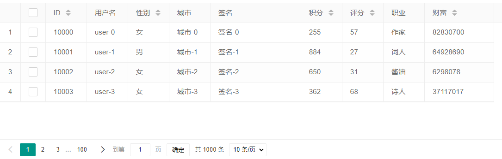

#### 头工具栏

```javascript
<script type="text/html" id="toolbarDemo">
    <div class="layui-btn-container">
        <button type="button" class="layui-btn layui-btn-sm" lay-event="getCheckData">按钮一</button> 
		<button type="button" class="layui-btn layui-btn-sm" lay-event="getCheckLength">按钮二</button>
		<button type="button" class="layui-btn layui-btn-sm" lay-event="isAll">按钮三</button> 
	</div>
</script> 
,toolbar:"#toolbarDemo"
```

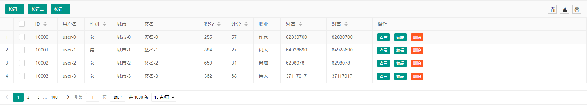

#### 行工具栏

```javascript
 <script type="text/html" id="toolDemo">
        <a class="layui-btn layui-btn-xs" lay-event="detail">查看</a>
        <a class="layui-btn layui-btn-xs" lay-event="edit">编辑</a>
        <a class="layui-btn layui-btn-danger layui-btn-xs" lay-event="del">删除</a>
 </script>   
, { field: '操作', title: '操作', toolbar:"#toolDemo" }
```


#### 监听头工具栏

```html
<!DOCTYPE html>
<html lang="">

    <head>
        <meta charset="utf-8">
        <title>table模块快速使用</title>
        <link rel="stylesheet" href="layui/css/layui.css">
        <script src="layui/layui.js"></script>
    </head>

    <body>

        原始容器
        <table id="demo" lay-filter="test"></table>

        头工具栏模板：
        <script type="text/html" id="toolbarDemo">
            <div class="layui-btn-container">
                <button class="layui-btn layui-btn-sm" lay-event="add">添加</button>
                <button class="layui-btn layui-btn-sm" lay-event="delete">删除</button>
                <button class="layui-btn layui-btn-sm" lay-event="update">编辑</button>
            </div>
        </script>

        <script>
            var table = layui.table;
            //方法渲染
            table.render({
                elem: '#demo'
                , height: 312
                , url: "js/package.json" //数据接口
                , page: true //开启分页
                , cols: [[ //表头
                    //设置序列号列
                    {field: 'aa', type: "numbers"}
                    //开启复选框列
                    , {field: 'aa', type: "checkbox"}
                    , {field: 'id', title: 'ID', width: 80, sort: true}
                    , {field: 'username', title: '用户名', width: 80}
                    , {field: 'sex', title: '性别', width: 80, sort: true}
                    , {field: 'city', title: '城市', width: 80}
                    , {field: 'sign', title: '签名', width: 177}
                    , {field: 'experience', title: '积分', width: 80, sort: true}
                    , {field: 'score', title: '评分', width: 80, sort: true}
                    , {field: 'classify', title: '职业', width: 80}
                    , {field: 'wealth', title: '财富', width: 135, sort: true}
                    , {field: 'wealth', title: '财富', width: 135, sort: true}
                ]]
                , toolbar: "#toolbarDemo"
            });

            //头工具栏触发事件
            table.on('toolbar(test)', function (obj) {
                console.log(obj)
                var checkStatus = table.checkStatus(obj.config.id);
                console.log(checkStatus);
                switch (obj.event) {
                    case 'add':
                        layer.msg('添加');
                        break;
                    case 'delete':
                        layer.msg('删除');
                        break;
                    case 'update':
                        layer.msg('编辑');
                        break;
                }
            });

        </script>
    </body>

</html>
```

#### 监听行工具

```html
<!DOCTYPE html>
<html lang="">
    <head>
        <meta charset="utf-8">
        <title>table模块快速使用</title>
        <link rel="stylesheet" href="layui/css/layui.css">
        <script src="layui/layui.js"></script>
    </head>
    <body>
        原始容器
        <table id="demo" lay-filter="test"></table>
        工具栏:
        <script type="text/html" id="toolDemo">
            <a class="layui-btn layui-btn-xs" lay-event="add">查看</a>
            <a class="layui-btn layui-btn-xs" lay-event="delete">编辑</a>
            <a class="layui-btn layui-btn-danger layui-btn-xs" lay-event="update">删除</a>
        </script>
        <script>
            var table = layui.table;
            //方法渲染
            table.render({
                elem: '#demo'
                , height: 312
                , url: "js/package.json" //数据接口
                , page: true //开启分页
                , cols: [[ //表头
                    //设置序列号列
                    {field: 'aa', type: "numbers"}
                    //开启复选框列
                    , {field: 'aa', type: "checkbox"}
                    , {field: 'id', title: 'ID', width: 80, sort: true}
                    , {field: 'username', title: '用户名', width: 80}
                    , {field: 'sex', title: '性别', width: 80, sort: true}
                    , {field: 'city', title: '城市', width: 80}
                    , {field: 'sign', title: '签名', width: 177}
                    , {field: 'experience', title: '积分', width: 80, sort: true}
                    , {field: 'score', title: '评分', width: 80, sort: true}
                    , {field: 'classify', title: '职业', width: 80}
                    , {field: 'wealth', title: '财富', width: 135, sort: true}
                    , {field: 'wealth', title: '财富', width: 135, sort: true}
                    , {field: '操作', title: '操作', toolbar: "#toolDemo"}
                ]]
            });
            //行触发事件
            table.on('tool(test)', function (obj) {
                var data = obj.data;
                console.log(data);
                switch (obj.event) {
                    case 'add':
                        layer.msg('添加');
                        break;
                    case 'delete':
                        layer.msg('删除');
                        break;
                    case 'update':
                        layer.msg('编辑');
                        break;
                }
            });
        </script>
    </body>
</html>
```

#### 监听单元格编辑

```javascript
/*单元格编辑事件*/
table.on('edit(test)', function (obj) {
    console.log(obj)
    var value = obj.value;
    var data = obj.data;
    var filed = obj.filed;
    console.log(data + filed)
});
```

#### 表格重载

```javascript
//所获得的 tableIns 即为当前容器的实例
var tableIns = table.render({
  elem: '#id'
  ,cols: [] //设置表头
  ,url: '/api/data' //设置异步接口
  ,id: 'idTest'
}); 
 
//这里以搜索为例
tableIns.reload({
  where: { //设定异步数据接口的额外参数，任意设
    aaaaaa: 'xxx'
    ,bbb: 'yyy'
    //…
  }
  ,page: {
    curr: 1 //重新从第 1 页开始
  }
});
//上述方法等价于
table.reload('idTest', {
  where: { //设定异步数据接口的额外参数，任意设
    aaaaaa: 'xxx'
    ,bbb: 'yyy'
    //…
  }
  ,page: {
    curr: 1 //重新从第 1 页开始
  }
}); //只重载数据
```

### 表单模块

> 参考文档

### 下拉框模块

#### 基本样式

```html
<!DOCTYPE html>
<html>
    <head>
        <meta charset="utf-8">
        <title>下拉框组件</title>
        <link rel="stylesheet" href="layui/css/layui.css">
        <script src="layui/layui.js"></script>
    </head>
    <body>
        <button class="layui-btn" id="demo1">
            下拉菜单
            <i class="layui-icon layui-icon-down layui-font-12"></i>
        </button>
        <script>
            layui.use('dropdown', function () {
                var dropdown = layui.dropdown
                dropdown.render({
                    elem: '#demo1' //可绑定在任意元素中，此处以上述按钮为例
                    , data: [{
                        title: 'menu item 1'
                        , id: 100
                        , href: '#'
                    }, {
                        title: 'menu item 2'
                        , id: 101
                        , href: 'https://www.layuion.com/' //开启超链接
                        , target: '_blank' //新窗口方式打开
                    }, {type: '-'}, {
                        title: 'menu item 3'
                        , id: 102
                        , type: 'group'  //菜单类型，支持：normal/group/parent/-
                        , child: [{
                            title: 'menu item 3-1'
                            , id: 103
                        }, {
                            title: 'menu item 3-2'
                            , id: 104
                            , child: [{
                                title: 'menu item 3-2-1'
                                , id: 105
                            }, {
                                title: 'menu item 3-2-2'
                                , id: 106
                            }]
                        }, {
                            title: 'menu item 3-3'
                            , id: 107
                        }]
                    }, {type: '-'}, {
                        title: 'menu item 4'
                        , id: 108
                    }, {
                        title: 'menu item 5'
                        , id: 109
                        , child: [{
                            title: 'menu item 5-1'
                            , id: 11111
                            , child: [{
                                title: 'menu item 5-1-1'
                                , id: 2111
                            }, {
                                title: 'menu item 5-1-2'
                                , id: 3111
                            }]
                        }, {
                            title: 'menu item 5-2'
                            , id: 52
                        }]
                    }, {type: '-'}, {
                        title: 'menu item 6'
                        , id: 6
                        , type: 'group'
                        , isSpreadItem: false
                        , child: [{
                            title: 'menu item 6-1'
                            , id: 61
                        }, {
                            title: 'menu item 6-2'
                            , id: 62
                        }]
                    }]
                    , id: 'demo1'
                    //菜单被点击的事件
                    , click: function (obj) {
                        console.log(obj);
                        layer.msg('回调返回的参数已显示再控制台');
                    }
                });
            });
        </script>
    </body>
</html>
```

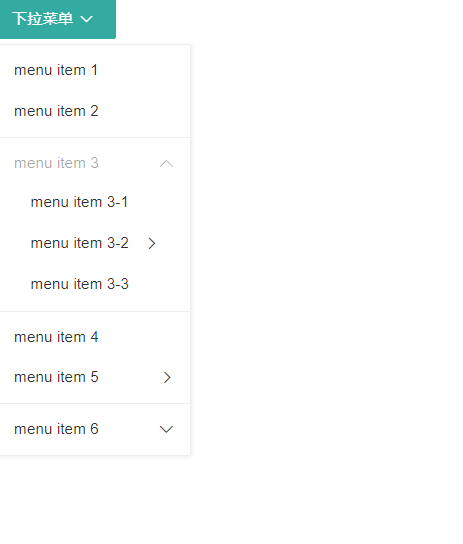

#### 基本参数

| 参数名         | 含义           | 参数值         |
| -------------- | -------------- | -------------- |
| elem           | 指向容器选择器 |                |
| data           | 数据           |                |
| 其余参数看文档 | 其余参数看文档 | 其余参数看文档 |

#### 菜单栏参数

| 参数    | 说明                                                                                                          |
| :------ | :------------------------------------------------------------------------------------------------------------ |
| title   | 菜单标题                                                                                                      |
| id      | 菜单 ID。用户菜单项唯一索引                                                                                   |
| href    | 菜单项的超链接地址。若填写，点击菜单将直接发生跳转。                                                          |
| target  | 菜单项超链接的打开方式，需 href 填写才生效。一般可设为 _blank 或 _self 等                                     |
| type    | 菜单项的类型，当前支持的值如下：*normal*（默认） *group*（垂直菜单组） *parent*（横向父子菜单） *-*（分割线） |
| child   | 子级菜单数据项。参数同父级，可无限嵌套。                                                                      |
| templet | 自定义当前菜单项模板，优先级高于全局设定的 templet。详见下文。                                                |

### 穿梭框模块

#### 基本样式

```html
<!DOCTYPE html>
<html>
    <head>
        <meta charset="utf-8">
        <title>穿梭框组件</title>
        <link rel="stylesheet" href="layui/css/layui.css">
        <script src="layui/layui.js"></script>
    </head>
    <body>
        <div id="test1"></div>
        <script>
            layui.use('transfer', function () {
                var transfer = layui.transfer;
                //渲染
                transfer.render({
                    elem: '#test1'  //绑定元素
                    , data: [
                        {"value": "1", "title": "李白", "disabled": "", "checked": ""}
                        , {"value": "2", "title": "杜甫", "disabled": "", "checked": ""}
                        , {"value": "3", "title": "贤心", "disabled": "", "checked": ""}
                    ]
                    , id: 'demo1' //定义索引
                });
            });
        </script>
    </body>
</html>
```

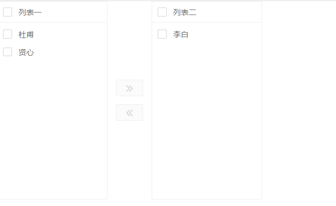

#### 基本参数

| 参数名                                   | 含义                                     | 参数值                                             |
| ---------------------------------------- | ---------------------------------------- | -------------------------------------------------- |
| elem                                     | 指向容器选择器                           |                                                    |
| title                                    | 穿梭框上方标题                           | title: ["权限列表","已获得的权限列表"]             |
| data                                     | 数据源                                   | json 数组形式：[{}, {}, …]                         |
| parseData                                | 用于对数据源进行格式解析                 | 服务端返回的数据一般不能正常使用，通过解析添加属性 |
| value                                    | 初始选中的数据（右侧列表）               |                                                    |
| id                                       | 设定实例唯一索引，用于基础方法传参使用。 |                                                    |
| showSearch                               | 是否开启搜索                             | false                                              |
| width                                    | 定义左右穿梭框宽度                       |                                                    |
| height                                   | 定义左右穿梭框高度                       |                                                    |
| var getData = transfer.getData('demo1'); | 获得被选中的数据存到数据库中             |                                                    |
| 其余参数看文档                           | 其余参数看文档                           | 其余参数看文档                                     |

### 树形组件模块

#### 基本样式

```html
<!DOCTYPE html>
<html>
    <head>
        <meta charset="utf-8">
        <title>树组件</title>
        <link rel="stylesheet" href="layui/css/layui.css">
        <script src="layui/layui.js"></script>    </head>
    <body>
        <div id="test1"></div>
        <script>
            layui.use('tree', function () {
                var tree = layui.tree;
                //渲染
                var inst1 = tree.render({
                    elem: '#test1'  //绑定元素
                    , data: [{
                        title: '江西' //一级菜单
                        , children: [{
                            title: '南昌' //二级菜单
                            , children: [{
                                title: '高新区' //三级菜单
                                //…… //以此类推，可无限层级
                            }]
                        }]
                    }, {
                        title: '陕西' //一级菜单
                        , children: [{
                            title: '西安' //二级菜单
                        }]
                    }]
                });
            });
        </script>
    </body>
</html>
```

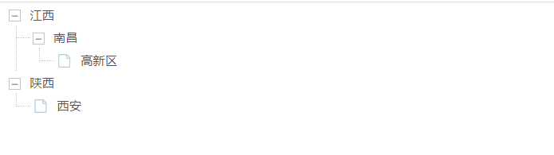

#### 基本参数

| 参数名         | 含义                   | 参数值                         |
| -------------- | ---------------------- | ------------------------------ |
| elem           | 指向容器选择器         |                                |
| data           | 数据源                 | 服务端                         |
| edit           | 是否开启节点的操作图标 | edit: ['add', 'update', 'del'] |
| 其余参数看文档 | 其余参数看文档         | 其余参数看文档                 |

### 轮播图模块

#### 基本样式

```html
<!DOCTYPE html>
<html>
    <head>
        <meta charset="utf-8">
        <title>carousel模块快速使用</title>
        <link rel="stylesheet" href="layui/css/layui.css">
        <script src="layui/layui.js"></script>    </head>
    <body>

        <div class="layui-carousel" id="test1">
            <div carousel-item>
                <div></div>
                <div></div>
                <div></div>
                <div></div>
                <div></div>
            </div>
        </div>
        <!-- 条目中可以是任意内容，如： -->

        <script>
            layui.use('carousel', function () {
                var carousel = layui.carousel;
                //建造实例
                carousel.render({
                    elem: '#test1'
                    , width: '100%' //设置容器宽度
                    , arrow: 'always' //始终显示箭头
                    //,anim: 'updown' //切换动画方式
                });
            });
        </script>
    </body>
</html>
```


#### 基本参数

| 参数名         | 含义               | 参数值                                                    |
| -------------- | ------------------ | --------------------------------------------------------- |
| elem           | 指向容器选择器     |                                                           |
| width          | 设定轮播容器宽度   | 默认值 '600px'                                            |
| height         | 设定轮播容器高度   | 默认值 '280px'                                            |
| anim           | 轮播切换动画方式   | default（左右切换）updown（上下切换）fade（渐隐渐显切换） |
| autoplay       | 是否自动切换       | 默认值 true                                               |
| interval       | 自动切换的时间间隔 | 默认值 3000                                               |
| 其余参数看文档 | 其余参数看文档     | 其余参数看文档                                            |

### 文件上传模块

#### 基本样式

```html
<!DOCTYPE html>
<html>
    <head>
        <meta charset="utf-8">
        <title>穿梭框组件</title>
        <link rel="stylesheet" href="layui/css/layui.css">
        <script src="layui/layui.js"></script>
    </head>
    <body>
        <button type="button" class="layui-btn" id="test1">
            <i class="layui-icon">&#xe67c;</i>上传图片
        </button>
        <script>
            layui.use('upload', function () {
                var upload = layui.upload;
                //执行实例
                var uploadInst = upload.render({
                    elem: '#test1' //绑定元素
                    , url: '/upload/' //上传接口
                    , done: function (res) {
                        //上传完毕回调
                    }
                    , error: function () {
                        //请求异常回调
                    }
                });
            });
        </script>
    </body>
</html>
```

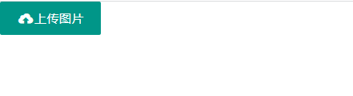

#### 基本参数

| 参数选项       | 说明           | 默认值         |
| :------------- | :------------- | :------------- |
| elem           | 指向容器选择器 | -              |
| url            | 服务端上传接口 | -              |
| data           | 数据           | -              |
| 其余参数看文档 | 其余参数看文档 | 其余参数看文档 |

#### 文件上传的其他方法参照文档

### 其他模块参见文档

> 模板引擎、流加载、工具组件、代码高亮、评分、滑块、颜色选择器
>
> [https://www.layuion.com/demo/laypage.html](https://www.layuion.com/demo/laypage.html)
