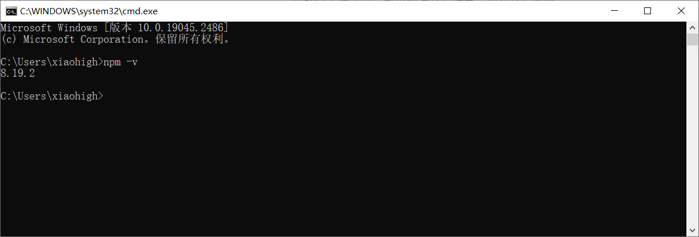
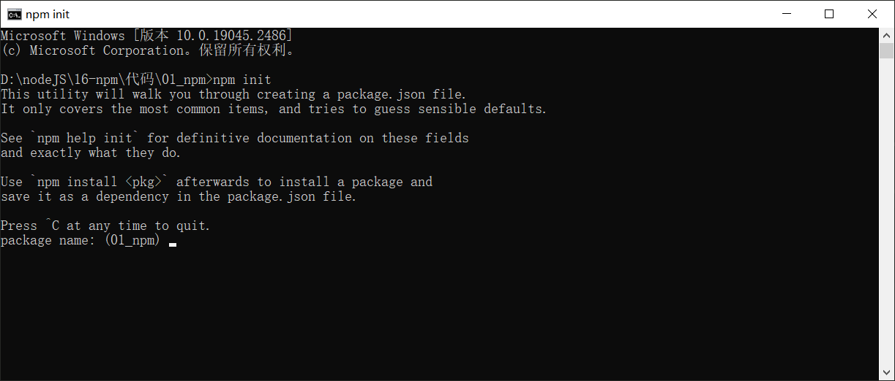
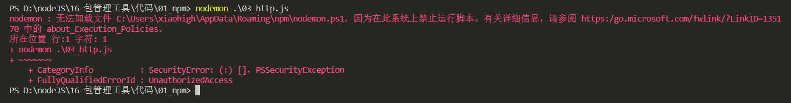
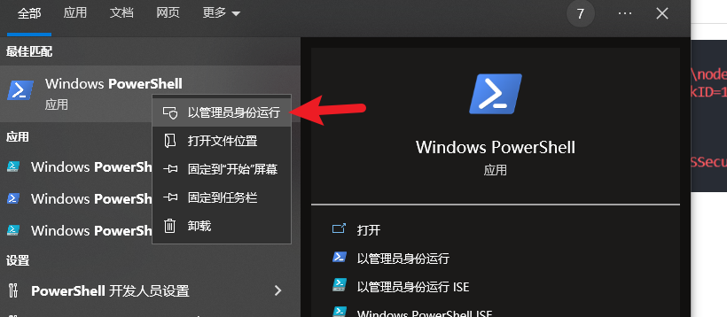
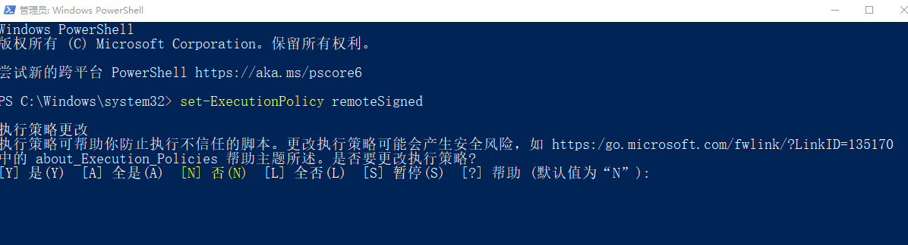
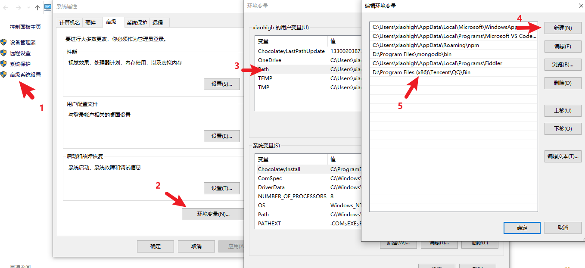

# 包管理工具


## 概念介绍

### 包是什么

『包』英文单词是 `package` ，代表了一组特定功能的源码集合

### 包管理工具

管理『包』的应用软件，可以对「包」进行 `下载安装` ， `更新` ， `删除` ， `上传` 等操作

借助包管理工具，可以快速开发项目，提升开发效率

包管理工具是一个通用的概念，很多编程语言都有包管理工具，所以 `掌握好包管理工具非常重要`

### 常用的包管理工具

下面列举了前端常用的包管理工具

- npm
- yarn
- cnpm

## npm

npm 全称 `Node Package Manager` ，翻译为中文意思是『Node 的包管理工具』

npm 是 node.js 官方内置的包管理工具，是 `必须要掌握住的工具`

### npm 的安装

node.js 在安装时会 `自动安装 npm` ，所以如果你已经安装了 `node.js`，可以直接使用 `npm`

可以通过 `npm -v` 查看版本号测试，如果显示版本号说明安装成功，反之安装失败



> 查看版本时可能与上图版本号不一样，不过不影响正常使用

### npm 基本使用

#### 初始化

创建一个空目录，然后以此目录作为工作目录 `启动命令行工具` ，执行 `npm init`



`npm init` 命令的作用是将文件夹初始化为一个『包』，交互式创建 `package.json 文件`

`package.json` 是包的配置文件，每个包都必须要有 `package.json`

`package.json` 内容示例：

```json
{
    "name": "01_npm",
    "version": "1.0.0",
    "description": "",
    "main": "index.js",
    "scripts": {
        "test": "echo \"Error: no test specified\" && exit 1"
    },
    "author": "",
    "license": "ISC"
}
```

属性翻译

```json
{
    "name": "1-npm", // 包的名字
    "version": "1.0.0", // 包的版本
    "description": "", // 包的描述
    "main": "index.js", // 包的入口文件
    "scripts": { // 脚本配置
        "test": "echo \"Error: no test specified\" && exit 1"
    },
    "author": "", // 作者
    "license": "ISC" // 开源证书
}
```

> 初始化的过程中还有一些注意事项：
>
> 1. `package name ( 包名 )` 不能使用中文、大写，默认值是 `文件夹的名称` ，所以文件夹名称也不能使用中文和大写
> 2. version ( 版本号 ) 要求 `x.x.x` 的形式定义， `x` 必须是数字，默认值是 `1.0.0`
> 3. `ISC` 证书与 `MIT` 证书功能上是相同的，关于开源证书扩展阅读 [http://www.ruanyifeng.com/blog/2011/05/how_to_choose_free_software_licenses.html](http://www.ruanyifeng.com/blog/2011/05/how_to_choose_free_software_licenses.html)
> 4. `package.json` 可以手动创建与修改
> 5. 使用 `npm init -y` 或者 `npm init --yes` 极速创建 `package.json`

#### 搜索包

搜索包的方式有两种

1. 命令行 『npm s/search 关键字』

2. `网站搜索` 网址是 [https://www.npmjs.com/](https://www.npmjs.com/)

> 经常有同学问，『我怎样才能精准找到我需要的包？』
>
> 这个事儿需要大家在实践中不断的积累，通过看文章，看项目去学习去积累

#### 下载安装包

我们可以通过 `npm install` 和 `npm i` 命令安装包

```js
# 格式
npm install <包名>
npm i <包名>
    
# 示例
npm install uniq
npm i uniq
```

运行之后文件夹下会增加两个资源

- `node_modules` 文件夹 存放下载的包
- `package-lock.json` 包的锁文件，用来锁定包的版本

>安装 `uniq` 之后， `uniq` 就是当前这个包的一个 `依赖包` ，有时会简称为 `依赖`
>
>比如我们创建一个包名字为 `A`，`A` 中安装了包名字是 `B`，我们就说 `B` 是 `A` 的一个依赖包，也会说`A` 依赖 `B`

#### require 导入 npm 包基本流程

1. 在当前文件夹下 `node_modules` 中寻找同名的文件夹
2. 在上级目录中下的 `node_modules` 中寻找同名的文件夹，直至找到磁盘根目录

### 生产环境与开发环境

开发环境是程序员 `专门用来写代码` 的环境，一般是指程序员的电脑，开发环境的项目一般 `只能程序员自己访问`

生产环境是项目 `代码正式运行` 的环境，一般是指正式的服务器电脑，生产环境的项目一般 `每个客户都可以访问`

### 生产依赖与开发依赖

我们可以在安装时设置选项来区分 依赖的类型，目前分为两类：

| 类型     | 命令                                    | 补充                                                                                     |
| -------- | --------------------------------------- | ---------------------------------------------------------------------------------------- |
| 生产依赖 | npm i -S uniq<br/>npm i --save uniq     | -S 等效于 --save，  `-S 是默认选项`<br/>包信息保存在 package.json 中 `dependencies` 属性 |
| 开发依赖 | npm i -D less<br/>npm i --save-dev less | -D 等效于 --save-dev<br/>包信息保存在 package.json 中 `dependencies` 属性                |

> 举个例子方便大家理解，比如说做蛋炒饭需要 `大米 ， 油 ， 葱 ， 鸡蛋 ， 锅 ， 煤气 ， 铲子` 等
>
> 其中 `锅 ， 煤气 ， 铲子` 属于开发依赖，只在制作阶段使用
>
> 而` 大米 ， 油 ， 葱 ， 鸡蛋` 属于生产依赖，在制作与最终食用都会用到
>
> 所以 `开发依赖` 是只在开发阶段使用的依赖包，而 `生产依赖` 是开发阶段和最终上线运行阶段都用到的依赖包

### 全局安装

我们可以执行安装选项 `-g` 进行全局安装

```js
npm i -g nodemon
```

全局安装完成之后就可以在命令行的任何位置运行 `nodemon` 命令

该命令的作用是 `自动重启 node 应用程序`

> 说明：
>
> - 全局安装的命令不受工作目录位置影响
> - 可以通过 `npm root -g` 可以查看全局安装包的位置
> - `不是所有的包都适合全局安装` ，只有全局类的工具才适合，可以通过 `查看包的官方文档来确定安装方式` ，这里先不必太纠结

#### 修改 windows 执行策略



windows 默认不允许 npm 全局命令执行脚本文件，所以需要修改执行策略

1. 以 `管理员身份` 打开 powershell 命令行

   

2. 键入命令 `set-ExecutionPolicy remoteSigned`

   

3. 键入 `A` 然后敲回车 👌

4. 如果不生效，可以尝试重启 `vscode`

#### 环境变量 Path

Path 是操作系统的一个环境变量，可以设置一些文件夹的路径，在当前工作目录下找不到可执行文件时，就会在环境变量 Path 的目录中挨个的查找，如果找到则执行，如果没有找到就会报错



> 补充说明：
>
> - 如果希望某个程序在任何工作目录下都能正常运行，就应该将该程序的所在目录配置到环境变量 Path 中
> - windows 下查找命令的所在位置
>   - cmd 命令行 中执行 where nodemon
>   - powershell 命令行 执行 get-command nodemon

### 安装包依赖

在项目协作中有一个常用的命令就是 `npm i` ，通过该命令可以依据 `package.json` 和 `package-lock.json` 的依赖声明安装项目依赖

```js
npm i
npm install
```

> `node_modules` 文件夹大多数情况都不会存入版本库

### 安装指定版本的包

项目中可能会遇到版本不匹配的情况，有时就需要安装指定版本的包，可以使用下面的命令的

```js
## 格式
npm i <包名@版本号>
    
## 示例
npm i jquery@1.11.2
```

### 删除依赖

项目中可能需要删除某些不需要的包，可以使用下面的命令

```js
## 局部删除
npm remove uniq
npm r uniq

## 全局删除
npm remove -g nodemon
```

### 配置命令别名

通过配置命令别名可以更简单的执行命令

配置 `package.json` 中的 `scripts` 属性

```json
{
	...
    "scripts": {
        "server": "node server.js",
        "start": "node index.js",
    },
	...
}
```

配置完成之后，可以使用别名执行命令

```js
npm run server
npm run start
```

不过 `start` 别名比较特别，使用时可以省略 `run`

```js
npm start
```

> 补充说明：
>
> - `npm start` 是项目中常用的一个命令，一般用来启动项目
> - `npm run` 有自动向上级目录查找的特性，跟 `require` 函数也一样
> - 对于陌生的项目，我们可以通过查看 `scripts` 属性来参考项目的一些操作

## cnpm

### 介绍

`cnpm` 是一个淘宝构建的 `npmjs.com` 的完整镜像，也称为『淘宝镜像』，网址 [https://npmmirror.com/](https://npmmirror.com/)

`cnpm` 服务部署在国内 `阿里云服务器上` ，可以提高包的下载速度

官方也提供了一个全局工具包 `cnpm` ，操作命令与 `npm` 大体相同

### 安装

我们可以通过 `npm` 来安装 `cnpm` 工具

```js
npm install -g cnpm --registry=https://registry.npmmirror.com
```

| 功能         | 命令                                                                    |
| ------------ | ----------------------------------------------------------------------- |
| 初始化       | cnpm init<br/>cnpm init                                                 |
| 安装包       | cnpm i uniq<br/>cnpm i -S uniq<br/>cnpm i -D uniq<br/>cnpm i -g nodemon |
| 安装项目依赖 | cnpm i                                                                  |
| 删除         | cnpm r uniq                                                             |

### npm 配置淘宝镜像

用 `npm` 也可以使用淘宝镜像，配置的方式有两种

- 直接配置
- 工具配置

#### 直接配置

执行如下命令即可完成配置

```js
npm config set registry https://registry.npmmirror.com/
```

#### 工具配置

使用 `nrm` 配置 `npm` 的镜像地址 `npm registry manager`

1. 安装 nrm

   ```js
   npm i -g nrm
   ```

2. 修改镜像

   ```js
   nrm use taobao
   ```

3. 检查是否配置成功（选做）

   ```js
   npm config list
   ```

检查 registry 地址是否为 [https://registry.npmmirror.com/](https://registry.npmmirror.com/) , 如果是则表明成功

> 补充说明：
>
> 1. `建议使用第二种方式` 进行镜像配置，因为后续修改起来会比较方便
> 2. 虽然 `cnpm` 可以提高速度，但是 `npm` 也可以通过淘宝镜像进行加速，所以 npm 的使用率还是高于 cnpm

## yarn


### yarn 介绍

yarn 是由 Facebook 在 2016 年推出的新的 Javascript 包管理工具，官方网址：[https://yarnpkg.com/](https://yarnpkg.com/)

### yarn 特点

yarn 官方宣称的一些特点

- 速度超快：yarn 缓存了每个下载过的包，所以再次使用时无需重复下载。同时利用并行下载以最大化资源利用率，因此安装速度更快
- 超级安全：在执行代码之前，yarn 会通过算法校验每个安装包的完整性
- 超级可靠：使用详细、简洁的锁文件格式和明确的安装算法，yarn 能够保证在不同系统上无差异的工作

### yarn 安装

我们可以使用 npm 安装 yarn

```js
npm i -g yarn
```

### yarn 常用命令

| 功能         | 命令                                                                                         |
| ------------ | -------------------------------------------------------------------------------------------- |
| 初始化       | yarn init<br/>yarn init -y                                                                   |
| 安装包       | yarn add uniq 生产依赖<br/>yarn add less --dev 开发依赖<br/>yarn global add nodemon 全局安装 |
| 删除包       | yarn remove uniq 删除项目依赖包<br/>yarn global remove nodemon 全局删除包                    |
| 安装项目依赖 | yarn                                                                                         |
| 运行命令别名 | yarn <别名><br/># 不需要添加  run                                                            |

> 思考题：
>
> 这里有个小问题就是 `全局安装的包不可用` ，yarn 全局安装包的位置可以通过`yarn global bin` 来查看

### yarn 配置淘宝镜像

可以通过如下命令配置淘宝镜像

```js
yarn config set registry https://registry.npmmirror.com
```

可以通过 `yarn config list` 查看 `yarn` 的配置项

### npm 和 yarn 选择

大家可以根据不同的场景进行选择

1. 个人项目

   如果是个人项目，哪个工具都可以，可以根据自己的喜好来选择

2. 公司项目

   如果是公司要根据项目代码来选择，可以 `通过锁文件判断` 项目的包管理工具

   - `npm` 的锁文件为 `package-lock.json`
   - `yarn` 的锁文件为 `yarn.lock`

> 包管理工具 `不要混着用，切记，切记，切记`

## 管理发布包

### 创建与发布

我们可以将自己开发的工具包发布到 `npm` 服务上，方便自己和其他开发者使用，操作步骤如下：

1. 创建文件夹，并创建文件 `index.js`，在文件中声明函数，使用 `module.exports` 暴露
2. `npm` 初始化工具包，`package.json` 填写包的信息 (包的名字是唯一的)
3. 注册账号 [https://www.npmjs.com/signup](https://www.npmjs.com/signup)
4. 激活账号（一定要激活账号）
5. 修改为官方的官方镜像 (命令行中运行 `nrm use npm` )
6. 命令行下 `npm login` 填写相关用户信息
7. 命令行下 `npm publish` 提交包 👌

### 更新包

后续可以对自己发布的包进行更新，操作步骤如下

1. 更新包中的代码

2. 测试代码是否可用

3. 修改 `package.json` 中的版本号

4. 发布更新

   ```js
   npm publish
   ```

### 删除包

执行如下命令删除包

```js
npm unpublish --force
```

> 删除包需要满足一定的条件，[https://docs.npmjs.com/policies/unpublish](https://docs.npmjs.com/policies/unpublish)
>
> - 你是包的作者
> - 发布小于 24 小时
> - 大于 24 小时后，没有其他包依赖，并且每周小于 300 下载量，并且只有一个维护者

## 扩展内容

在很多语言中都有包管理工具，比如：

| 语言       | 包管理工具          |
| ---------- | ------------------- |
| PHP        | composer            |
| Python     | pip                 |
| Java       | maven               |
| Go         | go mod              |
| JavaScript | npm/yarn/cnpm/other |
| Ruby       | rubyGems            |

除了编程语言领域有包管理工具之外，操作系统层面也存在包管理工具，不过这个包指的是『 软件包 』

| 操作系统 | 包管理工具 | 网址                                                                       |
| -------- | ---------- | -------------------------------------------------------------------------- |
| Centos   | yum        | [https://packages.debian.org/stable/](https://packages.debian.org/stable/) |
| Ubuntu   | apt        | [https://packages.ubuntu.com/](https://packages.ubuntu.com/)               |
| MacOS    | homebrew   | [https://brew.sh/](https://brew.sh/)                                       |
| Windows  | chocolatey | [https://chocolatey.org/](https://chocolatey.org/)                         |
