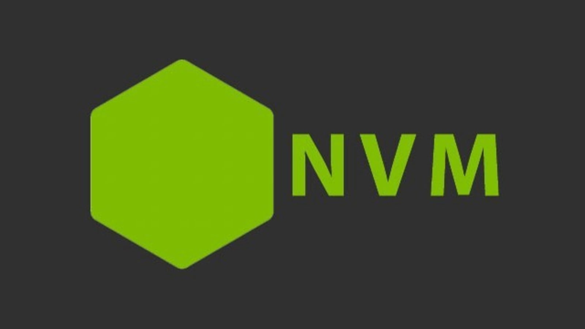
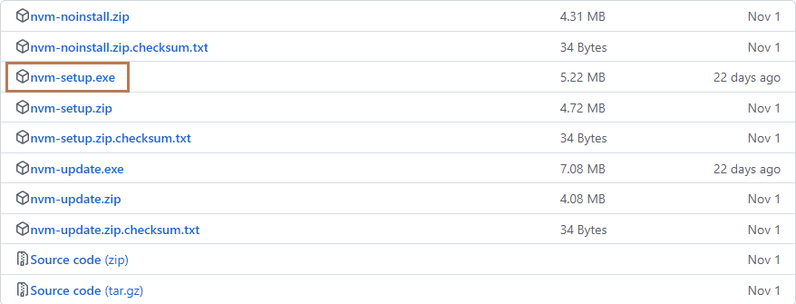
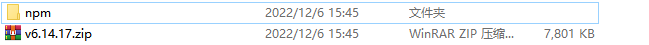
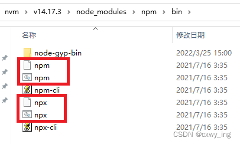
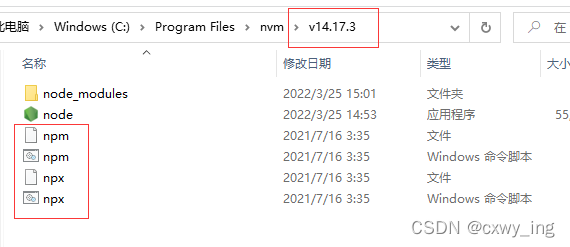

# nvm



## 什么是 nvm

Node.js 默认一台电脑只能装一个版本，有时为了开发项目经常会使用不同版本的 Node.js 版本，通常情况版本切换就比较麻烦了。

为了解决这个问题，nvm（node version manager）应运而生。有了 nvm，便可以在一台电脑上安装多个 Node.js 版本，并且可以一条指令随时下载或切换版本，而不需要频繁地下载/卸载不同版本的 node.js 来满足当前项目的要求。

## 安装 nvm

github 下载地址：[https://github.com/coreybutler/nvm-windows/releases](https://github.com/coreybutler/nvm-windows/releases)



## 常见命令

```js
nvm -v //查看 nvm 版本
nvm list //列出所有已安装的 node 版本
nvm list available //显示所有可下载的版本
nvm current //当前 node 版本
nvm install nodejsversion //安装 nodejs 版本
nvm use nodejsversion //使用 nodejs 版本
nvm uninstall nodejsversion //卸载 nodejs 版本
```

```js
nvm install 10.14.2
nvm use 10.14.2
```

## 用 nvm 安装 node 后，发现 npm 下载总是失败的解决办法

npm 网站：[https://registry.npmmirror.com/binary.html?path=npm/](https://registry.npmmirror.com/binary.html?path=npm/)

可从 npm 网站下载对应的 npm 包。之后解压，将解压后的文件名改成 npm，复制到对应的 node 版本文件夹下的 node_moudles 文件夹下。



然后将nvm/v14.17.3/node_moudles/npm/bin文件夹里的下图红框中的文件，复制到node文件夹下。



这里我的 node 的文件名是 v14.17.3，所以我复制到了 v14.17.3 文件下，如下图。



