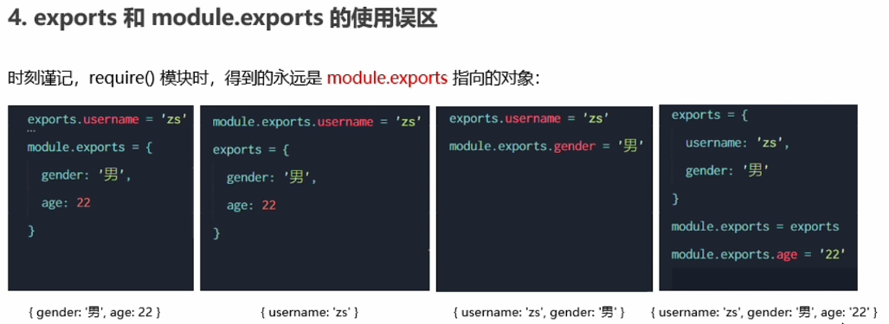
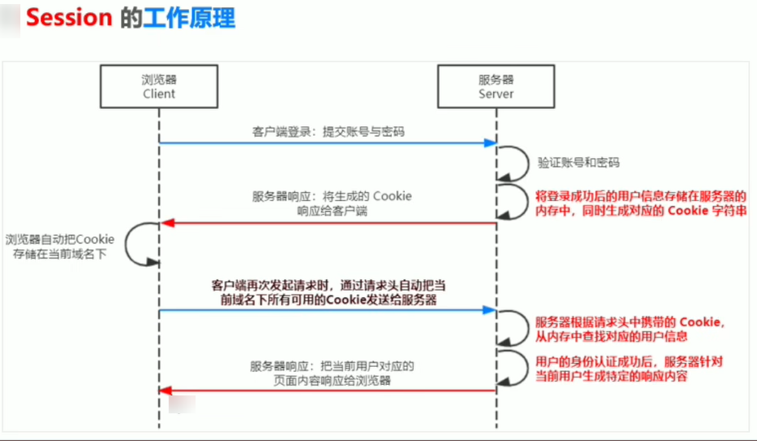
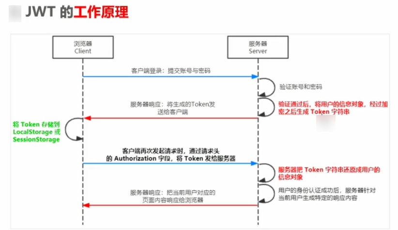

# NodeJS

> [黑马程序员 Node.js 全套入门教程，nodejs 新教程含 es6 模块化+npm+express+webpack+promise 等_Nodejs 实战案例详解](https://www.bilibili.com/video/BV1a34y167AZ/?spm_id_from=333.337.search-card.all.click)
>
> [https://www.npmjs.com/](https://www.npmjs.com/)

## NodeJS 简介

> Node.js 是 js 的后端运行环境，使用 V8 引擎，不包含浏览器内置 API

## NodeJS 安装

> [https://nodejs.org/zh-cn/](https://nodejs.org/zh-cn/)
>
> node -v 检查是否安装成功

## fs 文件系统模块

> 用来操作文件的内置模块
>
> __dirname 当前文件所处路径 相当于`./`

### 读取文件

```javascript
const fs = require('fs')
fs.readFile(__dirname + '/file/123.txt', 'utf-8', function (err, dataStr) {
    if (err) {
        return console.log("读取失败")
    }
    console.log(dataStr)
})
```

### 写入文件

```javascript
const fs = require('fs')
fs.readFile(__dirname + '/file/123.txt', 'utf-8', function (err, dataStr) {
    if (err) {
        return console.log("读取失败")
    }
    console.log(dataStr)
})
```

## path 路径模块

### 路径拼接

> ../会抵消一层目录
>
> path.join

```javascript
const path = require('path')
const str = path.join('/a','/b/c','../','./d','e','f')
console.log(str)
```

### 不要通过 + 号拼接路径

```javascript
const fs = require('fs')
const path = require('path')

fs.readFile(path.join(__dirname,'/file/grade.txt'), 'utf-8', function (err, dataStr) {
    if (err) {
        return console.log("读取失败" + err.message)
    }
    console.log(dataStr)
})
```

### 获取路径中的文件名

> path.basename

```javascript
const path = require('path')
const name = '/a/index.html'

var fullname = path.basename(name)
console.log(fullname) //index.html

var ext = path.basename(name,".html")
console.log(ext) //index
```

### 获取文件后缀名

>path.extname

```javascript
const path = require("path");
const name = '/a/index.html'
var ext = path.extname(name)
console.log(ext) //.html
```

## http 模块

> ip 地址是每台计算机器的唯一地址，点分十进制表示 (a,b,c,d),都是 0~255 之间的十进制整数
>
> 域名和域名服务器：域名服务器就是解析域名和 ip 地址的服务器 (DNS)
>
> 端口号：作为服务的门牌号，不能被多个服务占用

### 创建 web 服务器

```javascript
const http = require('http')
const server = http.createServer()
// req 是请求对象，包含了与客户端相关的数据和属性 绑定请求事件
server.on('request', (req, res) => {
    // req.url 是客户端请求的 URL 地址
    const url = req.url
    // req.method 是客户端请求的 method 类型
    const method = req.method
    const str = `中文 Your request url is ${url}, and request method is ${method}`
    console.log(str)
    // 调用 res.end() 方法，向客户端响应一些内容
    // 解决中文乱码
    res.setHeader('Content-Type', 'text/html;charset=utf-8')
    res.end(str)
})
//启动服务器
server.listen(80, () => {
    console.log('server running at http://127.0.0.1')
})
```

### 根据不同的请求响应不同的页面

```javascript
const http = require('http')
const server = http.createServer()
// req 是请求对象，包含了与客户端相关的数据和属性 绑定请求事件
server.on('request', (req, res) => {
    //获取请求的 url 地址
    const url = req.url
    //设置默认响应
    let content = '<h1>404 Not Found!</h1>'
    //判度是否为首页
    if (url === '/' || url === '/index.html') {
        content = '<h1>index.html</h1>'
    } else if (url === '/about.html') {
        content = '<h1>关于页面.html</h1>'
    }
    //乱码
    res.setHeader('Content-Type', 'text/html;charset=utf-8')
    res.end(content)
})
//启动服务器
server.listen(8081, () => {
    console.log('server running at http://127.0.0.1:8081')
})
```

## 模块化

### 模块分类

- 内置模块（fs，path，http）
- 自定义模块（加载模块时需要加`./`）
- 第三方模块

```javascript
const fs = require('fs')
const custom = require('./custom.js')
const moment = require('moment')
```

### 模块作用域

- 成员，方法等只能在当前模块中才能访问

### modele 对象

```javascript
Module {
  id: '.',
  path: 'G:\\011-front\\nodejs\\nodejs\\module',
  exports: {},
  filename: 'G:\\011-front\\nodejs\\nodejs\\module\\module.js',
  loaded: false,
  children: [],
  paths: [
    'G:\\011-front\\nodejs\\nodejs\\module\\node_modules',
    'G:\\011-front\\nodejs\\nodejs\\node_modules',
    'G:\\011-front\\nodejs\\node_modules',
    'G:\\011-front\\node_modules',
    'G:\\node_modules'
  ]
}
```

### 共享模块作用域

- `默认情况下module.exports={}`
- 在自定义模块中，可以通过该对象将成员共享出去
- 外界导入该自定义模块时，得到的就是 module.exports 指向的对象
- 永远以 module.exports 指向的对象为准
- exports 和 module.exports 指向同一个对象，module 只是简化

```javascript
// 在一个自定义模块中，默认情况下，module.exports = {}
const age = 20

// 向 module.exports 对象上挂载 username 属性
module.exports.username = 'zs'
// 向 module.exports 对象上挂载 sayHello 方法
module.exports.sayHello = function() {
    console.log('Hello!')
}
module.exports.age = age

// 让 module.exports 指向一个全新的对象
module.exports = {
    nickname: '小黑',
    sayHi() {
        console.log('Hi!')
    }
}
```

### 使用误区



### CommonJS 规范

> 每个模块内部，module 变量代表当前模块
>
> module 变量是一个对象，它的 exports 属性是对外的接口
>
> 加载某个模块的时候，其实是加载该模块的 module.export 属性，ruquire() 表示加载该模块

## npm 包

> 第三方模块就是包

> [https://www.npmjs.com/](https://www.npmjs.com/)
>
> [https://registry.npmjs.org/](https://registry.npmjs.org/)

### 使用 npm 包格式化时间

```npm
npm install moment
npm i moment
```

> 会生成 node_modules 和 package-lock.json 和 package.json 文件
>
> node_modules 文件夹用来存放所有已安装到项目中的包
>
> package-lock.json 配置文件用来记录每一个包的下载信息
>
> package.json 是在多人开发中共享 npm 包的下载版本信息，避免将 node_modeles 上传到 git 仓库中

```javascript
// 注意：导入的名称，就是装包时候的名称
const moment = require('moment')

const dt = moment().format('YYYY-MM-DD HH:mm:ss')
console.log(dt)
```

### 快速创建 package.json

```javascript
npm init -y
```

### 一次性安装所有包

```javascript
npm install //会自动获取 package.json 包的版本信息并安装
```

### 一次性卸载所有包

```javascript
npm uninstall //自动卸载所有包
```

### devDependencies 节点

> 将只有在开发阶段才会用到的包放到 devDependencies 节点中

```javascript
npm i 包名 -D
```

```json
{
  "dependencies": {
    "jquery": "^3.6.0",
    "moment": "^2.29.3"
  },
  "devDependencies": {
    "webpack": "^5.72.1"
  }
}
```

### 下包速度慢解决方式

```javascript
#查看当前下包镜像源
npm config get registry
#下包镜像源切换为淘宝镜像源
npm config set registry=https://registry.npm.taobao.org/
#检测镜像源是否成功
npm config get registry
```

### nrm 工具

```javascript
#nrm管理工具
npm i nrm -g
nrm ls
nrm use taobao
```

## npm 与包

### 包的分类

> 项目包：分为开发依赖包（dev）和核心依赖包
>
> 全局包：npm i 包名 -g 会安装在 C 盘用户目录的的 node_modeles

### 开发自己的包

> 新建一个包文件夹，创建 package.json、index.js、README.md 文件

#### package.json

```json
{
    "name": "itheima-tools",
    "version": "1.1.0",
    "main": "index.js",
    "description": "提供了格式化时间、HTMLEscape 相关的功能",
    "keywords": [
        "itheima",
        "dateFormat",
        "escape"
    ],
    "license": "ISC"
}
```

#### index.js

```javascript
// 这是包的入口文件

const date = require('./src/dateFormat')
const escape = require('./src/htmlEscape')

// 向外暴露需要的成员
module.exports = {
    ...date,
    ...escape
}

```

#### README.md

````txt
## 安装
```
npm install itheima-tools
```

## 导入
```js
const itheima = require('itheima-tools')
```

## 格式化时间
```js
// 调用 dateFormat 对时间进行格式化
const dtStr = itheima.dateFormat(new Date())
// 结果  2020-04-03 17:20:58
console.log(dtStr)
```

## 转义 HTML 中的特殊字符
```js
// 带转换的 HTML 字符串
const htmlStr = '<h1 title="abc">这是 h1 标签<span>123&nbsp;</span></h1>'
// 调用 htmlEscape 方法进行转换
const str = itheima.htmlEscape(htmlStr)
// 转换的结果 &lt;h1 title=&quot;abc&quot;&gt;这是 h1 标签&lt;span&gt;123&amp;nbsp;&lt;/span&gt;&lt;/h1&gt;
console.log(str)
```

## 还原 HTML 中的特殊字符
```js
// 待还原的 HTML 字符串
const str2 = itheima.htmlUnEscape(str)
// 输出的结果 <h1 title="abc">这是 h1 标签<span>123&nbsp;</span></h1>
console.log(str2)
```

## 开源协议
ISC
````

#### 发布包

>https://www.npmjs.com/

### 模块的加载机制

> 优先从缓存中加载
>
> 内置模块的加载优先级最高
>
> 自定义模块加载机制：`确切的文件名`->`补全.js`->`补全.json`->`补全.node`->`报错`
>
> 第三方模块加载机制：从当前目录的 node_modules 找，找不到则找上级目录，直到根目录

### express 框架入门

> https://www.expressjs.com.cn/

```javascript
npm i express@4.17.1
```

#### 创建 web 服务器

> req.query() 获取从客户端传递的参数名和参数值
>
> req.params() 获取匹配 URL 的参数值

```javascript
// 1. 导入 express
const express = require('express')
// 2. 创建 web 服务器
const app = express()

// 4. 监听客户端的 GET 和 POST 请求，并向客户端响应具体的内容
app.get('/user', (req, res) => {
    // 调用 express 提供的 res.send() 方法，向客户端响应一个 JSON 对象
    res.send({ name: 'zs', age: 20, gender: '男' })
})
app.post('/user', (req, res) => {
    // 调用 express 提供的 res.send() 方法，向客户端响应一个 文本字符串
    res.send('请求成功')
})
app.get('/', (req, res) => {
    // 通过 req.query 可以获取到客户端发送过来的 查询参数
    // 注意：默认情况下，req.query 是一个空对象
    console.log(req.query)
    res.send(req.query)
})
// 注意：这里的 :id 是一个动态的参数
app.get('/user/:ids/:username', (req, res) => {
    // req.params 是动态匹配到的 URL 参数，默认也是一个空对象
    console.log(req.params)
    res.send(req.params)
})

// 3. 启动 web 服务器
app.listen(80, () => {
    console.log('express server running at http://127.0.0.1')
})
```

#### 托管静态资源

> express.static() 托管静态资源

```javascript
const express = require('express')
const app = express()

// 在这里，调用 express.static() 方法，快速的对外提供静态资源
app.use(express.static('./clock'))

app.listen(80, () => {
    console.log('express server running at http://127.0.0.1')
})
```

#### 托管多个静态资源

> 按照查找顺序加载静态资源

```javascript
const express = require('express')
const app = express()

// 在这里，调用 express.static() 方法，快速的对外提供静态资源
app.use(express.static('./files'))
app.use(express.static('./clock'))

app.listen(80, () => {
    console.log('express server running at http://127.0.0.1')
})
```

#### 挂载路径前缀

>http://127.0.0.1/clock/

```javascript
const express = require('express')
const app = express()

// 在这里，调用 express.static() 方法，快速的对外提供静态资源
// app.use(express.static('./files'))
app.use('/clock',express.static('./clock'))

app.listen(80, () => {
    console.log('express server running at http://127.0.0.1')
})
```

#### nodemon

> 类似于热部署的工具
>
> 可能会遇到电脑禁用脚本的时候，需要开放权限
>
> Windows Powershell -> set-ExecutionPolicy RemoteSigned -> y 

```javascript
npm install -g nodemon
```

### express 路由

> 路由指的是客户端请求和服务器处理函数的映射关系
>
> 路由由三部分组成：请求的类型，请求的地址。请求的处理函数

#### 路由使用

```javascript
const express = require('express')
const app = express()

// 挂载路由
app.get('/', (req, res) => {
    res.send('hello world.')
})
app.post('/', (req, res) => {
    res.send('Post Request.')
})

app.listen(80, () => {
    console.log('http://127.0.0.1')
})
```

#### 路由模块化

```javascript
// 这是路由自定义模块
// 1. 导入 express
const express = require('express')
// 2. 创建路由对象
const router = express.Router()

// 3. 挂载具体的路由
router.get('/user/list', (req, res) => {
    res.send('Get user list.')
})
router.post('/user/add', (req, res) => {
    res.send('Add new user.')
})

// 4. 向外导出路由对象
module.exports = router
```

```javascript
const express = require('express')
const app = express()

// app.use('/files', express.static('./files'))

// 1. 导入路由模块
const router = require('./03.router')
// 2. 注册路由模块
app.use('/api', router)

// 注意：app.use() 函数的作用，就是来注册全局中间件

app.listen(80, () => {
    console.log('http://127.0.0.1')
})
```

### express 中间件

> 本质上就是一个 function(){}处理函数，中间件函数参数必须包含 next
>
> next() 是实现中间件连续调用的关键，它表示将流转关系传递给下一个中间件或者是路由

#### 最简单的中间件函数

```javascript
const express = require('express')
const app = express()

// 定义一个最简单的中间件函数
const mw = function (req, res, next) {
    console.log('这是最简单的中间件函数')
    // 把流转关系，转交给下一个中间件或路由
    next()
}

app.listen(80, () => {
    console.log('http://127.0.0.1')
})
```

#### 全局生效的中间件

> 通过 app.use(中间件函数)，即可定义一个全局生效的中间件函数

```javascript
const express = require('express')
const app = express()

// 这是定义全局中间件的简化形式
app.use((req, res, next) => {
    console.log('这是最简单的中间件函数')
    next()
})

app.get('/', (req, res) => {
    console.log('调用了 / 这个路由')
    res.send('Home page.')
})
app.get('/user', (req, res) => {
    console.log('调用了 /user 这个路由')
    res.send('User page.')
})

app.listen(80, () => {
    console.log('http://127.0.0.1')
})
```

#### 中间件的作用

> 上游中间件给 res 和 req 添加自定义属性或方法，供下游中间件或路由使用，类似由过滤器的作用

#### 定义多个全局中间件

```javascript
const express = require('express')
const app = express()

// 定义第一个全局中间件
app.use((req, res, next) => {
    console.log('调用了第 1 个全局中间件')
    next()
})
// 定义第二个全局中间件
app.use((req, res, next) => {
    console.log('调用了第 2 个全局中间件')
    next()
})

// 定义一个路由
app.get('/user', (req, res) => {
    res.send('User page.')
})

app.listen(80, () => {
    console.log('http://127.0.0.1')
})
```

#### 局部生效的中间件

> 不使用 app.use(中间件函数)，即可定义一个局部生效中间件函数

```javascript
// 导入 express 模块
const express = require('express')
// 创建 express 的服务器实例
const app = express()

// 1. 定义中间件函数
const mw1 = (req, res, next) => {
    console.log('调用了局部生效的中间件')
    next()
}

// 2. 创建路由
app.get('/', mw1, (req, res) => {
    res.send('Home page.')
})
//不生效
app.get('/user', (req, res) => {
    res.send('User page.')
})

// 调用 app.listen 方法，指定端口号并启动 web 服务器
app.listen(80, function () {
    console.log('Express server running at http://127.0.0.1')
})
```

#### 定义多个局部中间件

```javascript
// 导入 express 模块
const express = require('express')
// 创建 express 的服务器实例
const app = express()

// 1. 定义中间件函数
const mw1 = (req, res, next) => {
    console.log('调用了第一个局部生效的中间件')
    next()
}

const mw2 = (req, res, next) => {
    console.log('调用了第二个局部生效的中间件')
    next()
}

// 2. 创建路由
app.get('/', [mw1, mw2], (req, res) => {
    res.send('Home page.')
})
app.get('/user', (req, res) => {
    res.send('User page.')
})

// 调用 app.listen 方法，指定端口号并启动 web 服务器
app.listen(80, function () {
    console.log('Express server running at http://127.0.0.1')
})
```

#### 中间件的注意事项

- 一定要在路由之前注册中间件函数

- 客户端发送过来的请求，可以连续调用多个中间件进行处理
- 执行完中间件代码后，一定要调用 next() 函数
- 在调用 next() 函数后就不要在写其他的代码
- 连续调用多个中间件时，res 和 req 时共享的

#### 中间件的分类

##### 应用级别中间件

> 绑定到 app 实例上的中间件叫做应用级别中间件（全局和局部中间件）

##### 路由级别中间件

> 绑定到 express.Router() 实例上的中间件叫做路由级别中间件

##### 错误级别中间件

> 用于捕获整个项目中发生的异常错误，注意错误中间件卸载路由后面用于捕捉错误，不需要 next()

```javascript
// 导入 express 模块
const express = require('express')
// 创建 express 的服务器实例
const app = express()

// 1. 定义路由
app.get('/', (req, res) => {
    // 1.1 人为的制造错误
    throw new Error('服务器内部发生了错误！')
    res.send('Home page.')
})

// 2. 定义错误级别的中间件，捕获整个项目的异常错误，从而防止程序的崩溃
app.use((err, req, res, next) => {
    console.log('发生了错误！' + err.message)
    res.send('Error:' + err.message)
})

// 调用 app.listen 方法，指定端口号并启动 web 服务器
app.listen(80, function () {
    console.log('Express server running at http://127.0.0.1')
})
```

##### Express 内置中间件

> express.static 托管静态资源的内置中间件
>
> express.json 解析 json 格式的请求体数据
>
> express.urlencoded 解析 URL 格式的请求体数据
>
> req.body 如果没有解析表单的中间件，则默认是 undefined

```javascript
// 导入 express 模块
const express = require('express')
// 创建 express 的服务器实例
const app = express()

// 注意：除了错误级别的中间件，其他的中间件，必须在路由之前进行配置
// 通过 express.json() 这个中间件，解析表单中的 JSON 格式的数据
app.use(express.json())
// 通过 express.urlencoded() 这个中间件，来解析 表单中的 url-encoded 格式的数据
app.use(express.urlencoded({ extended: false }))

app.post('/user', (req, res) => {
    // 在服务器，可以使用 req.body 这个属性，来接收客户端发送过来的请求体数据
    // 默认情况下，如果不配置解析表单数据的中间件，则 req.body 默认等于 undefined
    console.log(req.body)
    res.send('ok')
})

app.post('/book', (req, res) => {
    // 在服务器端，可以通过 req,body 来获取 JSON 格式的表单数据和 url-encoded 格式的数据
    console.log(req.body)
    res.send('ok')
})

// 调用 app.listen 方法，指定端口号并启动 web 服务器
app.listen(80, function () {
    console.log('Express server running at http://127.0.0.1')
}
```

##### 第三方中间件

> body-parser 第三方中间件，用来解析请求体数据

```javascript
npm i body-parser

// 导入 express 模块
const express = require('express')
// 创建 express 的服务器实例
const app = express()

// 1. 导入解析表单数据的中间件 body-parser
const parser = require('body-parser')
// 2. 使用 app.use() 注册中间件
app.use(parser.urlencoded({ extended: false }))
// app.use(express.urlencoded({ extended: false }))

app.post('/user', (req, res) => {
    // 如果没有配置任何解析表单数据的中间件，则 req.body 默认等于 undefined
    console.log(req.body)
    res.send('ok')
})

// 调用 app.listen 方法，指定端口号并启动 web 服务器
app.listen(80, function () {
    console.log('Express server running at http://127.0.0.1')
})
```

### express 写接口

#### 基本的服务器

```javascript
// 导入 express
const express = require('express')
// 创建服务器实例
const app = express()

// 配置解析表单数据的中间件
app.use(express.urlencoded({ extended: false }))

// 必须在配置 cors 中间件之前，配置 JSONP 的接口
app.get('/api/jsonp', (req, res) => {
    // TODO: 定义 JSONP 接口具体的实现过程
    // 1. 得到函数的名称
    const funcName = req.query.callback
    // 2. 定义要发送到客户端的数据对象
    const data = { name: 'zs', age: 22 }
    // 3. 拼接出一个函数的调用
    const scriptStr = `${funcName}(${JSON.stringify(data)})`
    // 4. 把拼接的字符串，响应给客户端
    res.send(scriptStr)
})

// 一定要在路由之前，配置 cors 这个中间件，从而解决接口跨域的问题
const cors = require('cors')
app.use(cors())

// 导入路由模块
const router = require('./16.apiRouter')
// 把路由模块，注册到 app 上
app.use('/api', router)

// 启动服务器
app.listen(80, () => {
    console.log('express server running at http://127.0.0.1')
})
```

#### get 接口

```javascript
// 定义 GET 接口
router.get('/get', (req, res) => {
    // 通过 req.query 获取客户端通过查询字符串，发送到服务器的数据
    const query = req.query
    // 调用 res.send() 方法，向客户端响应处理的结果
    res.send({
        status: 0, // 0 表示处理成功，1 表示处理失败
        msg: 'GET 请求成功！', // 状态的描述
        data: query, // 需要响应给客户端的数据
    })
})
```

#### post 接口

```javascript
// 定义 POST 接口
router.post('/post', (req, res) => {
    // 通过 req.body 获取请求体中包含的 url-encoded 格式的数据
    const body = req.body
    // 调用 res.send() 方法，向客户端响应结果
    res.send({
        status: 0,
        msg: 'POST 请求成功！',
        data: body,
    })
})
```

#### CORS 跨域资源共享

> res.setHrader(‘Access-Control-Allow-Origin’，‘*’)  允许来自任何域的请求
>
> 简单请求（get，post，head）和预检请求的区别：简单请求客户端和服务端只会发生一次请求，预检请求客户端和服务端会发生两次请求，OPTION 预检请求发送成功之后，才会发起真正的请求

```javascript
npm i cors
```

```html
<!DOCTYPE html>
<html lang="en">
    <head>
        <meta charset="UTF-8" />
        <meta name="viewport" content="width=device-width, initial-scale=1.0" />
        <title>Document</title>
        <script src="https://cdn.staticfile.org/jquery/3.4.1/jquery.min.js"></script>
    </head>
    <body>
        <button id="btnGET">GET</button>
        <button id="btnPOST">POST</button>
        <button id="btnDelete">DELETE</button>
        <button id="btnJSONP">JSONP</button>

        <script>
            $(function () {
                // 1. 测试 GET 接口
                $('#btnGET').on('click', function () {
                    $.ajax({
                        type: 'GET',
                        url: 'http://127.0.0.1/api/get',
                        data: { name: 'zs', age: 20 },
                        success: function (res) {
                            console.log(res)
                        },
                    })
                })
                // 2. 测试 POST 接口
                $('#btnPOST').on('click', function () {
                    $.ajax({
                        type: 'POST',
                        url: 'http://127.0.0.1/api/post',
                        data: { bookname: '水浒传', author: '施耐庵' },
                        success: function (res) {
                            console.log(res)
                        },
                    })
                })

                // 3. 为删除按钮绑定点击事件处理函数
                $('#btnDelete').on('click', function () {
                    $.ajax({
                        type: 'DELETE',
                        url: 'http://127.0.0.1/api/delete',
                        success: function (res) {
                            console.log(res)
                        },
                    })
                })

                // 4. 为 JSONP 按钮绑定点击事件处理函数
                $('#btnJSONP').on('click', function () {
                    $.ajax({
                        type: 'GET',
                        url: 'http://127.0.0.1/api/jsonp',
                        dataType: 'jsonp',
                        success: function (res) {
                            console.log(res)
                        },
                    })
                })
            })
        </script>
    </body>
</html>
```

#### jsonp 跨域资源共享

> 只支持 get 请求

## 数据库

```javascript
npm i mysql
```

### 建立连接

```javascript
// 1. 导入 mysql 模块
const mysql = require('mysql')
// 2. 建立与 MySQL 数据库的连接关系
const db = mysql.createPool({
    host: '127.0.0.1', // 数据库的 IP 地址
    user: 'root', // 登录数据库的账号
    password: '123456', // 登录数据库的密码
    database: 'nodejs', // 指定要操作哪个数据库
})
```

### 查询数据

```javascript
// 查询 users 表中所有的数据
const sqlStr = 'select * from users'
db.query(sqlStr, (err, results) => {
    // 查询数据失败
    if (err) return console.log(err.message)
    // 查询数据成功
    // 注意：如果执行的是 select 查询语句，则执行的结果是数组
    console.log(results)
})
```

### 插入数据

```javascript
// 向 users 表中，新增一条数据，其中 username 的值为 Spider-Man，password 的值为 pcc123
const user = {username: 'Spider-Man', password: 'pcc123'}
// 定义待执行的 SQL 语句
const sqlStr = 'insert into users (username, password) values (?, ?)'
// 执行 SQL 语句
db.query(sqlStr, [user.username, user.password], (err, results) => {
    // 执行 SQL 语句失败了
    if (err) return console.log(err.message)
    // 成功了
    // 注意：如果执行的是 insert into 插入语句，则 results 是一个对象
    // 可以通过 affectedRows 属性，来判断是否插入数据成功
    if (results.affectedRows === 1) {
        console.log('插入数据成功！')
    }
})
```

### 插入数据便捷形式

```javascript
// 演示插入数据的便捷方式
const user = {username: 'Spider-Man2', password: 'pcc4321'}
// 定义待执行的 SQL 语句
const sqlStr = 'insert into users set ?'
// 执行 SQL 语句
db.query(sqlStr, user, (err, results) => {
    if (err) return console.log(err.message)
    if (results.affectedRows === 1) {
        console.log('插入数据成功')
    }
})
```

### 更新数据

```javascript
// 演示如何更新用户的信息
const user = { id: 1, username: 'aaa', password: '000' }
// 定义 SQL 语句
const sqlStr = 'update users set username=?, password=? where id=?'
// 执行 SQL 语句
db.query(sqlStr, [user.username, user.password, user.id], (err, results) => {
    if (err) return console.log(err.message)
    // 注意：执行了 update 语句之后，执行的结果，也是一个对象，可以通过 affectedRows 判断是否更新成功
    if (results.affectedRows === 1) {
        console.log('更新成功')
    }
})
```

### 更新数据便捷形式

```javascript
// 演示更新数据的便捷方式
const user = { id: 1, username: 'aaaa', password: '0000' }
// 定义 SQL 语句
const sqlStr = 'update users set ? where id=?'
// 执行 SQL 语句
db.query(sqlStr, [user, user.id], (err, results) => {
    if (err) return console.log(err.message)
    if (results.affectedRows === 1) {
        console.log('更新数据成功')
    }
})
```

### 删除数据

```javascript
// 删除 id 为 5 的用户
const sqlStr = 'delete from users where id=?'
db.query(sqlStr, 3, (err, results) => {
    if (err) return console.log(err.message)
    // 注意：执行 delete 语句之后，结果也是一个对象，也会包含 affectedRows 属性
    if (results.affectedRows === 1) {
        console.log('删除数据成功')
    }
})
```

### 逻辑删除

> 数组中第一位表示 status 设置为 1，第二位是 id

```javascript
// 标记删除
const sqlStr = 'update users set status=? where id=?'
db.query(sqlStr, [1, 2], (err, results) => {
    if (err) return console.log(err.message)
    if (results.affectedRows === 1) {
        console.log('标记删除成功')
    }
}
```

## 身份认证

> 对于服务端渲染即 jsp 使用 session 认证机制
>
> 对于前后端分离使用 JWT 认证机制

### cookie

> 身份认证的标识：自动发送、域名独立、过期时限、4kb 限制


### session 工作原理



### 使用 session

```javascript
// 导入 express 模块
const express = require('express')
// 创建 express 的服务器实例
const app = express()

// TODO_01：请配置 Session 中间件
const session = require('express-session')
app.use(
    session({
        secret: 'itheima',
        resave: false, //固定写法
        saveUninitialized: true, //固定写法
    })
)

// 托管静态页面
app.use(express.static('./pages'))
// 解析 POST 提交过来的表单数据
app.use(express.urlencoded({ extended: false }))

// 登录的 API 接口
app.post('/api/login', (req, res) => {
    // 判断用户提交的登录信息是否正确
    if (req.body.username !== 'admin' || req.body.password !== '000000') {
        return res.send({ status: 1, msg: '登录失败' })
    }

    // TODO_02：请将登录成功后的用户信息，保存到 Session 中
    // 注意：只有成功配置了 express-session 这个中间件之后，才能够通过 req 点出来 session 这个属性
    req.session.user = req.body // 用户的信息
    req.session.islogin = true // 用户的登录状态

    res.send({ status: 0, msg: '登录成功' })
})

// 获取用户姓名的接口
app.get('/api/username', (req, res) => {
    // TODO_03：请从 Session 中获取用户的名称，响应给客户端
    if (!req.session.islogin) {
        return res.send({ status: 1, msg: 'fail' })
    }
    res.send({
        status: 0,
        msg: 'success',
        username: req.session.user.username,
    })
})

// 退出登录的接口
app.post('/api/logout', (req, res) => {
    // TODO_04：清空 Session 信息
    req.session.destroy()
    res.send({
        status: 0,
        msg: '退出登录成功',
    })
})

// 调用 app.listen 方法，指定端口号并启动 web 服务器
app.listen(80, function () {
    console.log('Express server running at http://127.0.0.1:80')
})
```

### JWT 认证机制

> 区别是 JWT 将用户信息保持在浏览器端，session 将用户信息保持在服务器端
>
> JWT 由 header 由 Header 头部，Payload 有效荷载，Signature 签名三部分



### 使用 JWT

```javascript
// 导入 express 模块
const express = require('express')
// 创建 express 的服务器实例
const app = express()

// TODO_01：安装并导入 JWT 相关的两个包，分别是 jsonwebtoken 和 express-jwt
const jwt = require('jsonwebtoken')
const expressJWT = require('express-jwt')

// 允许跨域资源共享
const cors = require('cors')
app.use(cors())

// 解析 post 表单数据的中间件
const bodyParser = require('body-parser')
app.use(bodyParser.urlencoded({ extended: false }))

// TODO_02：定义 secret 密钥，建议将密钥命名为 secretKey
const secretKey = 'itheima No1 ^_^'

// TODO_04：注册将 JWT 字符串解析还原成 JSON 对象的中间件
// 注意：只要配置成功了 express-jwt 这个中间件，就可以把解析出来的用户信息，挂载到 req.user 属性上
app.use(expressJWT({ secret: secretKey }).unless({ path: [/^\/api\//] }))

// 登录接口
app.post('/api/login', function (req, res) {
    // 将 req.body 请求体中的数据，转存为 userinfo 常量
    const userinfo = req.body
    // 登录失败
    if (userinfo.username !== 'admin' || userinfo.password !== '000000') {
        return res.send({
            status: 400,
            message: '登录失败！',
        })
    }
    // 登录成功
    // TODO_03：在登录成功之后，调用 jwt.sign() 方法生成 JWT 字符串。并通过 token 属性发送给客户端
    // 参数 1：用户的信息对象
    // 参数 2：加密的秘钥
    // 参数 3：配置对象，可以配置当前 token 的有效期
    // 记住：千万不要把密码加密到 token 字符中
    const tokenStr = jwt.sign({ username: userinfo.username }, secretKey, { expiresIn: '30s' })
    res.send({
        status: 200,
        message: '登录成功！',
        token: tokenStr, // 要发送给客户端的 token 字符串
    })
})

// 这是一个有权限的 API 接口
app.get('/admin/getinfo', function (req, res) {
    // TODO_05：使用 req.user 获取用户信息，并使用 data 属性将用户信息发送给客户端
    console.log(req.user)
    res.send({
        status: 200,
        message: '获取用户信息成功！',
        data: req.user, // 要发送给客户端的用户信息
    })
})

// TODO_06：使用全局错误处理中间件，捕获解析 JWT 失败后产生的错误
app.use((err, req, res, next) => {
    // 这次错误是由 token 解析失败导致的
    if (err.name === 'UnauthorizedError') {
        return res.send({
            status: 401,
            message: '无效的 token',
        })
    }
    res.send({
        status: 500,
        message: '未知的错误',
    })
})

// 调用 app.listen 方法，指定端口号并启动 web 服务器
app.listen(8888, function () {
    console.log('Express server running at http://127.0.0.1:8888')
})
```

