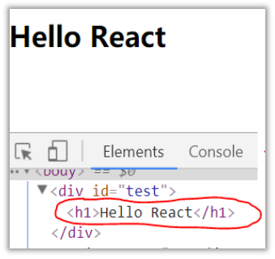
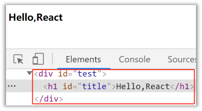
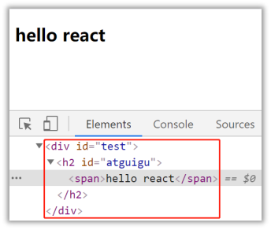
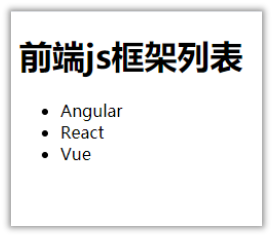
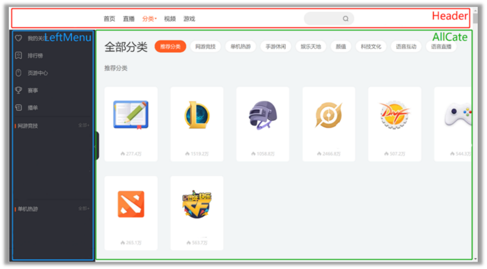

# React 入门

>[尚硅谷 React 教程（2022 加更，B 站超火 react 教程）](https://www.bilibili.com/video/BV1wy4y1D7JT/?spm_id_from=333.337.search-card.all.click)

## React 简介

### 官网

1. 英文官网：[https://reactjs.org/](https://reactjs.org/)
2. 中文官网：[https://react.docschina.org/](https://react.docschina.org/)

### 介绍描述

1. 用于动态构建用户界面的 JavaScript 库 (只关注于视图)
2. 由 Facebook 开源

### React 的特点

1. 声明式编码
2. 组件化编码
3. React Native 编写原生应用
4. 高效（优秀的 Diffing 算法）

### React 高效的原因

1. 使用虚拟 (virtual)DOM, 不总是直接操作页面真实 DOM。
2. DOM Diffing 算法，最小化页面重绘。

## React 的基本使用

### 效果

### 相关 js 库

1. react.js：React 核心库。
2. react-dom.js：提供操作 DOM 的 react 扩展库。
3. babel.min.js：解析 JSX 语法代码转为 JS 代码的库。

### 创建虚拟 D0M 的两种方式

1. 纯 JS 方式 (一般不用)
2. JSX 方式

### 虚拟 DOM 与真实 DOM

1. React 提供了一些 API 来创建一种“特别”的一般 js 对象
   - `const VDOM = React.createElement('xx',{id:'xx'},'xx')`
   - 上面创建的就是一个简单的虚拟 DOM 对象
2. 虚拟 DOM 对象最终都会被 React 转换为真实的 DOM
3. 我们编码时基本只需要操作 react 的虚拟 DOM 相关数据，react 会转换为真实 DOM 变化而更新界。

## React JSX

### 效果

### JSX

1. 全称：JavaScript XML

2. react 定义的一种类似于 XML 的 JS 扩展语法：JS + XML 本质是

   React.createElement(component,props.,··.children) 方法的语法搪

3. 作用：用来简化创建虚拟 DOM

   1. 写法：`var ele = <h1>Hello JSX!</h1>`
   2. 注意 1：它不是字符串，也不是 HTML/XML 标签
   3. 注意 2：它最终产生的就是一个 JS 对象

4. 标签名任意：HTML 标签或其它标签

5. 标签属性任意：HTML 标签属性或其它

6. 基本语法规则

   1. 遇到 <开头的代码，以标签的语法解析：html 同名标签转换为 html 同名元素，其它标签需要特别解析
   2. 遇到以 { 开头的代码，以 JS 语法解析：标签中的 js 表达式必须用{ }包含

7. babel.js 的作用

   1. 浏览器不能直接解析 JSX 代码，需要 babel 转译为纯 JS 的代码才能运行
   2. 只要用了 JSX，都要加上 type="text/babel", 声明需要 babel 来处理

### 渲染虚拟 DOM(元素)

1. 语法：`ReactDOM.render(virtualDOM,containerDOM)`
2. 作用：将虚拟 DOM 元素渲染到页面中的真实容器 DOM 中显示
3. 参数说明
   1. 参数一：纯 js 或 jsx 创建的虚拟 dom 对象
   2. 参数二：用来包含虚拟 DOM 元素的真实 dom 元素对象 (一般是一个 div)

### JSX 练习

需求：动态展示如下列表

## 模块与组件、模块化与组件化的理解

### 模块

1. 理解：向外提供特定功能的 js 程序，一般就是一个 js 文件
2. 为什么要拆成模块：随着业务逻辑增加，代码越来越多且复杂。
3. 作用：复用 js, 简化 js 的编写，提高 js 运行效率

### 组件

1. 理解：用来实现局部功能效果的代码和资源的集合 (html/css/js/image 等等)
2. 为什么要用组件：一个界面的功能更复杂
3. 作用：复用编码，简化项目编码，提高运行效率

### 模块化

当应用的 js 都以模块来编写的，这个应用就是一个模块化的应用

### 组件化

当应用是以多组件的方式实现，这个应用就是一个组件化的应用

