# React 面向组件编程

## 基本理解和使用

### 使用 React 开发者工具调试

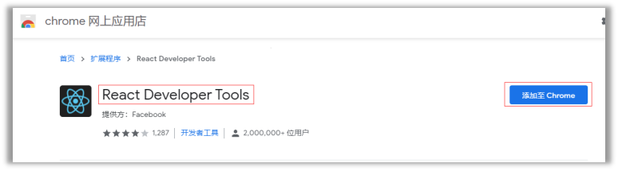

### 效果

函数式组件：

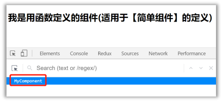

类式组件：

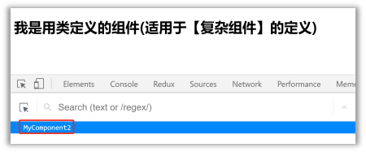

### 注意

1. 组件名必须首字母大写
2. 虚拟 DOM 元素只能有一个根元素
3. 虚拟 DOM 元素必须有结束标签

### 渲染类组件标签的基本流程

1. React 内部会创建组件实例对象
2. 调用 render() 得到虚拟 DOM，并解析为真实 DOM
3. 插入到指定的页面元素内部

## 组件三大核心属性 1：state

### 效果

需求：定义一个展示天气信息的组件

1. 默认展示天气炎热 或 凉爽
2. 点击文字切换天气

.gif)

### 理解

1. state 是组件对象最重要的属性，值是对象 (可以包含多个 key-value 的组合)
2. 组件被称为"状态机", 通过更新组件的 state 来更新对应的页面显示 (重新渲染组件)

### 强烈注意

1. 组件中 render 方法中的 this 为组件实例对象
2. 组件自定义的方法中 this 为 undefined，如何解决？
   - 强制绑定 this: 通过函数对象的 bind()
   - 箭头函数

3. 状态数据，不能直接修改或更新

## 组件三大核心属性 2：props

### 效果

需求：自定义用来显示一个人员信息的组件

1. 姓名必须指定，且为字符串类型；
2. 性别为字符串类型，如果性别没有指定，默认为男
3. 年龄为字符串类型，且为数字类型，默认值为 18

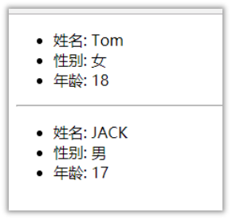

### 理解

1. 每个组件对象都会有 props(properties 的简写) 属性
2. 组件标签的所有属性都保存在 props 中

### 作用

1. 通过标签属性从组件外向组件内传递变化的数据
2. 注意：组件内部不要修改 props 数据

### 编码操作

1. 内部读取某个属性值

2. 对 props 中的属性值进行类型限制和必要性限制

   第一种方式（React v15.5 开始已弃用）：

   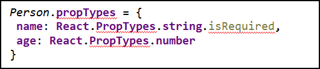

   第二种方式（新）：使用 prop-types 库进限制（需要引入 prop-types 库)

   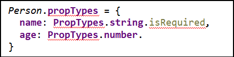

3. 扩展属性：将对象的所有属性通过 props 传递

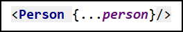

4. 默认属性值：

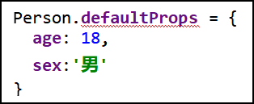

5. 组件类的构造函数

   

##  组件三大核心属性 3：refs 与事件处理

### 效果

需求：自定义组件，功能说明如下：

1. 点击按钮，提示第一个输入框中的值

2. 当第 2 个输入框失去焦点时，提示这个输入框中的值

.gif)

### 理解

组件内的标签可以定义 ref 属性来标识自己

### 编码

1. 字符串形式的 ref

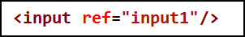

2. 回调形式的 ref

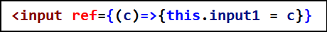

3. createRef 创建 ref 容器·

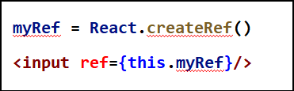

### 事件处理

1. 通过 onXxx 属性指定事件处理函数 (注意大小写)
   1. React 使用的是自定义 (合成) 事件，而不是使用的原生 DOM 事件
   2. React 中的事件是通过事件委托方式处理的 (委托给组件最外层的元素)
2. 通过 event.target 得到发生事件的 DOM 元素对象

## 收集表单数据

### 效果

需求：定义一个包含表单的组件

输入用户名密码后，点击登录提示输入信息

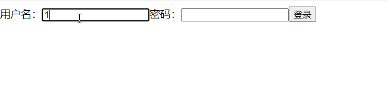

### 理解

包含表单的组件分类

1. 受控组件
2. 非受控组件

## 组件的生命周期

### 效果

需求：定义组件实现以下功能：

1. 让指定的文本做显示 / 隐藏的渐变动画
2. 从完全可见，到彻底消失，耗时 2S
3. 点击“不活了”按钮从界面中卸载组件

### 理解

1. 组件从创建到死亡它会经历一些特定的阶段。
2. React 组件中包含一系列勾子函数 (生命周期回调函数), 会在特定的时刻调用。
3. 我们在定义组件时，会在特定的生命周期回调函数中，做特定的工作。

### 生命周期流程图（旧）

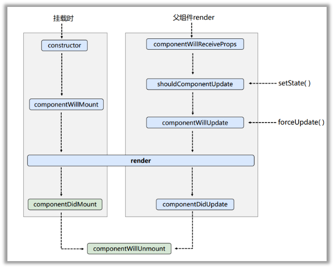

生命周期的三个阶段（旧）

1. 初始化阶段：由 ReactDOM.render() 触发---初次渲染
   1. constructor()
   2. componentWillMount()
   3. render()
   4. componentDidMount()
2. 更新阶段：由组件内部 this.setSate() 或父组件重新 render 触发
   1. shouldComponentUpdate()
   2. componentWillUpdate()
   3. render()
   4. componentDidUpdate()
3. 卸载组件：由 ReactDOM.unmountComponentAtNode() 触发
   1. componentWillUnmount()

### 生命周期流程图（新）

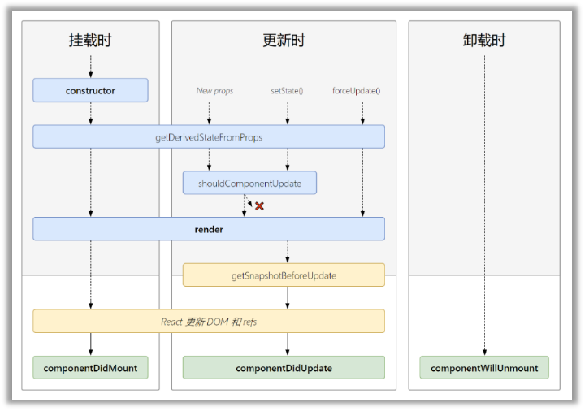

生命周期的三个阶段（新）

1. 初始化阶段：由 ReactDOM.render() 触发---初次渲染
   1. constructor()
   2. getDerivedStateFromProps
   3. render()
   4. componentDidMount()
2. 更新阶段：由组件内部 this.setSate() 或父组件重新 render 触发
   1. getDerivedStateFromProps
   2. shouldComponentUpdate()
   3. render()
   4. getSnapshotBeforeUpdate
   5. componentDidUpdate()
3. 卸载组件 : 由 ReactDOM.unmountComponentAtNode() 触发
   1. componentWillUnmount()

### 重要的勾子

1. render：初始化渲染或更新渲染调用
2. componentDidMount：开启监听，发送 ajax 请求
3. componentWillUnmount：做一些收尾工作，如：清理定时器

### 即将废弃的勾子

1. componentWillMount
2. componentWillReceiveProps
3. componentWillUpdate

现在使用会出现警告，下一个大版本需要加上 UNSAFE_前缀才能使用，以后可能会被彻底废弃，不建议使用。

## 虚拟 DOM 与 DOM Diffing 算法

### 效果

需求：验证虚拟 DOM Diffing 算法的存在

### 基本原理图

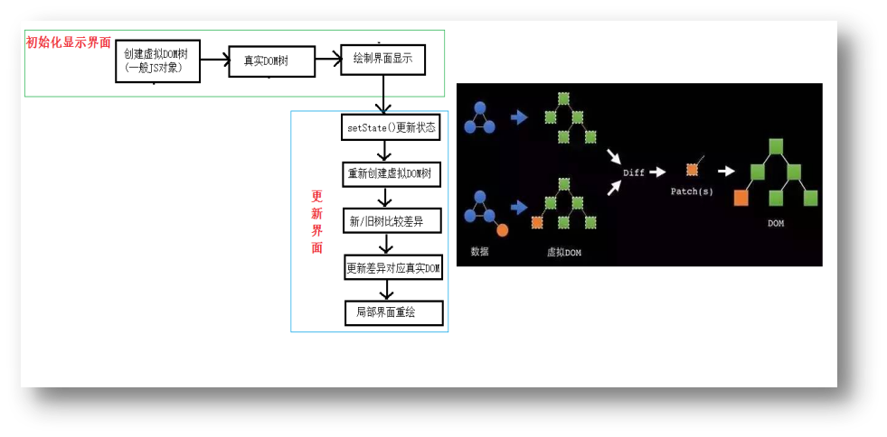
