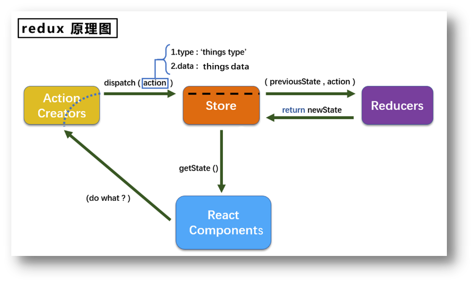
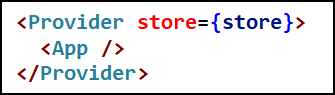
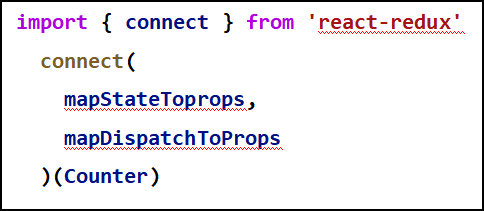
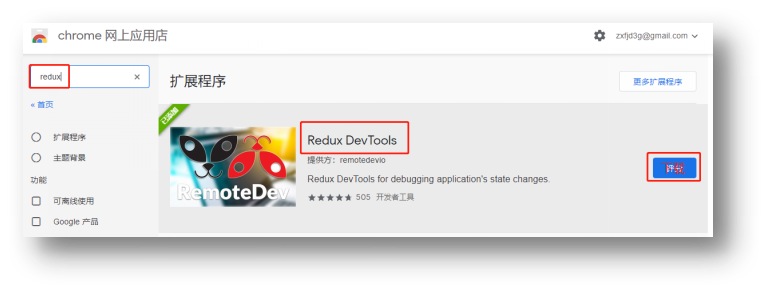

# redux

## redux 理解

### 学习文档

1. 英文文档：[https://redux.js.org/](https://redux.js.org/)
2. 中文文档：[http://www.redux.org.cn/](http://www.redux.org.cn/)
3. Github: [https://github.com/reactjs/redux](https://github.com/reactjs/redux)

### redux 是什么

1. redux 是一个专门用于做 **状态管理** 的 JS 库 (不是 react 插件库)。
2. 它可以用在 react, angular, vue 等项目中，但基本与 react 配合使用。
3. 作用：集中式管理 react 应用中多个组件 **共享** 的状态。

### 什么情况下需要使用 redux

1. 某个组件的状态，需要让其他组件可以随时拿到（共享）。
2. 一个组件需要改变另一个组件的状态（通信）。
3. 总体原则：能不用就不用，如果不用比较吃力才考虑使用。

### redux 工作流程

## redux 的三个核心概念

### action

1. 动作的对象
2. 包含 2 个属性
   - type：标识属性，值为字符串，唯一，必要属性
   - data：数据属性，值类型任意，可选属性

3. 例子：`{ type: 'ADD_STUDENT',data:{name: 'tom',age:18} }`

### reducer

1. 用于初始化状态、加工状态。
2. 加工时，根据旧的 state 和 action，产生新的 state 的 **纯函数**

### store

1. 将 state、action、reducer 联系在一起的对象
2. 如何得到此对象？
   - `import {createStore} from 'redux'`
   - `import reducer from './reducers'`
   - `const store = createStore(reducer)`
3. 此对象的功能？
   - `getState()`: 得到 state
   - `dispatch(action)`: 分发 action, 触发 reducer 调用，产生新的 state
   - `subscribe(listener)`: 注册监听，当产生了新的 state 时，自动调用

## redux 的核心 API

### createstore(）

作用：创建包含指定 reducer 的 store 对象

### store 对象

1. 作用：redux 库最核心的管理对象
2. 它内部维护着：
   1. `state`
   2. `reducer`
3. 核心方法：
   1. `getState()`
   2. `dispatch(action)`
   3. `subscribe(listener)`
4. 具体编码：
   1. `store.getState()`
   2. `store.dispatch({type:'INCREMENT', number})`
   3. `store.subscribe(render)`

### applyMiddleware(）

作用：应用上基于 redux 的中间件 (插件库)

### combineReducers(）

作用：合并多个 reducer 函数

## 使用 redux 编写应用

## redux 异步编程

### 理解：

1. redux 默认是不能进行异步处理的，
2. 某些时候应用中需要在 **redux 中执行异步任务**(ajax, 定时器)

### 使用异步中间件

`npm install --save redux-thunk`

## react-redux

### 理解

1. 一个 react 插件库
2. 专门用来简化 react 应用中使用 redux

### react-Redux 将所有组件分成两大类

1. UI 组件
   1. 只负责 UI 的呈现，不带有任何业务逻辑
   2. 通过 props 接收数据 (一般数据和函数)
   3. 不使用任何 Redux 的 API
   4. 一般保存在 components 文件夹下
2. 容器组件
   1. 负责管理数据和业务逻辑，不负责 UI 的呈现
   2. 使用 Redux 的 API
   3. 一般保存在 containers 文件夹下

### 相关 API

1. Provider：让所有组件都可以得到 state 数据

2. connect：用于包装 UI 组件生成容器组件

3. mapStateToprops：将外部的数据（即 state 对象）转换为 UI 组件的标签属性

   

4. mapDispatchToProps：将分发 action 的函数转换为 UI 组件的标签属性

## 使用上 redux 调试工具

### 安装 chrome 浏览器插件

### 下载工具依赖包

`npm install --save-dev redux-devtools-extension`

## 纯函数和高阶函数

### 纯函数

1. 一类特别的函数：只要是同样的输入 (实参)，必定得到同样的输出 (返回)
2. 必须遵守以下一些约束 
   1. 不得改写参数数据
   2. 不会产生任何副作用，例如网络请求，输入和输出设备
   3. 不能调用 Date.now() 或者 Math.random() 等不纯的方法 
3. redux 的 reducer 函数必须是一个纯函数

### 高阶函数

1. 理解：一类特别的函数
   1. 情况 1: 参数是函数
   2. 情况 2: 返回是函数
2. 常见的高阶函数：
   1. 定时器设置函数
   2. 数组的`forEach()`/`map()`/`filter()`/`reduce()`/`find()`/`bind()`
   3. `promise`
   4. `react-redux`中的`onnect`函数
3. 作用：能实现更加动态，更加可扩展的功能
