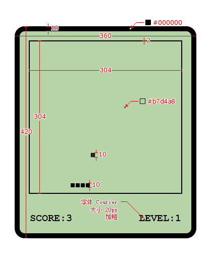

# TypeScript 练习

>[尚硅谷 TypeScript 教程（李立超老师 TS 新课）](https://www.bilibili.com/video/BV1Xy4y1v7S2/?p=1)
>
>[TypeScript 官网](https://www.typescriptlang.org/)



## 基础环境搭建

### package.json

```json
{
  "name": "snake",
  "version": "1.0.0",
  "description": "",
  "main": "index.js",
  "scripts": {
    "test": "echo \"Error: no test specified\" && exit 1",
    "build": "webpack",
    "start": "webpack serve --open chrome.exe"
  },
  "keywords": [],
  "author": "",
  "license": "ISC",
  "devDependencies": {
    "@babel/core": "^7.12.9",
    "@babel/preset-env": "^7.12.7",
    "babel-loader": "^8.2.2",
    "clean-webpack-plugin": "^3.0.0",
    "core-js": "^3.8.0",
    "html-webpack-plugin": "^4.5.0",
    "ts-loader": "^8.0.11",
    "typescript": "^4.1.2",
    "webpack": "^5.6.0",
    "webpack-cli": "^4.2.0",
    "webpack-dev-server": "^3.11.0"
  }
}
```

### tsconfig.json

```json
{
  "compilerOptions": {
    "module": "es2015",
    "target": "es2015",
    "strict": true,
    "outDir": "./dist",
    "noEmitOnError": true
  },
  "include": [
    "./src/**/*"
  ]
}
```

### webpack.config.js

```js
// 引入一个包
const path = require('path');
// 引入 html 插件
const HTMLWebpackPlugin = require('html-webpack-plugin');
// 引入 clean 插件
const { CleanWebpackPlugin } = require('clean-webpack-plugin');

// webpack 中的所有的配置信息都应该写在 module.exports 中
module.exports = {

    // 指定入口文件
    entry: "./src/index.ts",

    // 指定打包文件所在目录
    output: {
        // 指定打包文件的目录
        path: path.resolve(__dirname, 'dist'),
        // 打包后文件的文件
        filename: "bundle.js",

        // 告诉 webpack 不使用箭头，兼容 ie
        environment: {
            arrowFunction: false
        }
    },

    // 指定 webpack 打包时要使用模块
    module: {
        // 指定要加载的规则
        rules: [
            {
                // test 指定的是规则生效的文件
                test: /\.ts$/,
                // 要使用的 loader
                use: [
                    // 配置 babel
                    {
                        // 指定加载器
                        loader: "babel-loader",
                        // 设置 babel
                        options: {
                            // 设置预定义的环境
                            presets: [
                                [
                                    // 指定环境的插件
                                    "@babel/preset-env",
                                    // 配置信息
                                    {
                                        // 要兼容的目标浏览器
                                        targets: {
                                            "chrome": "58",
                                            "ie": "11"
                                        },
                                        // 指定 corejs 的版本
                                        "corejs": "3",
                                        // 使用 corejs 的方式 "usage" 表示按需加载
                                        "useBuiltIns": "usage"
                                    }
                                ]
                            ]
                        }
                    },
                    'ts-loader'
                ],
                // 要排除的文件
                exclude: /node-modules/
            }
        ]
    },

    // 配置 Webpack 插件
    plugins: [
        new CleanWebpackPlugin(),
        new HTMLWebpackPlugin({
            // title: "这是一个自定义的 title"
            template: "./src/index.html"
        }),
    ],

    // 用来设置引用模块
    resolve: {
        extensions: ['.ts', '.js']
    }

};
```

## 整合 Less

Less 是一种 CSS 预处理器，它通过引入一些编程语言的概念，为 CSS 提供了更多的扩展功能，让样式表的编写更加方便和高效。

### 1、下载构建工具

`npm i -D less less-loader css-loader style-loader`

- `less`
  - 一种 CSS 预处理器，可以扩展 CSS 语言，提供更多的功能。
- `less-loader`
  - 用于将 Less 文件编译成 CSS 文件的 Webpack 加载器。
- `css-loader`
  - 用于将 CSS 文件转换成 JavaScript 模块的 Webpack 加载器。
- `style-loader`
  - 用于将 CSS 注入到 HTML 页面中的 Webpack 加载器。

### 2、配置对 less 文件的处理

```js
// 引入一个包
const path = require('path');
// 引入 html 插件
const HTMLWebpackPlugin = require('html-webpack-plugin');
// 引入 clean 插件
const { CleanWebpackPlugin } = require('clean-webpack-plugin');

// webpack 中的所有的配置信息都应该写在 module.exports 中
module.exports = {

    // 指定入口文件
    entry: "./src/index.ts",

    // 指定打包文件所在目录
    output: {
        // 指定打包文件的目录
        path: path.resolve(__dirname, 'dist'),
        // 打包后文件的文件
        filename: "bundle.js",

        // 告诉 webpack 不使用箭头，兼容 ie
        environment: {
            arrowFunction: false
        }
    },

    // 指定 webpack 打包时要使用模块
    module: {
        // 指定要加载的规则
        rules: [
            {
                // test 指定的是规则生效的文件
                test: /\.ts$/,
                // 要使用的 loader
                use: [
                    // 配置 babel
                    {
                        // 指定加载器
                        loader: "babel-loader",
                        // 设置 babel
                        options: {
                            // 设置预定义的环境
                            presets: [
                                [
                                    // 指定环境的插件
                                    "@babel/preset-env",
                                    // 配置信息
                                    {
                                        // 要兼容的目标浏览器
                                        targets: {
                                            "chrome": "58",
                                            "ie": "11"
                                        },
                                        // 指定 corejs 的版本
                                        "corejs": "3",
                                        // 使用 corejs 的方式 "usage" 表示按需加载
                                        "useBuiltIns": "usage"
                                    }
                                ]
                            ]
                        }
                    },
                    'ts-loader'
                ],
                // 要排除的文件
                exclude: /node-modules/
            },

            // 设置 less 文件的处理
            {
                test: /\.less$/,
                use: [
                    "style-loader",
                    "css-loader",
                    // 引入 postcss
                    {
                        loader: "postcss-loader",
                        options: {
                            postcssOptions: {
                                plugins: [
                                    [
                                        "postcss-preset-env",
                                        {
                                            browsers: 'last 2 versions'
                                        }
                                    ]
                                ]
                            }
                        }
                    },
                    "less-loader",
                ]
            }
        ]
    },

    // 配置 Webpack 插件
    plugins: [
        new CleanWebpackPlugin(),
        new HTMLWebpackPlugin({
            // title: "这是一个自定义的 title"
            template: "./src/index.html"
        }),
    ],

    // 用来设置引用模块
    resolve: {
        extensions: ['.ts', '.js']
    }

};
```

### 3、下载 CSS 兼容工具

`npm i -D postcss postcss-loader postcss-preset-env`

- `postcss`
  - 是一个 CSS 处理工具，可以帮助你转换 CSS 代码以提高浏览器兼容性和性能。
- `postcss-loader`
  - 是一个 Webpack 插件，用于将 PostCSS 与 Webpack 集成，并自动转换 CSS 代码。
- `postcss-preset-env`
  - 是一个 PostCSS 插件，它可以根据所需的浏览器兼容性自动将 CSS 代码转换成当前的标准 CSS 代码

### 4、配置 CSS 兼容浏览器

 ```js
 // 引入一个包
 const path = require('path');
 // 引入 html 插件
 const HTMLWebpackPlugin = require('html-webpack-plugin');
 // 引入 clean 插件
 const { CleanWebpackPlugin } = require('clean-webpack-plugin');
 
 // webpack 中的所有的配置信息都应该写在 module.exports 中
 module.exports = {
 
     // 指定入口文件
     entry: "./src/index.ts",
 
     // 指定打包文件所在目录
     output: {
         // 指定打包文件的目录
         path: path.resolve(__dirname, 'dist'),
         // 打包后文件的文件
         filename: "bundle.js",
 
         // 告诉 webpack 不使用箭头，兼容 ie
         environment: {
             arrowFunction: false
         }
     },
 
     // 指定 webpack 打包时要使用模块
     module: {
         // 指定要加载的规则
         rules: [
             {
                 // test 指定的是规则生效的文件
                 test: /\.ts$/,
                 // 要使用的 loader
                 use: [
                     // 配置 babel
                     {
                         // 指定加载器
                         loader: "babel-loader",
                         // 设置 babel
                         options: {
                             // 设置预定义的环境
                             presets: [
                                 [
                                     // 指定环境的插件
                                     "@babel/preset-env",
                                     // 配置信息
                                     {
                                         // 要兼容的目标浏览器
                                         targets: {
                                             "chrome": "58",
                                             "ie": "11"
                                         },
                                         // 指定 corejs 的版本
                                         "corejs": "3",
                                         // 使用 corejs 的方式 "usage" 表示按需加载
                                         "useBuiltIns": "usage"
                                     }
                                 ]
                             ]
                         }
                     },
                     'ts-loader'
                 ],
                 // 要排除的文件
                 exclude: /node-modules/
             },
 
             // 设置 less 文件的处理
             {
                 test: /\.less$/,
                 use: [
                     "style-loader",
                     "css-loader",
                     // 引入 postcss
                     {
                         Loader: "postcss-loader",
                         options: {
                             postcssOptions: {
                                 plugins: [
                                     [
                                         "postcss-preset-env",
                                         {
                                             browsers: 'last 2 versions'
                                         }
                                     ]
                                 ]
                             }
                         }
                     },
                     "less-loader",
                 ]
             }
         ]
     },
 
     // 配置 Webpack 插件
     plugins: [
         new CleanWebpackPlugin(),
         new HTMLWebpackPlugin({
             // title: "这是一个自定义的 title"
             template: "./src/index.html"
         }),
     ],
 
     // 用来设置引用模块
     resolve: {
         extensions: ['.ts', '.js']
     }
 
 };
 ```

